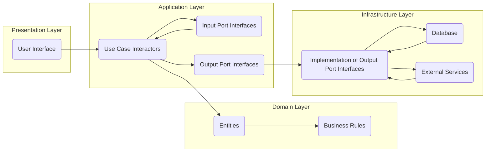

# Project Design Document: Clean Architecture Example

**Version:** 1.1
**Date:** October 26, 2023
**Prepared By:** Gemini (AI Language Model)

## 1. Introduction

This document provides a detailed design overview of the Clean Architecture example project located at [https://github.com/ardalis/CleanArchitecture](https://github.com/ardalis/CleanArchitecture). This document meticulously outlines the architecture, components, and data flow of the project, serving as a crucial resource for understanding its structure and behavior. This detailed design is specifically intended to facilitate effective threat modeling by providing a clear and comprehensive picture of the system.

### 1.1. Purpose

The primary purpose of this document is to furnish a comprehensive architectural description of the Clean Architecture example project. This description is explicitly created to enable security engineers and analysts to conduct thorough threat modeling, identify potential security vulnerabilities, and understand the attack surface of the application.

### 1.2. Scope

This document encompasses the high-level architecture, key components within each layer, and the flow of data throughout the Clean Architecture example project. It focuses on the logical organization and interactions between the distinct layers and modules that constitute the application. Implementation details within individual classes or methods are deliberately excluded to maintain a focus on the architectural level.

### 1.3. Target Audience

This document is primarily intended for:

* Security engineers and analysts tasked with performing threat modeling and security assessments.
* Software developers requiring a high-level understanding of the project's architectural design and component interactions.
* Software architects responsible for reviewing the design, evaluating its adherence to Clean Architecture principles, and assessing its security posture.

## 2. Overview

The Clean Architecture example project serves as a practical demonstration of the Clean Architecture principles, a software design philosophy that prioritizes the separation of concerns and independence from external frameworks, databases, and user interfaces. By organizing the codebase into independent, concentric layers with strictly controlled dependencies pointing inwards, Clean Architecture promotes applications that are highly maintainable, easily testable, and remarkably flexible to change. This architectural style isolates the core business logic, making it resilient to changes in the technology landscape.

### 2.1. Project Goals

The fundamental goals of the Clean Architecture example project are:

* To provide a clear and working example of implementing Clean Architecture principles in a real-world scenario.
* To offer a well-organized and easily understandable codebase that serves as a learning resource.
* To illustrate the effective separation of core business logic from infrastructure-specific concerns.
* To enable independent testing of the critical business rules and use cases without reliance on external dependencies.

## 3. Architectural Design

The project adheres to the layered architecture pattern central to Clean Architecture. The distinct layers, arranged concentrically, are:

* **Entities (Domain Layer):**  This innermost layer encapsulates the core business entities and the fundamental business rules that govern them. It is entirely independent and unaware of any other layers. Its focus is solely on the "what" of the business.
* **Use Cases (Application Layer):** This layer contains the application-specific business logic, defining how the system operates to fulfill user requirements. It orchestrates the interaction between entities in the Domain Layer to achieve specific tasks. This layer depends on the Entities layer but is agnostic of external concerns. It focuses on the "how" of the business operations.
* **Interface Adapters (Presentation and Infrastructure Layers):** These outermost layers act as bridges, translating data and interactions between the inner layers and the external world. They adapt external frameworks and technologies to the needs of the inner layers.
    * **Presentation Layer:**  This layer is responsible for presenting information to the user and interpreting user input. It contains UI elements, controllers, and presenters. It depends on the Application Layer to execute business logic.
    * **Infrastructure Layer:** This layer deals with all external concerns, such as database interactions, file system access, communication with external services, and framework-specific implementations. It implements interfaces defined in the Application Layer.

### 3.2. Dependencies

The dependency rule is a cornerstone of Clean Architecture: dependencies point only inwards. This means:

* The Presentation Layer depends on the Application Layer.
* The Infrastructure Layer depends on the Application Layer.
* The Application Layer depends on the Domain Layer.
* The Domain Layer has absolutely no dependencies on any other layers. This ensures the core business logic remains independent and stable.

### 3.3. Data Flow

A typical request flow within the application proceeds as follows:

1. A user initiates an action through the **Presentation Layer** (e.g., clicking a button, submitting a form).
2. The **Presentation Layer** receives the user input and invokes a corresponding **Use Case Interactor** within the **Application Layer**.
3. The **Use Case Interactor** retrieves and manipulates **Entities** from the **Domain Layer** to execute the necessary business logic.
4. If the **Use Case Interactor** requires access to external resources or services (e.g., data persistence), it interacts with **Input Port Interfaces** defined within the **Application Layer**.
5. The **Infrastructure Layer** provides concrete implementations of these **Input Port Interfaces**, enabling interaction with databases, external APIs, and other external systems.
6. Data resulting from the operation flows back through the layers: from the **Infrastructure Layer** to the **Application Layer** (via **Output Port Interfaces**), and finally to the **Presentation Layer** for display to the user.

## 4. Data Flow Diagram

## 5. Key Components

This section provides a more detailed breakdown of the key components within each architectural layer:

### 5.1. Domain Layer

* **Entities:** Represent the core business objects and their associated data and behavior. Examples include `Customer`, `Order`, `Product`, each encapsulating relevant attributes and methods.
* **Business Rules:** Define the fundamental logic and constraints of the business. These can be implemented as methods within entities or as separate domain services that operate on entities. Examples include validation rules, calculation logic, and business policies.
* **Value Objects:** Immutable objects that represent a conceptual whole based on their value, not identity. Examples include `Address`, `Email`, `Money`, which are treated as single, indivisible units.

### 5.2. Application Layer

* **Use Case Interactors:** Implement specific business operations or workflows triggered by user actions. Examples include `CreateOrderInteractor`, `GetCustomerDetailsInteractor`, `ProcessPaymentInteractor`. Each interactor orchestrates the necessary steps using entities and potentially interacting with infrastructure through interfaces.
* **Input Port Interfaces:** Define the contracts for how the Presentation Layer can initiate use cases. These interfaces specify the input data required for each use case. Examples include `ICreateOrderInputPort`, `IGetCustomerDetailsInputPort`.
* **Output Port Interfaces:** Define the contracts for how use cases deliver results back to the Presentation Layer. These interfaces specify the output data structure. Examples include `ICreateOrderOutputPort`, `IGetCustomerDetailsOutputPort`.
* **Application Services (Optional):**  May provide cross-cutting concerns or utility functions that are used by multiple use cases. Examples include logging services or security services.

### 5.3. Presentation Layer

* **Controllers/API Endpoints:** Handle incoming user requests (e.g., HTTP requests) and translate them into calls to the appropriate Use Case Interactors in the Application Layer.
* **View Models:** Data structures specifically tailored for presentation to the user. They transform the output from the Application Layer into a format suitable for the UI.
* **User Interface (UI):**  The visual elements and user interaction logic of the application (e.g., web pages, mobile app screens, command-line interfaces).
* **Presenters (or similar):** Components responsible for formatting the output from the Application Layer into a format suitable for the View Models.

### 5.4. Infrastructure Layer

* **Database Access Components (Repositories):** Implement interfaces defined in the Application Layer to interact with databases. Often utilize Object-Relational Mappers (ORMs). Examples include `CustomerRepository`, `OrderRepository`.
* **External Service Integrations:** Code responsible for communicating with external APIs, services, or systems. Examples include integrations with payment gateways, email providers, or other third-party services.
* **Framework-Specific Implementations:** Concrete implementations of interfaces defined in the Application Layer using specific frameworks or libraries. Examples include logging implementations using a specific logging framework, caching implementations, or implementations for accessing file systems.

## 6. Security Considerations (Detailed)

Considering the layered architecture, several security considerations are paramount:

* **Input Validation and Sanitization (Presentation Layer):**  The Presentation Layer must rigorously validate and sanitize all user inputs to prevent common injection attacks such as SQL injection, cross-site scripting (XSS), and command injection. Implement robust input validation rules and encoding mechanisms.
* **Authorization and Authentication (Application Layer):** The Application Layer is responsible for enforcing authorization rules to ensure that users can only access and manipulate data they are permitted to. Implement authentication mechanisms to verify user identities and authorization checks before executing use cases.
* **Data Protection at Rest and in Transit (Infrastructure Layer):** Sensitive data stored in the database or transmitted over the network must be encrypted. Utilize encryption technologies like TLS/SSL for communication and encryption at rest for sensitive data stored in databases or file systems.
* **Dependency Management and Vulnerability Scanning (All Layers):**  Carefully manage external dependencies and regularly scan for known vulnerabilities in third-party libraries used across all layers. Employ dependency management tools and vulnerability scanning services.
* **Logging and Auditing (Infrastructure Layer):** Implement comprehensive logging and auditing mechanisms within the Infrastructure Layer to track user actions, system events, and potential security breaches. Ensure logs are securely stored and regularly reviewed.
* **Secure Communication with External Services (Infrastructure Layer):** When integrating with external services, ensure secure communication channels using protocols like HTTPS and appropriate authentication and authorization mechanisms (e.g., API keys, OAuth).
* **Error Handling and Information Leakage (All Layers):** Implement proper error handling to prevent sensitive information from being leaked through error messages. Avoid displaying detailed error information to end-users in production environments.
* **Cross-Site Request Forgery (CSRF) Protection (Presentation Layer):** Implement CSRF protection mechanisms to prevent malicious websites from making unauthorized requests on behalf of authenticated users.
* **Rate Limiting and Throttling (Presentation Layer):** Implement rate limiting and throttling to protect against denial-of-service (DoS) attacks by limiting the number of requests from a single source within a given timeframe.

## 7. Assumptions and Constraints

The following assumptions and constraints are relevant to this design document:

* The project is implemented using object-oriented programming principles, facilitating the separation of concerns and encapsulation required by Clean Architecture.
* While the specific programming language and frameworks are not explicitly defined here, it is assumed they possess the capabilities to support the principles and patterns of Clean Architecture (e.g., dependency inversion).
* This document focuses on the logical architecture and does not delve into specific deployment topologies, infrastructure provisioning, or scaling strategies.
* Security considerations are discussed at an architectural level; specific implementation details for security controls will be addressed during the threat modeling and implementation phases.

## 8. Future Considerations

Potential future enhancements or changes that could impact the architecture and should be considered during future development include:

* **Introduction of new business capabilities:**  Adding new features will likely require creating new Use Case Interactors in the Application Layer and potentially new Entities in the Domain Layer.
* **Adoption of new technologies or frameworks:**  Changes in the technology stack (e.g., switching database providers or UI frameworks) will primarily impact the Infrastructure and Presentation Layers, ideally without affecting the core Application and Domain Layers.
* **Scaling and performance requirements:**  Addressing scalability needs might necessitate architectural adjustments, such as introducing caching mechanisms or message queues, primarily impacting the Infrastructure Layer.
* **Integration with new external services:**  Integrating with additional external services will require new implementations within the Infrastructure Layer and potentially new interfaces in the Application Layer.
* **Microservices adoption:**  A future evolution could involve breaking down the application into smaller, independent microservices, which would require careful consideration of inter-service communication and data management.

This revised document provides a more detailed and comprehensive understanding of the Clean Architecture example project, making it an even more valuable resource for conducting thorough and effective threat modeling activities.
