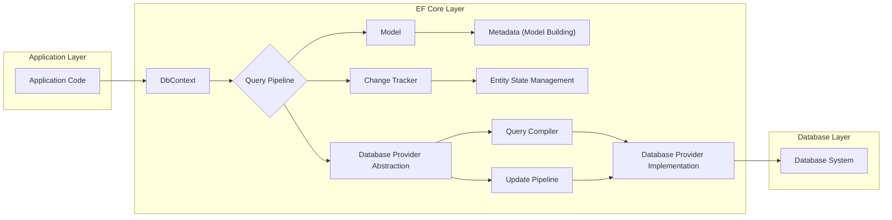
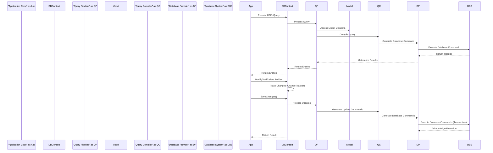

## Project Design Document: Entity Framework Core

**1. Introduction**

This document provides a detailed architectural overview of the Entity Framework Core (EF Core) project. It outlines the key components, their interactions, and the overall system architecture. This document serves as a foundation for subsequent threat modeling activities, enabling a comprehensive understanding of potential security vulnerabilities.

**2. Project Goals**

The primary goals of the Entity Framework Core project are:

*   Provide a modern, lightweight, extensible, and cross-platform Object-Relational Mapper (ORM) for .NET.
*   Enable developers to interact with databases using .NET objects, reducing the need to write raw SQL.
*   Support a wide range of database providers.
*   Offer a performant and efficient data access solution.
*   Maintain a strong focus on developer productivity and ease of use.

**3. System Architecture**

EF Core follows a layered architecture, separating concerns and promoting modularity. The core components interact to translate LINQ queries into database-specific commands and materialize query results into .NET objects.

**4. Key Components**

This section details the major components within the EF Core architecture:

*   **DbContext:**
    *   Represents a session with the database.
    *   Provides access to entity sets (DbSets) for querying and saving data.
    *   Manages the connection to the database.
    *   Handles configuration options for EF Core.
*   **Query Pipeline:**
    *   Responsible for processing LINQ queries.
    *   Translates LINQ expressions into a query plan.
    *   Optimizes the query for efficient execution.
*   **Model:**
    *   Represents the conceptual model of the data, independent of the database schema.
    *   Contains information about entities, their properties, and relationships.
    *   Built using conventions, data annotations, or the fluent API.
*   **Change Tracker:**
    *   Monitors the state of entities loaded into the DbContext.
    *   Tracks changes made to entities (added, modified, deleted).
    *   Used to determine which database operations are required when `SaveChanges` is called.
*   **Database Provider Abstraction:**
    *   Provides a common interface for interacting with different database systems.
    *   Abstracts away database-specific details.
    *   Enables EF Core to support various databases through provider implementations.
*   **Metadata (Model Building):**
    *   Responsible for building the conceptual model from code.
    *   Uses conventions, data annotations, and the fluent API to configure entities and relationships.
*   **Entity State Management:**
    *   Manages the lifecycle and state of entities within the DbContext.
    *   States include Added, Modified, Deleted, Unchanged, and Detached.
*   **Query Compiler:**
    *   Translates the query plan into database-specific SQL or other query language.
    *   Takes into account the specific capabilities of the target database.
*   **Update Pipeline:**
    *   Responsible for generating and executing database commands (INSERT, UPDATE, DELETE) based on the changes tracked by the Change Tracker.
*   **Database Provider Implementation:**
    *   Provides the database-specific implementation of the provider abstraction.
    *   Handles connection management, command execution, and result materialization for a particular database system (e.g., SQL Server, PostgreSQL, SQLite).

**5. Data Flow**

The following outlines the typical data flow for querying and saving data using EF Core:

*   **Querying Data:**
    1. The application code executes a LINQ query against a DbSet.
    2. The DbContext's Query Pipeline receives the query.
    3. The Query Pipeline interacts with the Model to understand the data structure.
    4. The Query Compiler, using the appropriate Database Provider Implementation, translates the LINQ query into database-specific SQL.
    5. The Database Provider Implementation executes the SQL query against the Database System.
    6. The Database System returns the result set.
    7. The Database Provider Implementation materializes the result set into .NET entity objects.
    8. The materialized entities are returned to the application code.

*   **Saving Data:**
    1. The application code modifies entity objects tracked by the DbContext or adds/removes entities from DbSets.
    2. The Change Tracker detects these changes.
    3. The application code calls `SaveChanges` on the DbContext.
    4. The Update Pipeline examines the changes tracked by the Change Tracker.
    5. The Update Pipeline, using the appropriate Database Provider Implementation, generates database commands (INSERT, UPDATE, DELETE) to reflect the changes.
    6. The Database Provider Implementation executes these commands against the Database System within a transaction.
    7. The Database System persists the changes.
    8. The transaction is committed (or rolled back in case of errors).

**6. Security Considerations**

Several security aspects are relevant to EF Core:

*   **SQL Injection:**  EF Core mitigates SQL injection risks by using parameterized queries. However, if raw SQL queries are used, developers must be cautious about sanitizing input.
*   **Data Access Control:** EF Core relies on the underlying database system for access control. Permissions should be configured at the database level to restrict access to sensitive data.
*   **Connection String Security:** Connection strings contain sensitive information (e.g., database credentials). Secure storage and management of connection strings are crucial. Consider using environment variables or configuration providers with appropriate access controls.
*   **Data Validation:** EF Core provides mechanisms for data validation, which can help prevent invalid data from being persisted. Implement robust validation rules to ensure data integrity and prevent potential exploits.
*   **Sensitive Data Handling:**  Consider using encryption or other techniques to protect sensitive data at rest and in transit. EF Core can be used in conjunction with data encryption features provided by the database or other libraries.
*   **Code Injection:**  While less direct, vulnerabilities in application code that constructs dynamic LINQ queries based on user input could potentially lead to unexpected data access or modification. Careful input validation and sanitization are important.
*   **Dependency Management:** Ensure that the EF Core NuGet packages and their dependencies are from trusted sources and are kept up-to-date to patch any known security vulnerabilities.
*   **Provider Security:** The security of the application also depends on the security of the specific database provider being used. Choose providers from reputable sources and keep them updated.

**7. Deployment Considerations**

EF Core applications can be deployed to various environments:

*   **Web Servers (e.g., ASP.NET Core):**  Commonly deployed alongside web applications, leveraging dependency injection for DbContext management.
*   **Desktop Applications (e.g., WPF, WinForms):**  Can be used in desktop applications for local or remote database access.
*   **Mobile Applications (e.g., Xamarin):**  Supports mobile development, often using SQLite for local data storage.
*   **Cloud Environments (e.g., Azure, AWS, GCP):**  Well-suited for cloud deployments, integrating with various database services.

Deployment considerations include:

*   **Connection String Management:** Securely managing connection strings in the deployment environment.
*   **Database Migrations:**  Managing database schema changes across different environments. EF Core provides a migration feature for this purpose.
*   **Performance Tuning:**  Optimizing database queries and EF Core configuration for the specific deployment environment.
*   **Security Hardening:**  Applying security best practices to the deployment environment, such as network segmentation and access control.

**8. Future Considerations**

*   Further enhancements to query performance and optimization.
*   Improved support for NoSQL databases.
*   Continued focus on developer productivity and ease of use.
*   Addressing emerging security threats and best practices.

This document provides a comprehensive overview of the Entity Framework Core project architecture, facilitating a thorough threat modeling process. By understanding the components, data flow, and security considerations, potential vulnerabilities can be identified and mitigated effectively.
