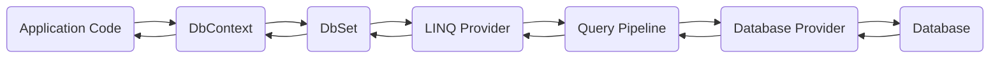
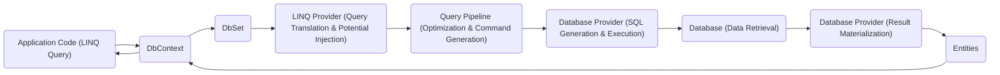
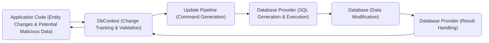

# Project Design Document: Entity Framework Core (EF Core)

**Version:** 1.1
**Date:** October 26, 2023
**Author:** AI Software Architect

## 1. Introduction

This document provides an enhanced architectural design of the Entity Framework Core (EF Core) project, based on the information available in the provided GitHub repository: [https://github.com/aspnet/entityframeworkcore](https://github.com/aspnet/entityframeworkcore). This revised document aims to provide a more detailed and security-focused foundation for subsequent threat modeling activities by clearly outlining the system's components, data flow, and interactions, with a particular emphasis on potential attack surfaces.

## 2. Goals

*   Provide a comprehensive and detailed overview of the EF Core architecture.
*   Clearly identify key components, their responsibilities, and potential security implications.
*   Describe the data flow within the system with a focus on potential interception and manipulation points.
*   Highlight external dependencies and their associated security risks.
*   Establish a clear and security-aware understanding of the system's boundaries for effective threat modeling.

## 3. Scope

This document focuses on the core architectural aspects of EF Core as a library, emphasizing elements relevant to security. It covers the primary components involved in interacting with data stores and the lifecycle of data operations. While it touches upon database providers, it does not delve into the intricate implementation details of every specific provider but focuses on the general interaction patterns.

## 4. High-Level Architecture

EF Core acts as an Object-Relational Mapper (ORM), bridging the gap between object-oriented programming languages (primarily C#) and relational databases. It allows developers to interact with databases using .NET objects, abstracting away the complexities of direct SQL interaction. This abstraction layer introduces both convenience and potential security considerations.

**Key Actors:**

*   **"Application Code":** The .NET application utilizing EF Core to interact with data. This is the primary point of interaction and potential vulnerability introduction.
*   **"Developer":** The individual writing the application code and configuring EF Core. Their practices directly impact the security posture.
*   **"Database Administrator (DBA)":** Responsible for managing the underlying database, including security configurations and access controls.

## 5. Core Components

This section details the major components within EF Core and their functionalities, with added emphasis on security aspects:

*   **DbContext:**
    *   Represents a session with the database, managing connections and transactions. **Security Note:** Improperly configured or exposed `DbContext` instances can lead to unauthorized database access.
    *   Manages database connections and transactions. **Security Note:** Connection strings stored insecurely are a major vulnerability.
    *   Provides access to `DbSet<TEntity>` instances.
    *   Tracks changes made to entities. **Security Note:** Understanding change tracking is crucial for preventing unintended data modifications.
    *   Orchestrates the process of querying and saving data.
    *   Configured through options, including connection strings, database provider selection, and potentially sensitive logging configurations. **Security Note:** Logging sensitive data can lead to information disclosure.

*   **DbSet\<TEntity>:**
    *   Represents a collection of entities of a specific type in the database.
    *   Provides LINQ methods for querying data. **Security Note:**  Careless use of LINQ can lead to inefficient queries and potential performance-based denial-of-service.
    *   Used to add, update, and delete entities. **Security Note:** Lack of proper authorization checks before these operations can lead to data manipulation.

*   **LINQ Provider:**
    *   Translates LINQ queries into database-specific query language (e.g., SQL). **Security Note:** Vulnerabilities in the LINQ provider could potentially lead to SQL injection if not properly sanitized.
    *   Abstracts away the differences between various database dialects.

*   **Query Pipeline:**
    *   The process of converting a LINQ query into an executable database command. **Security Note:**  Understanding the query pipeline is important for identifying potential injection points.
    *   Involves query parsing, optimization, and command generation. **Security Note:**  Query optimization should not compromise security by bypassing necessary checks.

*   **Change Tracking:**
    *   Monitors changes made to entities retrieved from or attached to the `DbContext`. **Security Note:**  Bypassing or manipulating change tracking could lead to data integrity issues.
    *   Determines which entities need to be inserted, updated, or deleted when `SaveChanges()` is called.
    *   Maintains the state of entities (Added, Modified, Deleted, Unchanged).

*   **Update Pipeline:**
    *   The process of translating tracked entity changes into database commands (INSERT, UPDATE, DELETE). **Security Note:**  Proper authorization and validation must occur before reaching this stage.
    *   Handles concurrency control and conflict resolution. **Security Note:**  Concurrency control mechanisms should be robust to prevent race conditions leading to data corruption.

*   **Database Providers:**
    *   Implement the specific logic for interacting with a particular database system. **Security Note:**  Vulnerabilities in database providers can directly expose the application to database-specific attacks.
    *   Provide database-specific query translation, connection management, and command execution.
    *   Examples include `Microsoft.EntityFrameworkCore.SqlServer`, `Npgsql.EntityFrameworkCore.PostgreSQL`. **Security Note:**  Using outdated or unpatched providers increases risk.

*   **Migrations:**
    *   A feature for managing changes to the database schema over time. **Security Note:**  Migration scripts should be carefully reviewed for potential security implications before execution.
    *   Allows developers to define database schema updates in code and apply them to the database.
    *   Generates SQL scripts to update the database schema. **Security Note:**  Uncontrolled access to migration execution can lead to unauthorized schema modifications.

*   **Model Building:**
    *   The process of defining the mapping between .NET entities and database tables. **Security Note:**  Incorrectly configured mappings can expose unintended data or create vulnerabilities.
    *   Can be done through conventions, data attributes, or the Fluent API.
    *   Defines relationships, keys, and other database schema aspects.

## 6. Data Flow

The following outlines the typical data flow for querying and saving data using EF Core, highlighting potential security considerations at each stage:

**Querying Data:**

1. **"Application Code (LINQ Query)":** The application initiates a data retrieval request using LINQ. **Security Note:** Input validation should occur *before* the query is constructed to prevent injection.
2. **"DbContext":** The `DbContext` receives the query.
3. **"DbSet<TEntity>":** The query is targeted at a specific `DbSet`.
4. **"LINQ Provider (Query Translation & Potential Injection)":** The LINQ Provider translates the LINQ query into SQL. **Security Note:** This is a critical point where unsanitized input can lead to SQL injection vulnerabilities. Parameterization is crucial here.
5. **"Query Pipeline (Optimization & Command Generation)":** The Query Pipeline optimizes and prepares the SQL command.
6. **"Database Provider (SQL Generation & Execution)":** The Database Provider generates the final SQL command and executes it against the database.
7. **"Database (Data Retrieval)":** The database processes the query and retrieves the requested data. **Security Note:** Database-level security (permissions, roles) is essential here.
8. **"Database Provider (Result Materialization)":** The Database Provider retrieves the results from the database.
9. **"Entities":** The results are materialized into .NET entities.
10. **"DbContext" and "Application Code":** The entities are returned to the application.

**Saving Data:**

1. **"Application Code (Entity Changes & Potential Malicious Data)":** The application modifies entities or adds new ones. **Security Note:** Input validation is paramount before saving to prevent persistence of malicious data.
2. **"DbContext (Change Tracking & Validation)":** The `DbContext` detects changes and potentially performs validation. **Security Note:** Server-side validation is crucial as client-side validation can be bypassed.
3. **"Update Pipeline (Command Generation)":** The Update Pipeline determines the necessary database operations.
4. **"Database Provider (SQL Generation & Execution)":** The Database Provider generates and executes the SQL commands.
5. **"Database (Data Modification)":** The database performs the INSERT, UPDATE, or DELETE operations. **Security Note:** Database triggers and constraints can provide an additional layer of security.
6. **"Database Provider (Result Handling)":** The Database Provider handles the results.
7. **"DbContext" and "Application Code":** The `DbContext` updates the state of tracked entities.

## 7. External Dependencies

EF Core relies on several external components and libraries, each with its own security considerations:

*   **".NET Runtime":**  Requires a secure and up-to-date runtime environment. **Security Note:** Vulnerabilities in the .NET runtime can be exploited.
*   **"Database Providers":** Specific NuGet packages for each supported database system. **Security Note:** Using compromised or outdated provider packages can introduce vulnerabilities. Ensure providers are from trusted sources.
*   **"Logging Frameworks":** EF Core integrates with .NET logging abstractions. **Security Note:**  Sensitive data logged by the application or EF Core can be a security risk. Configure logging carefully.
*   **"Dependency Injection Container":** EF Core utilizes dependency injection. **Security Note:**  Improperly configured dependency injection can lead to security vulnerabilities.
*   **"Underlying Database System":** The specific database being targeted (e.g., SQL Server, PostgreSQL). **Security Note:** The security of the entire system is heavily reliant on the security of the underlying database.

## 8. Deployment Considerations

The way EF Core applications are deployed significantly impacts their security:

*   **"Database Connection String Management":** Securely storing and managing database connection strings is critical. **Security Note:** Avoid storing connection strings directly in code or configuration files. Use environment variables, key vaults, or other secure methods.
*   **"Database Schema Management (Migrations)":** Utilizing Migrations for managing database schema changes across different environments. **Security Note:** Secure the migration process and restrict access to migration execution.
*   **"Database Provider Compatibility":** Ensuring the correct and secure database provider is deployed with the application.
*   **"Performance Tuning":** Optimizing database queries and EF Core configurations for performance. **Security Note:** Performance issues can sometimes be exploited for denial-of-service attacks.
*   **"Security Best Practices":** Following secure coding practices when using EF Core to prevent vulnerabilities like SQL injection and unauthorized data access.
*   **"Access Control":** Implementing proper authentication and authorization mechanisms to control access to the application and the database.
*   **"Network Security":** Securing the network communication between the application and the database.

## 9. Security Considerations (Detailed for Threat Modeling)

This section provides a more detailed breakdown of security considerations, categorized for effective threat modeling:

*   **Input Validation Vulnerabilities:**
    *   **"SQL Injection":**  A primary concern when constructing dynamic queries. Ensure all user-provided input is properly sanitized and parameterized.
    *   **"Data Integrity Violations":**  Insufficient validation can lead to the persistence of invalid or malicious data, compromising data integrity.

*   **Authentication and Authorization Flaws:**
    *   **"Unauthorized Data Access":**  Lack of proper authorization checks before querying or modifying data can lead to unauthorized access.
    *   **"Privilege Escalation":**  Vulnerabilities that allow users to perform actions beyond their intended privileges.

*   **Configuration and Deployment Issues:**
    *   **"Connection String Exposure":**  Insecurely stored connection strings can grant attackers full access to the database.
    *   **"Information Disclosure via Logging":**  Logging sensitive data can expose it to unauthorized individuals.
    *   **"Insecure Migrations":**  Maliciously crafted or improperly secured migration scripts can compromise the database schema.

*   **Dependency Vulnerabilities:**
    *   **"Compromised Database Providers":**  Using vulnerable or backdoored database provider packages.
    *   **"Vulnerabilities in .NET Runtime or other Dependencies":**  Exploiting known vulnerabilities in the underlying platform.

*   **Operational Security Concerns:**
    *   **"Denial of Service (DoS)":**  Crafting inefficient queries or exploiting vulnerabilities to overload the database or application.
    *   **"Data Breaches":**  Unauthorized extraction of sensitive data from the database.

*   **Other Potential Threats:**
    *   **"Cross-Site Scripting (XSS) and Cross-Site Request Forgery (CSRF)":** While EF Core doesn't directly handle web requests, vulnerabilities in the application using EF Core can lead to these attacks if data is displayed or actions are triggered based on user input without proper sanitization and validation.

## 10. Future Considerations

This document provides a comprehensive overview of the current architecture with a focus on security. Future enhancements could include:

*   More detailed diagrams for specific components, particularly those involved in security-sensitive operations.
*   Inclusion of caching mechanisms and their potential security implications (e.g., cache poisoning).
*   Detailed analysis of specific features like interceptors and events from a security perspective.
*   Consideration of NoSQL database providers and their unique security challenges within the EF Core context.
*   Integration with security scanning tools and practices.

This enhanced design document provides a more robust and security-focused foundation for understanding the architecture of Entity Framework Core. It serves as a valuable and more detailed input for subsequent threat modeling activities, enabling a more thorough identification and mitigation of potential security vulnerabilities.