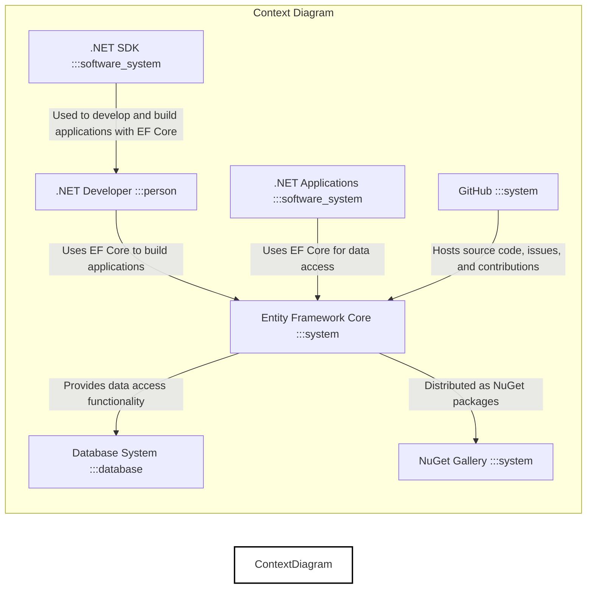
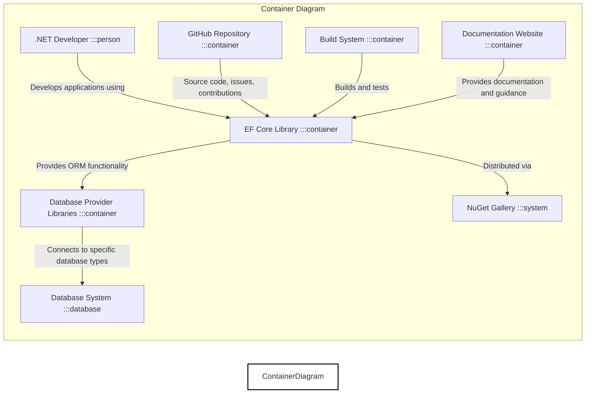
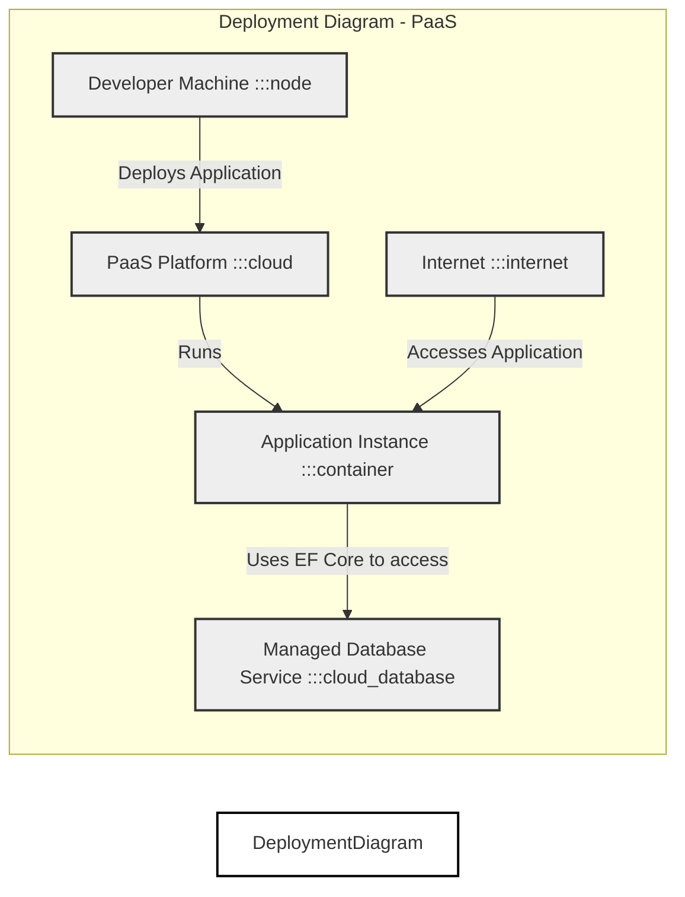
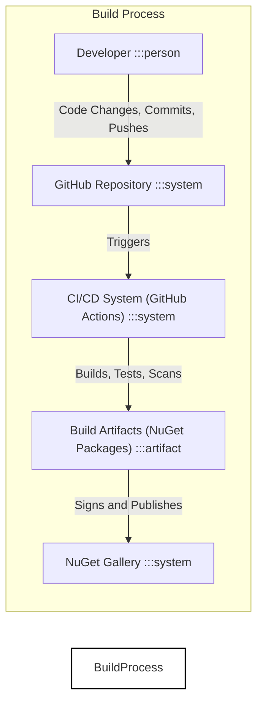

# BUSINESS POSTURE

The Entity Framework Core (EF Core) project aims to provide a modern object-database mapper for .NET. It enables developers to work with data using .NET objects, simplifying data access code and improving developer productivity. EF Core supports various database systems and platforms, making it a versatile tool for building data-centric applications.

Business Priorities:
- Provide a reliable and performant ORM for .NET developers.
- Ensure compatibility with a wide range of database systems.
- Maintain a vibrant and active open-source community around the project.
- Continuously improve the features and capabilities of EF Core based on user feedback and industry trends.
- Facilitate secure data access practices for applications using EF Core.

Business Goals:
- Increase developer adoption of EF Core for .NET application development.
- Establish EF Core as the leading ORM solution in the .NET ecosystem.
- Empower developers to build efficient and scalable data-driven applications.
- Foster innovation and collaboration within the .NET data access community.

Most Important Business Risks:
- Security vulnerabilities in EF Core could lead to data breaches and compromise applications using it.
- Performance issues in EF Core could negatively impact the performance of applications.
- Lack of compatibility with new database systems or .NET features could limit adoption.
- Decline in community support could hinder project development and user assistance.
- Bugs or instability in EF Core releases could disrupt application development and production environments.

# SECURITY POSTURE

Existing Security Controls:
- security control: GitHub repository with access control and audit logs. Implemented by GitHub.
- security control: Open source development model with community review. Implemented by GitHub and community.
- security control: .NET platform security features. Implemented by .NET runtime and libraries.
- security control: NuGet package signing. Implemented by NuGet infrastructure.
- security control: Static code analysis tools used in development. Implemented in development and CI pipelines.
- security control: Unit and integration testing. Implemented in development and CI pipelines.

Accepted Risks:
- accepted risk: Vulnerabilities might be introduced by community contributions.
- accepted risk: Open source nature makes the codebase publicly available for scrutiny by both security researchers and malicious actors.
- accepted risk: Dependency on third-party libraries and database providers, which might have their own vulnerabilities.
- accepted risk: Security issues might be discovered after release, requiring patching and updates.

Recommended Security Controls:
- security control: Implement regular security audits and penetration testing of EF Core codebase.
- security control: Enhance static and dynamic code analysis with dedicated security scanning tools.
- security control: Establish a clear vulnerability disclosure and incident response process.
- security control: Provide security guidelines and best practices for developers using EF Core.
- security control: Implement dependency scanning and management to track and update vulnerable dependencies.

Security Requirements:
- Authentication:
    - requirement: EF Core itself does not handle user authentication, but it must securely manage database connection credentials provided by the application.
    - requirement: Connection strings should be protected and not hardcoded in application code.
    - requirement: Support for various database authentication methods should be robust and secure.
- Authorization:
    - requirement: EF Core should facilitate implementation of application-level authorization logic to control data access based on user roles and permissions.
    - requirement: Query generation should prevent SQL injection vulnerabilities that could bypass authorization checks.
    - requirement: Data access should adhere to the principle of least privilege.
- Input Validation:
    - requirement: EF Core should encourage or enforce input validation to prevent injection attacks (e.g., SQL injection, NoSQL injection).
    - requirement: Data type validation and range checks should be performed before database queries are executed.
    - requirement: Parameterized queries or prepared statements must be used by default to prevent SQL injection.
- Cryptography:
    - requirement: EF Core should support encryption of sensitive data at rest in the database and in transit.
    - requirement: Secure handling of cryptographic keys and secrets used for encryption should be ensured.
    - requirement: Support for data masking and anonymization techniques for sensitive data should be considered.

# DESIGN

## C4 CONTEXT

Context Diagram Elements:

- Element:
    - Name: .NET Developer
    - Type: Person
    - Description: Software developers who use EF Core to build .NET applications.
    - Responsibilities: Develops applications using EF Core, configures EF Core for data access, writes queries and data models.
    - Security controls: Secure development practices, code review, using secure coding guidelines for EF Core.

- Element:
    - Name: Entity Framework Core
    - Type: System
    - Description: An object-relational mapper (ORM) for .NET that facilitates data access from various database systems.
    - Responsibilities: Mapping .NET objects to database tables, generating database queries, managing database connections, providing data access APIs.
    - Security controls: Input validation, parameterized queries, secure connection management, vulnerability management, security testing.

- Element:
    - Name: Database System
    - Type: Database
    - Description: Relational or NoSQL database systems supported by EF Core (e.g., SQL Server, PostgreSQL, MySQL, Cosmos DB).
    - Responsibilities: Storing and managing application data, executing database queries, enforcing database security policies.
    - Security controls: Database access control, encryption at rest, encryption in transit, database auditing, vulnerability patching.

- Element:
    - Name: NuGet Gallery
    - Type: System
    - Description: The package manager for .NET, used to distribute and consume EF Core NuGet packages.
    - Responsibilities: Hosting and distributing EF Core NuGet packages, verifying package integrity, managing package versions.
    - Security controls: Package signing, malware scanning, access control for package publishing.

- Element:
    - Name: .NET Applications
    - Type: Software System
    - Description: Applications built using .NET and EF Core that rely on EF Core for data access.
    - Responsibilities: Utilizing EF Core to interact with databases, implementing business logic, handling user requests.
    - Security controls: Application-level authentication and authorization, input validation, secure data handling, vulnerability management.

- Element:
    - Name: GitHub
    - Type: System
    - Description: Platform hosting the EF Core source code repository, issue tracking, and collaboration tools.
    - Responsibilities: Source code management, version control, issue tracking, pull request management, community collaboration.
    - Security controls: Access control, audit logs, vulnerability scanning for repository infrastructure, secure development workflows.

- Element:
    - Name: .NET SDK
    - Type: Software System
    - Description: Software Development Kit for .NET, used by developers to build, test, and run .NET applications including those using EF Core.
    - Responsibilities: Providing tools and libraries for .NET development, compiling code, managing dependencies.
    - Security controls: Secure installation and update mechanisms, vulnerability management for SDK components.

## C4 CONTAINER

Container Diagram Elements:

- Element:
    - Name: EF Core Library
    - Type: Container
    - Description: The core EF Core library, distributed as NuGet packages, providing the main ORM functionality.
    - Responsibilities: Object-Relational mapping, query translation, change tracking, database interaction abstraction, API for developers.
    - Security controls: Input validation, parameterized query generation, secure connection management, vulnerability scanning, code reviews, security testing.

- Element:
    - Name: Database Provider Libraries
    - Type: Container
    - Description: Libraries that provide database-specific implementations for EF Core to interact with different database systems.
    - Responsibilities: Database-specific query generation, connection management, data type mapping, feature implementation.
    - Security controls: Provider-specific security considerations, input validation, secure connection handling, vulnerability management (responsibility shared with provider developers).

- Element:
    - Name: Database System
    - Type: Database
    - Description: The actual database system (e.g., SQL Server, PostgreSQL) where application data is stored.
    - Responsibilities: Data storage, query execution, data integrity, database security.
    - Security controls: Database access control, encryption at rest, encryption in transit, database auditing, vulnerability patching, database hardening.

- Element:
    - Name: NuGet Gallery
    - Type: System
    - Description: The NuGet package repository used to host and distribute EF Core and provider libraries.
    - Responsibilities: Package hosting, distribution, versioning, package integrity verification.
    - Security controls: Package signing, malware scanning, access control for package publishing, infrastructure security.

- Element:
    - Name: GitHub Repository
    - Type: Container
    - Description: The GitHub repository hosting the source code, issue tracker, and contribution platform for EF Core.
    - Responsibilities: Source code management, version control, issue tracking, pull request management, community collaboration.
    - Security controls: Access control, audit logs, vulnerability scanning for repository infrastructure, secure development workflows, branch protection.

- Element:
    - Name: Build System
    - Type: Container
    - Description: Automated build and testing infrastructure used to compile, test, and package EF Core libraries.
    - Responsibilities: Compilation, unit testing, integration testing, packaging NuGet packages, static code analysis, security scanning.
    - Security controls: Secure build environment, access control, build process integrity, dependency scanning, SAST/DAST integration, artifact signing.

- Element:
    - Name: Documentation Website
    - Type: Container
    - Description: Website providing documentation, tutorials, and guidance for using EF Core.
    - Responsibilities: Providing user documentation, examples, API references, best practices, security guidelines.
    - Security controls: Web application security controls (authentication, authorization, input validation), protection against content injection, secure hosting.

## DEPLOYMENT

EF Core itself is not deployed as a standalone application. It is a library consumed by .NET applications. The deployment of applications using EF Core will vary greatly depending on the application type and requirements.

Possible Deployment Architectures for Applications using EF Core:
1.  On-Premise Servers: Applications and databases deployed on servers within an organization's data center.
2.  Cloud Infrastructure (IaaS): Applications and databases deployed on virtual machines in cloud environments like AWS EC2, Azure VMs, or Google Compute Engine.
3.  Platform as a Service (PaaS): Applications deployed on PaaS platforms like Azure App Service, AWS Elastic Beanstalk, or Google App Engine, potentially using managed database services.
4.  Containerized Deployment (Docker, Kubernetes): Applications and databases containerized and orchestrated using Docker and Kubernetes.
5.  Serverless Functions: Applications using EF Core for data access within serverless functions (e.g., Azure Functions, AWS Lambda).

Detailed Deployment Architecture (Example: PaaS with Managed Database):

Deployment Diagram Elements (PaaS Example):

- Element:
    - Name: Developer Machine
    - Type: Node
    - Description: Developer's local machine used for developing and deploying the .NET application.
    - Responsibilities: Writing code, building application, deploying application to PaaS.
    - Security controls: Developer workstation security, code security practices, secure deployment tools.

- Element:
    - Name: PaaS Platform (e.g., Azure App Service)
    - Type: Cloud
    - Description: Platform as a Service environment hosting the application.
    - Responsibilities: Application hosting, scaling, monitoring, providing runtime environment.
    - Security controls: Platform security controls, network security, access control, runtime environment security, vulnerability management.

- Element:
    - Name: Application Instance
    - Type: Container
    - Description: Instance of the .NET application running within the PaaS platform, using EF Core.
    - Responsibilities: Handling user requests, executing business logic, using EF Core for data access.
    - Security controls: Application security controls (authentication, authorization, input validation), secure configuration, vulnerability management, logging and monitoring.

- Element:
    - Name: Managed Database Service (e.g., Azure SQL Database)
    - Type: Cloud Database
    - Description: Managed database service provided by the cloud platform.
    - Responsibilities: Data storage, database management, high availability, backups.
    - Security controls: Database access control, encryption at rest, encryption in transit, database auditing, vulnerability patching, managed security services.

- Element:
    - Name: Internet
    - Type: Internet
    - Description: Public internet through which users access the application.
    - Responsibilities: Providing network connectivity for users to access the application.
    - Security controls: Network security controls (firewalls, DDoS protection), secure communication protocols (HTTPS).

## BUILD

Build Process Description:

1.  Developer: Developers write code, commit changes to a local repository, and push commits to the central GitHub repository.
2.  GitHub Repository: Hosts the source code and triggers the CI/CD system upon code changes.
3.  CI/CD System (GitHub Actions): Automated system that builds, tests, and performs security checks on the code.
    -   Responsibilities:
        -   Source code checkout.
        -   Compilation and build process.
        -   Unit and integration testing.
        -   Static code analysis (SAST).
        -   Dependency scanning.
        -   Security vulnerability scanning.
        -   Code linting and formatting checks.
        -   Packaging build artifacts (NuGet packages).
    -   Security Controls:
        -   Secure build environment (isolated and hardened).
        -   Access control to CI/CD system and configurations.
        -   Secrets management for credentials used in build and deployment.
        -   Code signing of build artifacts.
        -   Provenance tracking of build artifacts.
        -   Integration of security scanning tools (SAST, dependency scanning).
4.  Build Artifacts (NuGet Packages): Compiled and tested NuGet packages containing EF Core libraries.
    -   Responsibilities: Containing the distributable code of EF Core.
    -   Security Controls: Code signing to ensure integrity and authenticity.
5.  NuGet Gallery: Public NuGet package repository where EF Core NuGet packages are published.
    -   Responsibilities: Hosting and distributing NuGet packages.
    -   Security Controls: Package signing verification, malware scanning, access control for package publishing, infrastructure security.

# RISK ASSESSMENT

Critical Business Processes:
- Development of .NET applications using EF Core.
- Data access within .NET applications using EF Core.
- Integrity and confidentiality of data managed by applications using EF Core.
- Availability and performance of applications relying on EF Core.
- Community trust and adoption of EF Core as a reliable ORM solution.

Data Sensitivity:
- EF Core itself does not store or process application data directly. It facilitates access to data stored in external database systems.
- The sensitivity of data handled through EF Core depends entirely on the applications using it and the databases they interact with.
- Data sensitivity can range from publicly available information to highly confidential personal or financial data, depending on the application domain.
- It is crucial for applications using EF Core to properly classify and protect the data they handle, using appropriate security measures at the application and database levels.

# QUESTIONS & ASSUMPTIONS

Questions:
- What are the primary target applications and use cases for EF Core from a business perspective?
- What are the most critical security concerns for users of EF Core?
- Are there specific regulatory compliance requirements that EF Core needs to address?
- What is the expected level of security expertise among developers using EF Core?
- Are there any specific threat models or attack scenarios that are of particular concern for EF Core?

Assumptions:
- EF Core is intended to be used in a wide variety of .NET applications, ranging from small projects to large enterprise systems.
- Security is a significant concern for users of EF Core, especially given its role in data access.
- Developers using EF Core are expected to have a basic understanding of security best practices, but may not be security experts.
- The primary threat vectors for EF Core are likely to be related to injection attacks (SQL injection, NoSQL injection), insecure data handling, and vulnerabilities in dependencies.
- The open-source nature of EF Core is considered a benefit for transparency and community security review, but also requires careful management of contributions and vulnerabilities.