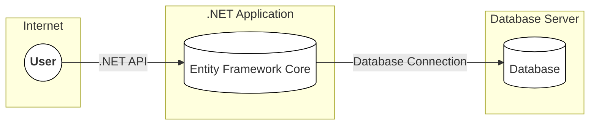
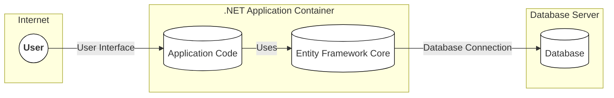
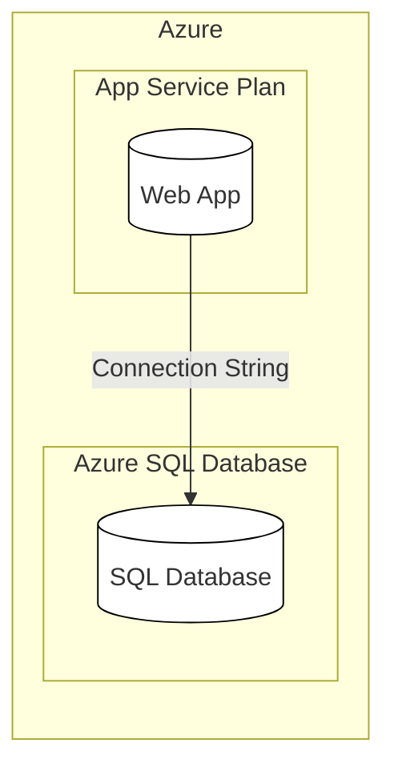
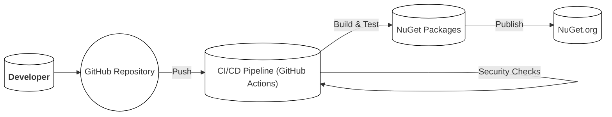

# Project Design Document: Entity Framework Core

## BUSINESS POSTURE

Entity Framework Core (EF Core) is a critical component for many .NET applications, serving as the primary data access layer. Its success is tied to developer productivity, application performance, and data integrity.

Priorities and Goals:

*   Enable developers to interact with databases using .NET objects, reducing boilerplate code and increasing productivity.
*   Provide a flexible and extensible framework that supports various database providers.
*   Ensure high performance and efficient data access.
*   Maintain data integrity and consistency.
*   Support a wide range of application types, from small utilities to large enterprise systems.
*   Provide a clear and consistent development experience across different platforms (.NET, .NET Core, .NET Framework).

Business Risks:

*   Data breaches due to vulnerabilities in EF Core or its interaction with the database.
*   Performance bottlenecks caused by inefficient queries or improper use of EF Core features.
  Data corruption or loss due to bugs in EF Core or incorrect usage.
*   Incompatibility with specific database providers or versions, limiting deployment options.
*   Steep learning curve for developers unfamiliar with ORM concepts, hindering adoption.
*   Exposure of sensitive data through logging or error messages.
*   Supply chain attacks targeting EF Core or its dependencies.

## SECURITY POSTURE

Existing Security Controls:

*   security control: Parameterized Queries: EF Core uses parameterized queries by default, mitigating SQL injection risks. Implemented within the query generation logic of EF Core.
*   security control: Input Validation: While EF Core itself doesn't perform explicit input validation, it relies on the .NET type system and data annotations for basic validation. Developers are expected to implement comprehensive input validation in their application logic. Described in the documentation and best practices guides.
*   security control: Data Encryption: EF Core supports encryption at rest and in transit through database provider configurations and .NET APIs. Described in the documentation.
*   security control: Auditing: EF Core provides mechanisms for tracking changes to entities, which can be used for auditing purposes. Implemented through the ChangeTracker API.
*   security control: Secure Development Practices: The EF Core team follows secure development practices, including code reviews, static analysis, and vulnerability scanning. Described in their development process documentation.
*   security control: Regular Security Updates: Microsoft releases regular security updates for EF Core to address identified vulnerabilities.
*   security control: Least Privilege Principle: Documentation and guidance encourage developers to use database accounts with the least necessary privileges.

Accepted Risks:

*   accepted risk: Reliance on Database Provider Security: EF Core's security heavily relies on the security of the underlying database provider and its configuration.
*   accepted risk: Potential for Developer Error: Incorrect usage of EF Core features, such as raw SQL queries or disabling change tracking, can introduce security vulnerabilities.
*   accepted risk: Limited Control over Third-Party Dependencies: EF Core depends on various third-party libraries, which may have their own security vulnerabilities.

Recommended Security Controls:

*   security control: Implement robust input validation at the application level, before data reaches EF Core.
*   security control: Regularly review and update EF Core and its dependencies to the latest versions.
*   security control: Enable detailed logging and monitoring to detect and respond to suspicious activity.
*   security control: Implement a strong authentication and authorization mechanism for database access.
*   security control: Conduct regular security assessments and penetration testing to identify potential vulnerabilities.
*   security control: Use a Web Application Firewall (WAF) to protect against common web attacks.

Security Requirements:

*   Authentication:
    *   Applications using EF Core must authenticate users and database connections securely.
    *   Support for multi-factor authentication should be considered.
*   Authorization:
    *   Access to data through EF Core should be controlled based on user roles and permissions.
    *   Implement least privilege access to the database.
*   Input Validation:
    *   All data input to the application, especially data that interacts with EF Core, must be validated.
    *   Validation should be performed on both the client-side and server-side.
*   Cryptography:
    *   Sensitive data stored in the database should be encrypted at rest.
    *   Data transmitted between the application and the database should be encrypted in transit (e.g., using TLS).
    *   Use strong, industry-standard cryptographic algorithms.
*   Output Encoding:
    *   Data retrieved from the database and displayed to the user should be properly encoded to prevent cross-site scripting (XSS) vulnerabilities.

## DESIGN

### C4 CONTEXT

Element Descriptions:

*   Element:
    *   Name: User
    *   Type: Person
    *   Description: Represents a user interacting with the .NET application that uses EF Core.
    *   Responsibilities: Initiates requests to the application, provides input, and receives output.
    *   Security controls: Authentication, Authorization (handled by the application).
*   Element:
    *   Name: Entity Framework Core
    *   Type: Software System
    *   Description: The object-relational mapper (ORM) used by the .NET application to interact with the database.
    *   Responsibilities: Translates between .NET objects and database tables, manages database connections, executes queries, and tracks changes.
    *   Security controls: Parameterized Queries, Data Encryption (through provider), Auditing (ChangeTracker).
*   Element:
    *   Name: Database
    *   Type: Database
    *   Description: The database system used to store and manage data.
    *   Responsibilities: Stores data, enforces data integrity, executes queries, and manages transactions.
    *   Security controls: Database-level security (authentication, authorization, encryption), Auditing.

### C4 CONTAINER

Since EF Core is a library within a .NET application, the container diagram is essentially an extension of the context diagram. The "container" in this case is the .NET application itself.

Element Descriptions:

*   Element:
    *   Name: User
    *   Type: Person
    *   Description: Represents a user interacting with the .NET application.
    *   Responsibilities: Initiates requests, provides input, and receives output.
    *   Security controls: Authentication, Authorization (handled by the application).
*   Element:
    *   Name: Application Code
    *   Type: Container
    *   Description: The code of the .NET application that utilizes EF Core.
    *   Responsibilities: Handles user requests, interacts with EF Core, implements business logic, and renders the user interface.
    *   Security controls: Input Validation, Output Encoding, Authentication, Authorization.
*   Element:
    *   Name: Entity Framework Core
    *   Type: Container (Library)
    *   Description: The object-relational mapper (ORM) library.
    *   Responsibilities: Translates between .NET objects and database tables, manages database connections, executes queries, and tracks changes.
    *   Security controls: Parameterized Queries, Data Encryption (through provider), Auditing (ChangeTracker).
*   Element:
    *   Name: Database
    *   Type: Database
    *   Description: The database system.
    *   Responsibilities: Stores data, enforces data integrity, executes queries, and manages transactions.
    *   Security controls: Database-level security (authentication, authorization, encryption), Auditing.

### DEPLOYMENT

EF Core itself is a library and doesn't have a specific deployment process. However, applications using EF Core can be deployed in various ways. Here are a few common scenarios, with a detailed description of one:

Possible Deployment Solutions:

1.  Azure App Service (PaaS)
2.  Azure Virtual Machines (IaaS)
3.  On-premises IIS Server
4.  Docker Containers (deployed to Kubernetes, Docker Swarm, or other orchestrators)
5.  Serverless Functions (Azure Functions, AWS Lambda)

Chosen Solution: Azure App Service (PaaS)

Element Descriptions:

*   Element:
    *   Name: Web App
    *   Type: Web Application
    *   Description: The .NET application using EF Core, deployed as an Azure App Service.
    *   Responsibilities: Hosts the application code, handles HTTP requests, and interacts with the database.
    *   Security controls: Azure App Service security features (authentication, authorization, TLS/SSL, network security), Application-level security controls.
*   Element:
    *   Name: SQL Database
    *   Type: Database
    *   Description: The Azure SQL Database instance used by the application.
    *   Responsibilities: Stores and manages application data.
    *   Security controls: Azure SQL Database security features (firewall, authentication, encryption, auditing, threat detection).

Deployment Steps:

1.  The .NET application (including EF Core) is built and published.
2.  An Azure App Service and Azure SQL Database are provisioned.
3.  The published application is deployed to the Azure App Service.
4.  The connection string for the Azure SQL Database is configured in the App Service settings (using environment variables or Key Vault for secrets management).
5.  The App Service is configured with appropriate security settings (TLS/SSL, authentication, authorization).

### BUILD

The build process for EF Core involves multiple steps and security considerations.

Build Process Description:

1.  Developer: Developers write code and commit changes to the GitHub repository.
2.  GitHub Repository: The source code for EF Core is hosted on GitHub.
3.  CI/CD Pipeline (GitHub Actions): A CI/CD pipeline (using GitHub Actions) is triggered on each commit.
4.  Build & Test: The pipeline builds the code, runs unit and integration tests, and creates NuGet packages.
5.  Security Checks:
    *   Static Analysis: Static analysis tools (e.g., Roslyn analyzers, SonarQube) are used to identify potential code quality and security issues.
    *   Dependency Scanning: Tools like Dependabot scan for known vulnerabilities in project dependencies.
    *   Code Signing: NuGet packages are digitally signed to ensure their integrity and authenticity.
6.  NuGet Packages: The built NuGet packages are the build artifacts.
7.  Publish: The NuGet packages are published to NuGet.org, the official package repository for .NET.

Security Controls in Build Process:

*   security control: Code Reviews: All code changes are reviewed by other developers before merging.
*   security control: Static Analysis: Automated static analysis tools are used to identify potential vulnerabilities.
*   security control: Dependency Scanning: Automated scanning for known vulnerabilities in dependencies.
*   security control: Code Signing: NuGet packages are signed to prevent tampering.
*   security control: Least Privilege: Build agents run with minimal necessary permissions.
*   security control: Secure Build Environment: The CI/CD pipeline runs in a secure environment (GitHub Actions).

## RISK ASSESSMENT

Critical Business Processes:

*   Data access and management for .NET applications.
*   Database interactions for various application types.
*   Enabling developer productivity in building data-driven applications.

Data Sensitivity:

*   EF Core itself doesn't store data, but it handles data access. The sensitivity of the data depends on the specific application using EF Core.
*   Data handled by EF Core can range from non-sensitive (e.g., public website content) to highly sensitive (e.g., personally identifiable information (PII), financial data, health records).
*   Connection strings and other database credentials are highly sensitive and must be protected.

## QUESTIONS & ASSUMPTIONS

Questions:

*   What specific database providers are intended to be used with EF Core in this particular context?
*   What is the expected scale and performance requirements for applications using EF Core?
*   Are there any specific compliance requirements (e.g., GDPR, HIPAA) that need to be considered?
*   What is the existing security infrastructure and tooling in place for the development and deployment environments?
*   What level of logging and monitoring is required for applications using EF Core?

Assumptions:

*   BUSINESS POSTURE: It is assumed that the organization has a basic understanding of data security principles and best practices.
*   SECURITY POSTURE: It is assumed that the underlying operating system and database server are properly secured and maintained.
*   DESIGN: It is assumed that developers using EF Core will follow secure coding practices and utilize the provided security features appropriately.
*   DEPLOYMENT: It is assumed that the chosen deployment environment (Azure App Service in the example) is configured securely.
*   BUILD: It is assumed that the build process is automated and includes security checks.