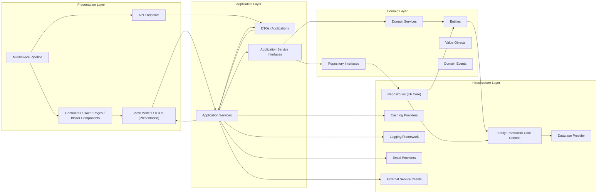
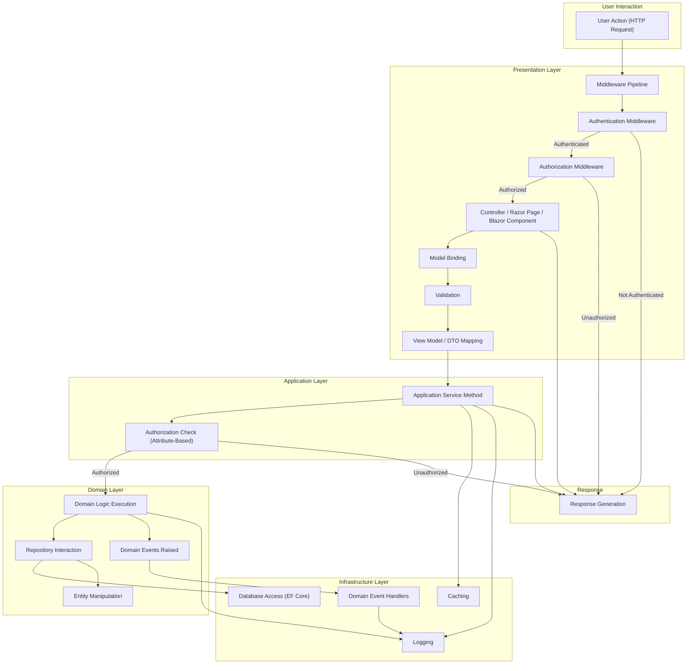

## Project Design Document: ASP.NET Boilerplate Framework (Improved)

**1. Introduction**

This document provides an enhanced and more detailed architectural design of the ASP.NET Boilerplate framework. It aims to offer a comprehensive understanding of the framework's components, their interactions, and data flow, with a specific focus on aspects relevant to security. This document will serve as a robust foundation for subsequent threat modeling activities, enabling a thorough analysis of potential security vulnerabilities.

**2. Goals**

*   Clearly define the architectural components of the ASP.NET Boilerplate framework with greater detail.
*   Illustrate the interactions and dependencies between these components with improved clarity.
*   Describe the typical data flow within an application built using the framework, including middleware and specific stages.
*   Identify key technologies, patterns, and security features employed by the framework.
*   Provide a more comprehensive basis for identifying potential security threats and vulnerabilities, categorized for better analysis.

**3. Target Audience**

This document is intended for:

*   Security architects and engineers responsible for threat modeling, security assessments, and penetration testing.
*   Developers working with the ASP.NET Boilerplate framework, especially those involved in security-sensitive areas.
*   System architects designing and deploying applications based on the framework.
*   DevOps engineers responsible for the secure deployment and operation of applications.

**4. Project Overview**

ASP.NET Boilerplate is a mature and widely adopted open-source application framework built on top of ASP.NET Core. It provides a robust foundation for building modern, scalable, and maintainable web applications and APIs. The framework emphasizes a layered architecture, modularity, and testability, incorporating Domain-Driven Design (DDD) principles and addressing common cross-cutting concerns. Key features include:

*   Dependency Injection (using Autofac by default) for loose coupling and testability.
*   Unit of Work pattern for managing database transactions.
*   Repository pattern for abstracting data access logic.
*   Domain-Driven Design (DDD) building blocks to model complex business domains.
*   Comprehensive Authentication and Authorization system with role-based access control.
*   Auditing infrastructure for tracking changes and activities.
*   Localization support for building multi-lingual applications.
*   Exception Handling and logging mechanisms for robust error management.
*   Background Jobs for asynchronous task processing.
*   Real-time notifications for interactive user experiences.
*   Modular architecture allowing for feature isolation and independent development.

**5. Architectural Design**

The ASP.NET Boilerplate framework adheres to a well-defined layered architecture, promoting separation of concerns and maintainability. The typical layers are:

*   **Presentation Layer:** Responsible for handling user interactions and presenting information. This layer can be implemented using:
    *   ASP.NET Core MVC (Controllers and Views)
    *   Razor Pages
    *   Blazor (Server-Side and WebAssembly)
    *   Web APIs (RESTful or GraphQL endpoints)
    *   Middleware for request processing and security enforcement.
*   **Application Layer:** Contains the application's business logic and orchestrates interactions between the presentation and domain layers. It defines:
    *   Application Services that expose use cases to the presentation layer.
    *   Data Transfer Objects (DTOs) for transferring data between layers.
    *   Application Service Interfaces defining contracts for application services.
*   **Domain Layer:** Represents the core business logic and concepts of the application, independent of any specific framework or technology. It includes:
    *   Entities representing the core business objects.
    *   Domain Services encapsulating complex business logic.
    *   Repository Interfaces defining contracts for data access.
    *   Value Objects representing immutable domain concepts.
    *   Domain Events for decoupling domain logic and triggering side effects.
*   **Infrastructure Layer:** Provides concrete implementations for interfaces defined in other layers, handling technical concerns:
    *   Data access using Entity Framework Core (default) or other ORMs.
    *   Concrete Repository implementations using the chosen ORM.
    *   Caching providers (e.g., in-memory, distributed cache).
    *   Logging framework implementations (e.g., Serilog, NLog).
    *   Email providers (e.g., SMTP, SendGrid).
    *   External service clients for integration with external systems.
    *   Database provider-specific implementations within EF Core.

**5.1. Component Diagram**

**5.2. Key Components and Responsibilities (Enhanced)**

*   **Controllers / Razor Pages / Blazor Components:** Handle incoming user requests, orchestrate interactions with application services, and return responses to the user. They are responsible for presentation logic and user interface interactions.
*   **API Endpoints:** Expose application functionality through well-defined APIs (RESTful, GraphQL, etc.) for consumption by external clients or other parts of the application.
*   **View Models / DTOs (Presentation Layer):** Data structures specifically designed for the presentation layer, often tailored to the needs of specific views or API responses. They help in decoupling the presentation layer from the domain model.
*   **Middleware Pipeline:** A series of components that process HTTP requests and responses. This includes middleware for authentication, authorization, logging, exception handling, and security headers.
*   **Application Services:** Implement specific use cases and business workflows. They coordinate interactions between domain objects and infrastructure services, acting as a facade to the domain layer.
*   **DTOs (Application Layer):** Data structures used to transfer data between the presentation and application layers, and between the application and domain layers. They encapsulate data required for specific operations.
*   **Application Service Interfaces:** Define contracts for application services, promoting loose coupling and allowing for different implementations.
*   **Entities:** Represent the core business objects within the domain, encapsulating data and behavior relevant to the business rules.
*   **Domain Services:** Implement complex business logic that spans multiple entities or requires access to infrastructure services. They contain logic that doesn't naturally belong to a single entity.
*   **Repository Interfaces:** Define contracts for accessing and manipulating entities in the data store, abstracting away the underlying data access technology.
*   **Value Objects:** Immutable objects that represent a conceptual whole, such as an address or a monetary amount. They contribute to domain clarity and prevent certain types of errors.
*   **Domain Events:** Represent significant occurrences within the domain. They allow for decoupling of domain logic and can trigger asynchronous operations or side effects.
*   **Entity Framework Core Context:** Provides a connection to the database, manages entity tracking, and facilitates querying and saving data.
*   **Repositories (EF Core Implementation):** Concrete implementations of repository interfaces using Entity Framework Core, providing the actual data access logic.
*   **Caching Providers:** Implement caching mechanisms to improve application performance by storing frequently accessed data in memory or a distributed cache.
*   **Logging Framework:** Handles application logging, error reporting, and auditing, providing insights into application behavior and potential issues.
*   **Email Providers:** Facilitate sending emails from the application for notifications, confirmations, and other communication purposes.
*   **External Service Clients:** Implement integrations with external systems and services, such as payment gateways, social media platforms, or other APIs.
*   **Database Provider:** The specific database system (e.g., SQL Server, PostgreSQL, MySQL) used with Entity Framework Core.

**6. Data Flow (Detailed)**

A typical HTTP request flow in an ASP.NET Boilerplate application involves several stages, including middleware processing:

**Detailed Steps:**

1. **User Action:** A user initiates an action, resulting in an HTTP request to the application.
2. **Middleware Pipeline:** The request enters the ASP.NET Core middleware pipeline.
3. **Authentication Middleware:** Middleware responsible for identifying the user. It checks for authentication tokens (e.g., cookies, JWT) and establishes the user's identity.
4. **Authorization Middleware:** Middleware responsible for determining if the authenticated user has permission to access the requested resource or perform the requested action.
5. **Controller / Razor Page / Blazor Component:** If authorized, the request is routed to the appropriate controller action, Razor Page handler, or Blazor component method.
6. **Model Binding:** Input data from the request (e.g., form data, query parameters, request body) is automatically mapped to the parameters of the controller action or page handler.
7. **Validation:** Validation attributes and logic are applied to the bound model to ensure the input data is valid and meets the required criteria.
8. **View Model / DTO Mapping:** Input data (often in the form of View Models) is mapped to Application Layer DTOs for use by application services.
9. **Application Service Method:** The controller/page/component calls a corresponding method in an application service.
10. **Authorization Check (Attribute-Based):** Application service methods may have authorization attributes that enforce further authorization checks at the application layer.
11. **Domain Logic Execution:** If authorized, the application service orchestrates the execution of business logic within the domain layer, interacting with entities and domain services.
12. **Repository Interaction:** Domain services or application services use repository interfaces to access and manipulate data in the data store.
13. **Entity Manipulation:** Entities are created, updated, or deleted based on the business logic.
14. **Domain Events Raised:** Significant events within the domain may be raised during the execution of business logic.
15. **Database Access (EF Core):** The repository implementation (using Entity Framework Core) interacts with the configured database provider to persist changes.
16. **Caching:** The application may utilize caching mechanisms to retrieve frequently accessed data, potentially within the application service or repository.
17. **Logging:** Throughout the process, relevant events, errors, and security-related activities are logged.
18. **Domain Event Handlers:** Asynchronously handle domain events, triggering side effects or integrations.
19. **Response Generation:** The application service returns a result (often a DTO), which is then mapped to a View Model or API response and sent back to the user.

**7. Security Considerations (Detailed)**

ASP.NET Boilerplate incorporates several security features and practices. Potential security considerations include:

*   **Authentication and Authorization:**
    *   Built-in user and role management system.
    *   Support for various authentication schemes (e.g., cookie-based, JWT).
    *   Attribute-based authorization for controlling access to application service methods and controllers.
    *   Integration with ASP.NET Core Identity.
    *   Consideration for multi-factor authentication (MFA) implementation.
*   **Input Validation:**
    *   Leverages ASP.NET Core's model validation framework with data annotations and custom validation logic.
    *   Importance of validating input at both the presentation and application layers to prevent injection attacks.
*   **Data Protection:**
    *   Encourages the use of HTTPS for encrypting data in transit.
    *   Integration with ASP.NET Core Data Protection API for encrypting sensitive data at rest.
    *   Consideration for database encryption features.
*   **Cross-Site Scripting (XSS):**
    *   Utilizes Razor's encoding features to prevent rendering of malicious scripts.
    *   Importance of proper handling of user-generated content.
    *   Consideration for Content Security Policy (CSP) headers.
*   **Cross-Site Request Forgery (CSRF):**
    *   Built-in support for anti-forgery tokens to protect against CSRF attacks.
    *   Ensure anti-forgery tokens are correctly implemented in forms and AJAX requests.
*   **SQL Injection:**
    *   Entity Framework Core's parameterized queries help prevent SQL injection vulnerabilities.
    *   Avoidance of constructing raw SQL queries where possible.
*   **Dependency Management:**
    *   Importance of keeping NuGet packages up-to-date to patch known vulnerabilities.
    *   Consider using tools for vulnerability scanning of dependencies.
*   **Error Handling and Logging:**
    *   Centralized exception handling middleware to prevent leaking sensitive information in error messages.
    *   Comprehensive logging of security-related events for auditing and incident response.
*   **Security Headers:**
    *   Configuration of security headers (e.g., `Strict-Transport-Security`, `X-Content-Type-Options`, `X-Frame-Options`) to enhance security.
*   **Rate Limiting and Throttling:**
    *   Consider implementing middleware or other mechanisms to protect against denial-of-service attacks by limiting the rate of requests.
*   **Auditing:**
    *   Built-in auditing system for tracking changes to entities and other significant actions.
    *   Configuration of which entities and properties are audited.
*   **Open Redirects:**
    *   Careful handling of redirect URLs to prevent malicious redirects.
*   **Insecure Deserialization:**
    *   Awareness of potential vulnerabilities related to deserializing untrusted data.

**8. Technologies Used**

*   ASP.NET Core (.NET 6, .NET 7, etc.)
*   C#
*   Entity Framework Core (with support for various database providers like SQL Server, PostgreSQL, MySQL)
*   Autofac (IoC container)
*   .NET Standard libraries
*   NuGet packages (e.g., `Abp.AspNetCore`, `Abp.EntityFrameworkCore`, logging frameworks like Serilog or NLog, caching libraries)
*   Potentially JavaScript frameworks (e.g., Angular, React, Vue.js) for the front-end.

**9. Deployment**

ASP.NET Boilerplate applications can be deployed to various environments, including:

*   IIS (Internet Information Services) on Windows Server.
*   Docker containers orchestrated with Kubernetes or Docker Compose.
*   Cloud platforms like Azure (using Azure App Service, Azure Kubernetes Service), AWS (using EC2, Elastic Beanstalk, EKS), and GCP (using Compute Engine, Google Kubernetes Engine).
*   Serverless environments (with considerations for state management and cold starts).
*   Self-hosted environments on Linux or Windows servers.

**10. Future Considerations**

*   Detailed sequence diagrams illustrating interactions between specific components for critical security workflows (e.g., authentication, authorization).
*   More in-depth analysis of the framework's built-in security features and their configuration options.
*   Consideration of specific security best practices for different deployment environments.
*   Integration with security scanning tools and processes.
*   Detailed documentation on securing specific modules or features within the framework.
*   Performance considerations related to security implementations.

This improved design document provides a more comprehensive and detailed understanding of the ASP.NET Boilerplate framework's architecture, data flow, and security considerations. It serves as a valuable resource for security professionals and developers involved in building and securing applications based on this framework.