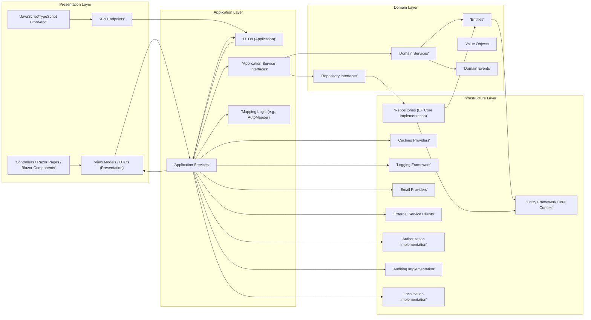
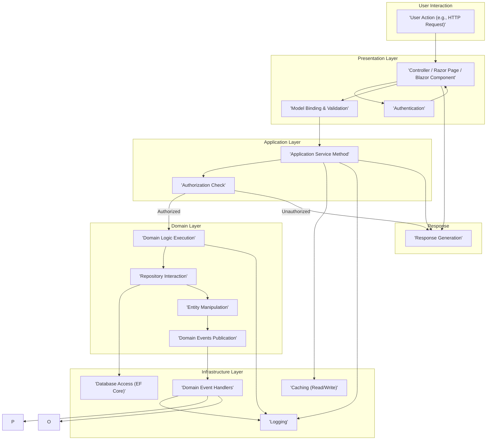

## Project Design Document: ASP.NET Boilerplate Framework (Improved)

**1. Introduction**

This document provides an enhanced and more detailed architectural design of the ASP.NET Boilerplate framework. It aims to offer a comprehensive understanding of the framework's components, their interactions, and data flow, specifically tailored for threat modeling purposes. This document will serve as a robust foundation for subsequent threat modeling activities, enabling a thorough analysis of potential security vulnerabilities and attack vectors.

**2. Goals**

*   Clearly and comprehensively define the architectural components of the ASP.NET Boilerplate framework, including specific examples within each layer.
*   Illustrate the interactions, dependencies, and communication pathways between these components with greater clarity.
*   Describe the typical data flow within an application built using the framework, including considerations for error handling and asynchronous operations.
*   Identify key technologies, design patterns, and cross-cutting concerns employed by the framework.
*   Provide a robust and detailed basis for identifying potential security threats, vulnerabilities, and attack surfaces.

**3. Target Audience**

This document is intended for:

*   Security architects and engineers responsible for in-depth threat modeling, security architecture reviews, and penetration testing.
*   Developers working with the ASP.NET Boilerplate framework who need a deep understanding of its architecture for secure development practices.
*   System architects designing and integrating applications based on the framework, requiring a clear understanding of its internal workings.

**4. Project Overview**

ASP.NET Boilerplate is a mature and widely adopted open-source application framework built on top of ASP.NET Core. It provides a robust and opinionated foundation for building modern, scalable, and maintainable web applications and APIs by implementing common cross-cutting concerns and adhering to established best practices. The framework strongly promotes a layered architecture, modularity, and testability, facilitating the development of complex enterprise applications. Key features include:

*   Inversion of Control (IoC) and Dependency Injection (using Autofac as the default container)
*   Unit of Work pattern for managing database transactions
*   Repository pattern for abstracting data access logic
*   Domain-Driven Design (DDD) building blocks to model complex business domains
*   Comprehensive Authentication and Authorization infrastructure with role-based access control
*   Auditing capabilities for tracking changes to data
*   Localization support for building multi-lingual applications
*   Centralized Exception Handling for consistent error management
*   Background Jobs and Task Scheduling for asynchronous operations
*   Real-time notification system for pushing updates to clients

**5. Architectural Design**

The ASP.NET Boilerplate framework enforces a well-defined layered architecture, promoting separation of concerns and maintainability. The typical layers are:

*   **Presentation Layer:** Responsible for handling user interactions and presenting information. Examples include:
    *   ASP.NET Core MVC Controllers for traditional web applications.
    *   Razor Pages for page-centric development.
    *   Blazor components for interactive client-side UI.
    *   Web API controllers (both RESTful and potentially GraphQL endpoints) for exposing backend functionality.
    *   JavaScript/TypeScript front-end frameworks (e.g., Angular, React, Vue.js) interacting with the API.
*   **Application Layer:** Contains the application's business logic and orchestrates interactions between the presentation and domain layers. Examples include:
    *   Application Services that implement specific use cases.
    *   Data Transfer Objects (DTOs) for transferring data between layers.
    *   Application Service Interfaces defining contracts for application services.
    *   Mapping logic (e.g., using AutoMapper) to convert between DTOs and domain entities.
*   **Domain Layer:** Represents the core business logic and concepts of the application, independent of any specific technology or framework. Examples include:
    *   Domain Entities representing business objects (e.g., `User`, `Order`, `Product`).
    *   Domain Services containing complex business logic that operates on entities.
    *   Repository Interfaces defining contracts for data access operations.
    *   Value Objects representing immutable concepts (e.g., `Address`, `Email`).
    *   Domain Events for signaling changes within the domain.
*   **Infrastructure Layer:** Provides concrete implementations for interfaces defined in other layers and handles cross-cutting concerns. Examples include:
    *   Entity Framework Core `DbContext` for database interaction.
    *   Concrete Repository implementations using EF Core.
    *   Caching providers (e.g., in-memory, Redis, distributed cache).
    *   Logging frameworks (e.g., Serilog, NLog).
    *   Email providers (e.g., SMTP clients).
    *   External service clients (e.g., for payment gateways, third-party APIs).
    *   Implementations for cross-cutting concerns like auditing, authorization, and localization.

**5.1. Component Diagram**

**5.2. Key Components and Responsibilities**

*   **Controllers / Razor Pages / Blazor Components:** Handle incoming user requests, orchestrate the application flow, interact with application services, and prepare responses for the user interface. They are responsible for request processing, input validation (to some extent), and response rendering.
*   **API Endpoints:** Expose application functionality through well-defined interfaces (e.g., RESTful APIs) for consumption by external applications or front-end frameworks. They handle request routing, authentication, authorization, and response formatting.
*   **View Models / DTOs (Presentation Layer):** Data structures specifically designed for the presentation layer, often tailored to the needs of a particular view or API endpoint. They help in decoupling the presentation layer from the domain model.
*   **JavaScript/TypeScript Front-end:**  Represents client-side logic and UI components that interact with the backend API endpoints.
*   **Application Services:** Implement specific business use cases by coordinating interactions between domain objects and infrastructure services. They act as a facade to the domain layer, exposing only necessary functionality to the presentation layer. They often handle authorization checks and transaction management.
*   **DTOs (Application Layer):** Data structures used to transfer data between the application layer and other layers (presentation and domain). They help in decoupling layers and defining clear data contracts.
*   **Application Service Interfaces:** Define contracts for application services, promoting loose coupling and enabling easier testing and mocking.
*   **Mapping Logic (e.g., AutoMapper):**  Handles the conversion between different data models (e.g., DTOs and domain entities), reducing boilerplate code and improving maintainability.
*   **Entities:** Represent the core business objects within the domain, encapsulating data and behavior related to a specific business concept. They are typically persistent and have a lifecycle managed by the application.
*   **Domain Services:** Implement complex business logic that spans multiple entities or requires access to infrastructure services. They contain logic that is core to the business domain and doesn't naturally fit within a single entity.
*   **Repository Interfaces:** Define contracts for accessing and manipulating entities in the data store, abstracting away the underlying data access technology.
*   **Value Objects:** Immutable objects that represent a conceptual whole, such as an address or a monetary amount. They are identified by their value rather than their identity.
*   **Domain Events:**  Represent significant occurrences within the domain. They allow for decoupling of concerns by enabling other parts of the application to react to domain changes without direct dependencies.
*   **Entity Framework Core Context:** Provides a connection to the database, manages entity tracking, and facilitates querying and saving data.
*   **Repositories (EF Core Implementation):** Concrete implementations of repository interfaces using Entity Framework Core, providing the actual data access logic.
*   **Caching Providers:** Implement caching mechanisms to improve application performance by storing frequently accessed data in memory or a distributed cache.
*   **Logging Framework:** Handles application logging, error reporting, and diagnostic information.
*   **Email Providers:** Facilitate sending emails from the application for various purposes (e.g., notifications, password resets).
*   **External Service Clients:**  Provide integration points for interacting with external systems and services (e.g., payment gateways, social media APIs).
*   **Authorization Implementation:** Handles the logic for determining if a user has permission to perform a specific action. ASP.NET Boilerplate provides a robust authorization system based on roles and permissions.
*   **Auditing Implementation:**  Records significant actions and changes made within the application, providing an audit trail for security and compliance purposes.
*   **Localization Implementation:** Provides mechanisms for supporting multiple languages and cultures within the application.

**6. Data Flow**

A typical synchronous request flow in an ASP.NET Boilerplate application can be described as follows:

**Detailed Steps:**

1. **User Action:** A user initiates an action through the presentation layer (e.g., clicking a button, submitting a form, making an API call).
2. **Controller/Razor Page/Blazor Component:** The request is received by a specific handler in the presentation layer.
3. **Authentication:** The framework authenticates the user based on provided credentials (e.g., cookies, tokens).
4. **Model Binding & Validation:** Input data is bound to model objects, and validation rules (defined using data annotations or fluent validation) are applied.
5. **Application Service Method:** The controller/page/component calls a corresponding method in an application service, passing in DTOs.
6. **Authorization Check:** The framework's authorization system checks if the authenticated user has the necessary permissions (roles, claims) to execute the requested application service method.
7. **Domain Logic Execution:** If authorized, the application service orchestrates the execution of business logic within the domain layer. This may involve interacting with domain entities and domain services.
8. **Repository Interaction:** Domain services or application services use repository interfaces to access and manipulate data in the data store.
9. **Entity Manipulation:** Entities are created, updated, or deleted based on the business logic.
10. **Domain Events Publication:**  Significant changes within the domain may trigger the publication of domain events.
11. **Database Access (EF Core):** The repository implementation (using Entity Framework Core) interacts with the database to persist changes. This typically involves a Unit of Work pattern to ensure transactional consistency.
12. **Caching (Read/Write):** The application may utilize caching mechanisms to retrieve frequently accessed data or store results of expensive operations.
13. **Logging:** Throughout the process, relevant events, errors, and security-related information are logged.
14. **Domain Event Handlers:** Asynchronously or synchronously handle published domain events, potentially triggering side effects like sending notifications or updating other parts of the system.
15. **Response Generation:** The application service returns a result (often a DTO) to the presentation layer, which is then used to generate a response to the user (e.g., rendering a view, returning JSON).

**7. Security Considerations (Detailed)**

Based on the architecture, potential security considerations and how ASP.NET Boilerplate addresses them include:

*   **Authentication and Authorization:**
    *   **Concern:** Ensuring only authenticated and authorized users can access specific functionalities and data.
    *   **ASP.NET Boilerplate Features:** Built-in user and role management, permission-based authorization, integration with ASP.NET Core Identity, support for various authentication schemes (e.g., cookie-based, JWT).
*   **Input Validation:**
    *   **Concern:** Preventing injection attacks (e.g., SQL injection, XSS) and data integrity issues by validating user input.
    *   **ASP.NET Boilerplate Features:** Encourages validation at multiple layers (presentation using data annotations, application layer using fluent validation), parameter binding validation in ASP.NET Core MVC.
*   **Data Protection:**
    *   **Concern:** Protecting sensitive data at rest and in transit.
    *   **ASP.NET Boilerplate Features:**  Integration with ASP.NET Core Data Protection for encrypting sensitive data, encourages the use of HTTPS, guidance on secure storage of sensitive information.
*   **Cross-Site Scripting (XSS):**
    *   **Concern:** Preventing the injection of malicious scripts into web pages.
    *   **ASP.NET Boilerplate Features:**  Leverages ASP.NET Core's built-in XSS protection mechanisms, encourages proper encoding of user-generated content in the presentation layer.
*   **Cross-Site Request Forgery (CSRF):**
    *   **Concern:** Protecting against unauthorized actions performed on behalf of an authenticated user.
    *   **ASP.NET Boilerplate Features:**  Automatic anti-forgery token generation and validation for forms and AJAX requests.
*   **SQL Injection:**
    *   **Concern:** Ensuring that dynamically generated SQL queries are properly parameterized to prevent malicious code injection.
    *   **ASP.NET Boilerplate Features:**  Relies on Entity Framework Core, which uses parameterized queries by default, reducing the risk of SQL injection.
*   **Dependency Management:**
    *   **Concern:** Using vulnerable third-party libraries.
    *   **ASP.NET Boilerplate Features:**  Encourages keeping dependencies up-to-date, provides guidance on managing NuGet packages.
*   **Error Handling:**
    *   **Concern:** Leaking sensitive information through error messages.
    *   **ASP.NET Boilerplate Features:**  Centralized exception handling, logging of errors, and preventing the display of detailed error information to end-users in production environments.
*   **Logging and Auditing:**
    *   **Concern:** Lack of visibility into security-related events and actions.
    *   **ASP.NET Boilerplate Features:**  Built-in auditing system for tracking changes to entities, integration with logging frameworks for recording application events.
*   **Security Headers:**
    *   **Concern:** Missing security headers that can protect against various attacks.
    *   **ASP.NET Boilerplate Features:**  Provides guidance on configuring security headers like Content-Security-Policy (CSP), HTTP Strict Transport Security (HSTS), etc.
*   **Rate Limiting:**
    *   **Concern:** Vulnerability to denial-of-service attacks.
    *   **ASP.NET Boilerplate Features:**  While not built-in, it can be implemented using middleware or external services.
*   **Mass Assignment Vulnerabilities:**
    *   **Concern:** Allowing users to modify unintended properties during model binding.
    *   **ASP.NET Boilerplate Features:** Encourages the use of DTOs and explicit property mapping to prevent over-posting.

**8. Technologies Used**

*   ASP.NET Core (.NET 6, .NET 7, etc.)
*   C#
*   Entity Framework Core (default Object-Relational Mapper)
*   Autofac (default Inversion of Control container)
*   .NET Standard Library
*   NuGet Packages for various functionalities (e.g., Serilog for logging, AutoMapper for object mapping, FluentValidation for validation)
*   Potentially JavaScript/TypeScript frameworks (Angular, React, Vue.js) for the front-end

**9. Deployment**

ASP.NET Boilerplate applications offer flexible deployment options:

*   **IIS (Internet Information Services):** Traditional deployment on Windows servers.
*   **Docker Containers:** Containerization for consistent and portable deployments.
*   **Cloud Platforms (Azure, AWS, GCP):** Deployment to cloud services using platforms like Azure App Service, AWS Elastic Beanstalk, Google App Engine.
*   **Serverless Environments (Azure Functions, AWS Lambda):** For specific background tasks or API endpoints.
*   **Self-Hosted Environments:** Deployment on Linux or Windows servers without relying on specific cloud providers.
*   **Considerations:** Security configurations vary depending on the deployment environment. Securely managing connection strings, API keys, and other sensitive information is crucial.

**10. Future Considerations**

This document provides a comprehensive overview of the ASP.NET Boilerplate architecture for threat modeling. Future enhancements could include:

*   Detailed sequence diagrams illustrating interactions for specific use cases, including error scenarios.
*   A dedicated security architecture section outlining specific security mechanisms and best practices within the framework.
*   Threat modeling diagrams and analysis based on the architecture described in this document.
*   Consideration of microservices architecture patterns and their impact on security when using ASP.NET Boilerplate in a distributed system.
*   More in-depth analysis of asynchronous data flows and their security implications.
*   Guidance on secure coding practices specific to ASP.NET Boilerplate.

This improved design document provides a more detailed and robust foundation for conducting thorough threat modeling activities on applications built using the ASP.NET Boilerplate framework. By understanding the intricacies of the architecture and data flow, security professionals can more effectively identify potential vulnerabilities and recommend appropriate mitigation strategies.