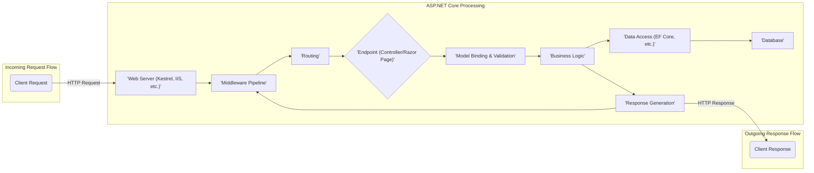
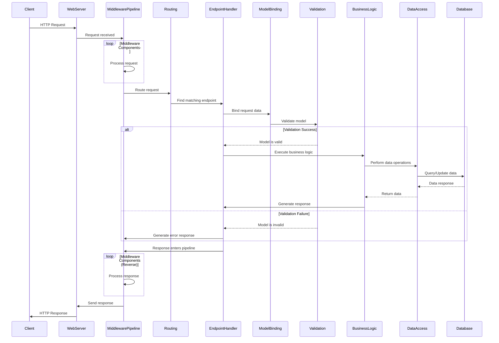

# Project Design Document: ASP.NET Core Framework

**Version:** 1.1
**Date:** October 26, 2023
**Author:** AI Software Architect

## 1. Introduction

This document provides a detailed architectural design overview of the ASP.NET Core framework, based on the project repository found at [https://github.com/dotnet/aspnetcore](https://github.com/dotnet/aspnetcore). This document is specifically crafted to serve as a foundation for subsequent threat modeling activities. It meticulously outlines the key components, their interactions, and the overall structure of the framework, highlighting potential areas of interest for security analysis.

## 2. Project Overview

ASP.NET Core is a versatile, open-source framework for building modern, cloud-connected applications across various platforms. It empowers developers to create web applications, RESTful APIs, and microservices that run on Windows, macOS, and Linux. Its core strengths include:

*   Platform independence
*   Modular and decoupled design
*   Integrated dependency injection
*   Robust support for testing
*   Seamless integration with modern front-end technologies
*   Optimized for high performance and scalability

## 3. Architectural Overview

ASP.NET Core employs a modular, layered architecture centered around the concept of a request pipeline. Key architectural elements include:

*   **Hosting Model:** Defines how the application is executed. Options include Kestrel (a cross-platform web server), integration with IIS (Internet Information Services), or other compatible HTTP servers. The host is responsible for starting the application and listening for HTTP requests.
*   **Middleware Pipeline:**  A sequence of independent components (middleware) that process incoming HTTP requests and outgoing responses. Each middleware performs a specific function, such as authentication, authorization, logging, or routing. The order of middleware in the pipeline is crucial.
*   **Endpoint Routing:** The mechanism that maps incoming HTTP requests to specific application logic, typically implemented as controllers or Razor Pages. Routing analyzes the request URL and other factors to determine the appropriate handler.
*   **Programming Models:**  Provides structures for handling web requests. Controllers are commonly used for building APIs, while Razor Pages offer a page-centric approach for building web UI.
*   **Model Binding and Validation:**  The process of converting raw HTTP request data into strongly-typed .NET objects and ensuring that this data conforms to defined rules. This helps prevent invalid data from reaching application logic.
*   **Dependency Injection (DI):** A fundamental pattern where components receive their dependencies from an external source (the DI container) rather than creating them internally. This promotes loose coupling and testability.
*   **Configuration System:**  A flexible system for managing application settings from various sources like configuration files, environment variables, and command-line arguments.
*   **Logging Abstraction:**  Provides a unified way to record application events and errors, allowing developers to switch between different logging providers without modifying application code.
*   **Authentication and Authorization Framework:**  Handles user identification and access control. Authentication verifies who a user is, while authorization determines what they are allowed to do.
*   **Data Access Layer:**  Facilitates interaction with databases and other data sources, often through Object-Relational Mappers (ORMs) like Entity Framework Core (EF Core).

## 4. Key Components and Subsystems

This section provides a more detailed look at some of the core components within the ASP.NET Core framework.

*   **Kestrel Web Server:**
    *   A cross-platform, event-driven web server built on libuv.
    *   Serves as the default web server for ASP.NET Core applications.
    *   Can act as an edge server directly exposed to the internet or be placed behind a reverse proxy like Nginx or IIS.
    *   Handles low-level TCP/IP connections and HTTP protocol processing.

*   **Middleware Pipeline:**
    *   A configurable sequence of delegates that process each HTTP request.
    *   Middleware components operate independently and can:
        *   Inspect and modify the incoming `HttpRequest`.
        *   Process the request and potentially short-circuit the pipeline.
        *   Inspect and modify the outgoing `HttpResponse`.
        *   Examples include authentication middleware, authorization middleware, CORS middleware, and exception handling middleware.

*   **Routing Subsystem:**
    *   Responsible for matching incoming request URLs to specific application endpoints.
    *   Supports various routing techniques, including:
        *   **Conventional Routing:** Defines URL patterns that map to controllers and actions.
        *   **Attribute Routing:**  Decorates controllers and actions with attributes to define their routes directly.
        *   **Endpoint Routing:** A more generalized routing system that can handle different types of endpoints beyond MVC controllers.

*   **Model Binding and Validation Subsystem:**
    *   Binds data from various parts of the HTTP request (query strings, form data, request body, route parameters) to action method parameters or model properties.
    *   Performs validation based on data annotations (e.g., `[Required]`, `[StringLength]`) or custom validation logic.
    *   Helps ensure data integrity and prevents common vulnerabilities related to malformed input.

*   **Dependency Injection (DI) Container:**
    *   A built-in inversion of control (IoC) container that manages the creation and lifetime of application services.
    *   Supports constructor injection, property injection, and method injection.
    *   Promotes modularity, testability, and maintainability by decoupling components.

*   **Authentication and Authorization Subsystem:**
    *   **Authentication:** Verifies the identity of a user. ASP.NET Core supports various authentication schemes, including:
        *   Cookie-based authentication
        *   JWT (JSON Web Token) bearer authentication
        *   OAuth 2.0 and OpenID Connect
        *   Windows Authentication
    *   **Authorization:** Determines what an authenticated user is allowed to do. This is typically based on roles, claims, or policies.

*   **Configuration Subsystem:**
    *   Loads application settings from an ordered set of configuration providers.
    *   Common configuration providers include:
        *   `appsettings.json` and `appsettings.{Environment}.json` files
        *   Environment variables
        *   Command-line arguments
        *   User secrets (for development)
        *   Azure Key Vault

*   **Logging Abstractions (`Microsoft.Extensions.Logging`):**
    *   Provides a standard interface for logging within ASP.NET Core applications.
    *   Supports various logging providers, allowing logs to be written to the console, files, databases, or external services like Application Insights.

## 5. Data Flow

The typical lifecycle of an HTTP request within an ASP.NET Core application follows these steps:

1. **A client initiates an HTTP request.**
2. **The web server (e.g., Kestrel) receives the incoming request.**
3. **The request enters the Middleware Pipeline.**
4. **Each middleware component in the pipeline processes the request sequentially.** Middleware can modify the request, the response, or terminate the pipeline.
5. **The Routing middleware attempts to match the request URL to a defined endpoint.**
6. **If a matching endpoint is found, the corresponding handler (Controller action or Razor Page handler) is selected for execution.**
7. **The Model Binding subsystem attempts to populate the parameters of the handler method with data from the request.**
8. **The Validation subsystem validates the bound model data against defined rules.**
9. **If validation is successful, the business logic within the handler is executed.**
10. **The handler may interact with data sources using data access technologies.**
11. **The handler generates an HTTP response.**
12. **The response travels back through the Middleware Pipeline.** Some middleware may perform actions on the response (e.g., adding headers).
13. **The web server sends the HTTP response back to the client.**

## 6. Deployment Model

ASP.NET Core applications offer flexible deployment options:

*   **Self-Contained Deployment:** Packages the application along with the necessary .NET runtime libraries, making it independent of the host system's .NET installation. This increases deployment size but simplifies deployment on systems without the .NET runtime.
*   **Framework-Dependent Deployment:**  Relies on the .NET runtime being installed on the target environment. This results in smaller deployment packages but requires the runtime to be present.
*   **Containerization (e.g., Docker):** Packages the application and its dependencies into a container image, ensuring consistent execution across different environments. This is a popular approach for cloud deployments.
*   **Cloud Platforms:**  Easily deployable to various cloud platforms like Azure App Service, AWS Elastic Beanstalk, Google Cloud Run, which provide managed hosting environments.
*   **On-Premises Servers:** Can be hosted on traditional servers running IIS (on Windows) or behind a reverse proxy like Nginx or Apache (on Linux).

## 7. Security Considerations (Focused on Threat Modeling)

When considering security threats for ASP.NET Core applications, the following areas are critical:

*   **Input Validation Vulnerabilities:** Failure to properly validate user input can lead to injection attacks (SQL Injection, Cross-Site Scripting), buffer overflows, and other vulnerabilities. Threat model should analyze all input points.
*   **Authentication and Authorization Weaknesses:**  Improperly configured or implemented authentication schemes can allow unauthorized access. Weak authorization logic can lead to privilege escalation. Threat model should examine authentication flows and authorization policies.
*   **Cross-Site Scripting (XSS) Attacks:**  If the application doesn't properly sanitize or encode user-provided data before displaying it in the browser, attackers can inject malicious scripts. Threat model should focus on output encoding and content security policies.
*   **Cross-Site Request Forgery (CSRF) Attacks:**  Without proper protection (e.g., anti-forgery tokens), attackers can trick authenticated users into performing unintended actions. Threat model should analyze state-changing operations.
*   **Insecure Configuration:**  Storing sensitive information (e.g., connection strings, API keys) in plain text configuration files can lead to data breaches. Threat model should consider configuration management practices.
*   **Exposure of Sensitive Data:**  Logging excessive information or returning detailed error messages in production can expose sensitive data. Threat model should analyze logging and error handling mechanisms.
*   **Dependency Vulnerabilities:**  Using outdated or vulnerable third-party libraries can introduce security risks. Threat model should consider dependency management and security scanning.
*   **Denial of Service (DoS) Attacks:**  Lack of rate limiting or other protective measures can make the application vulnerable to DoS attacks. Threat model should analyze resource consumption and rate limiting strategies.
*   **Insecure Communication:**  Failure to enforce HTTPS can expose data transmitted between the client and the server. Threat model should verify HTTPS implementation and certificate management.

## 8. Assumptions and Constraints

*   This document provides a general architectural overview and may not cover every specific feature or configuration option available in ASP.NET Core.
*   The ASP.NET Core framework is actively developed, and future versions may introduce changes to the architecture and components.
*   The implementation details within the linked GitHub repository are the definitive source of information.

## 9. Future Considerations

*   More detailed diagrams illustrating the internal workings of specific subsystems (e.g., the authentication pipeline, the model binding process).
*   Specific data flow diagrams for critical use cases and user journeys.
*   Analysis of integration points with other .NET technologies and Azure services.
*   Detailed exploration of different hosting models and server configurations and their security implications.