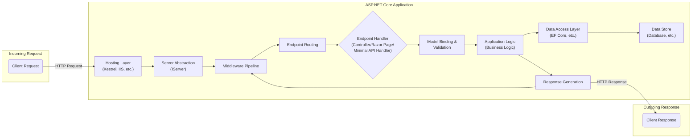
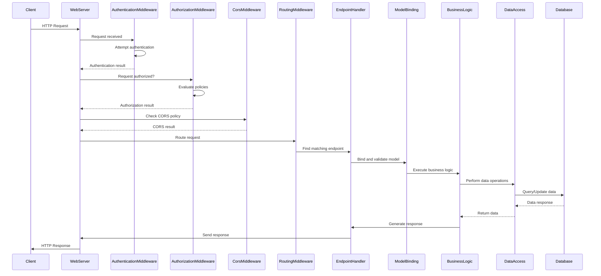

# Project Design Document: ASP.NET Core Framework

**Version:** 1.1
**Date:** October 26, 2023
**Author:** AI Software Architect

## 1. Introduction

This document provides an enhanced architectural design overview of the ASP.NET Core framework, based on the project repository found at [https://github.com/dotnet/aspnetcore](https://github.com/dotnet/aspnetcore). This revised document aims to provide a more detailed and structured foundation for subsequent threat modeling activities. It elaborates on the key components, their interactions, and the overall structure of the framework, with a stronger emphasis on security-relevant aspects.

## 2. Project Overview

ASP.NET Core is a modern, open-source, and cross-platform framework for building web applications, APIs, and microservices. Its design emphasizes performance, modularity, and cloud-native development. Key characteristics include:

*   **Cross-Platform Compatibility:** Runs on Windows, macOS, and Linux.
*   **Modular and Decoupled Design:** Features are implemented as independent packages, allowing developers to include only necessary components.
*   **Built-in Dependency Injection:**  A first-class citizen, promoting loose coupling and testability.
*   **Integrated Testing Framework:** Encourages unit and integration testing.
*   **Support for Modern Front-End Technologies:**  Works seamlessly with JavaScript frameworks like React, Angular, and Vue.js.
*   **High Performance and Scalability:** Optimized for handling high traffic loads.
*   **Cloud-Ready Architecture:** Designed for easy deployment and scaling in cloud environments.

## 3. Architectural Overview

ASP.NET Core employs a layered architecture centered around the concept of a request pipeline. Key architectural elements include:

*   **Hosting Layer:**  Responsible for bootstrapping the application and listening for incoming HTTP requests. This layer abstracts the underlying web server. Common hosts include:
    *   Kestrel (cross-platform, lightweight web server)
    *   IIS (Internet Information Services on Windows)
    *   Nginx or Apache (as reverse proxies in front of Kestrel)
*   **Server Abstraction:**  Provides an abstraction over the underlying HTTP server implementation, allowing the application to run on different servers without code changes. `IServer` is the core interface here.
*   **Middleware Pipeline:** The heart of ASP.NET Core request processing. It's a sequence of components (middleware) that process each HTTP request and response. Middleware components are executed in a defined order.
*   **Endpoint Routing:**  Maps incoming HTTP requests to specific application logic (endpoints). This is typically done based on URL patterns.
*   **Application Logic:**  The code that handles the specific business requirements of the application. This is often implemented using:
    *   Controllers (for building APIs)
    *   Razor Pages (for building page-centric web applications)
    *   Minimal APIs (for lightweight API development)
*   **Framework Services:**  A collection of built-in services provided by ASP.NET Core, such as:
    *   Dependency Injection (`IServiceProvider`)
    *   Configuration (`IConfiguration`)
    *   Logging (`ILogger`)
    *   Authentication and Authorization (`IAuthenticationService`, `IAuthorizationPolicyProvider`)
*   **Data Access Layer:**  Handles interaction with data storage. Entity Framework Core (EF Core) is the recommended data access technology.

## 4. Key Components and Subsystems

This section provides more detail on critical components, highlighting aspects relevant to security.

*   **Kestrel Web Server:**
    *   A cross-platform, event-driven web server.
    *   Handles TLS termination, but is often deployed behind a reverse proxy for enhanced security features.
    *   Vulnerable to denial-of-service attacks if not properly configured or protected by a reverse proxy.

*   **Middleware Pipeline:**
    *   Ordered sequence of delegates that intercept and process HTTP requests.
    *   Crucial for implementing cross-cutting concerns, including security.
    *   Examples of security-relevant middleware:
        *   **Authentication Middleware:** Identifies the user making the request. Supports various authentication schemes (e.g., cookies, JWT). Misconfiguration can lead to unauthorized access.
        *   **Authorization Middleware:** Determines if an authenticated user has permission to access a resource. Policy-based authorization provides fine-grained control.
        *   **CORS Middleware:** Controls which origins are allowed to make cross-origin requests. Improper configuration can introduce security vulnerabilities.
        *   **HTTPS Redirection Middleware:** Enforces the use of HTTPS, protecting data in transit.
        *   **Exception Handling Middleware:**  Handles unhandled exceptions. Care must be taken to avoid leaking sensitive information in error responses.
        *   **Request Logging Middleware:** Logs details of incoming requests. Sensitive data should be masked.

*   **Endpoint Routing Subsystem:**
    *   Matches incoming request URLs to specific handlers.
    *   Can be a point of vulnerability if not properly configured, potentially exposing unintended endpoints.
    *   Attribute routing can improve clarity but requires careful management.

*   **Model Binding and Validation Subsystem:**
    *   Converts raw HTTP request data into strongly-typed objects.
    *   Performs validation to ensure data integrity and prevent injection attacks.
    *   Custom validation logic is essential for robust security. Failure to validate input properly is a major source of vulnerabilities.

*   **Dependency Injection (DI) Container:**
    *   Manages dependencies between components.
    *   Can be used to inject security-related services and configurations.
    *   Care must be taken to register services with appropriate scopes to avoid unintended sharing of state.

*   **Authentication and Authorization Subsystem:**
    *   Provides a flexible and extensible framework for securing applications.
    *   Supports various authentication schemes and authorization policies.
    *   Proper configuration and implementation are critical to prevent unauthorized access. Vulnerabilities in custom authentication/authorization logic can be severe.

*   **Configuration Subsystem:**
    *   Loads application settings from various sources.
    *   Sensitive configuration data (e.g., connection strings, API keys) should be protected using mechanisms like Azure Key Vault or environment variables.

*   **Logging Abstractions:**
    *   Provides a standardized way to log application events.
    *   Sensitive information should be carefully excluded from logs. Secure logging practices are essential for auditing and incident response.

## 5. Data Flow (Detailed)

The following sequence diagram provides a more detailed view of the data flow, including key middleware components.

## 6. Deployment Model (with Security Considerations)

The deployment model significantly impacts the security posture of an ASP.NET Core application.

*   **Self-Contained Deployment:**
    *   Includes the .NET runtime, reducing dependencies on the host system.
    *   Security considerations: Larger deployment package size. Requires patching the runtime within the application for security updates.
*   **Framework-Dependent Deployment:**
    *   Relies on the .NET runtime being installed on the host.
    *   Security considerations: Smaller deployment package. Relies on the host system administrator to keep the .NET runtime updated with security patches.
*   **Containerized Deployment (e.g., Docker):**
    *   Packages the application and its dependencies into a container.
    *   Security considerations: Requires secure container image management and vulnerability scanning. Container orchestration platforms (e.g., Kubernetes) need to be secured.
*   **Cloud Platforms (e.g., Azure App Service, AWS Elastic Beanstalk, Google Cloud Run):**
    *   Leverages cloud provider infrastructure and services.
    *   Security considerations: Relies on the cloud provider's security measures. Requires proper configuration of cloud resources (e.g., network security groups, access controls).
*   **On-Premises Servers (e.g., IIS on Windows, Kestrel behind a reverse proxy on Linux):**
    *   Deployed on infrastructure managed by the organization.
    *   Security considerations: Requires careful configuration and maintenance of the server operating system, web server, and network infrastructure. Reverse proxies can provide additional security features like WAF (Web Application Firewall).

## 7. Security Considerations (Categorized)

This section categorizes security considerations for better organization.

*   **Input Security:**
    *   **Input Validation:**  Essential to prevent injection attacks (SQL, command, XSS). Validate all user-provided data.
    *   **Data Sanitization/Encoding:**  Encode output to prevent XSS vulnerabilities.
    *   **Request Size Limits:**  Prevent denial-of-service attacks by limiting the size of incoming requests.

*   **Authentication and Authorization:**
    *   **Secure Authentication:**  Use strong authentication schemes and protect credentials. Consider multi-factor authentication.
    *   **Robust Authorization:** Implement fine-grained authorization policies to control access to resources. Follow the principle of least privilege.
    *   **Session Management:**  Securely manage user sessions to prevent hijacking. Use secure cookies and appropriate timeouts.

*   **Data Protection:**
    *   **Encryption in Transit (HTTPS):**  Enforce HTTPS to protect data transmitted between the client and server.
    *   **Encryption at Rest:**  Encrypt sensitive data stored in databases or other storage mechanisms.
    *   **Secure Configuration Management:** Protect sensitive configuration data (connection strings, API keys) using secure storage mechanisms.

*   **Error Handling and Logging:**
    *   **Secure Error Handling:**  Avoid exposing sensitive information in error messages.
    *   **Secure Logging:**  Log security-relevant events for auditing and incident response. Protect log files from unauthorized access.

*   **Dependency Management:**
    *   **Vulnerability Scanning:** Regularly scan project dependencies for known vulnerabilities and update them promptly.
    *   **Supply Chain Security:** Be aware of the security of third-party libraries and components.

*   **Deployment Security:**
    *   **Secure Server Configuration:**  Harden the web server and operating system.
    *   **Network Security:**  Use firewalls and network segmentation to restrict access to the application.
    *   **Regular Security Audits and Penetration Testing:**  Identify and address potential vulnerabilities.

## 8. Assumptions and Constraints

*   This document provides a general architectural overview. Specific implementations within the linked GitHub repository may have further nuances.
*   Security best practices and the threat landscape are constantly evolving. This document reflects the current understanding.
*   The focus is on the ASP.NET Core framework itself. Security considerations for applications built *on* the framework are broader.

## 9. Future Considerations

*   Detailed diagrams for specific security subsystems (e.g., the authentication pipeline, data protection mechanisms).
*   Integration with security scanning tools and processes.
*   Guidance on secure coding practices for ASP.NET Core developers.
*   Analysis of specific security features and mitigations provided by ASP.NET Core.