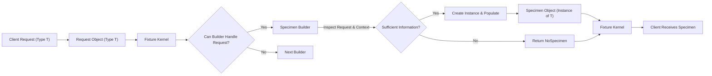

# Project Design Document: AutoFixture (Improved)

**Version:** 1.1
**Date:** October 26, 2023
**Author:** Gemini (AI Language Model)

## 1. Introduction

This document provides an enhanced design overview of the AutoFixture project, an open-source library for .NET designed to minimize the 'Arrange' phase of unit tests by automatically generating arbitrary test data. This improved document aims to provide a more granular and security-focused understanding of AutoFixture's architecture, components, and data flow, specifically tailored for threat modeling activities.

### 1.1. Purpose

The primary purpose of this document is to:

*   Provide a detailed and security-conscious description of the architecture and key components of the AutoFixture library.
*   Illustrate the data flow within the library during object creation with a focus on potential security implications.
*   Identify specific potential threat vectors and areas of interest for security analysis and threat modeling.
*   Serve as a comprehensive reference point for understanding the system's design from a security perspective.

### 1.2. Scope

This document covers the core functionality of the AutoFixture library, focusing on the mechanisms for generating test data and their potential security ramifications. It includes:

*   A detailed examination of the core engine responsible for object creation and its internal processes.
*   An in-depth look at customization mechanisms and their potential for misuse.
*   Analysis of extensibility points and their associated security risks.
*   Detailed descriptions of key data structures and interfaces involved in object generation.

This document does not cover:

*   Specific usage scenarios or examples beyond their relevance to security considerations.
*   The fine-grained implementation details of individual generators unless directly relevant to security.
*   The historical evolution of the project or its development lifecycle.
*   The specifics of the NuGet package creation and distribution process.

### 1.3. Target Audience

This document is primarily intended for:

*   Security architects and engineers responsible for threat modeling AutoFixture and systems that utilize it.
*   Developers seeking a deep understanding of AutoFixture's internal workings with a focus on security implications.
*   Security auditors and assessors evaluating the security posture of applications using AutoFixture.

## 2. System Overview

AutoFixture is a .NET library designed to automate the creation of test data, reducing the manual effort required in the 'Arrange' phase of unit tests. It achieves this by generating instances of classes with automatically populated properties based on a set of conventions and customizable rules. Understanding its internal workings is crucial for identifying potential security vulnerabilities, especially when considering how it interacts with the code under test and the testing environment.

AutoFixture leverages reflection to inspect type structures and employs a pipeline of strategies (Specimen Builders) to generate values for object members. The flexibility and extensibility of this system are key features but also introduce potential security considerations.

## 3. Architectural Design

AutoFixture's architecture centers around a request-response model for object creation, orchestrated by the `Fixture` component. The process involves a pipeline of `ISpecimenBuilder` instances attempting to fulfill requests for specific types.

### 3.1. Key Components

*   **Fixture:** The central orchestrator and entry point for interacting with AutoFixture. It manages configuration settings, a registry of `ISpecimenBuilder` instances, and provides the primary API (e.g., `Create<T>()`) for requesting object instances. It acts as the central hub for all object generation activities.
*   **Kernel (Internal Specimen Builder Pipeline):**  An internal component within the `Fixture` that manages the ordered collection of `ISpecimenBuilder` instances. When a request arrives, the kernel iterates through the builders, allowing each to attempt to create the requested specimen. This pipeline structure is crucial for understanding the order of operations and potential points of interception or manipulation.
*   **Specimen Builders (Generators):** Implementations of the `ISpecimenBuilder` interface. Each builder is responsible for attempting to create an instance of a specific type or handling a particular creation scenario. Builders are organized in a pipeline, and the first builder that can successfully handle a request will generate the specimen. The logic within these builders is a key area for security scrutiny, as vulnerabilities here could lead to the generation of unexpected or malicious data.
*   **Context (ISpecimenContext):** Provides contextual information to `ISpecimenBuilder` instances during the object creation process. This includes the requested type, the current `Fixture` instance, and potentially other relevant data. The context ensures that builders have the necessary information to make informed decisions about object creation.
*   **Request:** Represents a request for an instance of a specific type. This object is passed through the builder pipeline. Understanding the structure and content of the request is important for analyzing how builders make decisions.
*   **Specimen:** The generated instance of a type. This is the output of a successful builder execution.
*   **Customization Mechanisms:** Allow users to override or modify the default object creation behavior. These are powerful features but also potential attack vectors:
    *   **`Customize` method on the `Fixture` class:** Allows programmatic modification of the fixture's behavior, including registering or modifying builders. Malicious customizations here could compromise the integrity of the object generation process.
    *   **User-Registered `ISpecimenBuilder` Implementations:** Users can create and register their own builders. If these builders contain vulnerabilities or malicious logic, they can be introduced into the object generation pipeline.
    *   **Attributes Applied to Types or Members:** Attributes can guide the generation process. While seemingly benign, vulnerabilities in attribute handling or the logic they trigger could be exploited.
*   **Conventions:** Implicit rules that guide the object creation process when no explicit customization is provided. These conventions, while intended to be helpful, could lead to unexpected behavior if not fully understood or if they interact in unforeseen ways.

### 3.2. Component Interactions

The following diagram illustrates the high-level interaction between the key components during an object creation request, highlighting the flow of control and data:

```mermaid
graph LR
    A["Client Code (Test)"] --> B("Fixture");
    B -- "Create<T>() Request" --> C("Kernel (ISpecimenBuilder Pipeline)");
    C -- "TryCreate(request, context)" --> D["Registered Specimen Builders"];
    subgraph Registered Specimen Builders
        direction LR
        E["Builder 1"] -- "CanHandle(request)" --> |Yes| F["Builder 1 (Handles)"];
        E -- "CanHandle(request)" --> |No| G["Builder 2"];
        G -- "CanHandle(request)" --> |Yes| H["Builder 2 (Handles)"];
        G -- "CanHandle(request)" --> |No| I["Builder N"];
        I -- "CanHandle(request)" --> |No| J["No Suitable Builder"];
    end
    F -- "Create(request, context)" --> K["Specimen"];
    H -- "Create(request, context)" --> L["Specimen"];
    J -- "Return NoSpecimen" --> C;
    K --> C;
    L --> C;
    C --> B;
    B --> A;
```

*   The client code initiates a request for an object of type `T` through the `Fixture`.
*   The `Fixture` forwards the request to its internal `Kernel`.
*   The `Kernel` iterates through the ordered list of `Registered Specimen Builders`.
*   Each builder is queried using `CanHandle(request)` to determine if it can process the current request.
*   The first builder that returns `Yes` is selected to handle the request.
*   The selected builder executes its `Create(request, context)` method to generate the `Specimen`.
*   The generated `Specimen` is returned to the `Kernel` and subsequently to the client.
*   If no builder can handle the request, a `NoSpecimen` result is typically returned.

### 3.3. Data Flow

The data flow within AutoFixture involves the propagation of the `Request` object and the eventual creation of the `Specimen`. Understanding how data transformations occur within the builder pipeline is crucial for security analysis.



*   The process begins with a client request for an object of a specific type, encapsulated in a `Request` object.
*   The `Request` object is passed to the `Fixture` kernel.
*   The kernel iterates through the registered `Specimen Builders`.
*   Each builder checks if it can handle the request.
*   The responsible builder inspects the `Request` and the `Context` to determine if it has enough information to create the object.
*   If sufficient information is available, the builder creates and populates an instance of the requested type (the `Specimen`).
*   The `Specimen` is returned to the `Fixture` kernel and then to the client.
*   If the builder cannot create the object, it typically returns a `NoSpecimen` indicator.

## 4. Security Considerations (Detailed)

AutoFixture, while a development-time tool, presents several potential security considerations, particularly concerning its extensibility and the potential for malicious input or configurations.

*   **Malicious Customizations:**
    *   **Threat:** A compromised developer environment or malicious actor could inject a custom `ISpecimenBuilder` that introduces vulnerabilities, such as generating objects with insecure default values, triggering resource exhaustion, or leaking sensitive information during test execution.
    *   **Example:** A custom builder could be designed to write generated data to a file or network location.
    *   **Mitigation:** Code review of custom builders, secure development practices, and potentially sandboxing test execution environments.
    *   **`Customize` Method Abuse:**  Malicious code could use the `Customize` method to alter the behavior of existing builders in unexpected ways, potentially bypassing security checks or introducing vulnerabilities.
*   **Dependency Vulnerabilities:**
    *   **Threat:** AutoFixture relies on the .NET standard library and potentially other NuGet packages. Vulnerabilities in these dependencies could be exploited if AutoFixture uses the vulnerable components.
    *   **Mitigation:** Regular dependency scanning and updates.
*   **Unintended Object Creation with Sensitive Data:**
    *   **Threat:** If AutoFixture is used in scenarios where it inadvertently generates objects containing sensitive data based on external input or insecure configurations, this data could be unintentionally exposed or logged.
    *   **Example:** Generating database connection strings or API keys.
    *   **Mitigation:** Careful configuration of AutoFixture, avoiding the generation of sensitive data, and secure handling of test outputs.
*   **Reflection Abuse:**
    *   **Threat:** While reflection is core to AutoFixture, uncontrolled or malicious use of reflection within custom builders could bypass security restrictions or access private members in unintended ways.
    *   **Mitigation:** Restricting the use of reflection in custom builders and thorough code review.
*   **Denial of Service (DoS):**
    *   **Threat:** A malicious actor could craft requests or customizations that lead to infinite loops or excessive resource consumption within the object creation pipeline, causing a denial of service during test execution.
    *   **Example:** A custom builder that recursively requests the creation of the same type without a termination condition.
    *   **Mitigation:** Implementing timeouts and resource limits within custom builders and the core engine.
*   **Information Disclosure through Error Handling:**
    *   **Threat:** Verbose error messages or logging during AutoFixture's object generation process could inadvertently reveal sensitive information about the system's internal state or configuration.
    *   **Mitigation:** Careful handling of exceptions and logging, avoiding the inclusion of sensitive data in error messages.

## 5. Dependencies

AutoFixture depends on the following key components:

*   **.NET Standard Library:** Provides fundamental types and functionalities. Security vulnerabilities within the .NET Standard Library could impact AutoFixture.
*   **Potentially other NuGet packages:**  Specific dependencies may vary depending on the AutoFixture version and any extensions used. Each dependency introduces its own set of potential vulnerabilities. A thorough review of the project's `.csproj` file or NuGet package manifest is necessary for a complete understanding of the dependency tree.

## 6. Deployment and Usage

AutoFixture is deployed as a NuGet package and integrated directly into .NET test projects. Its security implications are primarily relevant within the context of the development and testing environment. Compromise of the development environment could lead to the injection of malicious customizations or the exploitation of vulnerabilities within AutoFixture.

## 7. Extensibility Points (Security Implications)

AutoFixture's extensibility points offer significant flexibility but also introduce potential security risks if not managed carefully:

*   **Registering Custom `ISpecimenBuilder` Implementations:** This is the most significant extensibility point from a security perspective. Malicious or poorly written custom builders can introduce a wide range of vulnerabilities, as they have direct control over object creation.
*   **Using the `Customize` Method:** While seemingly less impactful than registering entire builders, the `Customize` method can still be used to subtly alter the behavior of the fixture in ways that could have security implications. For example, a customization could be used to always generate a specific, vulnerable object state.
*   **Applying Attributes:** While attributes themselves don't execute code, vulnerabilities in how AutoFixture interprets and acts upon attributes could be exploited. For example, a specially crafted attribute could trigger unexpected behavior in a built-in builder.
*   **Creating Conventions:** Custom conventions can influence the default object generation behavior. Poorly designed conventions could lead to the generation of insecure default values or unexpected object states.

## 8. Future Considerations

Future development of AutoFixture should consider the following security implications:

*   **Sandboxing or Isolation of Custom Builders:** Exploring mechanisms to isolate custom builders could limit the potential damage from malicious or buggy code.
*   **Security Audits of Core Builders:** Regularly auditing the built-in `ISpecimenBuilder` implementations for potential vulnerabilities.
*   **Input Validation for Customizations:** Implementing stricter validation for user-provided customizations to prevent the injection of malicious logic.
*   **Telemetry and Monitoring:**  Potentially adding telemetry to detect unusual or suspicious activity during object generation.

## 9. Glossary

*   **Fixture:** The central component for using AutoFixture.
*   **Specimen:** An instance of an object generated by AutoFixture.
*   **Specimen Builder:** A component responsible for creating specimens of specific types or handling specific creation scenarios.
*   **Request:** An object representing a request for a specific type.
*   **Context:** Information available to `ISpecimenBuilder` instances during the object creation process.
*   **Kernel:** The internal component managing the `ISpecimenBuilder` pipeline.

This improved document provides a more detailed and security-focused understanding of AutoFixture's design, intended to facilitate thorough threat modeling activities. Further analysis should focus on the implementation details of key components and the potential exploitation of the identified threat vectors.
