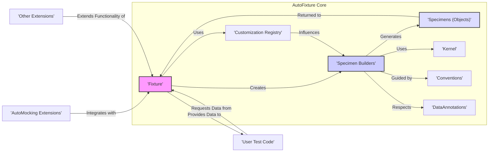
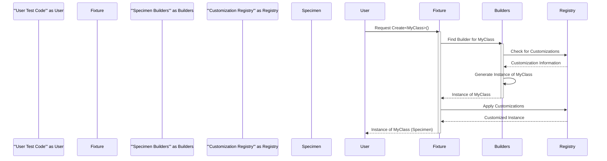

## Project Design Document: AutoFixture (Improved)

**1. Introduction**

This document provides an enhanced and detailed design overview of the AutoFixture project, an open-source library designed to minimize the 'Arrange' phase of unit testing by automatically generating arbitrary test data. This improved document aims to offer a more comprehensive understanding of AutoFixture's architecture, components, and data flow, providing a solid foundation for subsequent threat modeling activities. We have expanded on key areas and clarified certain aspects for better understanding.

**2. Project Overview**

AutoFixture is a powerful .NET library that empowers developers to write cleaner, more focused, and maintainable unit tests. Its core strength lies in its ability to automatically create instances of classes with populated properties, significantly reducing the amount of boilerplate code traditionally associated with setting up test data. The library offers a fluent and expressive interface, coupled with extensive customization options, making it adaptable to a wide range of testing scenarios and project needs.

**3. Goals and Objectives**

* **Primary Goal:** To fundamentally streamline and simplify the test setup process by automating the generation of necessary test data.
* **Objectives:**
    * Drastically reduce the volume of repetitive code developers need to write for the 'Arrange' phase of their tests.
    * Enhance the readability and overall maintainability of unit test suites, making them easier to understand and modify.
    * Enable developers to concentrate their efforts on the specific behavior being tested, rather than being bogged down in manual data creation.
    * Provide a highly flexible and extensible framework for data generation, allowing for adaptation to diverse testing requirements.
    * Encourage the adoption of best practices in unit testing by making test setup less cumbersome.

**4. Target Audience**

* Software developers actively engaged in writing unit tests within the .NET ecosystem.
* Quality assurance engineers who leverage unit tests as part of their testing strategies.
* Development teams that have adopted or are transitioning towards test-driven development (TDD) or behavior-driven development (BDD) methodologies.
* Architects and technical leads seeking to promote efficient and maintainable testing practices within their organizations.

**5. Architecture Overview**

**6. Detailed Design**

The central component of AutoFixture is the `'Fixture'` class, which serves as the primary interface for requesting test data. Below is a more detailed breakdown of the key components and their interactions:

* **`'Fixture'`:**
    * The main entry point through which users interact with AutoFixture to request the creation of test data.
    * Internally manages a curated collection of `'ISpecimenBuilder'` instances, each responsible for generating specific types of data.
    * Offers core methods like `'Create<T>()'` to seamlessly generate instances of a specified type `T`.
    * Maintains a `'Customization Registry'` to store and apply user-defined rules that influence data generation.
    * Provides mechanisms for applying customizations at different levels (globally or per-request).

* **`'ISpecimenBuilder'`:**
    * A fundamental interface defining the contract for any component responsible for generating a 'specimen' (an instance of an object).
    * Concrete implementations are tasked with creating instances of particular types or handling specific data generation scenarios.
    * Examples include specialized builders for primitive types, strings, collections, and complex object hierarchies.

* **`'Specimen Builders'` (Concrete Implementations of `'ISpecimenBuilder'`):**
    * A diverse set of classes, each implementing the `'ISpecimenBuilder'` interface and dedicated to generating specific kinds of specimens.
    * The order in which these builders are evaluated is crucial for the data generation process.
    * Key categories of builders include:
        * Builders for fundamental primitive types (e.g., integers, strings, booleans).
        * Builders for common collection types (e.g., `List<T>`, arrays).
        * Builders for enumerations (enums).
        * Builders capable of instantiating classes with publicly accessible constructors.
        * Specialized builders often requiring integration with mocking libraries for interfaces or abstract classes.

* **`'SpecimenContext'`:**
    * Provides essential contextual information to `'ISpecimenBuilder'` instances during the data generation process.
    * Encapsulates details such as the requested type and a reference to the parent `'Fixture'` instance.
    * Allows builders to make informed decisions based on the current generation context.

* **`'Customization'`:**
    * A powerful mechanism enabling users to override AutoFixture's default data generation behaviors.
    * Customizations can be applied broadly to the entire `'Fixture'` or targeted at specific data requests.
    * Common use cases for customizations include:
        * Setting specific values for particular properties.
        * Registering custom data generators for specific types.
        * Instructing AutoFixture to ignore certain properties during object creation.

* **`'Customization Registry'`:**
    * A central repository for storing all applied customizations.
    * The `'Fixture'` consults this registry to determine how to influence the selection and behavior of `'ISpecimenBuilder'` instances.

* **`'Kernel'`:**
    * Provides low-level, fundamental building blocks that `'Specimen Builders'` utilize during specimen creation.
    * Includes functionalities such as generating random numbers, strings, and other basic data elements.

* **`'Conventions'`:**
    * A set of implicit rules and heuristics that guide the `'Specimen Builders'` in generating more meaningful and contextually relevant data.
    * Examples include naming conventions for properties (e.g., automatically setting a boolean property named `'IsActive'` to a boolean value).

* **`'DataAnnotations'` Integration:**
    * AutoFixture is designed to recognize and respect data annotations (e.g., `[Required]`, `[StringLength]`) applied to class properties.
    * This integration ensures that the generated data adheres to the constraints defined by these annotations.

* **`'Extensions'`:**
    * **`'AutoMocking Extensions'` (e.g., `'AutoMoq'`, `'AutoNSubstitute'`, `'AutoFake'`):** Facilitate seamless integration between AutoFixture and popular mocking libraries, enabling the automatic creation of mock objects and their dependencies, greatly simplifying testing scenarios involving interfaces and abstract classes.
    * **`'Other Extensions'`:** Expand AutoFixture's core functionality by providing support for diverse data generation strategies, integration with other testing frameworks, and other specialized features.

**7. Data Flow**

The typical flow of data when utilizing AutoFixture within a unit test follows these steps:

1. **`'User Test Code'` Initiates Data Request:** The test code invokes a method on the `'Fixture'` instance, such as `'fixture.Create<MyClass>()'`, signaling a request for an instance of `'MyClass'`.
2. **`'Fixture'` Starts Generation Process:** The `'Fixture'` receives the request and initiates the process of creating an instance of the requested type (`'MyClass'` in this case).
3. **`'SpecimenBuilder'` Selection:** The `'Fixture'` iterates through its collection of registered `'ISpecimenBuilder'` instances, searching for the first builder that declares its ability to handle the request for `'MyClass'`. Customizations registered in the `'Customization Registry'` can influence this selection process.
4. **`'SpecimenBuilder'` Creates Specimen:** The selected `'ISpecimenBuilder'` utilizes the provided `'SpecimenContext'` and potentially leverages the `'Kernel'` and `'Conventions'` to construct an instance of `'MyClass'`. This process might involve recursively requesting instances of any dependencies required by `'MyClass'`.
5. **Customizations are Applied:** If any relevant customizations are registered for `'MyClass'` or its properties within the `'Customization Registry'`, these customizations are applied to the generated instance, potentially modifying its state.
6. **Specimen is Returned to `'Fixture'`:** The fully generated and customized instance (the 'specimen') is returned to the `'Fixture'`.
7. **Data Provided Back to `'User Test Code'`:** The `'Fixture'` then returns the generated instance to the original requesting code within the user's unit test.

**8. Key Technologies and Dependencies**

* **Primary Programming Language:** C#
* **Target Framework:** .NET Standard (ensuring broad compatibility across various .NET runtimes and platforms)
* **Core Dependencies:** Intentionally kept minimal, primarily relying on fundamental .NET libraries to reduce the risk surface and complexity.
* **Common Integration Points:**
    * Widely used in conjunction with popular unit testing frameworks such as xUnit, NUnit, and MSTest.
    * Frequently extended through integration with mocking libraries like Moq, NSubstitute, and FakeItEasy via dedicated extension packages.

**9. Deployment Model**

AutoFixture is distributed and deployed as a NuGet package. Developers integrate it into their .NET projects by adding it as a package dependency. Once added, the library's functionalities are readily available for use within the project's test code.

**10. Security Considerations (Expanded for Threat Modeling)**

While AutoFixture's primary function is test data generation and it doesn't directly interact with production data, several security considerations are relevant for threat modeling:

* **Accidental Generation of PII/Sensitive Data:** Although AutoFixture generates arbitrary data, there's a possibility of unintentionally generating data that resembles Personally Identifiable Information (PII) or other sensitive data (e.g., plausible email addresses, credit card patterns, social security number formats). This risk is heightened when using custom builders or extensions without careful design and review.
    * **Threat Scenario:** A developer might create a custom builder for a `User` object that inadvertently generates realistic-looking email addresses, which could be misused if exposed.
* **Vulnerabilities in Untrusted Customizations or Extensions:** The extensibility of AutoFixture, while powerful, introduces a potential risk. If developers utilize custom `'ISpecimenBuilder'` implementations or third-party extensions from unverified sources, these components could harbor vulnerabilities or malicious code.
    * **Threat Scenario:** A malicious extension could be designed to exfiltrate data from the test environment or introduce backdoors.
* **Information Disclosure through Test Failure Details:** AutoFixture-generated data is often included in the output of test failures to aid in debugging. If this generated data coincidentally resembles sensitive information, it could lead to unintended disclosure if test logs are not properly secured.
    * **Threat Scenario:** A test failure message might contain a generated string that happens to be a valid API key, which could be accidentally exposed in a CI/CD pipeline log.
* **Resource Exhaustion (DoS) via Complex Object Graphs:** AutoFixture's ability to generate complex object graphs could be exploited to cause excessive memory consumption or stack overflow errors, potentially leading to a denial-of-service condition within the test environment. This is particularly relevant when testing systems with deep object hierarchies.
    * **Threat Scenario:** A test could be crafted to request the creation of an extremely deep and interconnected object graph, overwhelming the available resources.
* **Indirect Vulnerabilities via Dependencies:** While AutoFixture has a minimal set of core dependencies, vulnerabilities present in those dependencies could indirectly impact AutoFixture users. It's crucial to keep dependencies updated and monitor for security advisories.
    * **Threat Scenario:** A vulnerability in a core .NET library used by AutoFixture could be exploited through AutoFixture if not patched.
* **Over-reliance on Auto-Generated Data Masking Underlying Issues:** Developers might become overly reliant on auto-generated data and neglect to implement proper input validation or sanitization in the system under test, assuming the generated data is always safe.
    * **Threat Scenario:**  A system might be vulnerable to SQL injection because developers assumed AutoFixture would always generate safe strings for database queries during testing.

**11. Future Considerations**

* **Advanced Data Generation Techniques:** Exploring and incorporating more sophisticated methods for generating realistic and contextually relevant test data, potentially leveraging techniques like data synthesis or model-based generation.
* **Enhanced Extensibility Framework:** Providing more robust, well-documented, and type-safe extension points for developers to customize and extend AutoFixture's functionality.
* **Built-in Data Anonymization Features:** Investigating the possibility of incorporating features to automatically anonymize or sanitize generated data, mitigating the risk of accidentally generating sensitive information.
* **Improved Diagnostics and Debugging Tools:** Enhancing the tooling around AutoFixture to provide better insights into the data generation process and aid in debugging customization issues.
* **Formal Security Audits:** Conducting periodic security audits and penetration testing to identify and address potential vulnerabilities within the AutoFixture library itself.

This improved document provides a more in-depth and comprehensive understanding of the AutoFixture project's design. This enhanced information will be invaluable for conducting thorough and effective threat modeling exercises, enabling a more precise assessment of potential security risks and informing appropriate mitigation strategies.