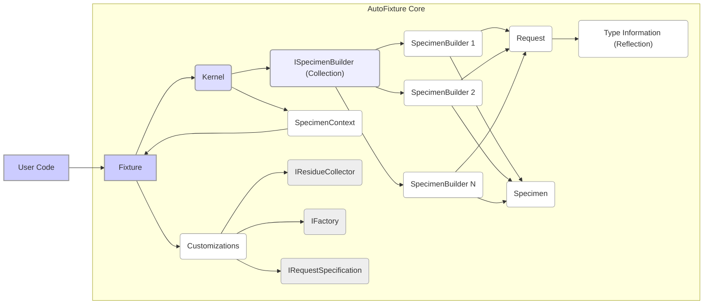
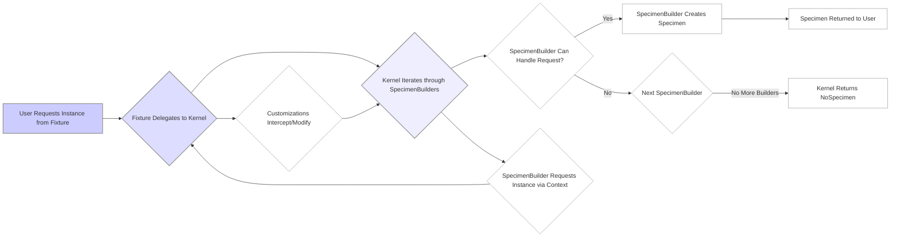

# Project Design Document: AutoFixture

**Version:** 1.1
**Date:** October 26, 2023
**Author:** AI Software Architect

## 1. Introduction

This document provides an enhanced design overview of the AutoFixture project, a library designed to minimize the 'Arrange' phase of unit tests by automatically generating arbitrary test data. This document is intended to serve as a robust foundation for subsequent threat modeling activities. It clarifies the architecture, data flow, and potential security considerations in greater detail.

## 2. Goals and Non-Goals

### 2.1. Goals

*   Provide a clear and concise architectural overview of AutoFixture, emphasizing components relevant for security analysis.
*   Identify key components and their interactions, focusing on data manipulation and potential points of vulnerability.
*   Describe the data flow within the library with a focus on how user input and internal mechanisms influence object creation.
*   Highlight potential areas of security concern with specific examples to facilitate effective threat modeling.
*   Document the intended usage patterns of AutoFixture to understand the context of potential threats.

### 2.2. Non-Goals

*   Provide a detailed, line-by-line code-level implementation description.
*   Document every single class or method within the library; the focus is on architectural significance.
*   Include performance benchmarks or optimization strategies, as these are less relevant for initial threat modeling.
*   Address specific bug fixes or feature requests that do not directly impact the overall architecture or security.

## 3. Architectural Overview

AutoFixture's architecture is centered around extensibility and customization, allowing users to tailor data generation to their specific needs. The core functionality revolves around generating instances of types with automatically populated properties and fields. Key architectural areas include:

*   **Core Engine (Fixture):** The central orchestrator, managing configuration and the object creation pipeline.
*   **Specimen Creation Pipeline:** The sequence of steps and components involved in generating an instance.
*   **Customization Framework:** Mechanisms for users to influence the data generation process.
*   **Type Reflection and Analysis:** The library's ability to inspect types and their members.

## 4. Components and Interactions

This section details the key components and their interactions, providing more context for potential security vulnerabilities.

*   **"Fixture"**: The primary entry point for users. It holds configuration, registered customizations, and orchestrates the object creation process. It acts as a factory and dependency injection container for specimen builders.
*   **"ISpecimenBuilder"**: An interface implemented by components responsible for creating instances of specific types or satisfying particular requests. Builders are the workhorses of the library.
*   **"SpecimenContext"**: Provides contextual information during the object creation process. It allows builders to recursively request instances of other types and access the parent "Fixture". This is a key area for understanding data flow and potential loops.
*   **"Kernel"**: Manages the collection of registered "ISpecimenBuilder" instances and delegates the creation request to the appropriate builder based on the request type.
*   **"Request"**: Represents the type or specific information for which an instance is requested. This can be a `Type`, a `ParameterInfo`, or other contextual information.
*   **"Specimen"**: The actual instance of an object created by a builder. This is the output of the data generation process.
*   **"Customizations"**: A collection of user-defined rules and logic that influence object creation. These can be registered globally on the "Fixture" or applied selectively. Examples include:
    *   **"IResidueCollector"**:  Handles properties or parameters that no other builder can satisfy.
    *   **"IFactory"**:  Allows defining custom factory methods for creating instances.
    *   **"IRequestSpecification"**:  Determines if a customization should be applied to a specific request.
*   **"OmitSpecimen"**: A special specimen indicating that a value should be omitted (e.g., for read-only properties or properties that should not be automatically populated).
*   **"NoSpecimen"**: A special specimen indicating that a builder cannot create an instance for the given request. This signals a failure in the generation process for that specific request.

## 5. Data Flow

The data flow within AutoFixture describes how a request for an object instance is processed and fulfilled. Understanding this flow is crucial for identifying potential points where malicious input or unexpected behavior could occur.

1. **"User Requests Instance from Fixture"**: The process begins when user code requests an instance of a specific type using methods like `Create<T>()` or `Build<T>()` on the "Fixture" instance.
2. **"Fixture Delegates to Kernel"**: The "Fixture" forwards the request to its internal "Kernel".
3. **"Kernel Iterates through SpecimenBuilders"**: The "Kernel" iterates through its registered collection of "ISpecimenBuilder" instances in a defined order.
4. **"SpecimenBuilder Can Handle Request?"**: For each builder, the "Kernel" checks if it can handle the current "Request". This is typically done by inspecting the requested type.
5. **"Yes: SpecimenBuilder Creates Specimen"**: If a builder can handle the request, it creates and returns a "Specimen" (the object instance). The builder might use reflection, generate random values, or use other strategies to create the instance.
6. **"No: Next SpecimenBuilder"**: If the current builder cannot handle the request, the "Kernel" moves to the next builder in the collection.
7. **"No More Builders: Kernel Returns NoSpecimen"**: If none of the registered builders can handle the request, the "Kernel" returns a "NoSpecimen", indicating that the instance could not be created.
8. **"Specimen Returned to User"**: The created "Specimen" is returned to the user code.
9. **"SpecimenBuilder Requests Instance via Context"**: During the creation process, a builder might need instances of other types to populate the properties of the object it's creating. It can recursively request these instances through the "SpecimenContext", leading back to step 2. This recursive behavior is important for threat modeling, as it could potentially lead to infinite loops or excessive resource consumption.
10. **"Customizations Intercept/Modify"**: "Customizations" registered with the "Fixture" can intercept and modify the creation process at various stages. They can:
    *   Provide a specific instance for a request.
    *   Modify the values of properties after an instance is created.
    *   Directly handle a request, bypassing the default builders.

## 6. Security Considerations

This section expands on potential security considerations, providing more specific examples relevant for threat modeling.

*   **Dependency Vulnerabilities (Supply Chain Risk)**: AutoFixture relies on other NuGet packages. Known vulnerabilities in these dependencies could be exploited if AutoFixture is used in a context where these dependencies are exposed or if a compromised dependency is introduced.
    *   **Example:** A vulnerability in a logging library used by a dependency could be exploited to leak sensitive information.
*   **Malicious Customizations (Code Injection/Execution Risk)**: Users can create custom "ISpecimenBuilder" implementations and register them with the "Fixture". A malicious user could introduce a crafted builder that performs unintended and potentially harmful actions during the object creation process.
    *   **Example:** A custom builder could log sensitive data, make unauthorized network requests, or even execute arbitrary code within the test environment.
*   **Reflection Abuse (Potential for Unexpected Behavior)**: AutoFixture heavily relies on reflection to inspect types and create instances. While generally safe, vulnerabilities or unexpected behavior in the .NET reflection mechanism itself could theoretically be exploited, although this is less likely.
    *   **Example:**  A bug in the .NET runtime's reflection implementation could be triggered by AutoFixture's usage, leading to unexpected crashes or behavior.
*   **Denial of Service (DoS) (Resource Exhaustion)**: A carefully crafted request or a malicious customization could potentially lead to excessive resource consumption, causing a denial of service during test execution. This could involve:
    *   Creating very large object graphs with deep recursion.
    *   Custom builders with inefficient or infinite loops.
    *   Generating an extremely large number of objects.
*   **Information Disclosure (Indirect Leakage)**: If AutoFixture is used to generate data for integration tests that interact with external systems, unintentionally generated sensitive data could be sent to those systems. This is primarily a usage concern but highlights the importance of careful configuration and awareness.
    *   **Example:** AutoFixture might generate realistic-looking but sensitive data (like email addresses or names) that are then inadvertently used in calls to external APIs during integration tests.
*   **Supply Chain Attacks (Compromised Package)**: If the AutoFixture NuGet package itself is compromised, malicious code could be injected into developer environments. This is a general risk for any dependency.
*   **Unintended Side Effects in Customizations**:  Poorly written or malicious customizations might have unintended side effects beyond simply creating an object.
    *   **Example:** A customization might modify global state or interact with external resources in a way that disrupts the test environment.
*   **Security Risks in Extensibility Points**: The various extensibility points (e.g., "IResidueCollector", "IFactory") offer opportunities for introducing vulnerabilities if not carefully implemented or used.

## 7. Deployment and Usage

AutoFixture is distributed as a NuGet package and is typically included as a development dependency in .NET projects. Its primary use is within unit and integration tests to generate test data, reducing the boilerplate code required for setting up test scenarios.

Common usage patterns include:

*   Creating a "Fixture" instance within a test setup method.
*   Using the `Create<T>()` method to generate instances of types with default values.
*   Using the `Build<T>()` method to gain more control over object creation and customize specific properties.
*   Registering customizations (using methods like `Customize()`) to influence the generated values for specific types or properties.
*   Utilizing attributes (like `[Frozen]`, `[Greedy]`) to customize the generation behavior directly on the types being tested.

## 8. Extensibility Points

AutoFixture's extensibility is a key feature, but it also introduces potential security considerations.

*   **Implementing "ISpecimenBuilder"**: Allows developers to create custom logic for generating instances of specific types or satisfying specific requests. This is the most powerful extensibility point and requires careful consideration from a security perspective.
*   **Registering Customizations**: Provides a way to modify the default generation behavior for certain types or properties. This can range from simple value overrides to more complex logic.
*   **Using Attributes**: Allows decorating types and members with attributes to influence the generation process. While less powerful than custom builders, misuse of attributes could still lead to unexpected behavior.
*   **Creating Conventions**: Enables defining rules for how properties or fields should be populated based on their names, types, or other characteristics. Maliciously crafted conventions could lead to unexpected data being generated.

## 9. Future Considerations

Potential future enhancements that could impact the design and security include:

*   **Improved Security Sandboxing for Customizations**: Exploring mechanisms to isolate custom builders and limit their access to system resources or sensitive information. This could involve running customizations in a restricted execution environment.
*   **Enhanced Dependency Scanning and Management**: Integrating with tools or features that automatically scan dependencies for known vulnerabilities and provide alerts or recommendations.
*   **More Granular Control over Reflection Usage**: Providing options to restrict the types of reflection operations performed by AutoFixture or its extensions, potentially mitigating risks associated with reflection vulnerabilities.
*   **Formalized Security Review Process**: Implementing a regular security review process for the core library and any official extensions.
*   **Clearer Guidelines for Secure Customization Development**: Providing developers with best practices and guidelines for writing secure custom builders and customizations.

This improved document provides a more detailed and security-focused design overview of the AutoFixture project. The enhanced descriptions of components, data flow, and security considerations aim to provide a stronger foundation for effective threat modeling and risk assessment.