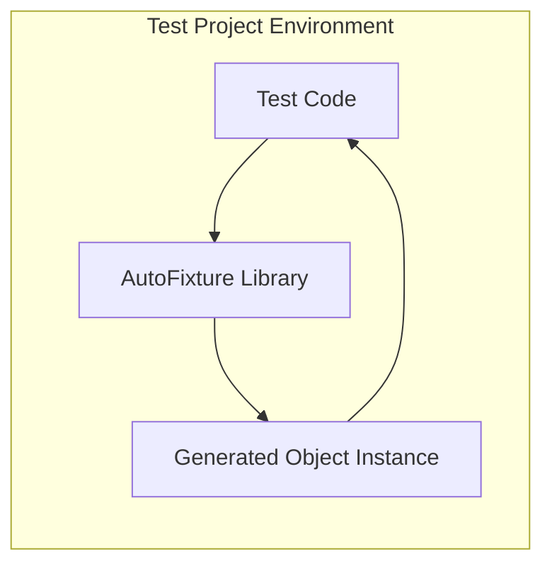
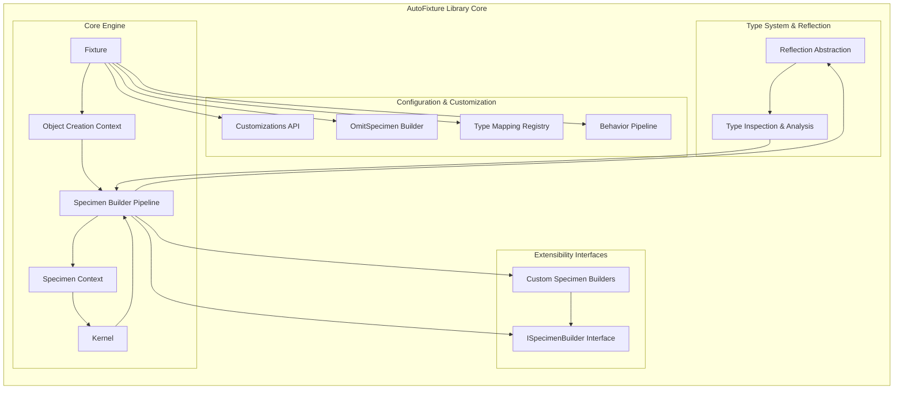
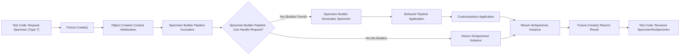

# Project Design Document: AutoFixture

**Version:** 1.1
**Date:** October 26, 2023
**Author:** AI Software Architecture Expert

## 1. Introduction

This document provides an enhanced and detailed design overview of the AutoFixture project, an open-source library available at [https://github.com/autofixture/autofixture](https://github.com/autofixture/autofixture). Building upon the initial version, this document aims to provide a more comprehensive and refined description of the system's architecture, components, data flow, and technology stack. It serves as a robust foundation for subsequent threat modeling activities, ensuring a deep understanding of AutoFixture's internal workings and external interactions.

AutoFixture is a .NET library specifically designed to streamline unit testing by automating the 'Arrange' phase. It achieves this by intelligently generating arbitrary, yet meaningful, test data. This automation significantly simplifies test setup, enhances test readability by removing boilerplate data creation code, and reduces maintenance overhead by decoupling tests from hardcoded data values. This document focuses specifically on the design and architecture of the AutoFixture library itself, and not on the patterns or best practices for its usage within client applications.

## 2. Project Overview

**Project Name:** AutoFixture

**Project Goal:** To empower .NET developers with a highly flexible, extensible, and efficient framework for automatic test data generation, ultimately leading to more focused, maintainable, and robust unit tests.

**Target Users:** Primarily software developers working within the .NET ecosystem who are actively engaged in writing unit tests.

**Key Features:**

*   **Intelligent Automatic Data Generation:** Generates instances of a wide range of .NET types, from primitive types (integers, strings, booleans) to complex objects, collections (lists, arrays, dictionaries), and more, using sensible and context-aware default values.
*   **Extensive Customization Capabilities:** Offers a rich and fluent API that allows users to precisely tailor data generation rules. This includes controlling generated values, customizing object structures, specifying constructor parameters, and overriding default behaviors.
*   **Robust Extensibility Model:** Provides well-defined interfaces and mechanisms for extending the library with custom generators (Specimen Builders) tailored to specific types, domains, or testing scenarios. This allows users to handle specialized data generation needs beyond the built-in capabilities.
*   **Seamless Integration with .NET Testing Frameworks:** Designed for effortless integration with popular .NET testing frameworks such as xUnit, NUnit, and MSTest. AutoFixture complements these frameworks, enhancing the test development workflow.
*   **Convention-Driven and Heuristic-Based Generation:** Employs conventions and heuristics to generate data that is not just arbitrary but also contextually relevant and meaningful. This is achieved by analyzing type information, property names, and other metadata to infer appropriate data values.

## 3. System Architecture

### 3.1. High-Level Architecture

AutoFixture is architected as a library that is directly integrated into a .NET application's test project. It is not deployed as a standalone application, service, or external process. Its core function is to operate within the test execution context, dynamically generating objects as needed during test execution.

**Description:**

*   **"Test Code"**: Represents the unit tests authored by developers. These tests are the consumers of AutoFixture's functionality, invoking it to generate the necessary test data.
*   **"AutoFixture Library"**: This is the core AutoFixture library, the central component responsible for the entire process of generating object instances. It receives requests from the test code and orchestrates the data generation process.
*   **"Generated Object Instance"**: The output of AutoFixture's data generation process. This is the concrete object instance, populated with automatically generated data, which is then returned to the calling test code for use in assertions and test logic.

### 3.2. Component-Level Architecture

The AutoFixture library's internal architecture is modular and component-based, designed for extensibility and maintainability. Key components work together to fulfill data generation requests.

**Component Descriptions:**

*   **"Fixture"**:  The primary entry point and orchestrator of AutoFixture. The `Fixture` class is the central object that users interact with to initiate data generation. It manages the overall configuration, including customizations, behaviors, and the registered `SpecimenBuilders`. It acts as a factory and configuration hub.
*   **"Object Creation Context"**:  Manages the contextual information required during the object creation process. It holds references to customizations, behaviors, and the `SpecimenBuilder` pipeline. It provides a scope for each object creation request, ensuring configurations are applied correctly.
*   **"Specimen Builder Pipeline"**:  A linear sequence of `SpecimenBuilder` instances. When a request for a specimen is made, the pipeline is traversed sequentially. Each `SpecimenBuilder` in the pipeline is given an opportunity to handle the request. This pipeline architecture allows for a flexible and extensible object creation strategy.
*   **"Specimen Context"**:  Provides contextual information to individual `SpecimenBuilders` as they attempt to create specimens. This context includes the requested type, the current build session (to handle recursion), and access to the overall `Object Creation Context`.
*   **"Kernel"**: The internal engine that drives the specimen creation process. It orchestrates the traversal of the `SpecimenBuilder` pipeline, manages the `SpecimenContext`, and ensures that customizations and behaviors are applied at the appropriate stages.
*   **"Customizations API"**:  Provides a fluent API for users to define and apply custom data generation rules. This includes features like freezing specific values, customizing property values using lambda expressions, registering type mappings, and specifying constructor parameters.
*   **"OmitSpecimen Builder"**: A specialized built-in `SpecimenBuilder` that handles requests to omit the generation of values for specific properties or members. This is configured through the Customizations API.
*   **"Type Mapping Registry"**:  A registry that stores user-defined mappings between types (e.g., interfaces or abstract classes) and their concrete implementations. This allows AutoFixture to instantiate the correct concrete types when interfaces or abstract types are requested.
*   **"Behavior Pipeline"**: A pipeline of behaviors that are applied to specimens *after* they have been generated by a `SpecimenBuilder`. Behaviors can implement cross-cutting concerns such as recursion depth control, post-processing actions, or validation.
*   **"ISpecimenBuilder Interface"**:  The core interface that all `SpecimenBuilders` must implement. It defines the `Create` method, which is the contract for generating specimens. This interface is the foundation of AutoFixture's extensibility.
*   **"Custom Specimen Builders"**:  User-defined classes that implement the `ISpecimenBuilder` interface. These allow developers to inject custom data generation logic into the AutoFixture pipeline for specific types or scenarios, extending the library's capabilities.
*   **"Reflection Abstraction"**:  Provides an abstraction layer over .NET Reflection. This component encapsulates the details of reflection operations, making the core logic less dependent on direct reflection calls and potentially improving maintainability and testability.
*   **"Type Inspection & Analysis"**:  Components responsible for analyzing .NET types using reflection. This includes inspecting constructors, properties, fields, and other type metadata to determine the best strategy for generating instances of those types.

## 4. Data Flow

The primary data flow within AutoFixture is centered around the request for and subsequent generation of object specimens. This flow is initiated by the test code and orchestrated by the `Fixture` and its internal components.

**Detailed Data Flow Description:**

1.  **"Test Code: Request Specimen (Type T)"**: The unit test code initiates a request to AutoFixture to generate an instance of a specific type `T` by calling `fixture.Create<T>()`.
2.  **"Fixture.Create<T>()"**: The `Fixture` instance receives the request and acts as the entry point to the data generation process.
3.  **"Object Creation Context Initialization"**:  The `Fixture` initializes the `Object Creation Context`. This involves setting up the context with the current configurations, customizations, and behaviors that will govern the object creation process.
4.  **"Specimen Builder Pipeline Invocation"**: The `Fixture` invokes the `Specimen Builder Pipeline`. This starts the process of iterating through the registered `SpecimenBuilders`.
5.  **"Specimen Builder Pipeline: Can Handle Request?"**:  For each `SpecimenBuilder` in the pipeline, AutoFixture checks if the builder can handle the request for the specified type `T`. This is typically done by calling a method on the `SpecimenBuilder` to determine its applicability.
    *   **"Yes (Builder Found)"**: If a `SpecimenBuilder` indicates it can handle the request, the pipeline traversal stops, and this builder is selected to generate the specimen.
    *   **"No (No Builder)"**: If the entire pipeline is traversed and no `SpecimenBuilder` can handle the request, it signifies that AutoFixture cannot generate an instance of type `T` with the current configuration.
6.  **"Specimen Builder Generates Specimen"**: The selected `SpecimenBuilder` executes its logic to generate an instance of type `T`. This might involve creating a new object, populating its properties with generated values, or performing other type-specific generation steps.
7.  **"Return NoSpecimen Instance"**: If no suitable `SpecimenBuilder` was found in the pipeline, AutoFixture returns a special `NoSpecimen` instance. This signals to the caller that object generation failed for the requested type.
8.  **"Behavior Pipeline Application"**: If a specimen was successfully generated, AutoFixture applies the configured `Behavior Pipeline`. Each behavior in the pipeline is executed on the generated specimen, allowing for post-generation processing or modifications.
9.  **"Customizations Application"**: After behaviors, AutoFixture applies any relevant customizations that are configured for the `Fixture` or specifically for the requested type. This might involve overriding property values, applying specific constructor parameters, or other user-defined modifications.
10. **"Return Generated Specimen"**: The generated specimen, potentially modified by behaviors and customizations, is returned as the result of the object generation process.
11. **"Fixture.Create<T>() Returns Result"**: The `Fixture.Create<T>()` method returns the generated specimen (or the `NoSpecimen` instance if generation failed).
12. **"Test Code: Receives Specimen/NoSpecimen"**: The test code receives the result from `Fixture.Create<T>()`. If a specimen was generated, the test code can use it in assertions and test logic. If `NoSpecimen` was returned, the test code needs to handle this scenario (though typically, this indicates a configuration issue or a type that AutoFixture cannot handle).

## 5. Technology Stack

*   **Primary Programming Language:** C#
*   **Target Framework:** .NET Standard Library (ensuring broad compatibility across various .NET platforms including .NET Framework, .NET Core, and .NET)
*   **Build Automation System:**  Likely utilizes standard .NET build tools such as MSBuild and the .NET CLI (Command-Line Interface) for building, testing, and packaging the library.
*   **Unit Testing Framework (for AutoFixture's Internal Tests):**  Predominantly xUnit.net, a popular and widely adopted unit testing framework in the .NET ecosystem, is likely used for testing AutoFixture itself.
*   **Package Management and Distribution:** NuGet, the standard package manager for .NET, is used for distributing AutoFixture as a reusable library package. Developers consume AutoFixture by adding the NuGet package to their test projects.
*   **Reflection Technology:**  Heavily relies on .NET Reflection. Reflection is fundamental to AutoFixture's ability to analyze types, discover constructors, properties, and fields, and dynamically create and populate objects at runtime.

## 6. Security Considerations (Detailed)

This section expands on the initial security considerations, providing more detail and context relevant for threat modeling.

*   **Dependency Management & Supply Chain Risks:** AutoFixture depends on .NET Standard libraries and potentially other NuGet packages (though minimizing external dependencies is generally good practice for libraries).
    *   **Threat:** Vulnerabilities in these dependencies could indirectly introduce security flaws into AutoFixture and, by extension, into projects that use AutoFixture. A compromised dependency could lead to various attacks, including code injection or data breaches.
    *   **Mitigation:** Implement robust dependency management practices. Regularly audit and update dependencies to their latest secure versions. Utilize vulnerability scanning tools to identify known vulnerabilities in dependencies. Consider using tools like Dependabot or similar for automated dependency updates and vulnerability alerts.
*   **Reflection Usage & Potential for Abuse:** AutoFixture's core functionality relies heavily on .NET Reflection. While essential, reflection can be a source of potential security risks if not handled carefully.
    *   **Threat:**  Uncontrolled or improperly validated reflection operations could potentially lead to unexpected behavior, performance issues, or even vulnerabilities. For instance, reflection could be misused to bypass security restrictions or access sensitive data if not implemented with security in mind.
    *   **Mitigation:**  Implement secure coding practices when using reflection. Carefully validate input types and members accessed through reflection. Minimize the surface area of reflection usage to only what is strictly necessary. Conduct thorough code reviews to identify potential reflection-related vulnerabilities.
*   **Custom Specimen Builders & Extension Point Security:** AutoFixture's extensibility model allows users to create and register custom `SpecimenBuilders`. This powerful feature also introduces potential security considerations.
    *   **Threat:**  Malicious or poorly written custom `SpecimenBuilders` could introduce vulnerabilities. For example, a custom builder could be designed to generate objects that trigger exploits in the system under test, or it could leak sensitive information during the data generation process. While less of a direct threat to AutoFixture *itself*, it's a risk for users who incorporate untrusted or poorly vetted custom builders.
    *   **Mitigation:**  Provide clear guidelines and best practices for developing secure custom `SpecimenBuilders`. Encourage code reviews and testing of custom builders.  For organizations, establish policies around the use of custom builders, especially those from external or untrusted sources.  Consider code signing or other mechanisms to verify the integrity and origin of custom builders.
*   **Configuration and Customization Vulnerabilities:** AutoFixture offers extensive configuration and customization options. Misconfigurations or malicious customizations could potentially lead to unintended consequences.
    *   **Threat:**  While less likely to be a direct security vulnerability in AutoFixture itself, improper or malicious customizations could lead to tests that behave unexpectedly, potentially masking real issues in the system under test. In extreme cases, misconfigurations could theoretically lead to resource exhaustion if, for example, a customization causes infinite recursion in object generation.
    *   **Mitigation:**  Provide clear and comprehensive documentation on configuration and customization options, emphasizing best practices and potential pitfalls. Implement input validation and sanitization where applicable in customization settings.  Encourage users to thoroughly test their AutoFixture configurations.
*   **Denial of Service (DoS) through Resource Exhaustion:** Although less probable in typical unit testing scenarios, poorly designed or excessively complex object generation logic, either within AutoFixture's core or in custom builders, could theoretically lead to resource exhaustion.
    *   **Threat:**  In extreme scenarios, if object generation becomes computationally expensive or memory-intensive (e.g., due to deeply nested object graphs or inefficient generation algorithms), it could lead to slow test execution or even denial of service conditions, especially in environments with limited resources or during parallel test execution.
    *   **Mitigation:**  Optimize object generation algorithms for performance and resource efficiency. Implement safeguards against excessive recursion depth and resource consumption during object generation.  Conduct performance testing and profiling to identify and address potential bottlenecks. Monitor resource usage during test execution, especially in resource-constrained environments.

## 7. Deployment Model

AutoFixture is deployed exclusively as a NuGet package. The deployment model is library-based, not as a standalone application or service.

*   **NuGet Package Distribution:** AutoFixture is packaged and distributed as a NuGet package on NuGet.org or potentially private NuGet feeds.
*   **Integration into .NET Projects:** Developers integrate AutoFixture into their .NET test projects by adding a NuGet package reference to their project file (e.g., `.csproj`).
*   **Runtime Execution within Test Context:** When tests are executed (e.g., using `dotnet test` or within a testing IDE), the AutoFixture library is loaded and runs directly within the test process. It operates as a component within the test execution environment, generating objects on demand during test execution.
*   **No Separate Deployment Infrastructure:** There is no separate deployment infrastructure required for AutoFixture itself. It leverages the existing .NET and NuGet ecosystem for distribution and integration.

## 8. Future Considerations

*   **Performance Enhancements and Optimization:** Continuously evaluate and optimize the performance of object generation, particularly for complex object graphs and scenarios that demand high performance. Explore techniques like caching, lazy initialization, and algorithmic improvements.
*   **Advanced Customization and Extensibility Features:** Explore adding more sophisticated customization options to cater to increasingly diverse and complex testing scenarios. This could include features like conditional customizations, data seeding from external sources, and more advanced control over object graph generation.
*   **Improved Error Handling, Diagnostics, and Logging:** Enhance error reporting and diagnostics to provide users with more informative feedback when object generation fails or encounters issues. Implement robust logging capabilities to aid in debugging and troubleshooting complex customization scenarios.
*   **Community Engagement and Contributions:** Actively foster community engagement and contributions to expand the library's capabilities, improve its quality, and ensure its long-term maintainability. Encourage contributions of new `SpecimenBuilders`, behaviors, and customizations from the community.
*   **Support for Emerging .NET Features:**  Continuously adapt and update AutoFixture to support new features and capabilities introduced in newer versions of the .NET platform, ensuring compatibility and leveraging new language features and APIs.

This improved design document provides a more detailed and refined understanding of the AutoFixture project's architecture and security considerations. It serves as a more robust foundation for conducting a comprehensive threat modeling exercise to identify and mitigate potential security risks associated with AutoFixture and its usage.