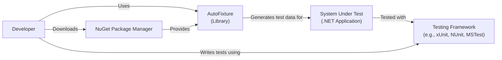
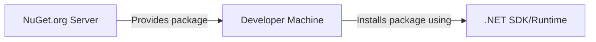
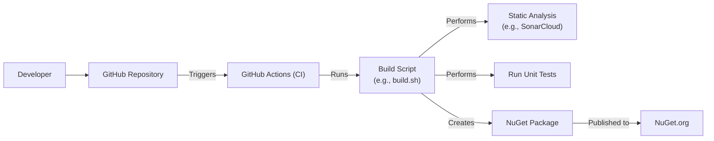

Okay, let's create a design document for the AutoFixture project.

# BUSINESS POSTURE

Business Priorities and Goals:

*   Provide a widely-used and reliable tool for simplifying unit testing in .NET.
*   Reduce boilerplate code in tests, making them more readable and maintainable.
*   Improve developer productivity by automating the creation of test data.
*   Maintain an open-source project with community contributions.
*   Support a wide range of .NET versions and testing frameworks.

Business Risks:

*   Introduction of bugs or vulnerabilities that could affect the reliability of tests or, in extreme cases, introduce vulnerabilities into the systems being tested (though this is less likely as it's a testing tool).
*   Lack of maintenance or updates, leading to incompatibility with newer .NET versions or testing frameworks.
*   Loss of community interest or contributions, slowing down development and bug fixes.
*   Competition from other similar tools.
*   In case of supply chain attack, malicious code can be injected into the package and affect all consumers.

# SECURITY POSTURE

Existing Security Controls:

*   security control: Code reviews are likely performed as part of the pull request process on GitHub.
*   security control: The project uses GitHub, which provides some inherent security features like access control and audit logs.
*   security control: Static analysis is used.
*   security control: Automated tests are used.

Accepted Risks:

*   accepted risk: As a testing library, AutoFixture itself is not directly exposed to external threats in a production environment. The primary risk is to the development and testing process, not to deployed applications.
*   accepted risk: The project relies on community contributions, which introduces a potential risk of malicious or poorly written code being introduced. This is mitigated by code reviews.

Recommended Security Controls:

*   security control: Implement a formal Security Development Lifecycle (SDL) process, including threat modeling.
*   security control: Use static code analysis tools (SAST) to identify potential vulnerabilities during development.
*   security control: Consider using dynamic analysis tools (DAST) if applicable, although the nature of the library makes this less relevant.
*   security control: Implement dependency scanning to identify and address vulnerabilities in third-party libraries.
*   security control: Sign NuGet packages to ensure authenticity and integrity.
*   security control: Enable and enforce branch protection rules on GitHub to prevent direct commits to main and require approvals for pull requests.
*   security control: Use a Software Bill of Materials (SBOM) to track all components and dependencies.
*   security control: Implement supply chain security measures, such as those provided by GitHub's Dependabot or other tools.

Security Requirements:

*   Authentication: Not directly applicable, as AutoFixture is a library used within other applications.
*   Authorization: Not directly applicable.
*   Input Validation: AutoFixture generates data, so input validation is more relevant to the code *using* AutoFixture. However, AutoFixture should handle edge cases and invalid input to its own APIs gracefully, preventing crashes or unexpected behavior.
*   Cryptography: Not directly applicable, unless AutoFixture is used to generate cryptographic keys or data (which should be done with caution and proper consideration of secure random number generation).

# DESIGN

## C4 CONTEXT

Element Descriptions:

*   Element:
    *   Name: Developer
    *   Type: Person
    *   Description: A software developer writing unit tests for a .NET application.
    *   Responsibilities: Writing, running, and maintaining unit tests.
    *   Security controls: Secure coding practices, access controls to development environment.

*   Element:
    *   Name: AutoFixture
    *   Type: Library
    *   Description: The AutoFixture library itself.
    *   Responsibilities: Generating anonymous variables and test data, reducing boilerplate code in tests.
    *   Security controls: Code reviews, static analysis, automated tests.

*   Element:
    *   Name: Testing Framework
    *   Type: Library
    *   Description: A .NET testing framework (xUnit, NUnit, MSTest, etc.).
    *   Responsibilities: Providing the infrastructure for running unit tests and assertions.
    *   Security controls: Relies on the security of the chosen testing framework.

*   Element:
    *   Name: System Under Test
    *   Type: Application
    *   Description: The .NET application or component being tested.
    *   Responsibilities: The functionality being tested.
    *   Security controls: Dependent on the application's own security measures.

*   Element:
    *   Name: NuGet Package Manager
    *   Type: System
    *   Description: The NuGet package repository.
    *   Responsibilities: Hosting and providing access to the AutoFixture package.
    *   Security controls: NuGet's own security measures, package signing.

## C4 CONTAINER

Since AutoFixture is a single library, the container diagram is essentially the same as the context diagram, with the addition of internal components if we were to decompose AutoFixture itself. For simplicity, we'll keep it at the library level.

Element Descriptions:

*   Element:
    *   Name: Developer
    *   Type: Person
    *   Description: A software developer writing unit tests for a .NET application.
    *   Responsibilities: Writing, running, and maintaining unit tests.
    *   Security controls: Secure coding practices, access controls to development environment.

*   Element:
    *   Name: AutoFixture
    *   Type: Library
    *   Description: The AutoFixture library itself.
    *   Responsibilities: Generating anonymous variables and test data, reducing boilerplate code in tests.
    *   Security controls: Code reviews, static analysis, automated tests.

*   Element:
    *   Name: Testing Framework
    *   Type: Library
    *   Description: A .NET testing framework (xUnit, NUnit, MSTest, etc.).
    *   Responsibilities: Providing the infrastructure for running unit tests and assertions.
    *   Security controls: Relies on the security of the chosen testing framework.

*   Element:
    *   Name: System Under Test
    *   Type: Application
    *   Description: The .NET application or component being tested.
    *   Responsibilities: The functionality being tested.
    *   Security controls: Dependent on the application's own security measures.

*   Element:
    *   Name: NuGet Package Manager
    *   Type: System
    *   Description: The NuGet package repository.
    *   Responsibilities: Hosting and providing access to the AutoFixture package.
    *   Security controls: NuGet's own security measures, package signing.

## DEPLOYMENT

Deployment Options:

1.  NuGet Package: The primary deployment method is via NuGet. Developers install the AutoFixture package into their .NET projects.
2.  Source Code (Less Common): Developers could theoretically clone the repository and build the library themselves, but this is less common.

Chosen Deployment (NuGet Package):

Element Descriptions:

*   Element:
    *   Name: NuGet.org Server
    *   Type: Server
    *   Description: The official NuGet package repository.
    *   Responsibilities: Hosting and serving the AutoFixture NuGet package.
    *   Security controls: NuGet's security infrastructure, package signing (if enabled).

*   Element:
    *   Name: Developer Machine
    *   Type: Workstation
    *   Description: The developer's computer.
    *   Responsibilities: Running the .NET development environment and installing the NuGet package.
    *   Security controls: Operating system security, firewall, antivirus, secure development practices.

*   Element:
    *   Name: .NET SDK/Runtime
    *   Type: Software
    *   Description: The .NET SDK or runtime environment.
    *   Responsibilities: Providing the tools to build and run .NET applications, including managing NuGet packages.
    *   Security controls: .NET's security features, regular updates.

## BUILD

Build Process Description:

1.  Developer commits code to the GitHub repository.
2.  GitHub Actions (or a similar CI system) is triggered by the commit.
3.  The build script (e.g., `build.sh` or a similar script) is executed.
4.  Static analysis tools (like SonarCloud, Roslyn analyzers) are run to check for code quality and potential vulnerabilities.
5.  Unit tests are executed to ensure the code functions as expected.
6.  If all checks and tests pass, a NuGet package is created.
7.  The NuGet package is published to NuGet.org (or a private NuGet feed).

Security Controls in Build Process:

*   security control: GitHub Actions (or similar CI) provides a controlled and automated build environment.
*   security control: Static analysis helps identify vulnerabilities early in the development process.
*   security control: Automated unit tests ensure code correctness and help prevent regressions.
*   security control: Code reviews (through pull requests) provide another layer of scrutiny.
*   security control: Dependency scanning (using tools like Dependabot) can identify vulnerable dependencies.
*   security control: NuGet package signing can ensure the integrity of the published package.

# RISK ASSESSMENT

Critical Business Processes:

*   The primary business process is providing a reliable and useful tool for .NET developers.  Disruption of this process would involve the release of a faulty or insecure version of AutoFixture, or the inability to release updates.

Data Sensitivity:

*   AutoFixture itself does not handle sensitive data directly. It generates test data, which, by design, should not be sensitive.  However, if misused (e.g., to generate data that *should* be sensitive, like passwords or PII), it could indirectly contribute to a security issue. The primary data to protect is the source code itself, as a compromise of the repository could lead to malicious code being injected into the library.

# QUESTIONS & ASSUMPTIONS

Questions:

*   What specific static analysis tools are currently used?
*   Are there any existing security policies or guidelines for the project?
*   Is NuGet package signing currently implemented?
*   What is the process for handling reported vulnerabilities?
*   Are there any plans to support other package managers besides NuGet?

Assumptions:

*   BUSINESS POSTURE: The project prioritizes ease of use and developer productivity, but also recognizes the importance of maintaining a secure and reliable library.
*   SECURITY POSTURE: Code reviews are performed regularly, and basic security best practices are followed.
*   DESIGN: The project is primarily distributed as a NuGet package, and GitHub Actions is used for CI/CD. The build process includes static analysis and unit tests.