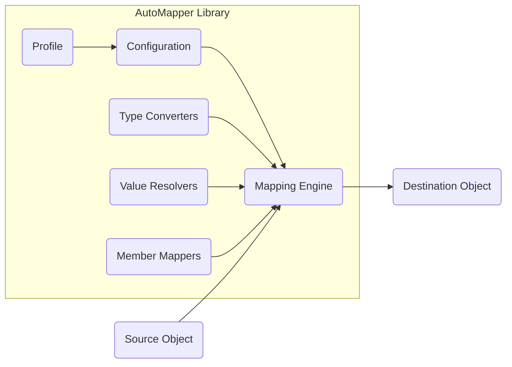
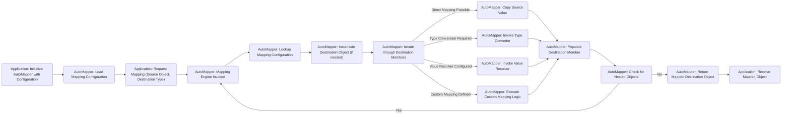

# Project Design Document: AutoMapper

**Version:** 1.1
**Date:** October 26, 2023
**Author:** AI Software Architect

## 1. Introduction

This document provides a detailed design overview of the AutoMapper project, an open-source library for .NET that simplifies the process of mapping objects of one type to objects of another type. This document is intended to serve as a foundation for future threat modeling activities and provides a comprehensive understanding of the system's architecture, components, and data flow. This revision includes more detailed explanations and expands on potential security considerations.

## 2. Goals and Objectives

The primary goals of AutoMapper are:

*   **Convention-based mapping:** Reduce the amount of boilerplate code required for object-to-object mapping by establishing sensible default conventions.
*   **Type safety:** Ensure type safety during the mapping process, catching potential errors at compile time or during configuration.
*   **Flexibility and customization:** Allow developers to override default conventions and define custom mapping logic for complex scenarios.
*   **Performance:** Provide efficient mapping capabilities without significant performance overhead.
*   **Maintainability:** Improve code maintainability by centralizing mapping logic and reducing repetitive code.

## 3. High-Level Architecture

AutoMapper operates as a library integrated into .NET applications. It doesn't run as a standalone service or application. Its core function is to transform data from a source object to a destination object based on defined mapping configurations.

*   **Source Object:** The object containing the data to be mapped.
*   **AutoMapper Library:** The core component responsible for performing the mapping operation based on configured mappings.
*   **Destination Object:** The object that will receive the mapped data.

## 4. Component Architecture

AutoMapper's internal architecture comprises several key components working together:

*   **Configuration:**
    *   Responsible for defining the mapping rules between source and destination types.
    *   Allows for convention-based mappings, where AutoMapper infers mappings based on property names and types.
    *   Supports explicit configuration through a fluent API, allowing developers to define specific mappings, ignore members, and apply custom logic.
    *   Includes mechanisms for defining type converters, value resolvers, and member mappings.
*   **Mapping Engine:**
    *   The central component that orchestrates the mapping process.
    *   Takes a source object instance and a mapping configuration as input.
    *   Creates an instance of the destination type (if needed) and delegates the mapping of individual members to the `Member Mappers`.
    *   Manages the execution of `Type Converters` and `Value Resolvers`.
*   **Type Converters:**
    *   Handle the transformation of values from the source type to the destination type when a direct implicit conversion is not available.
    *   Provides built-in converters for common type conversions (e.g., string to integer, date/time conversions).
    *   Allows developers to define custom type converters for specific domain logic or complex type transformations.
*   **Value Resolvers:**
    *   Provide a mechanism to calculate the value for a destination member based on the source object and potentially other contextual information.
    *   Useful when the destination member's value is derived from multiple source properties or requires external data.
    *   Offer more flexibility than simple type converters for complex mapping scenarios.
*   **Member Mappers:**
    *   Responsible for mapping individual members (properties, fields) from the source object to the destination object.
    *   Determines the source member based on naming conventions or explicit configuration.
    *   Handles null value handling and member-specific mapping logic.
*   **Profile:**
    *   A class that serves as a container for grouping related mapping configurations.
    *   Promotes organization and modularity of mapping configurations, especially in larger applications with numerous mappings.
    *   Allows for the application of common configuration settings to a group of mappings.

## 5. Data Flow

The typical data flow within AutoMapper involves the following steps:

1. **Configuration Loading:** The application initializes AutoMapper by loading mapping configurations. This can occur through scanning assemblies for `Profile` classes or by explicitly defining configurations using the `MapperConfiguration` object.
2. **Mapping Request:** The application requests a mapping operation, typically by calling methods like `Mapper.Map<TDestination>(source)` or `ProjectTo<TDestination>`. This request includes the source object instance and the desired destination type.
3. **Mapping Engine Invocation:** The appropriate mapping method is called, triggering the `Mapping Engine`.
4. **Configuration Lookup:** The `Mapping Engine` retrieves the relevant mapping configuration for the specified source and destination types. This includes information about member mappings, type converters, and value resolvers.
5. **Object Instantiation:** An instance of the destination type is created. In some cases, AutoMapper can map to existing instances.
6. **Member Mapping Iteration:** The `Mapping Engine` iterates through each member of the destination type that needs to be mapped.
7. **Source Member Resolution:** For each destination member, the `Member Mapper` determines the corresponding source member based on naming conventions or explicit configuration.
8. **Value Transformation:** The value from the source member is transformed as needed:
    *   **Direct Mapping:** If the source and destination member types are compatible, the value is directly copied.
    *   **Type Conversion:** If a `Type Converter` is configured for the member types, it's invoked to convert the source value to the destination type.
    *   **Value Resolution:** If a `Value Resolver` is configured, it's executed to calculate the destination member's value based on the source object and context.
    *   **Custom Mapping Logic:** If custom mapping logic is defined for the member, that logic is executed.
9. **Member Population:** The transformed value is assigned to the corresponding member of the destination object.
10. **Nested Mapping (if applicable):** If the destination object contains complex properties (other objects), the mapping process is recursively applied to those nested objects, following the same steps.
11. **Destination Object Return:** The fully mapped destination object is returned to the calling application.

## 6. Security Considerations

While AutoMapper itself doesn't directly handle sensitive data storage or network communication, potential security considerations arise from its usage and configuration. These can be categorized as follows:

*   **Configuration Vulnerabilities:**
    *   **Information Exposure:** Incorrectly configured mappings might inadvertently copy sensitive data from source objects to destination objects where it should not reside. For example, mapping a `User` object containing a password hash to a DTO intended for public display.
    *   **Over-Mapping:** Mapping more data than necessary to the destination object can increase the attack surface and the risk of information leakage.
    *   **Incorrect Type Handling:**  Misconfigured mappings or custom type converters could lead to data truncation, loss of precision, or unexpected data transformations, potentially leading to application errors or security vulnerabilities in downstream processes.
*   **Type Conversion Vulnerabilities:**
    *   **Insecure Custom Converters:** Custom type converters, if not implemented carefully, could introduce vulnerabilities. For instance, a custom converter might perform insecure string parsing or be susceptible to injection attacks if it interacts with external systems.
    *   **Deserialization Issues:** When mapping from external data sources (e.g., JSON, XML), vulnerabilities related to insecure deserialization could be introduced if AutoMapper is used without proper validation and sanitization of the input data *before* mapping. AutoMapper itself doesn't inherently sanitize input.
*   **Performance and Resource Consumption:**
    *   **Complex Mapping Overhead:**  Extremely complex or poorly configured mappings can lead to significant performance overhead and increased resource consumption, potentially leading to denial-of-service (DoS) conditions. Mappings involving large object graphs or numerous custom resolvers can be particularly problematic.
*   **Dependency Vulnerabilities:**
    *   **Transitive Dependencies:** AutoMapper relies on other .NET libraries. Vulnerabilities in these transitive dependencies could indirectly affect applications using AutoMapper. It's crucial to keep dependencies updated.
*   **Error Handling and Information Disclosure:**
    *   **Verbose Error Messages:**  Detailed error messages generated by AutoMapper during mapping failures, especially in production environments, could potentially leak sensitive information about the application's internal structure, data types, or even data values. Proper error handling and logging practices are essential.

## 7. Deployment

AutoMapper is deployed as a NuGet package that is included as a dependency in .NET applications. No separate deployment infrastructure is required for the library itself. The security considerations related to deployment primarily focus on ensuring the consuming application is deployed securely and that the AutoMapper configuration is managed appropriately within that application's lifecycle. This includes:

*   **Secure Configuration Management:** Ensuring that mapping configurations are not exposed in publicly accessible configuration files or through insecure channels.
*   **Dependency Management:** Regularly updating the AutoMapper NuGet package and its dependencies to patch any known security vulnerabilities.

## 8. Technologies Used

*   **Programming Language:** C#
*   **.NET Framework/ .NET Core / .NET:**  The target runtime environment.
*   **NuGet:** Package manager for distribution and dependency management.

## 9. Future Considerations

*   **Improved Diagnostics and Error Reporting:** Enhancing error messages and providing more detailed diagnostics for mapping failures could aid in identifying and resolving configuration issues more efficiently. This should be balanced with the need to avoid excessive information disclosure in production.
*   **Support for Asynchronous Mapping:**  Exploring options for asynchronous mapping operations could improve performance in scenarios involving I/O-bound operations within custom resolvers or converters.
*   **Integration with Source Generators:**  Leveraging .NET source generators could potentially improve performance by generating mapping code at compile time and provide earlier validation of mapping configurations.
*   **Security Analyzers/Linters:**  Developing or integrating with static analysis tools to detect potential misconfigurations or insecure patterns in AutoMapper usage could proactively mitigate security risks.

This document provides a more detailed design overview of the AutoMapper project, further enhancing its value as a foundation for threat modeling activities. The expanded security considerations section highlights potential areas of concern that should be carefully evaluated to ensure the secure and reliable use of AutoMapper in applications.
