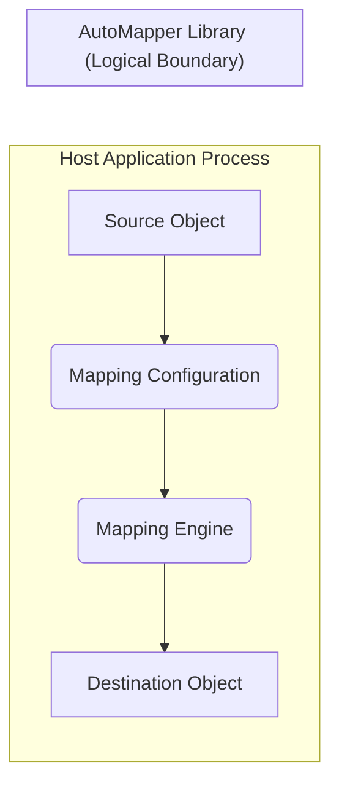
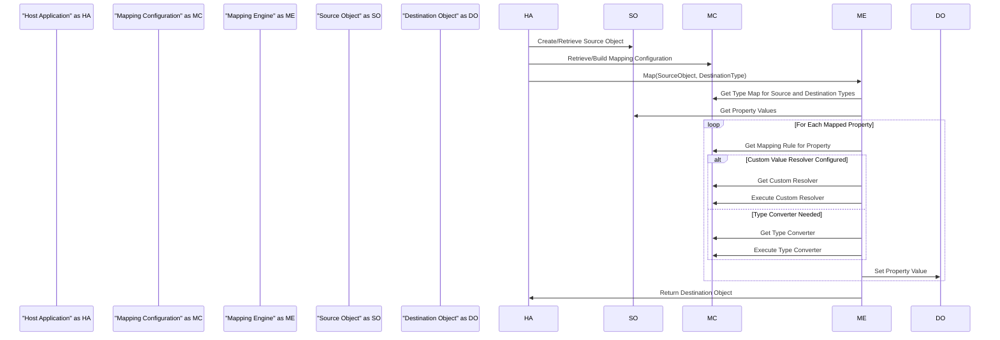

# Project Design Document: AutoMapper Library

**Version:** 1.1
**Date:** October 26, 2023
**Prepared By:** Gemini (AI Language Model)

## 1. Introduction

This document provides a detailed design overview of the AutoMapper library, an open-source convention-based object-object mapper for .NET. This document is intended to serve as a foundation for threat modeling activities, providing a comprehensive understanding of the library's architecture, data flow, and key components. This revised version includes more detailed explanations and elaborates on potential security considerations.

## 2. Goals and Objectives

The primary goal of this design document is to clearly articulate the architecture and functionality of the AutoMapper library to facilitate effective threat modeling. Specific objectives include:

*   Describing the core components and their interactions in detail.
*   Illustrating the data flow within the library with enhanced clarity.
*   Identifying potential areas of interest for security analysis, with specific examples.
*   Providing a foundation for understanding how AutoMapper is used within applications and its potential security implications.

## 3. Target Audience

This document is intended for the following audiences:

*   Security engineers and architects responsible for threat modeling applications that utilize AutoMapper.
*   Developers who are integrating AutoMapper into their projects and need a deeper understanding of its architecture and security considerations.
*   Anyone interested in the internal workings and design of the AutoMapper library, particularly concerning its role in application security.

## 4. System Architecture

AutoMapper is a library that is integrated into other applications. It doesn't have a standalone deployment or infrastructure. Its architecture revolves around the concept of defining mappings between different types of objects and then executing those mappings. The core of its functionality lies within the host application's process.

**Key Architectural Elements:**

*   **Host Application Process:** The runtime environment of the application utilizing AutoMapper. All AutoMapper operations occur within this process.
*   **Mapping Configuration:** This component defines the rules and conventions for mapping between specific source and destination types. It's typically built up during application startup or on demand. This includes:
    *   **Type Maps:** Explicit definitions of how properties on the source type correspond to properties on the destination type. These can be configured through a fluent API or by convention.
    *   **Custom Value Resolvers:** User-defined classes implementing specific interfaces to handle complex mapping scenarios where simple property-to-property mapping isn't sufficient. These resolvers execute custom logic to determine the destination value.
    *   **Type Converters:** Mechanisms for converting values between different data types. AutoMapper provides built-in converters for common types, and developers can create custom converters.
    *   **Profile Definitions:** Classes that group related mapping configurations, promoting organization and reusability.
*   **Mapping Engine:** The central component responsible for orchestrating the mapping process. It takes a source object and a destination type (or instance) and uses the `Mapping Configuration` to perform the mapping.
*   **Source Object:** An instance of the object whose data needs to be transferred and transformed. The data within this object is read during the mapping process.
*   **Destination Object:** An instance of the object that will be populated with data from the source object according to the defined mappings. This object is modified during the mapping process.

## 5. Data Flow

The typical data flow within an application using AutoMapper is as follows:

1. The **Host Application** creates or retrieves an instance of the **Source Object**.
2. The application retrieves or builds the **Mapping Configuration**, defining how the source and destination types relate. This might involve loading profiles, registering type maps, and configuring resolvers and converters.
3. The application invokes the **Mapping Engine**, typically through the `Mapper` class, providing the **Source Object** and the desired **Destination Object** type (or an existing instance).
4. The **Mapping Engine** consults the **Mapping Configuration** to find the appropriate type map for the source and destination types.
5. The **Mapping Engine** iterates through the properties of the **Source Object** that are configured for mapping.
6. For each mapped property:
    *   The **Mapping Engine** determines the corresponding property on the **Destination Object** based on the configuration.
    *   If a **Custom Value Resolver** is configured for that property, the resolver is executed, potentially accessing data from the **Source Object** or other services to determine the destination value.
    *   If a **Type Converter** is needed to convert the source property's type to the destination property's type, the appropriate converter is invoked.
    *   The resulting value is then set on the corresponding property of the **Destination Object**.
7. The **Destination Object**, now populated with data from the **Source Object**, is returned to the **Host Application**.

## 6. Key Components and Functionality

This section details the core components and their functionalities within the AutoMapper library:

*   **`Mapper` Class:** The primary interface for performing mapping operations. An instance of `IMapper` is typically resolved through dependency injection. It provides methods like `Map<TDestination>(TSource source)` to create a new destination object and `Map(TSource source, TDestination destination)` to populate an existing destination object.
*   **`MapperConfiguration` Class:**  Used to define and build the mapping configurations. It acts as a registry for type maps, value resolvers, and type converters. It is typically built once during application startup and then used to create `IMapper` instances.
    *   Allows registering mappings using a fluent API (e.g., `CreateMap<Source, Destination>().ForMember(...)`).
    *   Supports scanning assemblies for `Profile` classes to automatically register mappings.
    *   Provides methods for validating the configuration to catch potential errors early.
*   **`Profile` Class:** A base class that developers can inherit from to organize mapping configurations into logical units. This promotes modularity and maintainability of mapping definitions.
*   **`ITypeConverter<TSource, TDestination>` Interface:** Defines the contract for creating custom logic to convert values between different types. Implementations of this interface are registered with the `MapperConfiguration`.
*   **`IValueResolver<TSource, TDestination, TMember>` Interface:** Defines the contract for custom logic that resolves the value for a specific destination member. This is useful when the destination value needs to be derived from multiple source properties or external data.
*   **`IMemberValueResolver<TSource, TDestination, TSourceMember, TDestinationMember>` Interface:** A specialized version of `IValueResolver` that provides access to the value of the corresponding source member.
*   **Expression Mapping:** AutoMapper allows defining mappings using lambda expressions, providing strong typing and compile-time checking for mapping configurations. This improves code maintainability and reduces runtime errors.
*   **Convention-Based Mapping:** The core principle of AutoMapper, where it automatically maps properties with matching names and compatible types. This reduces the need for explicit mapping configurations in many cases.
*   **Configuration Validation:** A crucial feature that allows developers to verify the correctness of their mapping configurations. This can help identify potential issues like missing mappings or incompatible types before runtime.
*   **Asynchronous Mapping:** AutoMapper supports asynchronous operations within custom value resolvers and type converters, allowing for integration with asynchronous data sources and operations.

## 7. Security Considerations (Detailed)

While AutoMapper itself doesn't directly handle sensitive data storage or network communication, its role in data transformation and object manipulation introduces several potential security considerations:

*   **Exposure of Sensitive Data through Incorrect Mapping:**
    *   **Problem:**  If mappings are not carefully configured, sensitive data from the source object might be inadvertently copied to destination properties or objects where it shouldn't reside. This could lead to unintended data exposure if the destination object is later serialized, logged, or displayed.
    *   **Mitigation:** Thoroughly review and test all mapping configurations, especially when dealing with objects containing sensitive information. Utilize explicit mapping configurations instead of relying solely on conventions for sensitive properties. Consider using `Ignore()` to explicitly exclude sensitive properties from mapping.
*   **Data Integrity Issues due to Custom Logic:**
    *   **Problem:** Custom value resolvers and type converters execute developer-defined code. If this code contains errors or malicious logic, it could corrupt data during the mapping process, leading to data integrity issues in the destination object.
    *   **Mitigation:** Implement robust input validation and error handling within custom resolvers and converters. Follow secure coding practices to prevent vulnerabilities like injection flaws. Thoroughly test custom logic to ensure it behaves as expected.
*   **Denial of Service (DoS) through Resource-Intensive Mappings:**
    *   **Problem:** Complex or poorly performing custom resolvers or converters, especially when dealing with large object graphs or frequent mapping operations, can consume significant CPU and memory resources, potentially leading to performance degradation or even denial of service.
    *   **Mitigation:**  Optimize custom resolvers and converters for performance. Avoid unnecessary computations or I/O operations within mapping logic. Consider implementing caching mechanisms where appropriate. Monitor application performance and identify potential bottlenecks related to mapping operations.
*   **Information Disclosure through Verbose Error Messages:**
    *   **Problem:**  Detailed error messages generated during mapping configuration or execution, while helpful for debugging, might inadvertently reveal information about the application's internal structure, class names, or property names to attackers.
    *   **Mitigation:** Configure logging and error handling to avoid exposing sensitive internal details in production environments. Implement custom exception handling to provide more generic error messages to users while logging detailed information securely for debugging purposes.
*   **Vulnerabilities in AutoMapper Dependencies:**
    *   **Problem:** Like any software library, AutoMapper relies on its own set of dependencies. Vulnerabilities in these dependencies could potentially be exploited if AutoMapper is not kept up-to-date.
    *   **Mitigation:** Regularly update the AutoMapper NuGet package to the latest stable version to benefit from security patches and bug fixes in its dependencies. Utilize dependency scanning tools to identify and address potential vulnerabilities in the project's dependency tree.
*   **Security Risks Associated with Reflection:**
    *   **Problem:** AutoMapper heavily utilizes reflection to access and manipulate object properties. While powerful, misuse of reflection in custom resolvers or converters could potentially introduce security vulnerabilities if not handled carefully. For instance, dynamically invoking methods based on user input could lead to arbitrary code execution.
    *   **Mitigation:**  Exercise caution when using reflection within custom mapping logic. Avoid dynamically constructing method calls based on external input. Ensure proper input validation and sanitization when dealing with data that might influence reflection operations.
*   **Serialization and Deserialization Vulnerabilities:**
    *   **Problem:** If AutoMapper is used in scenarios involving serialization and deserialization (e.g., mapping between DTOs and domain objects), vulnerabilities related to these processes (like insecure deserialization) could become relevant. Maliciously crafted serialized data could be mapped into application objects, potentially leading to code execution or other attacks.
    *   **Mitigation:**  Follow secure deserialization practices. Avoid deserializing data from untrusted sources directly into application objects. Implement validation and sanitization of data before and after mapping. Consider using safer serialization formats and libraries.

## 8. Deployment Considerations

AutoMapper is typically deployed as a NuGet package integrated directly into the host application's build process. Deployment considerations are primarily focused on ensuring the correct version is deployed and that the mapping configurations are correctly initialized within the application.

*   **NuGet Package Management:** Ensure the correct version of the `AutoMapper` NuGet package is referenced in the project file and that package restore is successful during the build process.
*   **Configuration Initialization:** The mapping configuration (using `MapperConfiguration`) needs to be built and initialized during the application's startup phase. This is often done within the application's composition root or dependency injection setup.
*   **Performance Considerations:**  While not strictly a deployment concern, the performance impact of mapping should be considered, especially in high-throughput applications. Caching of `IMapper` instances and optimized mapping configurations are important.
*   **Assembly Deployment:** Ensure that all necessary assemblies, including `AutoMapper` and any custom resolver or converter implementations, are deployed with the application.

## 9. Future Enhancements (Potential Areas for Consideration)

While not directly impacting the current design for threat modeling, understanding potential future enhancements can provide context for future development and potential new attack surfaces:

*   **Improved Configuration APIs:** Exploring more declarative or type-safe ways to define mapping configurations.
*   **Enhanced Performance Optimizations:** Continuously seeking opportunities to improve the performance of the mapping engine, especially for complex scenarios.
*   **Support for New Frameworks and Platforms:** Adapting AutoMapper to new .NET versions and related technologies like Blazor or MAUI.
*   **More Granular Control over Mapping Behavior:** Providing more fine-grained options for customizing mapping behavior in specific scenarios.
*   **Built-in Security Features:** While unlikely for a mapping library, considering features like automatic sanitization or encoding of mapped data (though this might be better handled at the application level).

This revised document provides a more detailed and security-focused overview of the AutoMapper library's architecture and functionality. The expanded explanations of components, the clarified data flow, and the detailed security considerations should provide a stronger foundation for effective threat modeling activities.
