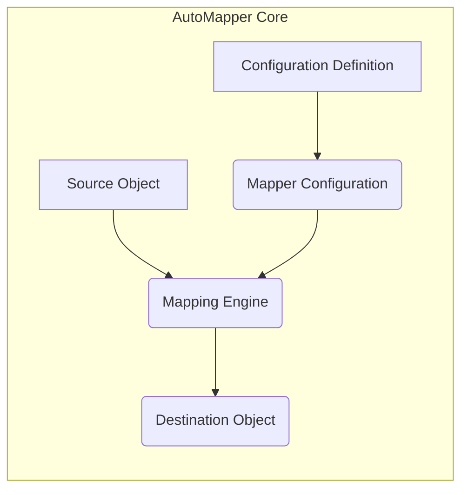
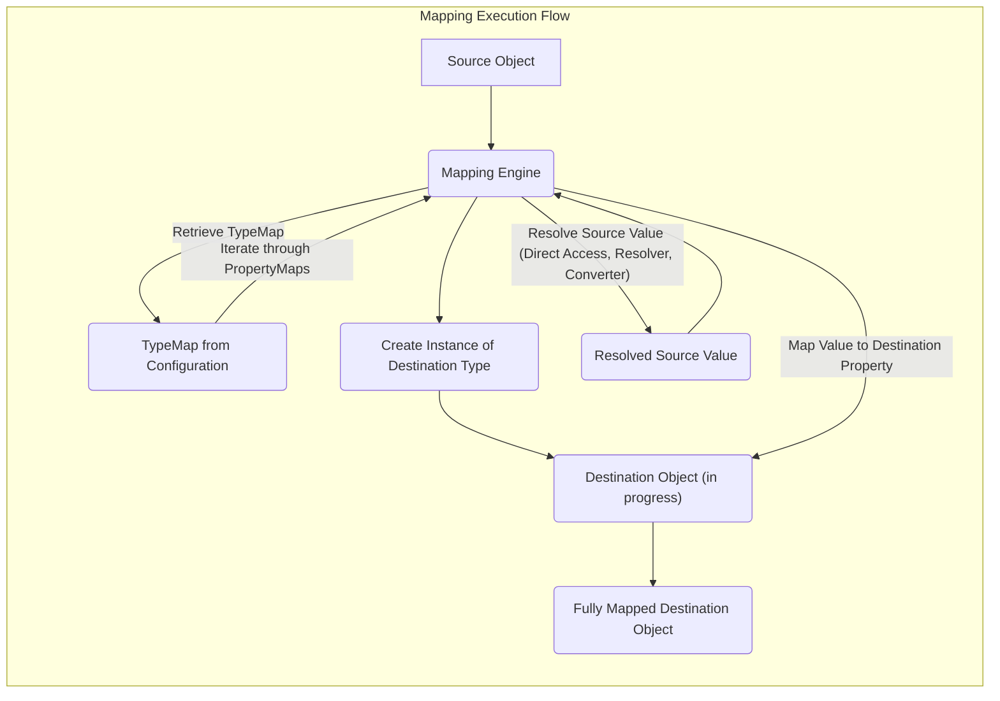

# Project Design Document: AutoMapper

**Version:** 1.1
**Date:** October 26, 2023
**Author:** AI Software Architect

## 1. Introduction

This document provides an enhanced and more detailed design overview of the AutoMapper library, an object-to-object mapper. The primary goal is to offer a comprehensive understanding of AutoMapper's architecture, components, and data flow, specifically tailored for effective threat modeling activities. This document will serve as a robust foundation for identifying potential security vulnerabilities and designing appropriate mitigation strategies.

## 2. Goals and Objectives

*   Deliver a comprehensive and easily understandable architectural overview of the AutoMapper library.
*   Clearly define each component within AutoMapper, detailing its purpose, functionality, and interactions with other components.
*   Illustrate the data flow during both the configuration and the mapping execution processes with enhanced clarity.
*   Identify potential areas of security concern with more specific examples to facilitate thorough threat modeling.
*   Serve as a definitive reference document for security assessments, development teams, and anyone seeking to understand AutoMapper's internal workings from a security perspective.

## 3. Scope

This document focuses on the core, fundamental functionality of AutoMapper, including:

*   The process of configuring mapping rules between different types.
*   The internal workings of the mapping engine and its core operations during object transformation.
*   The role and implementation of custom type converters and value resolvers in the mapping process.
*   The use of profile-based configuration for organizing and managing mappings.
*   The integration mechanisms with dependency injection containers for managing `IMapper` instances.

This document explicitly does not cover:

*   Specific, concrete use cases or applications that utilize the AutoMapper library.
*   Detailed performance optimization strategies or benchmarking results.
*   Low-level internal implementation details of specific mapping strategies or algorithms.

## 4. High-Level Architecture

AutoMapper's architecture is centered around the principle of defining mapping configurations upfront and then utilizing these configurations to efficiently transform data from source objects to destination objects.

*   **Source Object:** The instance of a class containing the data that needs to be transformed and mapped to another object.
*   **Configuration Definition:** The process of specifying the rules and instructions that dictate how properties from the source object should be mapped to the destination object. This often involves using `Profile` classes.
*   **Mapper Configuration:** A central repository holding all the defined mapping rules, type maps, and custom configurations. It's built based on the configuration definitions.
*   **Mapping Engine:** The core component responsible for orchestrating the mapping process. It takes the source object and the `Mapper Configuration` as input and applies the defined rules to create the destination object.
*   **Destination Object:** The newly instantiated object whose properties are populated with data from the source object according to the rules defined in the `Mapper Configuration`.

## 5. Detailed Design

### 5.1. Core Components

*   **`MapperConfiguration`:**
    *   The central registry that holds all defined mapping configurations for the application.
    *   Allows the registration of `Profile` instances, which encapsulate sets of related mappings.
    *   Provides the factory method for creating `IMapper` instances, which are used to perform the actual mapping.
    *   Internally manages collections of `TypeMap` objects, each representing the mapping between a specific source and destination type.
    *   Manages global configuration settings that apply to all mappings.
*   **`IMapper`:**
    *   The primary interface through which client code interacts with AutoMapper to perform object mapping.
    *   Instances are created from a `MapperConfiguration`, ensuring that mappings are performed according to the defined rules.
    *   Provides key methods like `Map<TDestination>(TSource source)` for creating a new destination object and `Map(TSource source, TDestination destination)` for mapping to an existing destination object.
    *   Delegates the core mapping logic execution to the internal `MappingEngine`.
*   **`Profile`:**
    *   A class that serves as a logical grouping mechanism for related mapping configurations.
    *   Inheriting from `Profile` allows developers to organize mappings by domain or feature.
    *   Provides a fluent interface for defining mappings between types, making the configuration process readable and maintainable.
    *   Supports lifecycle methods that can be overridden to perform actions before or after mapping.
*   **`TypeMap`:**
    *   Represents the specific mapping configuration between a single pair of source and destination types.
    *   Contains a collection of `PropertyMap` instances, detailing how individual properties should be mapped.
    *   Stores references to any custom type converters or value resolvers that are specific to this type mapping.
    *   Includes information about configured member mappings, including ignoring members or conditional mapping.
*   **`PropertyMap`:**
    *   Represents the mapping configuration for a single property on the destination type.
    *   Specifies the corresponding source member (property or field) from which the value should be obtained.
    *   Allows the definition of custom value resolvers to transform the source value before mapping.
    *   Supports the use of formatters to modify the value during the mapping process.
    *   Enables the specification of null value substitutions or default values.
    *   Can include conditional logic to determine if the property should be mapped based on certain criteria.
*   **`ITypeConverter<TSource, TDestination>`:**
    *   An interface for defining custom logic to convert values between two specific types. This is used when a direct, automatic mapping is not possible or desired.
    *   Implementations are registered within the `MapperConfiguration` and are invoked by the `MappingEngine` when a conversion between the specified types is required.
    *   Provides a `Convert` method that takes the source value and returns the converted destination value.
*   **`IValueResolver<TSource, TDestination, TMember>`:**
    *   An interface for defining custom logic to resolve the value for a specific member (property) on the destination type.
    *   Provides access to both the source object and the destination object being mapped, allowing for more context-aware value resolution.
    *   The `Resolve` method takes the source object, destination object, and the member being mapped as input and returns the resolved value.

### 5.2. Configuration Process

The configuration process in AutoMapper involves defining the rules that govern how objects of one type are transformed into objects of another type. This is typically achieved through the use of `Profile` classes.

1. **Create `Profile` Classes:** Developers define classes that inherit from the `Profile` base class. These profiles serve as containers for related mapping configurations.
2. **Define Mappings within the `Profile`:** Inside each `Profile`, the fluent API is used to specify mappings between source and destination types. This is done using methods like `CreateMap<SourceType, DestinationType>()`.
3. **Customize Property Mappings:** For each type mapping, developers can further customize how individual properties are mapped using methods like `ForMember()`. This allows for:
    *   **Specifying the Source Member:** Explicitly defining which property or field on the source object should be used.
    *   **Using `MapFrom()`:** Mapping a destination property to a different source member or a nested property.
    *   **Using `ResolveUsing()` with an `IValueResolver`:** Implementing custom logic to resolve the destination property's value.
    *   **Using `ConvertUsing()` with an `ITypeConverter`:** Specifying a custom type conversion for the property.
    *   **Ignoring Specific Members:** Preventing certain properties from being mapped.
    *   **Conditional Mapping:** Defining conditions under which a property should be mapped.
4. **Create `MapperConfiguration`:** An instance of `MapperConfiguration` is created. This object takes a configuration expression, which typically involves adding instances of the created `Profile` classes.
5. **Create `IMapper`:** An `IMapper` instance is obtained from the configured `MapperConfiguration`. This `IMapper` is then used to perform the actual object mapping.

### 5.3. Mapping Execution Process

When the `Map` method of an `IMapper` instance is invoked:

1. **Retrieve `TypeMap`:** The `MappingEngine` first retrieves the appropriate `TypeMap` from the `MapperConfiguration` based on the runtime types of the source and destination objects.
2. **Create Destination Instance:** An instance of the destination type is created. This might involve using the default constructor or a custom factory function if configured.
3. **Iterate through `PropertyMap`s:** The `MappingEngine` iterates through the collection of `PropertyMap` instances associated with the retrieved `TypeMap`.
4. **Resolve Source Value:** For each `PropertyMap`, the engine determines the value to be mapped to the destination property. This involves:
    *   **Direct Property Access:** Accessing the corresponding property or field on the source object.
    *   **Invocation of `IValueResolver`:** If a custom value resolver is configured for the property, its `Resolve` method is called to obtain the value.
    *   **Conversion using `ITypeConverter`:** If a type conversion is necessary and a custom converter is registered, its `Convert` method is invoked.
5. **Map Value to Destination:** The resolved source value is then mapped to the corresponding property on the destination object. This might involve:
    *   **Direct Assignment:** If the source and destination property types are compatible.
    *   **Recursive Mapping:** If the destination property is a complex object, the mapping process is recursively applied to map the nested object.
    *   **Type Conversion:** If the types are not directly compatible, the configured `ITypeConverter` is used to perform the conversion.
6. **Return Destination Object:** Once all properties have been mapped, the fully populated destination object is returned to the caller.

## 6. Data Flow

The data flow within AutoMapper can be broken down into two primary phases: configuration and mapping execution.

**Configuration Data Flow:**

1. **Profile Definition:** Developers define mapping rules within `Profile` classes.
2. **Configuration Building:** The `MapperConfiguration` object is instantiated and populated with the defined `Profile` instances.
3. **TypeMap Creation:** The `MapperConfiguration` analyzes the profiles and creates `TypeMap` objects for each configured mapping.
4. **PropertyMap Creation:** Within each `TypeMap`, `PropertyMap` objects are created, detailing the mapping for individual properties.
5. **`IMapper` Creation:** An `IMapper` instance is created from the fully configured `MapperConfiguration`.

**Mapping Execution Data Flow:**

1. **Source Object Input:** The `IMapper.Map` method receives the source object to be mapped.
2. **`TypeMap` Lookup:** The `MappingEngine` retrieves the appropriate `TypeMap` based on the source and destination types.
3. **Destination Object Instantiation:** An instance of the destination type is created.
4. **Property Mapping Iteration:** The `MappingEngine` iterates through the `PropertyMap`s in the `TypeMap`.
5. **Value Resolution:** For each destination property, the corresponding source value is resolved, potentially using custom resolvers or converters.
6. **Type Conversion (if needed):** If the source and destination property types differ, a type conversion is performed.
7. **Destination Property Population:** The resolved and converted value is assigned to the destination property.
8. **Destination Object Output:** The fully mapped destination object is returned.

## 7. Security Considerations (Detailed for Threat Modeling)

This section expands on potential security concerns, providing more specific examples to aid in threat modeling.

*   **Configuration Vulnerabilities:**
    *   **Injection of Malicious Configuration:** If the mapping configuration is loaded from an untrusted source (e.g., user-provided strings, external configuration files without integrity checks), an attacker could inject malicious configurations. This could involve mapping sensitive data to unintended properties, leading to information disclosure, or configuring mappings that trigger unexpected behavior. *Example: An attacker could inject a configuration that maps a user's password hash to a publicly accessible field.*
    *   **Overly Permissive Mappings:** Configurations that are too broad or lack specific constraints can inadvertently map sensitive data to destination properties where it shouldn't reside. This can lead to data leaks or privilege escalation if the destination object is used in a security-sensitive context. *Example: Mapping all properties from a user object to a DTO intended for public display, unintentionally including sensitive fields like email or phone number.*
*   **Custom Type Converters and Value Resolvers:**
    *   **Code Injection:** If custom converters or resolvers are implemented without proper input validation or sanitization, attackers might be able to inject malicious code that gets executed during the mapping process. This is especially critical if the custom logic interacts with external systems or performs operations based on the input data. *Example: A custom value resolver that executes a shell command based on a value from the source object.*
    *   **Denial of Service (DoS):** Inefficient or resource-intensive custom logic within converters or resolvers can be exploited to cause denial-of-service attacks. By providing specific input that triggers these expensive operations, an attacker can exhaust server resources. *Example: A custom converter that performs a complex and time-consuming calculation or makes numerous external API calls.*
    *   **Information Disclosure:** Custom logic might inadvertently expose sensitive information through logging, error messages, or by returning data that should not be accessible. *Example: A custom resolver that logs the values of sensitive properties during the mapping process.*
*   **Dependency Vulnerabilities:**
    *   AutoMapper relies on other libraries (dependencies). Known vulnerabilities in these dependencies could potentially be exploited if not properly managed and updated. Attackers could leverage these vulnerabilities to compromise the application. *Example: A vulnerability in a reflection library used by AutoMapper could allow an attacker to bypass security checks.*
*   **Deserialization Issues (Indirect):** While AutoMapper itself doesn't directly handle deserialization, if it's used in scenarios where untrusted data is deserialized into source objects *before* mapping, vulnerabilities in the deserialization process (e.g., insecure deserialization) could be exploited. This could lead to remote code execution or other attacks before AutoMapper even comes into play.
*   **Reflection Abuse:** AutoMapper heavily utilizes reflection to access and manipulate object properties. While powerful, reflection can be abused if not handled carefully. Attackers might try to exploit reflection mechanisms to access private members, bypass security checks, or manipulate object state in unintended ways if there are vulnerabilities in how AutoMapper uses reflection.
*   **Error Handling:** Insufficient or insecure error handling during the mapping process could expose sensitive information through overly verbose error messages or stack traces. These details could aid attackers in understanding the application's internal workings and identifying potential vulnerabilities. *Example: Error messages revealing database connection strings or internal file paths.*

## 8. Future Considerations

*   Conduct a detailed security analysis of specific extension points within AutoMapper (e.g., custom member mappers, naming conventions) and their potential security implications.
*   Examine common integration patterns with different frameworks (e.g., ASP.NET Core, Entity Framework) and assess their potential impact on the security posture of applications using AutoMapper.
*   Develop and document security best practices for configuring and utilizing AutoMapper in various deployment environments to mitigate identified risks.
*   Investigate potential security hardening techniques that could be applied to the AutoMapper library itself.