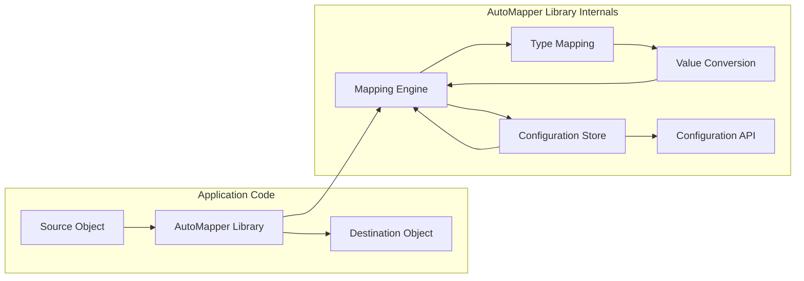

# Project Design Document: AutoMapper - Improved

**Project Name:** AutoMapper

**Project Repository:** [https://github.com/automapper/automapper](https://github.com/automapper/automapper)

**Document Version:** 1.1
**Date:** 2023-10-27
**Author:** AI Software Architect

## 1. Introduction

This document provides an enhanced design overview of the AutoMapper project, a prominent object-object mapper for .NET.  It is specifically crafted to serve as a robust foundation for threat modeling and security analysis of the AutoMapper library and applications that utilize it. This document details the architecture, key components, data flow pathways, and critical security considerations relevant to the library's operation and integration within larger systems.

## 2. Project Overview

AutoMapper is a convention-based object-object mapper library designed for the .NET ecosystem. Its primary function is to streamline and automate the mapping of properties between different object types. This automation significantly reduces the need for manual, repetitive mapping code, thereby enhancing code maintainability and development efficiency. AutoMapper is widely adopted in applications to facilitate data transfer across architectural layers, such as between Data Transfer Objects (DTOs) and domain models, or to manage data transformations within complex application structures where object schemas may diverge.

AutoMapper operates based on mapping configurations established between source and destination types. These configurations define the rules and logic for transferring data from source object properties to destination object properties.  The library supports a diverse range of mapping scenarios, including:

*   **Convention-Based Mapping:** Automatic mapping of properties based on naming conventions and type compatibility.
*   **Explicit Mapping Configuration:** Defining precise mapping rules for specific properties or types, overriding conventions.
*   **Nested Object Graph Mapping:** Handling the mapping of complex object hierarchies and relationships.
*   **Collection Mapping:** Efficiently mapping collections of objects, including lists, arrays, and sets.
*   **Custom Value Conversion:** Implementing custom logic for converting property values between disparate types during the mapping process.
*   **Conditional Mapping:** Mapping properties based on specific conditions or criteria.
*   **Before/After Mapping Actions:** Executing custom logic before or after the mapping process for specific types or mappings.

## 3. System Architecture

### 3.1. High-Level Architecture Diagram

### 3.2. Component Description

*   **Source Object ("Source Object"):**  The input object instance serving as the data source for the mapping operation. This object is provided by the consuming application code.
*   **Destination Object ("Destination Object"):** The output object instance that is populated with data mapped from the Source Object. AutoMapper creates and populates this object.
*   **AutoMapper Library ("AutoMapper Library"):** The core .NET library providing the object mapping functionality. It is integrated into applications as a dependency package.
*   **Mapping Engine ("Mapping Engine"):** The central orchestrator of the mapping process. It receives mapping requests, retrieves relevant configurations from the Configuration Store, and executes the property mapping logic.
*   **Configuration Store ("Configuration Store"):** A repository holding all defined mapping configurations. These configurations are built and managed through the Configuration API and include profiles, individual maps, and custom resolvers/converters.  Configurations are typically held in memory after initialization.
*   **Type Mapping ("Type Mapping"):**  Manages the mapping logic specific to different data types. It determines the appropriate mapping strategy for source and destination property types and delegates to Value Conversion when type transformations are required.
*   **Value Conversion ("Value Conversion"):**  Handles the conversion of values between incompatible types during mapping. This includes a set of built-in converters for common types and supports the registration of custom value converters for specific scenarios.
*   **Configuration API ("Configuration API"):**  A fluent interface exposed by AutoMapper for developers to define mapping configurations programmatically within their application code. This API allows for defining profiles, creating maps between types, and registering custom converters and resolvers.

## 4. Data Flow

The data flow during a typical AutoMapper mapping operation proceeds as follows:

1.  **Initiate Mapping Request:** Application code invokes a mapping function provided by AutoMapper, such as `mapper.Map<DestinationType>(sourceObject)`. This call provides the Source Object instance and the desired Destination Type.
2.  **Configuration Lookup:** The Mapping Engine queries the Configuration Store to retrieve the mapping configuration associated with the Source Type and Destination Type.
3.  **Destination Object Instantiation:** AutoMapper creates a new instance of the Destination Object.
4.  **Property Iteration and Mapping:** The Mapping Engine iterates through the properties of the Source Object. For each property:
    *   **Property Resolution:** The engine determines the corresponding property in the Destination Object based on the configured mapping rules. This resolution can be based on:
        *   **Convention:** Matching properties by name (e.g., "FirstName" in source maps to "FirstName" in destination).
        *   **Explicit Configuration:** Using custom mapping rules defined via the Configuration API (e.g., mapping "CustomerName" in source to "FullName" in destination).
    *   **Value Retrieval:** The value of the current property is retrieved from the Source Object.
    *   **Value Conversion (Conditional):** If the source and destination property types are different and require conversion, the Value Conversion component is invoked to transform the source value to a compatible type for the destination property.
    *   **Value Assignment:** The converted (or directly retrieved) value is assigned to the corresponding property of the Destination Object.
5.  **Nested Object Mapping (Recursive):** If a property is a complex object itself, the mapping process recursively repeats for this nested object, following the same steps.
6.  **Collection Mapping (Iterative):** If a property is a collection, the mapping process iterates through each item in the source collection and maps it to a corresponding item in the destination collection.
7.  **Return Destination Object:** Once all properties are processed, the fully populated Destination Object is returned to the initiating application code.

## 5. Technology Stack

AutoMapper is built upon the following core technologies:

*   **.NET Framework / .NET (.NET Core, .NET 5+):** The runtime environment supporting the library.
*   **C# Programming Language:** The primary language in which AutoMapper is developed.
*   **Reflection:**  Extensive use of .NET Reflection for runtime type inspection, property access, and dynamic object creation. This is fundamental to AutoMapper's ability to map between arbitrary object types without compile-time knowledge of their structure.
*   **Expression Trees:** Employed for building efficient property access and value conversion logic at runtime. Expression trees allow for dynamic code generation and optimization, improving performance compared to purely reflection-based approaches in some scenarios.

## 6. Deployment Model

AutoMapper is distributed as a NuGet package, designed for seamless integration into .NET applications.  Deployment is straightforward: developers add the AutoMapper NuGet package as a dependency to their .NET projects.  There is no separate deployment infrastructure for AutoMapper itself; it operates entirely within the context of the application it is integrated into. Applications using AutoMapper include the library as a standard dependency and utilize its API directly within their application code.

## 7. Security Considerations for Threat Modeling

When conducting threat modeling for applications utilizing AutoMapper, the following security areas and potential threats should be carefully evaluated:

*   **Configuration Management Vulnerabilities:**
    *   **Configuration Injection/Manipulation (Less Likely in Typical Usage):** While AutoMapper configurations are usually code-based, if configurations were ever dynamically generated or loaded from external, untrusted sources (e.g., user-provided input files, databases without proper access control - which is atypical for AutoMapper), there could be a risk of configuration injection. Malicious actors might attempt to inject or modify mapping configurations to alter application behavior, potentially leading to data manipulation or information disclosure.  *Mitigation:*  Strictly control the source and generation of AutoMapper configurations. Treat configuration code as security-sensitive.
    *   **Overly Complex Configurations:**  Highly complex or convoluted mapping configurations can become difficult to audit and understand, potentially masking unintended behaviors or vulnerabilities.  *Mitigation:*  Maintain configuration simplicity and clarity. Implement code reviews for complex mapping configurations.

*   **Reflection-Based Security Risks:**
    *   **Performance Degradation/Denial of Service (DoS):**  While not a direct vulnerability, excessive or inefficient reflection operations, especially in complex mapping scenarios or under high load, could lead to performance bottlenecks and potentially contribute to denial-of-service conditions. *Mitigation:*  Profile application performance under load. Optimize mapping configurations and consider caching strategies where applicable.
    *   **Type Confusion/Unexpected Behavior:**  In scenarios involving highly dynamic types or incorrect type handling within custom resolvers or converters that leverage reflection directly, there is a potential for type confusion. This could lead to unexpected application behavior or errors, although direct security exploits are less common from this. *Mitigation:*  Thoroughly test custom resolvers and converters, especially those using reflection. Implement robust type validation where necessary.

*   **Value Conversion Vulnerabilities (Critical Area):**
    *   **Custom Value Converter Exploits:** Custom value converters, if not implemented securely, represent a significant potential vulnerability point. Examples include:
        *   **Format String Bugs:** If custom converters use format strings based on external input without proper sanitization, format string vulnerabilities could arise, potentially leading to information disclosure or code execution.
        *   **Injection Flaws (e.g., SQL Injection, Command Injection):** If a custom converter interacts with external systems (databases, operating system commands) and constructs queries or commands based on unvalidated input during conversion, injection vulnerabilities are possible.
        *   **Cross-Site Scripting (XSS):** If a custom converter is involved in rendering output for web applications (e.g., HTML encoding) and fails to properly sanitize input, XSS vulnerabilities could be introduced.
        *   **Deserialization Issues:** If custom converters perform deserialization of data (e.g., from JSON or XML) without proper validation, they could be susceptible to deserialization vulnerabilities.
    *   **Data Type Mismatch Handling:**  Insufficiently robust handling of data type mismatches during conversion could lead to unexpected errors, data corruption, or application crashes. While not always a direct security vulnerability, it can impact application stability and reliability. *Mitigation for Value Converters:*  Implement rigorous input validation and sanitization within custom value converters. Follow secure coding practices. Conduct security reviews and testing of custom converters. Avoid constructing dynamic queries or commands based on converter input. Use parameterized queries or safe APIs for external interactions.

*   **Input Data Handling and Mapping Untrusted Data:**
    *   **Mapping Malicious Input:** If AutoMapper is used to map data originating from untrusted external sources (e.g., API requests, user uploads, external system integrations), and the destination objects or subsequent application logic are not designed to handle potentially malicious data, vulnerabilities can arise.  While AutoMapper itself doesn't perform input validation, the mapping process can propagate malicious data into the application.
    *   **Property Injection/Manipulation:**  Malicious input data, when mapped, could potentially overwrite or manipulate properties in the destination object in unintended ways if the mapping configurations or destination object structure are not carefully designed. This could lead to data integrity issues or unexpected application behavior.
    *   **Denial of Service via Large Objects:**  Mapping extremely large or deeply nested objects from untrusted sources could consume excessive resources (memory, CPU), potentially leading to denial-of-service. *Mitigation for Input Data:*  Implement robust input validation *before* mapping data with AutoMapper. Sanitize and validate data at the application layer. Design destination objects and mapping configurations to minimize the impact of potentially malicious input. Implement resource limits and safeguards against processing excessively large inputs.

*   **Information Disclosure Risks:**
    *   **Over-Mapping and Sensitive Data Exposure:**  Mapping configurations that are too broad or not carefully reviewed might inadvertently map and transfer sensitive data from the source object to the destination object when it is not intended or necessary. This could lead to information disclosure if the destination object is then exposed or persisted in a less secure manner. *Mitigation:*  Principle of least privilege in mapping configurations. Map only the necessary properties. Regularly review and audit mapping configurations to ensure they do not inadvertently expose sensitive data.

## 8. Threat Modeling Scope

For a focused and effective threat modeling exercise on AutoMapper within an application, the scope should primarily encompass:

*   **Custom Value Converters:**  This is the highest priority area. Thoroughly analyze all custom value converters for potential vulnerabilities, especially injection flaws, format string bugs, and deserialization issues.
*   **Mapping Configurations for External Data:**  Specifically examine mapping configurations used to process data originating from external or untrusted sources. Analyze how input validation is performed *before* mapping and how destination objects handle potentially malicious data.
*   **Configuration Management Practices:** Review how AutoMapper configurations are managed, loaded, and updated within the application. Assess the risk of unauthorized modification or injection of configurations (though this is typically a lower risk in standard AutoMapper usage).
*   **Reflection Usage in Custom Logic:** If custom resolvers or converters utilize reflection directly, analyze this code for potential type confusion or performance implications.
*   **Information Disclosure via Over-Mapping:** Review mapping configurations, particularly those involving sensitive data, to ensure that only necessary properties are mapped and that there is no unintended exposure of sensitive information.

By focusing threat modeling efforts on these key areas, security assessments of applications using AutoMapper can be more targeted and effective in identifying and mitigating potential security risks. This design document provides a comprehensive foundation for conducting such a threat modeling exercise.