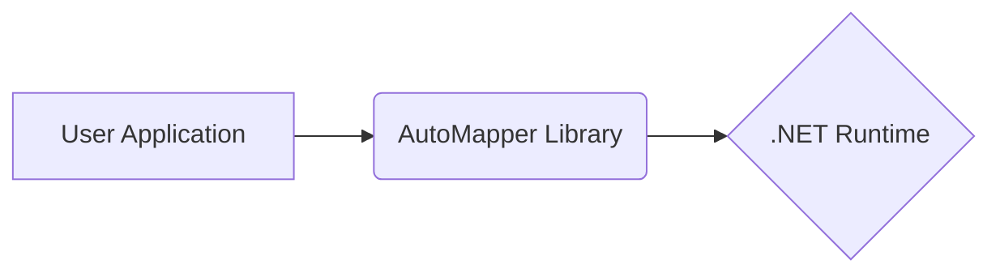
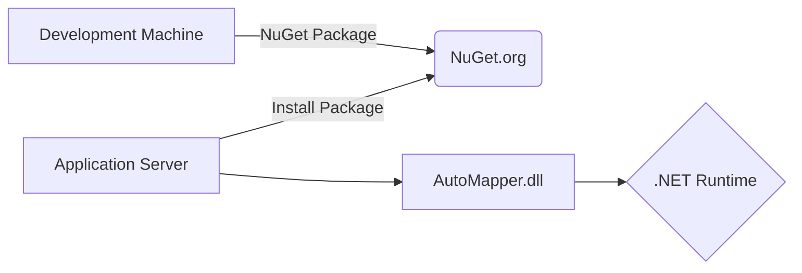

# BUSINESS POSTURE

Business Priorities and Goals:

*   Provide a simple, convention-based object-to-object mapping solution for .NET developers.
*   Reduce the amount of boilerplate code required for mapping between different object types.
*   Improve developer productivity by automating the mapping process.
*   Maintain high performance and efficiency in the mapping process.
*   Provide a flexible and extensible solution that can be customized to meet specific needs.
*   Maintain a large and active community for support and contributions.
*   Ensure the library is well-documented and easy to use.

Business Risks:

*   Incorrect mappings leading to data corruption or unexpected application behavior.
*   Performance bottlenecks in the mapping process, impacting application responsiveness.
*   Security vulnerabilities introduced through custom mapping configurations or extensions.
*   Compatibility issues with different .NET versions or other libraries.
*   Lack of community support or maintainer abandonment, leading to project stagnation.
*   Steep learning curve or complex configuration, hindering adoption.

# SECURITY POSTURE

Existing Security Controls:

*   security control: Code reviews are performed as part of the pull request process (visible in GitHub repository).
*   security control: Static analysis tools are used, as indicated by the presence of analyzers in the project.
*   security control: Tests are implemented to ensure the correctness of the mapping logic (visible in the test projects within the repository).
*   security control: The library itself does not handle sensitive data directly, reducing the attack surface. It operates on user-provided objects.

Accepted Risks:

*   accepted risk: Potential for vulnerabilities in custom value resolvers, formatters, and type converters if not implemented securely by the user.
*   accepted risk: Reflection-based mapping can be susceptible to performance issues if not optimized correctly.
*   accepted risk: Users are responsible for securing the data they are mapping. AutoMapper itself does not provide encryption or data protection mechanisms.

Recommended Security Controls:

*   security control: Implement a security linter to enforce secure coding practices within the AutoMapper codebase.
*   security control: Provide guidance and best practices in the documentation on how to securely implement custom mapping logic (value resolvers, etc.).
*   security control: Consider adding support for sandboxing or isolating custom mapping code to limit the potential impact of vulnerabilities.
*   security control: Regularly audit dependencies for known vulnerabilities.
*   security control: Implement fuzz testing to identify potential edge cases and vulnerabilities in the mapping engine.

Security Requirements:

*   Authentication: Not directly applicable to AutoMapper, as it's a library, not a service. Authentication is the responsibility of the consuming application.
*   Authorization: Not directly applicable to AutoMapper. Authorization is the responsibility of the consuming application.
*   Input Validation: AutoMapper itself does not perform input validation. However, users should validate data *before* mapping to prevent injection vulnerabilities or data corruption. The consuming application is responsible for input validation.
*   Cryptography: Not directly applicable to AutoMapper. If encryption/decryption is needed, it should be handled by the consuming application before/after mapping.
*   Configuration: Secure configuration management is the responsibility of the application using AutoMapper. AutoMapper configuration itself should not contain sensitive information.

# DESIGN

## C4 CONTEXT

Element Descriptions:

*   Element 1
    *   Name: User Application
    *   Type: Software System
    *   Description: The application that utilizes AutoMapper to perform object-to-object mapping.
    *   Responsibilities:
        *   Defines the source and destination object types.
        *   Configures AutoMapper mappings.
        *   Calls AutoMapper to perform the mapping.
        *   Handles input validation and data security.
    *   Security controls:
        *   Input validation.
        *   Authentication and authorization (if applicable).
        *   Secure handling of sensitive data.

*   Element 2
    *   Name: AutoMapper Library
    *   Type: Library
    *   Description: The AutoMapper library that provides object-to-object mapping functionality.
    *   Responsibilities:
        *   Provides an API for configuring and executing mappings.
        *   Uses reflection and code generation to create efficient mapping logic.
        *   Supports custom value resolvers, formatters, and type converters.
    *   Security controls:
        *   Code reviews.
        *   Static analysis.
        *   Unit tests.

*   Element 3
    *   Name: .NET Runtime
    *   Type: Platform
    *   Description: The .NET runtime environment on which AutoMapper and the user application execute.
    *   Responsibilities:
        *   Provides the underlying infrastructure for executing .NET code.
        *   Manages memory and resources.
        *   Provides security features such as code access security (CAS).
    *   Security controls:
        *   .NET security updates and patches.
        *   Code Access Security (CAS) (if enabled).

## C4 CONTAINER

Since AutoMapper is a library, the container diagram is essentially the same as the context diagram. It's a single component within the user's application.

Element Descriptions:

*   Element 1
    *   Name: User Application
    *   Type: Software System
    *   Description: The application that utilizes AutoMapper to perform object-to-object mapping.
    *   Responsibilities:
        *   Defines the source and destination object types.
        *   Configures AutoMapper mappings.
        *   Calls AutoMapper to perform the mapping.
        *   Handles input validation and data security.
    *   Security controls:
        *   Input validation.
        *   Authentication and authorization (if applicable).
        *   Secure handling of sensitive data.

*   Element 2
    *   Name: AutoMapper Library
    *   Type: Library
    *   Description: The AutoMapper library that provides object-to-object mapping functionality.
    *   Responsibilities:
        *   Provides an API for configuring and executing mappings.
        *   Uses reflection and code generation to create efficient mapping logic.
        *   Supports custom value resolvers, formatters, and type converters.
    *   Security controls:
        *   Code reviews.
        *   Static analysis.
        *   Unit tests.

*   Element 3
    *   Name: .NET Runtime
    *   Type: Platform
    *   Description: The .NET runtime environment on which AutoMapper and the user application execute.
    *   Responsibilities:
        *   Provides the underlying infrastructure for executing .NET code.
        *   Manages memory and resources.
        *   Provides security features such as code access security (CAS).
    *   Security controls:
        *   .NET security updates and patches.
        *   Code Access Security (CAS) (if enabled).

## DEPLOYMENT

AutoMapper is a library and is deployed as part of the consuming application. There are several deployment options:

1.  **NuGet Package:** The most common way to include AutoMapper is by adding the NuGet package to the project. The library is then deployed as a DLL alongside the application.
2.  **Project Reference:** The AutoMapper source code can be directly included in the solution and referenced as a project. This allows for easier debugging and modification of the library, but is less common.
3.  **Private NuGet Feed:** Organizations may host their own private NuGet feed for internal libraries, including a customized version of AutoMapper.

We will describe the NuGet Package deployment, as it is the standard method.

Element Descriptions:

*   Element 1
    *   Name: Development Machine
    *   Type: Workstation
    *   Description: The developer's machine where the AutoMapper library is built and packaged.
    *   Responsibilities:
        *   Building the AutoMapper source code.
        *   Creating the NuGet package.
        *   Publishing the package to NuGet.org (or a private feed).
    *   Security controls:
        *   Developer machine security (antivirus, firewall, etc.).
        *   Secure build process.

*   Element 2
    *   Name: NuGet.org
    *   Type: Package Repository
    *   Description: The public NuGet repository where the AutoMapper package is hosted.
    *   Responsibilities:
        *   Storing and serving NuGet packages.
        *   Providing package metadata and versioning.
    *   Security controls:
        *   NuGet.org security measures (HTTPS, access controls, etc.).

*   Element 3
    *   Name: Application Server
    *   Type: Server
    *   Description: The server where the application that uses AutoMapper is deployed.
    *   Responsibilities:
        *   Running the application.
        *   Loading the AutoMapper library.
    *   Security controls:
        *   Server security (operating system hardening, firewall, intrusion detection, etc.).

*   Element 4
    *   Name: AutoMapper.dll
    *   Type: Library
    *   Description: The compiled AutoMapper library file.
    *   Responsibilities:
        *   Providing object-to-object mapping functionality.
    *   Security controls:
        *   Digital signature (if applied).

*   Element 5
    *   Name: .NET Runtime
    *   Type: Platform
    *   Description: The .NET runtime environment.
    *   Responsibilities:
        *   Executing the application and AutoMapper code.
    *   Security controls:
        *   .NET security updates and patches.

## BUILD

The AutoMapper build process is automated using GitHub Actions, as evidenced by the `.github/workflows` directory in the repository.

Build Process Description:

1.  **Developer pushes code:** A developer pushes code changes to the GitHub repository.
2.  **GitHub Actions trigger:** The push triggers a GitHub Actions workflow.
3.  **Checkout Code:** The workflow checks out the source code from the repository.
4.  **Restore Dependencies:** NuGet packages required for building and testing are restored.
5.  **Build Solution:** The AutoMapper solution is built in Release configuration.
6.  **Run Tests:** Unit tests and integration tests are executed.
7.  **Pack NuGet Package:** The AutoMapper library is packaged into a NuGet package.
8.  **Publish Artifacts:** The NuGet package and other build artifacts are published.
9.  **Publish to NuGet/GitHub Packages:** The package is published to NuGet.org and/or GitHub Packages.

Security Controls in Build Process:

*   security control: **Automated Build:** The build process is fully automated, reducing the risk of manual errors and ensuring consistency.
*   security control: **Dependency Management:** NuGet is used for managing dependencies, allowing for tracking and auditing of used libraries.
*   security control: **Static Analysis:** Analyzers are included in the project, performing static analysis during the build to identify potential code quality and security issues.
*   security control: **Testing:** Automated tests are run as part of the build process, ensuring code correctness and helping to prevent regressions.
*   security control: **GitHub Actions Security:** GitHub Actions provides a secure environment for running the build process, with features like secrets management and access controls.

# RISK ASSESSMENT

Critical Business Processes:

*   Object-to-object mapping within applications that rely on AutoMapper. The correctness and performance of these mappings are critical.

Data Sensitivity:

*   AutoMapper itself does not handle sensitive data directly. It operates on user-provided objects. The sensitivity of the data being mapped depends entirely on the consuming application. If the application uses AutoMapper to map objects containing PII, financial data, or other sensitive information, then that data is at risk if the mapping is incorrect or if a vulnerability exists in custom mapping logic.

# QUESTIONS & ASSUMPTIONS

Questions:

*   Are there any specific compliance requirements (e.g., GDPR, HIPAA) that the consuming applications need to adhere to? This would influence the guidance provided on securing custom mapping logic.
*   Are there any performance benchmarks or targets that AutoMapper needs to meet? This would help prioritize performance optimizations.
*   What is the expected level of customization that users will perform? This will help determine the level of detail needed in the documentation regarding secure coding practices for custom resolvers, etc.
*   Are there plans to support any specific security features in the future, such as sandboxing of custom code?

Assumptions:

*   BUSINESS POSTURE: The primary goal is to provide a reliable and performant object mapping solution.
*   BUSINESS POSTURE: The community is active and contributes to the project's maintenance.
*   SECURITY POSTURE: Users are responsible for securing the data they are mapping and for implementing secure custom mapping logic.
*   SECURITY POSTURE: The core AutoMapper library is relatively secure due to code reviews, static analysis, and testing.
*   DESIGN: The deployment model is primarily through NuGet packages.
*   DESIGN: The build process is automated and secure using GitHub Actions.