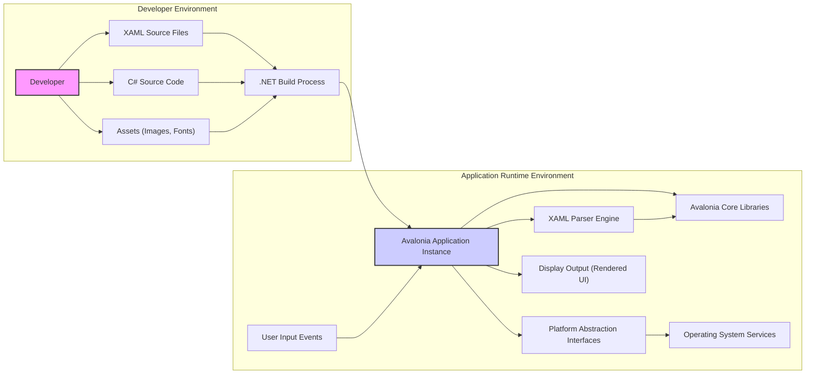

## Project Design Document: Avalonia UI Framework (Improved)

**1. Introduction**

This document provides a detailed architectural overview of the Avalonia UI framework. Its primary purpose is to serve as a comprehensive resource for conducting thorough threat modeling. It outlines the key components, data flows, and technologies integral to the framework's operation. This document is specifically intended for security engineers, developers, and architects involved in assessing and mitigating potential security risks associated with Avalonia-based applications.

**2. System Overview**

Avalonia is a cross-platform, open-source UI framework for building rich desktop, mobile, and web applications using .NET. It enables developers to create user interfaces that run consistently across various operating systems, including Windows, macOS, Linux, iOS, Android, and web browsers (via WebAssembly). Avalonia's architecture is designed around the principles of separation of concerns, providing a clear distinction between the UI definition (using XAML), application logic (using C#), and platform-specific implementations. It aims to provide a developer experience similar to WPF while offering broader platform support.

**3. Key Components**

*   **Core Libraries:** These are the fundamental building blocks of the framework, providing essential UI functionalities:
    *   `Avalonia.Base`: Contains core abstractions, base classes for controls, and foundational services.
    *   `Avalonia.Controls`: Offers a rich set of pre-built UI controls (buttons, text boxes, grids, etc.) that developers can use to construct their applications.
    *   `Avalonia.Layout`: Implements layout algorithms for arranging controls within windows and other containers.
    *   `Avalonia.Rendering`:  Manages the rendering pipeline, responsible for drawing UI elements on the screen using platform-specific graphics APIs. This includes handling the visual tree and drawing primitives.
    *   `Avalonia.Input`: Handles user interactions from various input devices (mouse, keyboard, touch), translating them into events that applications can respond to.
    *   `Avalonia.Styling`: Provides mechanisms for applying styles and themes to UI elements, allowing for customization of appearance and behavior. This includes support for CSS-like styling and data-driven styling.
    *   `Avalonia.Data`: Implements the data binding engine, enabling synchronization of data between UI elements and application logic. This includes support for various binding modes and value converters.
*   **XAML Parser (`Avalonia.Markup.Xaml`):** This component is responsible for parsing and interpreting XAML files. It converts the declarative UI definitions into a runtime object tree that Avalonia can render and interact with. Potential vulnerabilities here could involve the parser being susceptible to malformed XAML, leading to denial-of-service or potentially code execution if custom markup extensions are used unsafely.
*   **Platform Abstraction Layer (`Avalonia.Platform`):** This crucial layer provides abstract interfaces for interacting with platform-specific functionalities. It isolates the core Avalonia framework from the underlying operating system details. Key interfaces include:
    *   Windowing: Managing application windows and their properties.
    *   Input: Receiving input events from the operating system.
    *   Graphics: Interacting with platform-specific graphics APIs (e.g., Direct3D on Windows, Metal on macOS, OpenGL on Linux, Skia for cross-platform rendering).
    *   Threading: Managing threads and synchronization primitives.
    *   FileSystem: Providing access to the file system.
    *   Clipboard: Interacting with the system clipboard.
*   **Application Model (`Avalonia.Application`):** This provides the entry point and lifecycle management for Avalonia applications. It handles application startup, shutdown, and resource management.
*   **Build Tools and Integration:** This encompasses the tools and processes used to build and package Avalonia applications for different platforms. This typically involves the .NET SDK, MSBuild, and potentially platform-specific tools for packaging (e.g., for creating APKs for Android or IPA files for iOS).
*   **Third-Party Libraries and Extensions:** The Avalonia ecosystem benefits from a range of community-developed libraries and extensions that provide additional functionalities, such as charting controls, UI theming libraries, and integration with other services. The security of these third-party components is crucial.

**4. Data Flow Diagram**

**Data Flow Description:**

*   **Development Phase:**
    *   Developers create user interfaces using XAML (`B`).
    *   Developers write application logic in C# (`C`).
    *   Developers incorporate various assets like images and fonts (`D`).
    *   The `.NET Build Process` (`E`) compiles the C# code, parses XAML, and packages the application for the target platform.
*   **Runtime Phase:**
    *   The compiled Avalonia application (`F`) is launched.
    *   The `XAML Parser Engine` (`G`) loads and interprets the XAML files to construct the UI object tree.
    *   The `Avalonia Core Libraries` (`H`) manage the UI elements, layout, data binding, and rendering.
    *   `Platform Abstraction Interfaces` (`I`) facilitate communication with the underlying `Operating System Services` (`J`) for platform-specific operations.
    *   `User Input Events` (`K`) are captured by the operating system and passed to the Avalonia application for processing.
    *   The application renders the user interface to the `Display Output` (`L`).

**5. Technology Stack**

*   **Primary Programming Language:** C# (.NET)
*   **Markup Language:** XAML (Extensible Application Markup Language)
*   **Core Libraries:**  `Avalonia.Base`, `Avalonia.Controls`, `Avalonia.Layout`, `Avalonia.Rendering`, `Avalonia.Input`, `Avalonia.Styling`, `Avalonia.Data`, `Avalonia.Themes.Fluent` (default theme), etc.
*   **Target Platforms and Associated Technologies:**
    *   Windows:  Direct3D, Win32 API
    *   macOS: Metal, AppKit
    *   Linux: X11, Wayland, OpenGL, GTK
    *   iOS: UIKit
    *   Android: Android SDK
    *   WebAssembly: Blazor, Mono WASM
*   **.NET Runtime:**  Requires a compatible .NET runtime environment (e.g., .NET 6, .NET 7).
*   **Build System:**  .NET SDK, MSBuild, potentially platform-specific build tools (e.g., Xcode for iOS, Android Studio for Android).
*   **Graphics Libraries (Internal):**  SkiaSharp (for cross-platform 2D graphics).

**6. Deployment Model**

Avalonia applications can be deployed in several ways, each with its own security considerations:

*   **Desktop Applications (Windows, macOS, Linux):**
    *   Packaged as platform-specific executables or installers (e.g., MSI for Windows, DMG for macOS, DEB/RPM for Linux).
    *   Security considerations include code signing to verify the publisher and ensure integrity, protection against tampering, and managing application permissions.
*   **Mobile Applications (iOS, Android):**
    *   Built and deployed as native mobile applications through platform-specific app stores (Apple App Store, Google Play Store).
    *   Security considerations involve adhering to platform security guidelines, managing permissions requested by the application, and securing local data storage.
*   **Web Applications (via WebAssembly):**
    *   Compiled to WebAssembly and hosted within a web browser.
    *   Security considerations are similar to traditional web applications, including protection against XSS, CSRF, and ensuring secure communication (HTTPS). Browser security features like the Same-Origin Policy and Content Security Policy (CSP) become relevant. The security of the hosting web server is also critical.

**7. Security Considerations (Detailed)**

This section expands on potential security considerations for Avalonia applications, categorized for clarity:

*   **Input Validation and Sanitization:**
    *   **Threat:**  Applications that don't properly validate or sanitize user input (e.g., text entered in text boxes) are vulnerable to injection attacks (e.g., XAML injection if dynamically constructing UI, or script injection in WebAssembly scenarios).
    *   **Mitigation:** Implement robust input validation and sanitization techniques. Avoid dynamically generating XAML based on untrusted input. Utilize parameterized queries or equivalent mechanisms when interacting with data sources.
*   **XAML Security:**
    *   **Threat:**  Malicious XAML could be crafted to exploit vulnerabilities in the XAML parser or to execute unintended code through custom markup extensions.
    *   **Mitigation:**  Avoid loading XAML from untrusted sources. Carefully review and restrict the use of custom markup extensions. Keep the Avalonia framework updated to benefit from parser security fixes.
*   **Dependency Management:**
    *   **Threat:**  Avalonia applications rely on NuGet packages, which may contain known vulnerabilities.
    *   **Mitigation:**  Regularly scan project dependencies for known vulnerabilities using tools like OWASP Dependency-Check or similar. Keep dependencies updated to the latest stable versions. Follow a principle of least privilege when adding dependencies.
*   **Platform-Specific Security:**
    *   **Threat:**  Vulnerabilities in the underlying operating systems or platform APIs could be exploited through the Platform Abstraction Layer.
    *   **Mitigation:**  Stay informed about security advisories for the target platforms. Follow platform-specific security best practices. Minimize the application's reliance on privileged operations.
*   **Data Binding Security:**
    *   **Threat:**  Binding sensitive data directly to UI elements without proper consideration could lead to unintended exposure of information.
    *   **Mitigation:**  Carefully review data binding configurations, especially when dealing with sensitive information. Consider using value converters to mask or transform data displayed in the UI.
*   **Code Signing and Application Integrity:**
    *   **Threat:**  Unsigned or tampered applications can be malicious.
    *   **Mitigation:**  Implement code signing for desktop and mobile deployments to verify the publisher and ensure the application's integrity. Use secure build pipelines to prevent tampering during the build process.
*   **Update Mechanisms:**
    *   **Threat:**  Insecure update mechanisms can be exploited to deliver malicious updates.
    *   **Mitigation:**  Implement secure update mechanisms that verify the authenticity and integrity of updates. Use HTTPS for update downloads.
*   **Third-Party Library Risks:**
    *   **Threat:**  Third-party libraries may contain vulnerabilities or malicious code.
    *   **Mitigation:**  Thoroughly vet third-party libraries before including them in the project. Keep these libraries updated and monitor for security advisories.
*   **WebAssembly Specific Concerns:**
    *   **Threat:**  Standard web security vulnerabilities (XSS, CSRF) are relevant when deploying Avalonia applications via WebAssembly.
    *   **Mitigation:**  Implement standard web security measures, including Content Security Policy (CSP), input sanitization, and secure communication (HTTPS). Be mindful of the security boundaries between the browser environment and the WebAssembly code.
*   **Local Data Storage:**
    *   **Threat:**  Sensitive data stored locally (e.g., in files or databases) can be vulnerable if not properly protected.
    *   **Mitigation:**  Encrypt sensitive data stored locally. Use platform-specific secure storage mechanisms where available. Avoid storing sensitive information unnecessarily.

**8. Assumptions and Constraints**

*   Developers are expected to adhere to secure coding practices and be aware of common security vulnerabilities.
*   The underlying operating systems and .NET runtime are assumed to have their own security mechanisms in place, but applications should not solely rely on these.
*   This document provides a general architectural overview; specific security implementations will vary depending on the application's requirements and context.
*   The security of third-party libraries is the responsibility of their respective developers, but application developers must carefully evaluate and manage the risks associated with their use.

**9. Glossary**

*   **XAML:** Extensible Application Markup Language, a declarative XML-based language used to define user interfaces in Avalonia and other UI frameworks.
*   **WPF:** Windows Presentation Foundation, a UI framework for building Windows desktop applications, serving as a conceptual predecessor to Avalonia.
*   **WebAssembly:** A binary instruction format for a stack-based virtual machine that runs in web browsers, enabling near-native performance for web applications.
*   **NuGet:** A package manager for .NET, used to manage dependencies in Avalonia projects.
*   **CSP:** Content Security Policy, a web browser security mechanism that helps prevent XSS attacks.
*   **CSRF:** Cross-Site Request Forgery, a web security vulnerability that allows an attacker to induce users to perform actions they do not intend to perform.
*   **SkiaSharp:** A 2D graphics library used internally by Avalonia for cross-platform rendering.

This improved design document provides a more detailed and structured overview of the Avalonia UI framework, specifically tailored for threat modeling activities. It highlights key components, data flows, technologies, and potential security considerations to facilitate a comprehensive security assessment.
