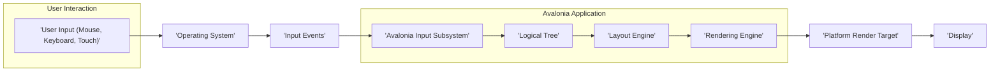
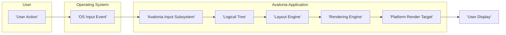

# Project Design Document: Avalonia UI Framework

**Version:** 1.1
**Date:** October 26, 2023
**Author:** AI Software Architect

## 1. Introduction

This document provides an enhanced architectural design of the Avalonia UI framework, an open-source, cross-platform UI framework for .NET. This revised document aims to offer a more detailed and precise understanding of the system's components, their interactions, and the flow of data, specifically tailored for effective threat modeling. The project repository can be found at: https://github.com/avaloniaui/avalonia.

## 2. Goals and Objectives

The primary goal of Avalonia is to empower developers to build truly cross-platform applications with a native look and feel, using a single .NET codebase. Key objectives include:

* **Comprehensive Cross-Platform Reach:**  Targeting a wide range of operating systems, encompassing Windows, macOS, Linux, iOS, Android, and web browsers through WebAssembly, ensuring a consistent development experience.
* **Feature-Rich UI Toolkit:** Providing a robust and extensive set of UI controls, flexible layout mechanisms, powerful data binding capabilities, and comprehensive styling and theming options.
* **Deep Extensibility and Customization:**  Facilitating the extension of the framework through custom controls, pluggable renderers, and platform-specific integrations, allowing developers to tailor Avalonia to their specific needs.
* **Optimized Performance and Responsiveness:** Delivering a smooth and performant user experience across diverse platforms and hardware configurations.
* **Intuitive Developer Experience:** Offering a development workflow that is familiar and productive for .NET developers, leveraging existing skills and tools.

## 3. High-Level Architecture

Avalonia employs a layered architecture, promoting separation of concerns and enhancing modularity. The core components work in concert to manage and render the user interface.

**Description:**

* **User Input:** Represents the various ways a user interacts with the application, including mouse movements and clicks, keyboard input, and touch gestures.
* **Operating System:** The underlying platform (e.g., Windows, macOS, Linux) that provides the foundation for the Avalonia application.
* **Input Events:** Low-level events generated by the operating system in response to user interactions, such as mouse button presses or key presses.
* **Avalonia Input Subsystem:** This component is responsible for processing raw input events from the operating system, translating them into Avalonia-specific input events, and dispatching these events to the appropriate UI elements within the application.
* **Logical Tree:** A hierarchical in-memory representation of the UI elements defined in XAML or programmatically in code. This tree reflects the structure of the user interface.
* **Layout Engine:** This engine calculates the size and position of each UI element within the Logical Tree based on defined layout rules, available screen space, and user preferences.
* **Rendering Engine:** The core component responsible for translating the visual representation of the UI elements into drawing commands. It determines what needs to be drawn and how.
* **Platform Render Target:** An abstraction layer that provides a consistent interface for the Rendering Engine to interact with the specific graphics API of the underlying operating system (e.g., Direct3D on Windows, Metal on macOS, OpenGL or Skia on Linux).
* **Display:** The physical output device (monitor, screen) where the application's rendered user interface is presented to the user.

## 4. Detailed Component Design

This section provides a more in-depth look at the key components within the Avalonia framework, detailing their responsibilities and interactions.

* **Input System:**
    * **Input Managers:** Dedicated modules that handle specific types of input events, such as mouse events, keyboard events, and touch events. They are responsible for interpreting the raw input data.
    * **Event Routing Mechanism:** A sophisticated system that determines the path an input event takes through the Logical Tree to reach the intended UI element. This involves hit-testing to identify the element under the cursor or touch point.
    * **Gesture Recognizers:** Components that identify and interpret complex user gestures, such as swipes, pinches, and rotations, translating them into higher-level application events.

* **Layout System:**
    * **Specialized Layout Managers (e.g., `StackPanel`, `Grid`, `Canvas`):** Implement distinct layout algorithms to arrange child elements. `StackPanel` arranges elements in a line, `Grid` arranges them in rows and columns, and `Canvas` allows absolute positioning.
    * **Precise Measure and Arrange Passes:** The layout process involves two key phases: the "measure" pass where each element determines its desired size, and the "arrange" pass where elements are assigned their final size and position within their parent.
    * **Efficient Invalidation and Update System:** A mechanism that intelligently tracks changes within the UI that necessitate a re-layout. Only affected portions of the UI are re-laid out, optimizing performance.

* **Rendering System:**
    * **Optimized Visual Tree:** A representation of the UI elements that are currently visible and require rendering. This tree is often a subset of the Logical Tree, improving rendering efficiency.
    * **Abstraction through Drawing Context:** Provides a device-independent interface for drawing operations, allowing developers to draw shapes, text, images, and other visuals without needing to know the specifics of the underlying graphics API.
    * **Platform-Specific Renderers:** Implement the actual drawing commands using the target platform's graphics API. This ensures optimal performance and leverages platform-specific capabilities. Examples include Direct3D renderer for Windows and Metal renderer for macOS.
    * **Advanced Effects and Transformations:** Enables the application of visual effects like blurs and shadows, and transformations such as rotation and scaling, to enhance the user interface.

* **Control Library:**
    * **Fundamental Base Control Classes:** Provide the foundational building blocks for creating UI elements. `Control` is the base class for all visual elements, and `ContentControl` allows displaying single pieces of content.
    * **Diverse Set of Common Controls (e.g., `Button`, `TextBox`, `ListBox`):** Pre-built, reusable UI elements with specific functionalities and visual appearances, accelerating development.
    * **Comprehensive Theming and Styling Infrastructure:** Powerful mechanisms for customizing the visual appearance of controls through styles, themes (collections of styles), and control templates (defining the visual structure of a control).

* **Data Binding Engine:**
    * **Robust Binding Engine:** Connects properties of UI elements directly to data sources (e.g., objects, collections, view models), automatically synchronizing data between the UI and the underlying data.
    * **Flexible Value Converters:** Allow transformation of data values during the binding process. For example, converting a date to a specific string format for display.
    * **Efficient Change Notification Mechanisms:** Implements patterns like `INotifyPropertyChanged` to efficiently notify the UI when bound data changes, ensuring the UI stays up-to-date.

* **Platform Abstraction Layer (PAL):**
    * **Unified Windowing Subsystem:** Provides a consistent way to create, manage, and interact with application windows across different operating systems.
    * **Cross-Platform Threading and Synchronization Primitives:** Offers utilities for managing concurrent operations and synchronizing access to shared resources in a platform-independent manner.
    * **Abstracted File System Access:** Provides a consistent API for interacting with the file system, hiding platform-specific differences.
    * **Networking Abstractions:** Offers platform-independent networking capabilities for tasks like making HTTP requests.

* **XAML (Extensible Application Markup Language) Support:**
    * **Powerful XAML Parser:** Reads and interprets XAML markup to instantiate UI elements and establish their properties and relationships.
    * **Extensible Markup Extensions:** Allow developers to extend the XAML syntax for more dynamic and complex scenarios, such as referencing resources or performing data binding.
    * **Seamless Code-Behind Integration:** Enables associating code logic (typically in C#) with UI elements defined in XAML, facilitating event handling and custom behavior.

## 5. Data Flow

This section details the flow of data within the Avalonia framework during typical user interaction and the rendering process.

**Description:**

1. **User Action:** The user initiates an interaction with the application, such as clicking a button, typing text into a field, or using a touch gesture.
2. **OS Input Event:** The operating system detects the user action and generates a corresponding low-level input event.
3. **Avalonia Input Subsystem:** The Avalonia Input Subsystem receives this OS input event.
4. **Logical Tree:** The input subsystem determines the target UI element within the Logical Tree that should handle the event, often through a process called hit-testing.
5. **Layout Engine:** If the event or subsequent actions trigger a change in the UI layout (e.g., resizing a window, changing visibility of an element), the Layout Engine recalculates the positions and sizes of the affected elements.
6. **Rendering Engine:** The Rendering Engine identifies the portions of the UI that need to be redrawn based on changes in the Logical Tree, layout, or data.
7. **Platform Render Target:** The Rendering Engine utilizes the Platform Render Target to translate the drawing instructions into commands that are specific to the underlying graphics API of the operating system.
8. **User Display:** The final rendered output is presented to the user on the display device.

**Data Flow Examples:**

* **Button Click Scenario:** A user clicks a button -> The OS generates a mouse click event -> The Avalonia Input Subsystem routes this event to the specific `Button` control in the Logical Tree -> The `Button`'s click event handler (defined in code-behind or through data binding) is executed, potentially triggering updates to application data or UI state -> The Layout and Rendering engines then update the display to reflect these changes.
* **Text Input Scenario:** A user types characters into a `TextBox` -> The OS generates keyboard events for each key press -> The Avalonia Input Subsystem directs these events to the `TextBox` control -> The `TextBox` updates its internal text content -> If data binding is in place, this change might propagate to the underlying data source -> The Layout and Rendering engines update the display to show the newly entered text.

## 6. Security Considerations (For Threat Modeling)

This section provides a more detailed exploration of potential security considerations relevant for threat modeling the Avalonia UI framework.

* **Input Validation and Sanitization:**
    * **Vulnerability:** Failure to properly validate and sanitize user input can lead to vulnerabilities such as cross-site scripting (XSS) if Avalonia is used in a WebAssembly context, or injection attacks (e.g., SQL injection) if user-provided data is used in backend queries without sanitization.
    * **Considerations:** How does Avalonia provide mechanisms for developers to validate and sanitize user input received through UI elements like `TextBox` or `ComboBox`? Are there built-in encoding functions to prevent XSS? How can developers ensure that data passed to backend systems is safe?

* **Third-Party Dependency Management:**
    * **Vulnerability:** Utilizing vulnerable third-party libraries or components can introduce security risks into Avalonia applications. Attackers could exploit known vulnerabilities in these dependencies.
    * **Considerations:** What are the core dependencies of Avalonia? How are these dependencies managed and updated? Does the project have a process for identifying and mitigating vulnerabilities in its dependencies (e.g., using dependency scanning tools)? How are developers encouraged to manage their own application dependencies securely?

* **Security of Code-Behind Logic:**
    * **Vulnerability:** Security flaws can be introduced in the application's code-behind logic, such as insecure data handling, improper authentication, or authorization bypasses.
    * **Considerations:** Does Avalonia offer any specific security-related APIs or guidelines for developers writing code-behind logic? How can developers be guided to implement secure coding practices within the Avalonia framework? Are there any features to help prevent common vulnerabilities like hardcoding secrets?

* **Rendering Pipeline Security:**
    * **Vulnerability:** Potential vulnerabilities within the rendering pipeline, particularly in platform-specific renderers that interact directly with graphics APIs, could lead to denial-of-service attacks (e.g., by providing malformed rendering instructions) or information disclosure (e.g., through memory corruption).
    * **Considerations:** How robust and secure are the platform renderers? Are there regular security audits or testing of these components? How does Avalonia handle potential errors or exceptions within the rendering pipeline to prevent crashes or security breaches?

* **Data Binding Security Implications:**
    * **Vulnerability:** Improperly configured data binding could inadvertently expose sensitive data to the UI or allow unintended modification of application state if binding is not carefully controlled.
    * **Considerations:** How does Avalonia's data binding mechanism handle sensitive data? Are there options to control the direction of data flow (one-way vs. two-way binding)? How can developers prevent unintended data exposure or modification through data binding?

* **WebAssembly Specific Security (if applicable):**
    * **Vulnerability:** When running in a web browser via WebAssembly, standard web security considerations become paramount, including protection against cross-site scripting (XSS), cross-site request forgery (CSRF), and ensuring adherence to the browser's same-origin policy.
    * **Considerations:** How does Avalonia integrate with the browser's security model when running in WebAssembly? What mechanisms are in place or recommended to prevent XSS and other web-based attacks? How is communication between the WebAssembly application and the hosting web page secured?

* **Platform-Specific Security Considerations:**
    * **Vulnerability:** Security features and potential vulnerabilities differ across operating systems. Applications need to be aware of and address these platform-specific nuances.
    * **Considerations:** How does Avalonia leverage platform-specific security features (e.g., sandboxing on macOS, user account control on Windows)? Are there platform-specific security guidelines or best practices that developers should follow when building Avalonia applications?

* **Application Update Mechanism Security:**
    * **Vulnerability:** If the application implements an auto-update mechanism, vulnerabilities in this process (e.g., insecure download channels, lack of signature verification) could be exploited to deliver malicious updates.
    * **Considerations:** Does Avalonia provide or recommend any specific update mechanisms? If so, how are these mechanisms secured? What best practices should developers follow when implementing their own update mechanisms for Avalonia applications?

* **Permissions and Sandboxing:**
    * **Vulnerability:** Applications might require specific permissions to access system resources (e.g., camera, microphone, file system). Improper handling of permissions or lack of sandboxing can increase the attack surface.
    * **Considerations:** How does Avalonia handle permissions requests on different platforms? Does it encourage or facilitate the use of sandboxing technologies to limit the application's access to system resources?

## 7. Deployment Considerations

Avalonia applications offer flexible deployment options depending on the target platform.

* **Desktop Application Deployment:** Applications are typically packaged as native executables (e.g., `.exe` on Windows, `.app` on macOS, executable binaries on Linux) for distribution.
* **Mobile Application Deployment:** Deployment to iOS and Android devices involves platform-specific packaging (e.g., `.ipa` for iOS, `.apk` for Android) and distribution through app stores or enterprise channels.
* **Web Application Deployment (via WebAssembly):** Avalonia applications can be deployed as part of a standard web application, with the compiled WebAssembly code served to the browser.

**Security Considerations during Deployment:**

* **Robust Code Signing Practices:** Digitally signing application binaries is crucial to ensure the authenticity and integrity of the application, verifying that it hasn't been tampered with.
* **Secure Distribution Channels:** Distributing applications through trusted and secure channels (e.g., official app stores, secure download portals) minimizes the risk of users downloading compromised versions.
* **Adherence to Platform-Specific Security Best Practices:** Following platform-specific security guidelines during the packaging and deployment process is essential (e.g., using appropriate entitlements on macOS and iOS, requesting necessary permissions on Android).

## 8. Technologies Used

* **.NET (C#):** The primary programming language for developing Avalonia applications and the framework itself.
* **XAML:** The declarative markup language used to define the structure and user interface of Avalonia applications.
* **SkiaSharp:** A powerful 2D graphics library that serves as a rendering backend for Avalonia on certain platforms, providing cross-platform graphics capabilities.
* **Platform-Specific Graphics APIs:** Avalonia leverages native graphics APIs like Direct3D (Windows), Metal (macOS, iOS), and OpenGL (Linux, Android) for optimal rendering performance on each platform. WebGL is used for WebAssembly.
* **NuGet Package Management:** NuGet is the standard package manager for the .NET ecosystem and is used to manage dependencies for Avalonia projects and the framework itself.

## 9. Future Considerations

* **Enhanced WebAssembly Capabilities:** Continued improvements to the WebAssembly backend, focusing on performance optimization and feature parity with native platforms.
* **Advanced Accessibility Features:** Further development of accessibility features to ensure Avalonia applications are usable by individuals with disabilities, adhering to accessibility standards.
* **Ongoing Performance Optimizations:** Continuous efforts to improve the rendering and layout performance of Avalonia across all supported platforms.
* **Expansion of the Control Library:** Development of new UI controls and features to provide developers with an even richer set of tools for building user interfaces.

This revised document provides a more detailed and refined architectural overview of the Avalonia UI framework, specifically focusing on aspects relevant to security considerations and threat modeling. This enhanced information will facilitate more effective identification and mitigation of potential security risks.