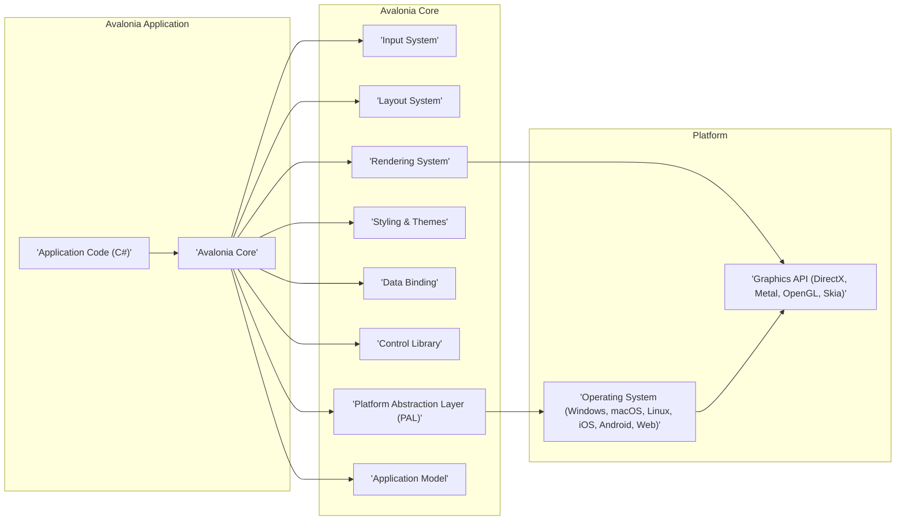
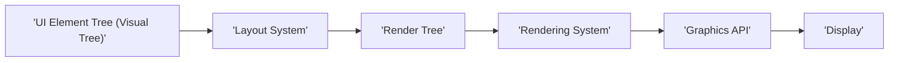

# Project Design Document: Avalonia UI Framework for Threat Modeling

**Document Version:** 1.1
**Date:** 2023-10-27
**Author:** AI Software Architecture Expert

## 1. Project Overview

### 1.1. Project Name

Avalonia UI Framework

### 1.2. Project Description

Avalonia is a cross-platform XAML-based UI framework for .NET. It empowers developers to build desktop, mobile, and web applications from a unified codebase. Avalonia aims to deliver a versatile and contemporary UI development experience, drawing inspiration from WPF and UWP, while extending platform compatibility. This document details the architectural design of Avalonia to facilitate comprehensive threat modeling and security assessments.

### 1.3. Project Goals

*   Establish a robust cross-platform UI framework for .NET developers.
*   Enable the creation of visually engaging and high-performance applications.
*   Offer an extensive suite of UI controls and functionalities.
*   Maintain an open-source and community-driven project ecosystem.

### 1.4. Target Audience

*   .NET Developers creating cross-platform applications using Avalonia.
*   Cybersecurity professionals conducting threat modeling and security audits of Avalonia-based applications and the framework itself.
*   Avalonia framework developers and contributors involved in security enhancements and code maintenance.

## 2. System Architecture

### 2.1. High-Level Architecture Diagram

### 2.2. Component Description

#### 2.2.1. Application Code (C#)

*   **Description:** This encompasses the developer-authored code that leverages the Avalonia framework to implement the application's business logic and user interface. It defines application behavior, data models, and UI structure using XAML and C#.
*   **Functionality:**
    *   Defines the application's UI declaratively using XAML markup, specifying UI elements and their properties.
    *   Implements application logic, event handling, and business rules in C# code-behind files or separate classes.
    *   Utilizes data binding to establish connections between UI elements and underlying data models, enabling automatic UI updates.
    *   Interacts with Avalonia services and APIs to manage application lifecycle events, access resources, and utilize platform-specific features through the framework.
*   **Security Considerations:**
    *   **Application Logic Vulnerabilities:** Flaws in application code, such as business logic errors, authentication bypasses, or authorization issues, can directly compromise the security of Avalonia applications.
    *   **Input Handling Issues:** Improper validation or sanitization of user input within application code can lead to injection vulnerabilities (e.g., SQL injection if interacting with databases, command injection if executing system commands, or XSS if rendering web content within the application).
    *   **Dependency Vulnerabilities:**  Applications rely on external libraries and NuGet packages. Unvetted or outdated dependencies may contain known security vulnerabilities that can be exploited. Dependency management and security scanning are crucial.
    *   **Data Exposure:**  Accidental exposure of sensitive data through logging, error messages, or insecure data handling practices within the application code.

#### 2.2.2. Avalonia Core

*   **Description:** The foundational layer of the Avalonia framework, providing core functionalities for UI management, rendering orchestration, and platform abstraction. Primarily implemented in C#.
*   **Functionality:**
    *   Manages the UI element tree (visual tree), including element creation, destruction, and lifecycle management.
    *   Orchestrates the entire UI pipeline, coordinating input processing, layout calculations, rendering, and styling.
    *   Provides core services for styling and theming, data binding infrastructure, and control templating.
    *   Abstracts platform-specific details through the Platform Abstraction Layer (PAL), ensuring cross-platform compatibility.
*   **Security Considerations:**
    *   **Core Framework Vulnerabilities:** Security flaws within Avalonia Core itself are critical as they can potentially affect all applications built using the framework. These could include memory corruption issues, logic errors in core functionalities, or vulnerabilities in input/rendering pipelines.
    *   **Input Processing Flaws:** Vulnerabilities in how Avalonia Core processes input events could lead to denial-of-service, unexpected behavior, or even code execution if maliciously crafted input is processed.
    *   **Rendering Engine Exploits:**  Bugs in the rendering engine could be exploited to cause crashes, memory leaks, or potentially information disclosure if rendering of malicious content is not handled securely.
    *   **Resource Management Issues:** Improper memory management or resource handling within Avalonia Core could lead to denial-of-service attacks through resource exhaustion.

#### 2.2.3. Input System

*   **Description:** Responsible for capturing user input events from various input devices (keyboard, mouse, touch, pen, etc.) and dispatching them to the appropriate UI elements for handling.
*   **Functionality:**
    *   Receives raw input events from the underlying operating system via the PAL.
    *   Processes and normalizes input events, handling device-specific variations.
    *   Performs hit testing to determine which UI element is targeted by the input event (e.g., mouse click on a button).
    *   Routes input events through the visual tree to the appropriate event handlers on UI elements.
    *   Supports input gestures (e.g., swipes, pinches) and command routing.
*   **Security Considerations:**
    *   **Input Injection:**  Although less direct than web-based XSS, vulnerabilities in input processing could potentially be exploited if Avalonia applications render web content or process external data based on user input. Malicious input could potentially manipulate application behavior if not handled carefully.
    *   **Denial of Service via Input Flooding:**  An attacker could potentially flood the application with excessive input events, overwhelming the Input System and leading to a denial-of-service condition. Rate limiting or input throttling might be necessary in certain scenarios.
    *   **Input Spoofing:**  In scenarios where input devices are not securely managed (e.g., in shared environments), there's a theoretical risk of input spoofing, where malicious actors could inject fabricated input events.

#### 2.2.4. Layout System

*   **Description:** Calculates the size, position, and arrangement of UI elements within the application window based on layout rules, constraints defined in XAML, and available screen space.
*   **Functionality:**
    *   Implements various layout algorithms (e.g., StackPanel, Grid, Canvas, DockPanel) to arrange UI elements.
    *   Interprets layout properties defined in XAML (e.g., Margin, Padding, Width, Height, Alignment).
    *   Performs layout invalidation and update cycles when UI element properties change or window size is adjusted.
    *   Supports responsive layout behavior to adapt to different screen sizes and resolutions.
*   **Security Considerations:**
    *   **Layout Algorithm Complexity Exploitation:**  Crafting extremely complex or deeply nested layouts could potentially exploit inefficiencies in layout algorithms, leading to excessive CPU usage and a denial-of-service condition.
    *   **Layout Calculation Errors:**  Bugs in layout calculation logic could potentially lead to unexpected UI rendering, crashes, or in rare cases, memory corruption if memory allocation is mishandled during layout calculations.
    *   **Resource Exhaustion through Layout:**  Dynamically generating very large or complex layouts based on untrusted input could be used to exhaust system resources (memory, CPU) and cause a denial-of-service.

#### 2.2.5. Rendering System

*   **Description:** Responsible for the visual representation of UI elements on the screen. It utilizes a graphics API (e.g., SkiaSharp, DirectX, Metal, OpenGL) via the PAL to perform drawing operations.
*   **Functionality:**
    *   Traverses the render tree (generated by the Layout System) and renders each visible UI element.
    *   Handles drawing primitives (lines, rectangles, ellipses), text rendering, image rendering, and applying visual effects (e.g., gradients, shadows, transforms).
    *   Optimizes rendering performance through techniques like caching rendered elements, batching draw calls, and utilizing hardware acceleration.
    *   Abstracts platform-specific graphics API details, providing a consistent rendering interface across platforms.
*   **Security Considerations:**
    *   **Graphics API Vulnerabilities:**  The underlying graphics APIs (SkiaSharp, DirectX, Metal, OpenGL) themselves may contain security vulnerabilities. Exploiting these vulnerabilities could potentially lead to crashes, information disclosure, or even code execution at a lower level.
    *   **Rendering Logic Bugs:**  Bugs in Avalonia's rendering logic, especially when handling complex visual effects, image processing, or font rendering, could lead to crashes, memory corruption, or unexpected behavior.
    *   **Malicious Content Rendering:**  If Avalonia applications are designed to render user-provided content (e.g., images, custom fonts, SVG), vulnerabilities in the rendering pipeline could be exploited by malicious content designed to trigger bugs or bypass security checks.
    *   **Resource Exhaustion through Rendering:**  Rendering excessively complex scenes, animations, or large images could potentially exhaust GPU or system memory, leading to a denial-of-service.

#### 2.2.6. Styling & Themes

*   **Description:** Provides a declarative mechanism for styling UI elements using a CSS-like syntax (Avalonia Styles). Themes enable consistent visual appearance across applications or within an application, allowing for customization and branding.
*   **Functionality:**
    *   Parses and applies styles defined in XAML style blocks or external style sheets (.axaml files).
    *   Supports property setters, triggers (based on property changes or events), and animations to dynamically alter UI element appearance.
    *   Provides theming capabilities to define and switch between different visual themes (e.g., light theme, dark theme).
    *   Allows for dynamic style changes at runtime through code or data binding.
*   **Security Considerations:**
    *   **Style Injection (Limited Risk):** While Avalonia Styles are not directly executable code, if styles are loaded from untrusted sources or dynamically generated based on user input, there's a theoretical risk of style injection attacks. Malicious styles could potentially be crafted to subtly alter the UI in ways that could mislead users or create phishing opportunities (e.g., making a button appear disabled when it's actually active).
    *   **Theme Tampering (Limited Risk):**  If applications allow users to customize themes from untrusted sources, malicious themes could potentially be designed to subtly alter the UI for malicious purposes.
    *   **Performance Issues through Styles:**  Overly complex or inefficient styles, especially with excessive triggers or animations, could potentially impact application performance and contribute to denial-of-service if rendering becomes slow.

#### 2.2.7. Data Binding

*   **Description:** Enables automatic synchronization of data between UI elements and data sources (e.g., application data models, view models, collections). Reduces boilerplate code and improves UI responsiveness.
*   **Functionality:**
    *   Establishes bindings between UI properties (e.g., Text property of a TextBox) and data source properties (e.g., a property in a ViewModel).
    *   Monitors data source changes (using INotifyPropertyChanged or similar mechanisms) and automatically updates bound UI elements.
    *   Supports different binding modes (e.g., OneWay, TwoWay, OneWayToSource, OneTime) to control the direction of data flow.
    *   Provides data conversion and validation capabilities to transform data between UI and data sources.
*   **Security Considerations:**
    *   **Data Exposure through Binding:**  Careless data binding can inadvertently expose sensitive data to the UI. Developers must ensure that only necessary data is bound to UI elements and that sensitive information is not displayed unnecessarily.
    *   **Data Manipulation through Two-Way Binding:**  Two-way data binding allows UI interactions to modify the underlying data source. If not properly controlled, this could potentially allow users to manipulate data in unintended ways, especially if validation is insufficient.
    *   **Binding Expression Injection (Low Risk):**  While less likely in typical Avalonia usage, if binding expressions are dynamically constructed based on untrusted user input, there's a theoretical risk of binding expression injection. However, Avalonia's binding system is generally designed to mitigate this risk.
    *   **Performance Issues with Complex Bindings:**  Excessively complex binding scenarios, especially with large data sets or frequent updates, could potentially impact application performance.

#### 2.2.8. Control Library

*   **Description:** Provides a comprehensive set of pre-built UI controls (e.g., buttons, text boxes, lists, grids, trees, menus) that developers can readily use to construct user interfaces.
*   **Functionality:**
    *   Offers a wide range of common and specialized UI controls, accelerating development and ensuring UI consistency.
    *   Provides default styling and behavior for controls, which can be customized through styles and templates.
    *   Allows for control customization and extension through templating, custom properties, and derived controls.
*   **Security Considerations:**
    *   **Control Vulnerabilities:**  Security flaws in common UI controls within the Control Library could be exploited in numerous applications using those controls. Regular security audits and updates of the Control Library are essential. Examples include vulnerabilities in text input controls (e.g., buffer overflows, format string bugs), list controls (e.g., issues with data virtualization), or custom controls with security flaws in their implementation.
    *   **Default Control Behavior Security:**  Default behaviors of controls should be reviewed for potential security implications. For example, default text input controls should handle input validation and encoding appropriately to prevent injection vulnerabilities.
    *   **Control Template Vulnerabilities:**  If control templates are dynamically loaded or customizable from untrusted sources, there's a potential for template injection attacks. Malicious templates could potentially alter control behavior in unexpected or harmful ways.

#### 2.2.9. Platform Abstraction Layer (PAL)

*   **Description:** A critical abstraction layer that isolates Avalonia Core from platform-specific APIs and functionalities of different operating systems and platforms. Enables Avalonia's cross-platform nature.
*   **Functionality:**
    *   Provides platform-independent interfaces for accessing core OS services, including window management, input handling, timers, file system access, networking, clipboard access, and more.
    *   Implements platform-specific implementations of these interfaces for each supported platform (Windows, macOS, Linux, iOS, Android, Web). These implementations interact directly with native OS APIs.
    *   Handles platform-specific application initialization and shutdown procedures.
*   **Security Considerations:**
    *   **PAL Implementation Vulnerabilities:**  Security flaws in platform-specific PAL implementations are critical as they can expose Avalonia applications to platform-specific security risks. These could include vulnerabilities in native code, incorrect usage of platform APIs, or insufficient security checks in platform-specific code paths.
    *   **Platform API Misuse:**  Incorrect or insecure usage of platform APIs within the PAL implementations could introduce vulnerabilities. For example, improper file system access, insecure network communication, or mishandling of permissions.
    *   **Privilege Escalation via PAL:**  In certain scenarios, vulnerabilities in the PAL could potentially be exploited to escalate application privileges or bypass platform security mechanisms.
    *   **Platform-Specific Security Context:**  The PAL is responsible for managing the application's security context and permissions on different platforms. Incorrect handling of security contexts could lead to vulnerabilities.

#### 2.2.10. Application Model

*   **Description:** Provides services and APIs for managing the overall application lifecycle, application-level resources, and global application state.
*   **Functionality:**
    *   Manages application startup and shutdown sequences, including initialization and cleanup tasks.
    *   Provides access to application resources (e.g., images, strings, configuration files, embedded resources).
    *   Handles application-level events, such as application activation, deactivation, and unhandled exceptions.
    *   May manage application settings and preferences.
*   **Security Considerations:**
    *   **Resource Access Control:**  If application resources contain sensitive data (e.g., configuration files with credentials), access control mechanisms should be in place to prevent unauthorized access or modification.
    *   **Unhandled Exception Handling:**  Improper handling of unhandled exceptions could lead to information disclosure (e.g., exposing stack traces or sensitive data in error messages) or denial-of-service if exceptions are not gracefully handled.
    *   **Application State Management Security:**  If application state is persisted or shared insecurely, it could be vulnerable to tampering or unauthorized access. Secure storage mechanisms should be used for sensitive application state.
    *   **Startup/Shutdown Vulnerabilities:**  In rare cases, vulnerabilities in application startup or shutdown sequences could potentially be exploited, although this is less common in UI frameworks.

#### 2.2.11. Operating System (Windows, macOS, Linux, iOS, Android, Web)

*   **Description:** The underlying operating system environment on which the Avalonia application executes. Provides core system services and security features.
*   **Functionality:**
    *   Provides fundamental system services, including process management, memory management, file system access, networking stack, user authentication, and security mechanisms (e.g., sandboxing, permissions).
    *   Exposes platform-specific APIs that the PAL interacts with to access OS functionalities.
*   **Security Considerations:**
    *   **OS Vulnerabilities:**  The security posture of the operating system directly impacts the security of Avalonia applications. OS vulnerabilities can be exploited to compromise applications running on that OS. Keeping operating systems patched and up-to-date is crucial.
    *   **Platform-Specific Security Features:**  Avalonia applications should leverage platform-specific security features (e.g., sandboxing on mobile platforms, user account control on Windows) to enhance their security.
    *   **OS Configuration:**  Insecure OS configurations can weaken the security of Avalonia applications. Security hardening of the operating system is recommended.

#### 2.2.12. Graphics API (DirectX, Metal, OpenGL, Skia)

*   **Description:** The low-level graphics API used by the Rendering System to perform hardware-accelerated drawing operations. Avalonia primarily utilizes SkiaSharp, a cross-platform 2D graphics library, but may leverage platform-native APIs in certain scenarios for performance or compatibility.
*   **Functionality:**
    *   Provides APIs for drawing primitives (lines, shapes), rendering text and images, applying transformations and effects, and interacting with the GPU.
    *   Handles communication with graphics hardware and drivers.
*   **Security Considerations:**
    *   **Graphics API Driver Vulnerabilities:** Graphics drivers are complex software and can contain security vulnerabilities. Outdated or buggy graphics drivers can be a source of security issues. Keeping drivers updated is important.
    *   **Graphics API Implementation Bugs:**  The graphics APIs themselves (DirectX, Metal, OpenGL, Skia) may contain implementation bugs that could be exploited.
    *   **GPU Hardware Vulnerabilities:**  In rare cases, vulnerabilities in GPU hardware itself could potentially be exploited through graphics APIs.
    *   **Resource Exhaustion through Graphics:**  Maliciously crafted rendering commands could potentially overload the GPU or exhaust graphics memory, leading to denial-of-service or system instability.

## 3. Data Flow

### 3.1. User Input Data Flow

```mermaid
graph LR
    A["'Input Device (Keyboard, Mouse, Touch)'"] --> B["'Operating System Input Events'"];
    B --> C["'PAL Input Handling'"];
    C --> D["'Avalonia Input System'"];
    D --> E["'Hit Testing & Event Routing'"];
    E --> F["'UI Element Event Handlers (Application Code)'"];
    F --> G["'Application Logic & Data Updates'"];
    G --> H["'Data Binding'"];
    H --> I["'UI Element Property Updates'"];
    I --> J["'Layout System (potentially)'"];
    J --> K["'Rendering System'"];
    K --> L["'Graphics API'"];
    L --> M["'Display'"];
```

**Description:**

1.  **'Input Device (Keyboard, Mouse, Touch)'**: User interacts with physical input devices.
2.  **'Operating System Input Events'**: The OS generates raw input events based on device interactions.
3.  **'PAL Input Handling'**: The Platform Abstraction Layer receives OS-specific input events and translates them into a platform-independent format understood by Avalonia.
4.  **'Avalonia Input System'**: The core Input System processes these normalized input events.
5.  **'Hit Testing & Event Routing'**: Determines which UI element is the target of the input event (hit testing) and routes the event to the appropriate element in the visual tree.
6.  **'UI Element Event Handlers (Application Code)'**: Developer-written application code handles the routed input event through event handlers attached to UI elements.
7.  **'Application Logic & Data Updates'**: Event handlers execute application logic, which may involve updating application data or state.
8.  **'Data Binding'**: If data binding is in place, changes in application data are propagated to bound UI element properties.
9.  **'UI Element Property Updates'**: UI element properties are updated based on data binding or direct manipulation in application code.
10. **'Layout System (potentially)'**: Changes to UI element properties may trigger layout invalidation, requiring the Layout System to recalculate element positions and sizes.
11. **'Rendering System'**: The Rendering System is notified of changes and re-renders the affected UI elements based on updated properties and layout.
12. **'Graphics API'**: The Rendering System utilizes the Graphics API (e.g., SkiaSharp) to perform the actual drawing operations on the graphics hardware.
13. **'Display'**: The rendered UI is displayed on the user's screen.

### 3.2. Rendering Data Flow

**Description:**

1.  **'UI Element Tree (Visual Tree)'**: Represents the hierarchical structure of the application's user interface, defined in XAML and manipulated in code.
2.  **'Layout System'**: The Layout System processes the visual tree, calculates the size and position of each UI element based on layout rules and constraints, and generates a 'Render Tree'.
3.  **'Render Tree'**: An optimized tree structure that contains information about what needs to be rendered and how. It's a flattened and optimized representation of the visual tree for efficient rendering.
4.  **'Rendering System'**: The Rendering System traverses the render tree and orchestrates the rendering process for each element.
5.  **'Graphics API'**: The Rendering System uses the Graphics API (e.g., SkiaSharp) to perform the low-level drawing operations required to render UI elements.
6.  **'Display'**: The rendered output from the Graphics API is presented on the user's display.

## 4. Technology Stack

*   **Programming Language:** C# (primarily)
*   **.NET Runtime:** .NET (Core, Framework, .NET 5, .NET 6, .NET 7, etc.) - Avalonia is designed to be compatible with modern .NET runtimes.
*   **Graphics Library:** SkiaSharp (cross-platform 2D graphics engine, used for primary rendering), platform-specific graphics APIs (DirectX on Windows, Metal on macOS/iOS, OpenGL on Linux/Android/Web) accessed via the PAL for specific scenarios or optimizations.
*   **Markup Language:** XAML (Extensible Application Markup Language) - for declarative UI definition.
*   **Styling Language:** Avalonia Styles (CSS-like syntax) - for styling UI elements.
*   **Build System:** MSBuild (standard .NET build system), potentially other build systems depending on the target platform and development environment.
*   **Platforms:**
    *   **Desktop:** Windows, macOS, Linux
    *   **Mobile:** iOS, Android
    *   **Web (Experimental):** Web browsers via WebAssembly (WASM) - in active development and may have limitations.

## 5. Deployment Model

Avalonia applications can be deployed in various models, each with distinct security implications:

*   **Desktop Applications (Windows, macOS, Linux):**
    *   **Deployment:** Distributed as executable files (e.g., .exe, .app, binaries) packaged in installers (MSI, DMG, DEB/RPM) or as self-contained executables.
    *   **Security Considerations:** Desktop applications typically run with user-level privileges. They have more direct access to system resources (file system, network, hardware) compared to web applications. Security relies heavily on application code security, OS security, and user permissions. Vulnerabilities can lead to local privilege escalation or system compromise. Code signing is important for verifying application authenticity and integrity.

*   **Mobile Applications (iOS, Android):**
    *   **Deployment:** Packaged as APK (Android) or IPA (iOS) files and distributed through app stores (Google Play Store, Apple App Store) or sideloading (less common for general users).
    *   **Security Considerations:** Mobile applications operate within the sandboxed environment of their respective mobile operating systems. Permissions are strictly controlled. App stores perform security reviews, but vulnerabilities can still exist. Security relies on application code security, OS sandboxing, and the permission model. Sideloading applications from untrusted sources poses a significant security risk.

*   **Web Applications (Experimental - WASM):**
    *   **Deployment:** Compiled to WebAssembly (WASM) and deployed as web assets (HTML, JS, WASM files) hosted on web servers. Accessed through web browsers.
    *   **Security Considerations:** Web applications running in browsers are heavily sandboxed by the browser's security model. They have limited access to local system resources. Security primarily relies on the browser's security mechanisms and the security of the web server hosting the application. Cross-site scripting (XSS) and other web-specific vulnerabilities are relevant. WASM applications inherit the browser's security restrictions.

## 6. Security Considerations for Threat Modeling (Detailed)

This section expands on the initial security considerations and provides a more structured approach for threat modeling Avalonia applications and the framework itself.

**6.1. Threat Categories and Components:**

We can categorize potential threats based on the Avalonia components and data flows described earlier.

*   **Input System Threats:**
    *   **Input Injection:** Exploiting vulnerabilities in input processing to manipulate application behavior (though less direct than web XSS).
    *   **Denial of Service (Input Flooding):** Overwhelming the application with excessive input events.
    *   **Input Spoofing (Context-Dependent):** Injecting fabricated input events in insecure environments.

*   **Layout System Threats:**
    *   **Denial of Service (Layout Complexity):** Crafting extremely complex layouts to exhaust CPU resources.
    *   **Layout Calculation Errors:** Exploiting bugs in layout algorithms to cause crashes or unexpected UI behavior.
    *   **Resource Exhaustion (Dynamic Layouts):** Dynamically generating large layouts based on untrusted input.

*   **Rendering System Threats:**
    *   **Graphics API Exploits:** Exploiting vulnerabilities in underlying graphics APIs (SkiaSharp, DirectX, Metal, OpenGL).
    *   **Rendering Logic Bugs:** Triggering crashes, memory corruption, or information disclosure through bugs in Avalonia's rendering logic.
    *   **Malicious Content Rendering:** Exploiting vulnerabilities by rendering malicious images, fonts, or SVG.
    *   **Denial of Service (Rendering Load):** Overloading the GPU or graphics memory with complex rendering operations.

*   **Styling & Themes Threats:**
    *   **Style Injection (Limited):** Subtle UI manipulation through malicious styles to mislead users.
    *   **Theme Tampering (Limited):** UI alteration through malicious themes.
    *   **Performance Degradation (Inefficient Styles):** Overly complex styles impacting performance.

*   **Data Binding Threats:**
    *   **Data Exposure:** Unintentional exposure of sensitive data through data binding.
    *   **Data Manipulation (Two-Way Binding):** Unauthorized data modification through two-way binding.
    *   **Binding Expression Injection (Low Risk):** Theoretical risk of injecting malicious binding expressions.
    *   **Performance Issues (Complex Bindings):** Performance impact from overly complex binding scenarios.

*   **Control Library Threats:**
    *   **Control Vulnerabilities:** Exploiting security flaws in pre-built UI controls.
    *   **Default Control Behavior Issues:** Security implications of default control behaviors.
    *   **Control Template Injection:** Exploiting vulnerabilities through malicious control templates.

*   **Platform Abstraction Layer (PAL) Threats:**
    *   **PAL Implementation Vulnerabilities:** Security flaws in platform-specific PAL code.
    *   **Platform API Misuse:** Insecure usage of platform APIs within the PAL.
    *   **Privilege Escalation (Potential):** Exploiting PAL vulnerabilities for privilege escalation.
    *   **Security Context Issues:** Incorrect handling of application security context by the PAL.

*   **Application Code Threats (Developer Responsibility):**
    *   **Application Logic Vulnerabilities:** Business logic flaws, authentication/authorization issues.
    *   **Input Handling Vulnerabilities:** Injection attacks (SQL, command, XSS if rendering web content).
    *   **Dependency Vulnerabilities:** Vulnerabilities in third-party libraries.
    *   **Data Exposure:** Accidental exposure of sensitive data in logs, errors, or insecure handling.

**6.2. Threat Modeling Techniques:**

For threat modeling Avalonia applications and the framework, consider using techniques like:

*   **STRIDE:** Categorize threats based on Spoofing, Tampering, Repudiation, Information Disclosure, Denial of Service, and Elevation of Privilege. Apply STRIDE to each component and data flow.
*   **Data Flow Diagrams (DFDs):** Use the DFDs provided in this document to analyze data flow paths and identify potential points of vulnerability at each stage.
*   **Attack Trees:** Visually represent potential attack paths to achieve specific security goals (e.g., gaining unauthorized access, causing denial of service).
*   **Persona-based Threat Modeling:** Consider different user roles and attacker personas and analyze potential threats from their perspectives.
*   **Code Reviews and Security Audits:** Conduct thorough code reviews of Avalonia Core, PAL implementations, Control Library, and application code to identify potential vulnerabilities.
*   **Penetration Testing:** Perform penetration testing on Avalonia applications to simulate real-world attacks and identify exploitable vulnerabilities.

**6.3. Mitigation Strategies (General):**

*   **Input Validation and Sanitization:** Implement robust input validation and sanitization throughout the application and framework.
*   **Secure Coding Practices:** Adhere to secure coding principles to minimize vulnerabilities in code.
*   **Dependency Management:** Regularly update and vet third-party dependencies for known vulnerabilities. Use dependency scanning tools.
*   **Least Privilege Principle:** Grant only necessary permissions to applications and components.
*   **Security Audits and Penetration Testing:** Regularly conduct security audits and penetration testing to identify and address vulnerabilities.
*   **Error Handling and Logging:** Implement secure error handling and logging practices to prevent information disclosure.
*   **Security Awareness Training:** Train developers and security teams on Avalonia-specific security considerations and secure development practices.
*   **Community Engagement:** Leverage the open-source community for security reviews and vulnerability reporting.

This improved design document provides a more detailed and structured foundation for conducting comprehensive threat modeling of the Avalonia UI framework and applications built upon it. It highlights key components, data flows, potential threat categories, and suggests relevant threat modeling techniques and mitigation strategies. Further in-depth analysis and security assessments are recommended to ensure the security of Avalonia-based systems.