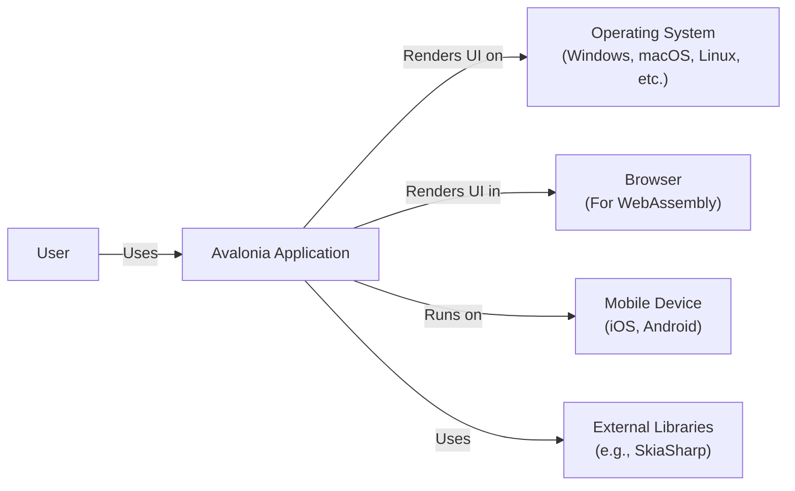
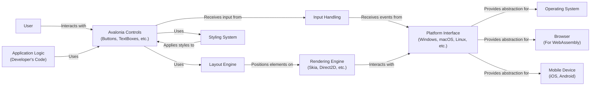
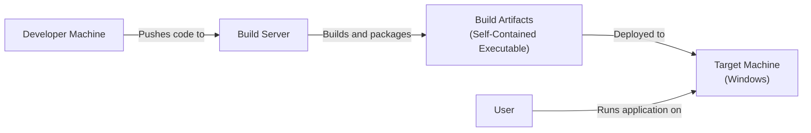
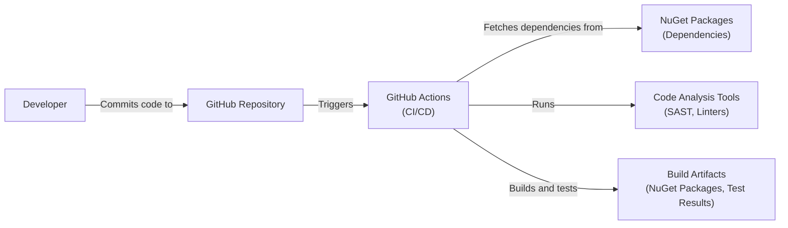

Okay, let's create a design document for the Avalonia UI project, focusing on aspects relevant for threat modeling.

# BUSINESS POSTURE

Avalonia is a cross-platform UI framework, aiming to provide a productive way to build beautiful, modern user interfaces.  It's open-source and competes with other UI frameworks like .NET MAUI, Flutter, and React Native.

Priorities and Goals:

-   Provide a robust and reliable cross-platform UI framework.
-   Attract and retain a large community of developers.
-   Maintain a high level of code quality and security.
-   Enable developers to build applications for a wide range of platforms (Windows, macOS, Linux, WebAssembly, iOS, Android).
-   Offer a flexible and extensible architecture.

Most Important Business Risks:

-   Security vulnerabilities in the framework could lead to exploits in applications built with Avalonia, damaging the reputation and adoption of the framework.
-   Lack of adoption by developers due to perceived complexity, performance issues, or lack of features.
-   Inability to keep up with the evolving landscape of UI technologies and platform requirements.
-   Legal issues related to licensing or intellectual property.
-   Supply chain attacks that compromise the integrity of the framework or its dependencies.

# SECURITY POSTURE

Existing Security Controls:

-   security control: Code reviews: Pull requests are used for code changes, implying a code review process. (Described in contributing guidelines and pull request process on GitHub).
-   security control: Static analysis: Some static analysis tools are used, as evidenced by mentions in the repository and CI workflows. (Visible in GitHub Actions workflows).
-   security control: Issue tracking: Security vulnerabilities can be reported and tracked via GitHub Issues. (Publicly visible on GitHub).
-   security control: Dependency management: Dependencies are managed using NuGet, which provides some level of version control and tracking. (Visible in project files).
-   security control: Open Source: Open source nature of project allows for community scrutiny and contributions to security.

Accepted Risks:

-   accepted risk: The framework relies on third-party dependencies, which may introduce vulnerabilities.  Mitigation is attempted through dependency management and updates, but the risk is not eliminated.
-   accepted risk: Cross-platform compatibility introduces complexity, increasing the potential attack surface.  This is inherent to the nature of the project.
-   accepted risk: The framework may not be fully hardened against all possible UI-specific attacks (e.g., input validation issues in custom controls). This is partially mitigated by providing guidance and best practices, but ultimate responsibility lies with application developers.

Recommended Security Controls:

-   Implement a comprehensive fuzzing strategy to test various components of the framework, especially input handling and rendering.
-   Integrate more advanced static analysis tools (e.g., SAST) into the CI/CD pipeline, specifically configured for UI-related vulnerabilities.
-   Establish a formal security vulnerability disclosure program with clear guidelines and response procedures.
-   Conduct regular security audits and penetration testing, performed by internal or external experts.
-   Implement Software Bill of Materials (SBOM) generation to improve supply chain security visibility.
-   Implement regular dynamic application security testing (DAST) of example applications.

Security Requirements:

-   Authentication: Avalonia itself does not handle authentication. This is the responsibility of the application developer using the framework.
-   Authorization: Similar to authentication, authorization is the responsibility of the application developer. Avalonia provides mechanisms for UI elements to be enabled/disabled or visible/hidden based on application logic, but it doesn't enforce authorization policies.
-   Input Validation: Avalonia provides some basic input validation mechanisms (e.g., text box input masks), but comprehensive input validation is crucial for application developers to implement. This includes validating data types, lengths, formats, and preventing injection attacks.
-   Cryptography: Avalonia does not directly handle cryptographic operations.  If applications built with Avalonia require cryptography, developers must use appropriate libraries and follow best practices. Avalonia should not introduce any restrictions that prevent secure cryptographic practices.

# DESIGN

## C4 CONTEXT

Context Diagram Element Descriptions:

-   Element:
    -   Name: User
    -   Type: Person
    -   Description: A person interacting with an application built using Avalonia.
    -   Responsibilities: Interacts with the application's UI.
    -   Security controls: N/A (External to the system)

-   Element:
    -   Name: Avalonia Application
    -   Type: Software System
    -   Description: An application built using the Avalonia UI framework.
    -   Responsibilities: Provides application-specific functionality and UI.
    -   Security controls: Input validation, output encoding, application-level security logic.

-   Element:
    -   Name: Operating System
    -   Type: Software System
    -   Description: The underlying operating system (Windows, macOS, Linux, etc.).
    -   Responsibilities: Provides the platform for the Avalonia application to run.
    -   Security controls: OS-level security features (e.g., sandboxing, permissions).

-   Element:
    -   Name: Browser
    -   Type: Software System
    -   Description: A web browser (for WebAssembly deployments).
    -   Responsibilities: Hosts and executes the Avalonia application in a WebAssembly environment.
    -   Security controls: Browser security features (e.g., sandboxing, same-origin policy).

-   Element:
    -   Name: MobileDevice
    -   Type: Device
    -   Description: Mobile device, iOS or Android.
    -   Responsibilities: Hosts and executes the Avalonia application.
    -   Security controls: OS-level security features (e.g., sandboxing, permissions).

-   Element:
    -   Name: External Libraries
    -   Type: Software System
    -   Description: External libraries used by Avalonia (e.g., SkiaSharp for rendering).
    -   Responsibilities: Provide specific functionalities (e.g., graphics rendering, platform integration).
    -   Security controls: Dependent on the security of the external libraries themselves.

## C4 CONTAINER

Container Diagram Element Descriptions:

-   Element:
    -   Name: User
    -   Type: Person
    -   Description: A person interacting with the application.
    -   Responsibilities: Interacts with the application's UI.
    -   Security controls: N/A (External to the system)

-   Element:
    -   Name: Rendering Engine
    -   Type: Container
    -   Description: Handles the actual drawing of UI elements.  May use Skia, Direct2D, or other rendering backends.
    -   Responsibilities: Renders UI elements to the screen.
    -   Security controls: Protection against buffer overflows, integer overflows, and other rendering-related vulnerabilities.

-   Element:
    -   Name: Platform Interface
    -   Type: Container
    -   Description: Provides an abstraction layer for interacting with the underlying operating system or platform.
    -   Responsibilities: Handles platform-specific events, window management, and other low-level operations.
    -   Security controls: Secure handling of platform-specific APIs, prevention of privilege escalation.

-   Element:
    -   Name: Application Logic
    -   Type: Container
    -   Description: The developer's code that defines the application's behavior and functionality.
    -   Responsibilities: Implements the application's core logic.
    -   Security controls: Input validation, output encoding, secure coding practices, application-specific security logic.

-   Element:
    -   Name: Avalonia Controls
    -   Type: Container
    -   Description: The set of UI controls provided by Avalonia (buttons, text boxes, etc.).
    -   Responsibilities: Provides the building blocks for creating user interfaces.
    -   Security controls: Input validation (where applicable), secure handling of user input, protection against XSS (in controls that display user-provided content).

-   Element:
    -   Name: Layout Engine
    -   Type: Container
    -   Description: Responsible for arranging UI elements on the screen.
    -   Responsibilities: Calculates the size and position of UI elements.
    -   Security controls: Protection against layout-related vulnerabilities (e.g., integer overflows in layout calculations).

-   Element:
    -   Name: Input Handling
    -   Type: Container
    -   Description: Processes user input events (keyboard, mouse, touch).
    -   Responsibilities: Receives input events from the platform interface and dispatches them to the appropriate controls.
    -   Security controls: Secure handling of input events, prevention of event injection attacks.

-   Element:
    -   Name: Styling System
    -   Type: Container
    -   Description: Manages the visual appearance of UI elements.
    -   Responsibilities: Applies styles and themes to UI controls.
    -   Security controls: Secure handling of style definitions, prevention of style injection attacks.

-   Element:
    -   Name: Operating System
    -   Type: Software System
    -   Description: The underlying operating system.
    -   Responsibilities: Provides the platform for the application to run.
    -   Security controls: OS-level security features.

-   Element:
    -   Name: Browser
    -   Type: Software System
    -   Description: A web browser (for WebAssembly deployments).
    -   Responsibilities: Hosts and executes the application in a WebAssembly environment.
    -   Security controls: Browser security features.

-   Element:
    -   Name: MobileDevice
    -   Type: Device
    -   Description: Mobile device, iOS or Android.
    -   Responsibilities: Hosts and executes the Avalonia application.
    -   Security controls: OS-level security features (e.g., sandboxing, permissions).

## DEPLOYMENT

Avalonia applications can be deployed in several ways, depending on the target platform:

1.  **Desktop Applications (Windows, macOS, Linux):**
    -   Self-contained executables: The application is packaged with all its dependencies, including the .NET runtime.
    -   Framework-dependent executables: The application requires the .NET runtime to be installed on the target machine.
    -   Installation packages: The application is packaged using platform-specific installers (e.g., MSI on Windows, DMG on macOS).

2.  **WebAssembly (Browser):**
    -   The application is compiled to WebAssembly and deployed to a web server.  The browser downloads and executes the WebAssembly code.

3.  **Mobile Applications (iOS, Android):**
    -   The application is packaged as a native mobile app (e.g., IPA for iOS, APK for Android).

Let's describe the deployment for a self-contained desktop application on Windows:

Deployment Diagram Element Descriptions:

-   Element:
    -   Name: Developer Machine
    -   Type: Device
    -   Description: The developer's workstation.
    -   Responsibilities: Code development, testing, and pushing changes to the build server.
    -   Security controls: Secure development environment, code signing.

-   Element:
    -   Name: Build Server
    -   Type: Server
    -   Description: A server that builds and packages the application.
    -   Responsibilities: Compiles the code, runs tests, creates the self-contained executable.
    -   Security controls: Secure build environment, access controls, build process integrity checks.

-   Element:
    -   Name: Build Artifacts
    -   Type: File
    -   Description: The self-contained executable and any associated files.
    -   Responsibilities: Represents the deployable application.
    -   Security controls: Code signing, integrity checks.

-   Element:
    -   Name: Target Machine
    -   Type: Device
    -   Description: The user's machine where the application will run.
    -   Responsibilities: Runs the application.
    -   Security controls: OS-level security features, antivirus software.

-   Element:
    -   Name: User
    -   Type: Person
    -   Description: The person running the application.
    -   Responsibilities: Interacts with the application.
    -   Security controls: N/A (External to the system)

## BUILD

The Avalonia build process involves multiple steps, from compiling the source code to creating platform-specific packages. GitHub Actions is used for CI/CD.

Build Process Security Controls:

-   security control: GitHub Actions: Uses GitHub Actions for automated builds and testing, providing a consistent and reproducible build environment.
-   security control: Dependency Management: Uses NuGet for dependency management, allowing for version pinning and auditing of dependencies.
-   security control: Static Analysis: Integrates static analysis tools (e.g., linters, SAST) into the build process to identify potential code quality and security issues.
-   security control: Code Signing: Build artifacts (NuGet packages) should be code-signed to ensure their integrity and authenticity. (This is a recommended control, not explicitly mentioned in the repository).
-   security control: Supply Chain Security: Regularly review and update dependencies to mitigate the risk of supply chain attacks. Use tools like Dependabot to automate this process. (Partially implemented via Dependabot).

# RISK ASSESSMENT

Critical Business Processes:

-   Software Development: The process of developing, maintaining, and releasing the Avalonia framework.
-   Community Engagement: Building and maintaining a strong community of developers and contributors.
-   Reputation Management: Maintaining a positive reputation for the framework's quality, security, and reliability.

Data to Protect:

-   Source Code: High sensitivity. Unauthorized modification or disclosure could lead to vulnerabilities or intellectual property theft.
-   User Data (Indirectly): While Avalonia itself doesn't directly handle user data, applications built with it *do*. Therefore, the framework must be designed to facilitate secure handling of user data by application developers. Sensitivity varies depending on the application.
-   Contributor Information: Low sensitivity. Basic information about contributors (e.g., GitHub usernames).
-   Issue Tracking Data: Medium sensitivity. Information about reported vulnerabilities should be handled responsibly.

# QUESTIONS & ASSUMPTIONS

Questions:

-   What is the specific threat model used (if any) during the development of Avalonia?
-   Are there any plans to implement a formal bug bounty program?
-   What is the process for handling security vulnerabilities reported by external researchers?
-   Are there any specific security certifications or compliance requirements that Avalonia aims to meet?
-   What level of support is provided for developers building secure applications with Avalonia (e.g., documentation, security guidelines, sample code)?

Assumptions:

-   BUSINESS POSTURE: The Avalonia project prioritizes security, but as an open-source project, resources may be limited.
-   SECURITY POSTURE: The existing security controls are implemented as described in the repository and associated documentation.
-   DESIGN: The design diagrams accurately reflect the high-level architecture of the Avalonia framework. The deployment and build processes are representative of common practices, but specific configurations may vary.
-   The development team is responsive to security concerns and actively works to address vulnerabilities.
-   Application developers using Avalonia are responsible for implementing application-specific security measures.