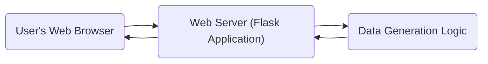
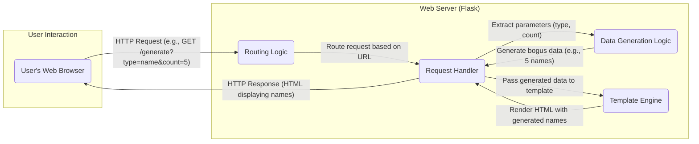
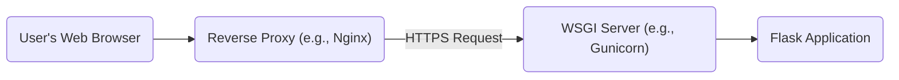

# Project Design Document: Bogus Data Generator

**Document Version:** 1.1
**Date:** October 26, 2023
**Prepared By:** Gemini (AI Language Model)

## 1. Introduction

This document provides a detailed design for the "bogus" project, a simple web application that generates fake data. This document serves as a foundation for understanding the system's architecture, components, and data flow, which will be crucial for subsequent threat modeling activities. The design is based on the publicly available source code found at: https://github.com/bchavez/bogus. This revision aims to provide greater clarity and detail compared to the initial version.

## 2. Goals

*   Clearly outline the architecture and components of the "bogus" application, providing more specific details about their responsibilities.
*   Describe the data flow within the application with enhanced precision.
*   Identify key interactions and dependencies between components, elaborating on the nature of these interactions.
*   Provide a robust basis for identifying potential security threats and vulnerabilities, offering more concrete examples.

## 3. Project Overview

The "bogus" project is a web application built using Python and the Flask framework. It offers a user interface for generating various types of fake data, such as names, addresses, and dates. The application follows a standard web application structure, likely incorporating routing, request handling, and template rendering.

## 4. System Architecture

The application employs a structure common to web applications built with Flask, separating concerns into presentation (frontend) and logic (backend).

### 4.1. High-Level Architecture Diagram

### 4.2. Component Descriptions

*   **User's Web Browser:** The client-side interface used by users to access and interact with the application. It interprets and renders HTML, CSS, and potentially executes JavaScript received from the server.
*   **Web Server (Flask Application):** The core of the application, responsible for:
    *   Receiving and interpreting HTTP requests from the user's browser.
    *   Routing requests to the appropriate handler functions based on the URL.
    *   Processing user input submitted through forms or URL parameters.
    *   Orchestrating the data generation process by invoking the "Data Generation Logic" component.
    *   Rendering HTML responses using a templating engine, embedding the generated data.
    *   Managing the application's state and configuration.
*   **Data Generation Logic:** A set of modules or functions responsible for the actual generation of fake data. This component likely contains:
    *   Specific functions for generating different data types (e.g., `generate_name()`, `generate_address()`).
    *   Potentially utilizes external libraries (e.g., `Faker`) to provide a wide range of realistic fake data.
    *   Logic to handle different generation options or parameters specified by the user.

## 5. Detailed Design

### 5.1. Components and Interactions

*   **Frontend (HTML/CSS/JavaScript):**
    *   **Purpose:** Presents the user interface for interacting with the data generator.
    *   **Functionality:**
        *   Displays forms with input fields for users to select data types and specify generation options (e.g., number of records).
        *   Handles user interactions, such as button clicks and form submissions.
        *   Sends HTTP requests (typically GET or POST) to the backend to initiate data generation.
        *   Receives the generated data from the backend in the HTTP response.
        *   Dynamically updates the user interface to display the generated data.
        *   May include client-side validation to improve user experience.
*   **Backend (Flask Application - Python):**
    *   **Routing Module:**
        *   **Purpose:** Maps incoming HTTP request URLs to specific handler functions within the application.
        *   **Functionality:** Uses Flask's routing capabilities (e.g., `@app.route()`) to define the application's endpoints and associate them with the appropriate view functions.
    *   **Request Handler Functions (View Functions):**
        *   **Purpose:** Process specific types of incoming requests.
        *   **Functionality:**
            *   Receive HTTP request objects containing user input.
            *   Extract and validate user parameters from the request (e.g., data type, quantity).
            *   Call the appropriate functions within the "Data Generation Logic" module to generate the requested data.
            *   Prepare the generated data to be passed to the templating engine.
            *   Return a rendered HTML response to the user's browser.
    *   **Data Generation Module:**
        *   **Purpose:** Contains the core logic for generating fake data.
        *   **Functionality:**
            *   Provides functions or classes for generating various types of fake data (e.g., names, addresses, emails, dates).
            *   May utilize external libraries like `Faker` to simplify data generation and provide a wider range of data types.
            *   Implements logic to handle different generation parameters and options.
    *   **Templating Engine (e.g., Jinja2):**
        *   **Purpose:** Dynamically generates HTML pages by embedding data into predefined templates.
        *   **Functionality:**
            *   Receives data from the request handler functions.
            *   Merges the data with HTML templates to create the final HTML output.
            *   Allows for conditional logic and loops within templates to dynamically generate content.

### 5.2. Data Flow

The primary data flow involves a user request for data, the backend processing that request, the generation of data, and the return of that data to the user.

**Detailed Data Flow Steps:**

1. **User Initiates Request:** The user interacts with the web browser, for example, by filling out a form and submitting it, or by clicking a link.
2. **HTTP Request Creation:** The browser constructs an HTTP request. This request typically includes the target URL and any necessary parameters (e.g., the type of data to generate and the quantity). The request method could be GET or POST depending on how the form is configured.
3. **Request Reception:** The Flask application's web server receives the HTTP request.
4. **Routing:** The routing logic within the Flask application examines the URL path in the request and matches it to a defined route. This determines which request handler function should handle the request.
5. **Request Handling:** The designated request handler function is invoked. This function is responsible for:
    *   Extracting the user-provided parameters from the request (e.g., using `request.args` for GET requests or `request.form` for POST requests).
    *   Potentially validating the input parameters to ensure they are valid and within acceptable ranges.
6. **Data Generation Invocation:** The request handler calls the appropriate function or method within the "Data Generation Logic" component, passing the extracted parameters.
7. **Data Generation:** The "Data Generation Logic" component executes, generating the requested fake data based on the provided parameters. This might involve using random number generators, string manipulation, or external libraries.
8. **Data Preparation for Response:** The generated data is prepared for inclusion in the HTTP response.
9. **Template Rendering:** The request handler passes the generated data to the templating engine (e.g., Jinja2). The templating engine uses a predefined HTML template and inserts the data into placeholders within the template.
10. **HTML Response Generation:** The templating engine generates the final HTML content, which includes the generated fake data.
11. **HTTP Response Transmission:** The Flask application sends the generated HTML content back to the user's web browser as the body of the HTTP response.
12. **Data Display:** The user's web browser receives the HTML response and renders it, displaying the generated fake data to the user.

## 6. Deployment Architecture

The deployment architecture can vary depending on the scale and requirements, but a typical setup for a Flask application involves several key components.

*   **Web Server Gateway Interface (WSGI) Server:**  A production-ready WSGI server like Gunicorn or uWSGI is used to interface between the web server and the Flask application. It handles concurrent requests and manages the application's lifecycle.
*   **Reverse Proxy Server:** A reverse proxy server such as Nginx or Apache sits in front of the WSGI server. Its responsibilities include:
    *   Handling incoming HTTP/HTTPS requests from the internet.
    *   SSL/TLS termination (encrypting and decrypting traffic).
    *   Load balancing requests across multiple application instances (if scaled horizontally).
    *   Serving static files (CSS, JavaScript, images) efficiently.
    *   Providing security features like request filtering.
*   **Operating System:** Typically a Linux-based operating system (e.g., Ubuntu, CentOS) provides the underlying environment for running the application and its dependencies.
*   **Python Environment:** A specific Python version and the necessary Python packages (dependencies) as defined in a `requirements.txt` file. It's recommended to use virtual environments to isolate project dependencies.
*   **Process Manager (Optional):** A process manager like Supervisor or systemd can be used to ensure the WSGI server is running reliably and can be automatically restarted if it crashes.

## 7. Security Considerations (Preliminary)

This section outlines potential security considerations based on the application's design. This serves as a starting point for a more in-depth threat modeling exercise.

*   **Cross-Site Scripting (XSS):**
    *   **Vulnerability:** If the application directly embeds user-provided input (e.g., through URL parameters or form fields) into the HTML output without proper sanitization or escaping, malicious scripts could be injected and executed in other users' browsers.
    *   **Example:** A user could submit a request with a malicious JavaScript payload in a parameter, which is then displayed on the results page without being properly escaped.
*   **Cross-Site Request Forgery (CSRF):**
    *   **Vulnerability:** If the application relies on browser cookies for session management and doesn't implement proper CSRF protection, attackers could trick users into making unintended requests on the application.
    *   **Example:** An attacker could embed a malicious link or form on another website that, when clicked by an authenticated user, submits a request to the "bogus" application to generate data without the user's knowledge.
*   **Insecure Dependencies:**
    *   **Vulnerability:** Using outdated or vulnerable versions of Python packages (e.g., Flask, its extensions, or data generation libraries) can expose the application to known security flaws.
    *   **Example:** A vulnerability in an older version of Flask could allow an attacker to bypass authentication or execute arbitrary code.
*   **Information Disclosure:**
    *   **Vulnerability:** Although the application generates fake data, improper error handling, logging, or debugging information could inadvertently expose sensitive details about the server environment or application internals.
    *   **Example:** Stack traces displayed in error messages on production environments could reveal file paths or library versions.
*   **Denial of Service (DoS):**
    *   **Vulnerability:** If the data generation process is computationally expensive or if the application doesn't have rate limiting in place, malicious users could flood the server with requests to generate large amounts of data, potentially overwhelming the server and making it unavailable to legitimate users.
    *   **Example:** An attacker could send a large number of requests with a high "count" parameter, forcing the server to expend significant resources on data generation.
*   **Input Validation Issues:**
    *   **Vulnerability:** Lack of proper input validation can lead to unexpected behavior, errors, or even security vulnerabilities. For instance, failing to validate the data type or range of user-provided parameters.
    *   **Example:** If the application doesn't validate the "count" parameter, a user could submit a very large number, potentially causing memory issues or performance degradation.

## 8. Assumptions and Constraints

*   The application is primarily a web application built using the Flask framework in Python.
*   Data generation logic is implemented within the Python backend, potentially leveraging external libraries.
*   The frontend utilizes standard web technologies (HTML, CSS, and potentially JavaScript) for user interaction.
*   The application does not currently interact with any persistent data stores (databases) or external services beyond what's necessary for data generation (e.g., the `Faker` library).
*   This design document focuses on the core functionality of generating and displaying fake data through a web interface. Deployment details are generalized and may vary in specific implementations.

## 9. Future Considerations

*   **API Endpoint for Programmatic Access:**  Developing a RESTful API endpoint would allow other applications or services to programmatically request and receive generated data, increasing the application's utility.
*   **Enhanced Configuration Options:** Providing more granular control over the types and formats of generated data through user-configurable options would enhance flexibility.
*   **Data Persistence (Optional Enhancement):**  Adding the ability to temporarily or persistently store generated data could be useful for certain use cases, but would introduce new security considerations.
*   **User Authentication and Authorization (If Required):** For scenarios where access to the data generation functionality needs to be restricted, implementing user authentication and authorization mechanisms would be necessary.

This improved design document provides a more detailed and comprehensive overview of the "bogus" project, offering a stronger foundation for subsequent threat modeling and future development efforts.