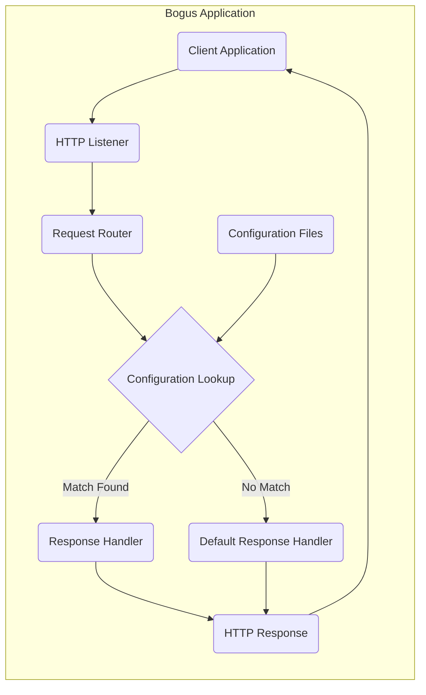
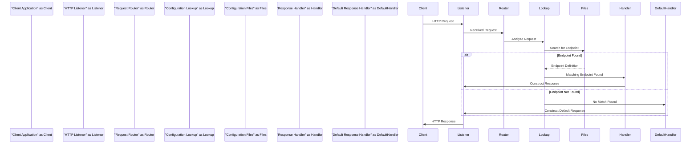

# Project Design Document: Bogus - Fake REST API Server

**Version:** 1.1
**Date:** October 26, 2023
**Author:** Gemini (AI Language Model)

## 1. Introduction

This document provides an enhanced design overview of the "Bogus" project, a simple fake REST API server. This detailed design serves as a crucial foundation for subsequent threat modeling activities, offering a comprehensive understanding of the system's architecture, components, data flow, and inherent security considerations.

## 2. Project Overview

The Bogus project, accessible on GitHub ([https://github.com/bchavez/bogus](https://github.com/bchavez/bogus)), is a lightweight application meticulously crafted to simulate a RESTful API. Its core strength lies in enabling users to define custom API endpoints and their corresponding responses. This capability proves invaluable for various scenarios, including rigorous testing of client applications, effective mocking of dependencies during the development lifecycle, and clear demonstrations of API interactions. The fundamental operation involves the server delivering pre-configured responses upon receiving specific HTTP requests.

## 3. Goals and Objectives

*   To deliver a highly configurable fake REST API server.
*   To empower users with the ability to define bespoke endpoints and responses.
*   To provide support for standard HTTP methods (GET, POST, PUT, DELETE, PATCH, etc.).
*   To ensure ease of setup and execution.
*   To offer a realistic simulation of a genuine API, specifically tailored for testing purposes.

## 4. System Architecture

The Bogus application adopts a relatively straightforward yet effective architecture. At its heart lies a web server component, diligently listening for incoming HTTP requests. Complementing this is a configuration component, which dictates precisely how these incoming requests are to be processed and handled.

### 4.1. High-Level Architecture Diagram

### 4.2. Component Description

*   **Client Application:** Any software entity (e.g., a web browser, a command-line tool like `curl`, another microservice) that initiates HTTP requests directed towards the Bogus server.
*   **HTTP Listener:** The foundational component responsible for establishing and managing incoming HTTP connections on a designated port. This is typically implemented using a robust web framework or library, such as Flask (for Python).
*   **Request Router:** This intelligent component meticulously analyzes the attributes of each incoming HTTP request, specifically the method (GET, POST, etc.) and the path (the URL), to accurately determine which pre-configured endpoint it corresponds to.
*   **Configuration Lookup:** This critical process involves systematically searching through the loaded configuration data to locate an endpoint definition that precisely matches the characteristics of the incoming request.
*   **Response Handler:** Upon successfully identifying a matching endpoint, the Response Handler takes over. Its primary function is to retrieve the pre-configured response details associated with that specific endpoint. These details encompass the HTTP status code (e.g., 200 OK, 404 Not Found), the headers (e.g., Content-Type), and the response body (the actual data being returned).
*   **Default Response Handler:** In scenarios where the Configuration Lookup fails to find a matching endpoint definition, the Default Response Handler steps in. It is responsible for generating a standard default response, typically a 404 Not Found error, to inform the client that the requested resource could not be located.
*   **HTTP Response:** This component is the final stage in the server's processing of a request. It takes the prepared response details (from either the Response Handler or the Default Response Handler), formats them according to HTTP specifications, and transmits the complete HTTP response back to the originating Client Application.
*   **Configuration Files:** These external files, commonly formatted using JSON or YAML, serve as the repository for defining the behavior of the fake API. They contain structured definitions of each fake API endpoint, specifying the expected request method, the URL path, and the precise response that the server should return when that endpoint is accessed.

## 5. Data Flow

The typical sequence of events for a request processed by the Bogus server unfolds as follows:

1. A **Client Application** initiates an HTTP request and sends it to the Bogus server's designated listening port.
2. The **HTTP Listener** diligently accepts the incoming connection and receives the complete HTTP request.
3. The **Request Router** meticulously examines the request method (e.g., GET, POST) and the request path (the URL).
4. The **Configuration Lookup** mechanism then undertakes a search within the **Configuration Files** to find an endpoint definition that matches the received request.
5. **Scenario A (Successful Match):**
    *   A matching endpoint definition is successfully located within the configuration.
    *   The **Response Handler** retrieves the pre-configured response details associated with the matched endpoint.
    *   An **HTTP Response** is constructed, incorporating the configured status code, headers, and response body.
    *   The fully formed **HTTP Response** is then transmitted back to the originating **Client Application**.
6. **Scenario B (No Matching Endpoint):**
    *   No corresponding endpoint definition is found within the configuration files.
    *   The **Default Response Handler** takes over and generates a standard error response, typically a 404 Not Found.
    *   An **HTTP Response** containing this error information is sent back to the **Client Application**.

## 6. Components in Detail

### 6.1. HTTP Listener

*   **Functionality:**  Establishes and manages incoming TCP connections on a specified port, subsequently accepting and processing incoming HTTP requests.
*   **Implementation Details:**  Likely implemented using a robust web framework such as Flask (if the project is in Python) or Express.js (if in Node.js). This component handles the intricate low-level details of network communication, including socket management and protocol handling.
*   **Key Considerations for Threat Modeling:**
    *   **Exposure of the Listening Port:** The port on which the server listens is a potential attack vector. Understanding how this port is exposed and secured is crucial.
    *   **Vulnerabilities in the Underlying Web Framework:** The chosen web framework itself might contain known vulnerabilities that could be exploited. Regular updates and security audits are essential.
    *   **Handling of Malformed or Oversized Requests:** The server's ability to gracefully handle unexpected or malicious request formats and sizes needs careful consideration to prevent crashes or resource exhaustion.

### 6.2. Request Router

*   **Functionality:**  The core task of this component is to accurately match incoming HTTP requests to their corresponding defined API endpoints. This matching is based on the HTTP method (GET, POST, etc.) and the specific path within the URL.
*   **Implementation Details:**  Typically leverages the routing mechanisms provided by the chosen web framework. This often involves defining routes using decorators or configuration, potentially employing regular expressions or other pattern-matching techniques for flexible route definitions.
*   **Key Considerations for Threat Modeling:**
    *   **Incorrect or Overly Permissive Routing Rules:**  Loosely defined routes could inadvertently expose unintended functionality or allow access to sensitive data.
    *   **Potential for Route Hijacking or Confusion:**  Carefully designed routes are necessary to prevent attackers from manipulating requests to target different endpoints than intended.
    *   **Case Sensitivity or Normalization Issues in Route Matching:** Inconsistencies in how routes are matched (e.g., case sensitivity) could lead to unexpected behavior or security vulnerabilities.

### 6.3. Configuration Lookup

*   **Functionality:**  This component is responsible for efficiently retrieving the configuration data and then searching through it to find an endpoint definition that precisely matches the attributes of the incoming request.
*   **Implementation Details:**  Involves reading and parsing configuration files, which are commonly in JSON or YAML format. To facilitate rapid searching, the parsed configuration data is often stored in efficient data structures like dictionaries (in Python) or hash maps (in other languages).
*   **Key Considerations for Threat Modeling:**
    *   **Vulnerabilities in Configuration File Parsing Logic:**  Flaws in how the configuration files are read and parsed could be exploited to inject malicious data or cause errors.
    *   **Exposure of Sensitive Information in Configuration Files:**  Configuration files might inadvertently contain sensitive information (e.g., API keys, internal URLs) that needs to be protected.
    *   **Possibility of Configuration Injection or Manipulation:**  If the configuration files are not properly secured, attackers might be able to modify them to alter the server's behavior.

### 6.4. Response Handler

*   **Functionality:**  Once a matching endpoint is found, the Response Handler takes the pre-configured details for that endpoint and constructs the appropriate HTTP response to send back to the client.
*   **Implementation Details:**  This involves retrieving the status code (e.g., 200, 400), headers (e.g., Content-Type), and the response body from the loaded configuration. These elements are then assembled into a valid HTTP response.
*   **Key Considerations for Threat Modeling:**
    *   **Injection Vulnerabilities in the Response Body:** If the response body is dynamically generated based on configuration data without proper sanitization, it could be susceptible to injection attacks (e.g., Cross-Site Scripting - XSS).
    *   **Exposure of Sensitive Information in Response Headers:**  Care must be taken to avoid including sensitive information in the response headers that should not be exposed to the client.
    *   **Incorrect Content Type or Encoding:**  Setting the wrong Content-Type header or using incorrect encoding can lead to misinterpretation of the response by the client.

### 6.5. Default Response Handler

*   **Functionality:**  In situations where no matching endpoint is found for an incoming request, the Default Response Handler steps in to generate a standard error response.
*   **Implementation Details:**  Typically, this involves setting the HTTP status code to 404 Not Found and including a standard error message in the response body to inform the client that the requested resource was not found.
*   **Key Considerations for Threat Modeling:**
    *   **Information Leakage in the Default Error Message:**  The default error message should be generic enough to avoid revealing sensitive information about the server's internal workings or configuration.
    *   **Potential for Denial-of-Service if Excessive Invalid Requests are Sent:**  While a single 404 response is harmless, a large volume of invalid requests could potentially strain server resources. Rate limiting might be considered.

### 6.6. Configuration Files

*   **Functionality:**  These files serve as the central repository for defining the behavior of the fake API, specifying the available endpoints and their corresponding responses.
*   **Implementation Details:**  Typically plain text files formatted using human-readable formats like JSON or YAML. The structure within these files defines the mapping between request methods and paths to specific response data.
*   **Key Considerations for Threat Modeling:**
    *   **Security of the Storage Location of these Files:**  The location where these configuration files are stored is critical. They should be protected from unauthorized access and modification.
    *   **Risk of Unauthorized Modification or Access:**  If an attacker gains access to these files, they could manipulate the API's behavior or inject malicious content into the responses.
    *   **Potential for Injection Vulnerabilities if Configuration Values are Not Properly Sanitized When Used:**  Even though the data is "bogus," if the application processes or uses values from the configuration files without proper sanitization, it could still be vulnerable to injection attacks.

## 7. Security Considerations (Detailed for Threat Modeling)

This section expands on the preliminary security considerations, providing more specific points for the threat modeling process.

*   **Input Validation:**  Thoroughly examine how the application validates input within the request path and body. Consider vulnerabilities related to:
    *   **Path Traversal:** Can an attacker manipulate the path to access files or directories outside the intended scope?
    *   **Injection Attacks:** Is the application vulnerable to SQL injection (if it were interacting with a database), command injection, or other forms of injection based on input?
    *   **Cross-Site Scripting (XSS):** Although it's a fake API, if responses are dynamically generated based on configuration, could malicious scripts be injected?
*   **Authentication and Authorization:**  While likely absent in a basic "bogus" implementation, consider the implications if authentication or authorization were to be added:
    *   **Broken Authentication:**  Are there weaknesses in how users are identified and authenticated?
    *   **Broken Authorization:**  Are there flaws in how access to resources is controlled based on user identity?
*   **Data Security:** Focus on the security of the configuration files:
    *   **Access Control:** Who has access to read and modify these files?
    *   **Encryption at Rest:** Should these files be encrypted if they contain sensitive information?
    *   **Integrity Protection:** How can we ensure that these files haven't been tampered with?
*   **Denial of Service (DoS):** Analyze the application's resilience to DoS attacks:
    *   **Resource Exhaustion:** Could an attacker send a large number of requests to overwhelm the server's resources (CPU, memory, network)?
    *   **Slowloris Attacks:** Is the server vulnerable to attacks that slowly consume resources by keeping connections open?
    *   **Request Rate Limiting:** Is there any mechanism to limit the number of requests from a single source?
*   **Injection Vulnerabilities:**  Beyond input validation, consider injection points within the application's logic:
    *   **Configuration Injection:** Could an attacker manipulate configuration files to inject malicious code or data?
    *   **Log Injection:** If the application logs request details, could an attacker inject malicious data into the logs?
*   **Dependency Vulnerabilities:**  A crucial aspect of security:
    *   **Known Vulnerabilities:** Are there known security vulnerabilities in the web framework or any other libraries used by the application?
    *   **Dependency Management:** How are dependencies managed and updated to patch vulnerabilities?
*   **Information Disclosure:** Identify potential areas where sensitive information could be leaked:
    *   **Error Messages:** Do error messages reveal internal details about the application or its environment?
    *   **Response Headers:** Are there any headers that might expose sensitive information?
    *   **Directory Listing:** Is directory listing enabled on the server, potentially exposing configuration files?

## 8. Deployment Considerations

The deployment strategy significantly impacts the security posture of the Bogus application. Consider the following:

*   **Local Machine:**  While convenient for development, running directly on a local machine might expose the application to local network threats if not properly firewalled.
*   **Containerization (e.g., Docker):**  Containers provide isolation and can simplify deployment, but the container image itself needs to be secured and regularly updated.
*   **Cloud Platforms:** Deploying to cloud platforms offers scalability and security features, but proper configuration of security groups, access controls, and other cloud-specific settings is essential.

## 9. Technologies Used (Specific Assumptions)

Based on common practices and the project's nature, we can make more specific assumptions about the technologies:

*   **Programming Language:** Python.
*   **Web Framework:** Flask.
*   **Configuration Format:** JSON.

These assumptions allow for more targeted threat modeling, focusing on the specific vulnerabilities and security features associated with these technologies.

## 10. Future Considerations

This design document will be a living document, subject to updates and revisions as the Bogus project evolves. Future enhancements to this document may include:

*   More granular diagrams illustrating the internal workings of specific components.
*   Detailed descriptions of data structures and algorithms used within the application.
*   Integration of security controls and mitigation strategies identified during the threat modeling process.
*   Regular reviews and updates to reflect changes in the project codebase and deployment environment.

This enhanced design document provides a robust and detailed foundation for conducting a comprehensive threat modeling exercise for the Bogus project. The in-depth analysis of components, data flow, and specific security considerations will facilitate the identification of potential vulnerabilities and the development of effective mitigation strategies, ultimately contributing to a more secure application.