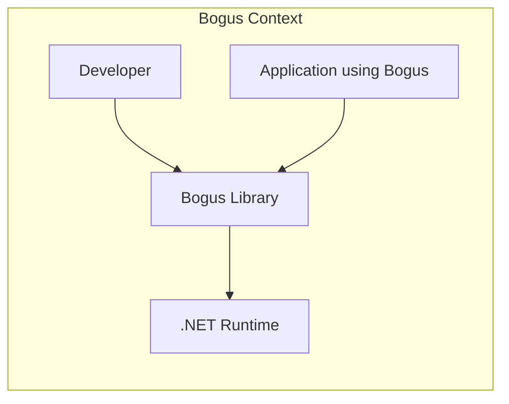
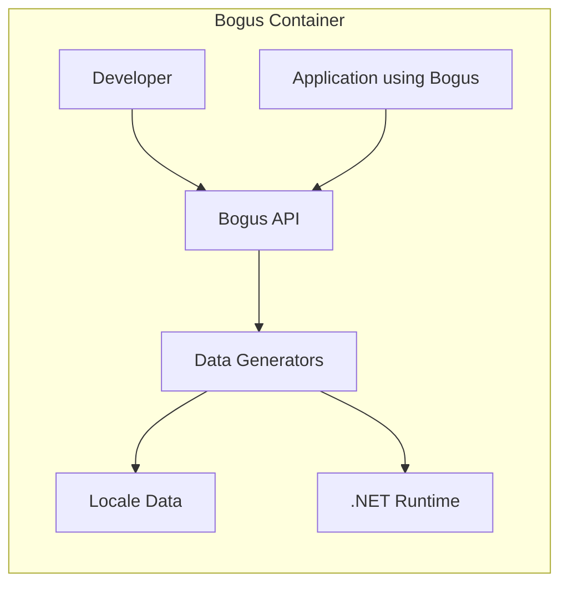
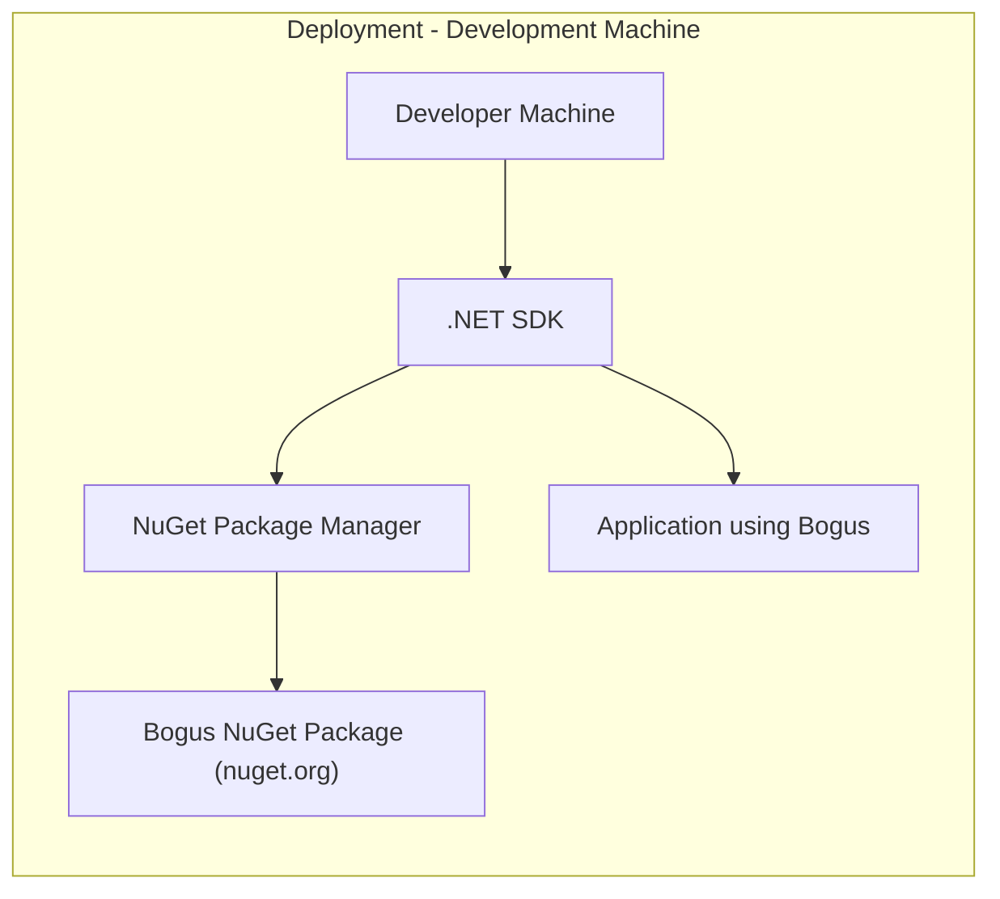

Okay, let's create a design document for the Bogus project, keeping in mind its purpose and potential security considerations.

# BUSINESS POSTURE

Bogus is a data generation library primarily used for testing and development purposes.  It allows developers to quickly generate realistic-looking fake data for various scenarios, such as populating databases, testing UI layouts, and creating mock API responses.

Priorities:

*   Ease of use and developer productivity:  The library should be simple to integrate and use, allowing developers to quickly generate the data they need.
*   Data realism: The generated data should be realistic enough to be useful for testing and development.
*   Extensibility:  The library should be extensible, allowing developers to customize the data generation process and add support for new data types.
*   Performance: Data generation should be reasonably fast, especially for large datasets.
*   Maintainability: The codebase should be well-maintained and easy to update.

Goals:

*   Provide a comprehensive set of data generators for common data types.
*   Support various locales and languages.
*   Offer a fluent and intuitive API.
*   Minimize external dependencies.

Business Risks:

*   Inadvertent use in production:  The most significant risk is the unintentional use of Bogus-generated data in a production environment. This could lead to incorrect data being presented to users, flawed business logic execution, or even security vulnerabilities if the fake data is used in security-sensitive contexts (e.g., generating fake user accounts or credentials).
*   Data leakage through generated data: While Bogus generates *fake* data, there's a small risk that the generation logic, if improperly configured or extended, could inadvertently leak information about the underlying system or data structures. This is particularly relevant if custom data generators are used that pull information from the system.
*   Dependency vulnerabilities: Like any software project, Bogus relies on external dependencies. Vulnerabilities in these dependencies could be exploited to compromise systems using Bogus.
*   Supply chain attacks: Compromise of the Bogus library itself or its distribution channels (e.g., NuGet) could lead to malicious code being injected into applications using Bogus.

# SECURITY POSTURE

Existing Security Controls:

*   security control: Code Reviews: The GitHub repository shows evidence of pull requests, suggesting that code reviews are part of the development process. (Inferred from GitHub repository structure).
*   security control: Static Analysis: The project may use static analysis tools, although this isn't explicitly stated. (Inferred from best practices for .NET development).
*   security control: Dependency Management: The project uses a package manager (NuGet) to manage dependencies, which helps with tracking and updating dependencies. (Inferred from project structure).
*   security control: Tests: The project includes unit tests, which help ensure the correctness of the code and prevent regressions. (Inferred from GitHub repository structure).

Accepted Risks:

*   accepted risk: Limited security focus: As a data generation library primarily intended for testing, Bogus likely doesn't have extensive security hardening built-in. The focus is on functionality and ease of use, rather than robust security against sophisticated attacks.
*   accepted risk: User responsibility for secure usage: The library's users are responsible for ensuring that Bogus is used appropriately and that generated data is not used in production environments.

Recommended Security Controls:

*   security control: Strong warnings against production use: Add prominent warnings in the documentation and code comments explicitly stating that Bogus should not be used in production environments.
*   security control: Input validation for custom generators: If custom data generators accept user input, implement robust input validation to prevent potential injection vulnerabilities.
*   security control: Regular dependency updates: Establish a process for regularly updating dependencies to address known vulnerabilities.
*   security control: Security-focused code reviews: Emphasize security considerations during code reviews, particularly for changes related to custom data generators or external integrations.
*   security control: Consider signing the NuGet package: Digitally signing the NuGet package helps ensure the integrity of the library and prevent tampering.
*   security control: SAST (Static Application Security Testing): Integrate SAST tools into the build process to automatically identify potential security vulnerabilities in the code.
*   security control: SCA (Software Composition Analysis): Use SCA tools to identify and track known vulnerabilities in dependencies.

Security Requirements:

*   Authentication: Not directly applicable to the core functionality of Bogus.
*   Authorization: Not directly applicable to the core functionality of Bogus.
*   Input Validation:
    *   Requirement: Custom data generators that accept user input *must* validate that input to prevent injection vulnerabilities.
    *   Requirement: The library should handle invalid or unexpected input gracefully, without crashing or exposing sensitive information.
*   Cryptography:
    *   Requirement: If Bogus is used to generate cryptographic material (e.g., random keys or passwords) for testing purposes, it *must* use a cryptographically secure random number generator.  This is crucial for testing security-related functionality.  However, emphasize that this is *only* for testing, and generated cryptographic material should *never* be used in production.
*   Data Protection:
    *   Requirement: Bogus should not store or transmit any sensitive data. Its purpose is to generate *fake* data.

# DESIGN

## C4 CONTEXT

Element Descriptions:

*   Element:
    *   Name: Developer
    *   Type: Person
    *   Description: A software developer who uses the Bogus library to generate fake data for testing and development.
    *   Responsibilities: Integrates Bogus into their applications, configures data generation rules, and uses the generated data for testing.
    *   Security controls: Responsible for using Bogus securely and avoiding its use in production environments.

*   Element:
    *   Name: Bogus Library
    *   Type: Software System
    *   Description: The Bogus data generation library.
    *   Responsibilities: Provides an API for generating fake data, manages data generation rules, and handles locale-specific data.
    *   Security controls: Input validation for custom generators, warnings against production use, dependency management.

*   Element:
    *   Name: .NET Runtime
    *   Type: Software System
    *   Description: The .NET runtime environment on which Bogus executes.
    *   Responsibilities: Provides the underlying platform for Bogus to run.
    *   Security controls: Relies on the security features of the .NET runtime.

*   Element:
    *   Name: Application using Bogus
    *   Type: Software System
    *   Description: Application that is using Bogus library.
    *   Responsibilities: Use Bogus to generate test data.
    *   Security controls: Relies on the security features implemented by application developers.

## C4 CONTAINER

Since Bogus is a library, the container diagram is essentially the same as the context diagram, with the addition of internal components within the library.

Element Descriptions:

*   Element:
    *   Name: Developer
    *   Type: Person
    *   Description: A software developer. (Same as in Context Diagram)
    *   Responsibilities: Integrates Bogus into their applications, configures data generation rules.
    *   Security controls: Responsible for using Bogus securely.

*   Element:
    *   Name: Bogus API
    *   Type: API
    *   Description: The public API of the Bogus library, exposed to developers.
    *   Responsibilities: Provides methods for creating and configuring data generators.
    *   Security controls: Input validation for configuration parameters.

*   Element:
    *   Name: Data Generators
    *   Type: Component
    *   Description: A collection of classes and methods responsible for generating specific types of data (e.g., names, addresses, phone numbers).
    *   Responsibilities: Generates data according to specified rules and locale.
    *   Security controls: Input validation for custom generators.

*   Element:
    *   Name: Locale Data
    *   Type: Data
    *   Description: Data files or resources containing locale-specific information used for data generation (e.g., lists of names, address formats).
    *   Responsibilities: Provides data for generating realistic data for different locales.
    *   Security controls: None directly, but should be protected from modification.

*   Element:
    *   Name: .NET Runtime
    *   Type: Software System
    *   Description: The .NET runtime environment. (Same as in Context Diagram)
    *   Responsibilities: Provides the underlying platform.
    *   Security controls: Relies on the security features of the .NET runtime.

*   Element:
    *   Name: Application using Bogus
    *   Type: Software System
    *   Description: Application that is using Bogus library.
    *   Responsibilities: Use Bogus to generate test data.
    *   Security controls: Relies on the security features implemented by application developers.

## DEPLOYMENT

Bogus is distributed as a NuGet package.  Developers typically integrate it into their projects using a package manager like `dotnet add package`. There are several deployment scenarios:

1.  **Development Machine:**  Bogus is used locally on a developer's machine for unit and integration testing.
2.  **CI/CD Pipeline:** Bogus is used within a CI/CD pipeline to generate test data for automated builds and tests.
3.  **Test/Staging Environment:** Bogus *could* be used in a dedicated test or staging environment, but this should be done with extreme caution to prevent accidental data leakage or misuse.  It's generally preferable to generate the data during the build process and deploy *that* data, rather than deploying Bogus itself.

We'll describe the **Development Machine** scenario, as it's the most common and straightforward.

Element Descriptions:

*   Element:
    *   Name: Developer Machine
    *   Type: Infrastructure Node
    *   Description: The developer's workstation.
    *   Responsibilities: Hosts the development environment, including the .NET SDK and the application code.
    *   Security controls: Relies on the security of the developer's machine (OS patching, antivirus, etc.).

*   Element:
    *   Name: .NET SDK
    *   Type: Software
    *   Description: The .NET Software Development Kit.
    *   Responsibilities: Provides tools for building and running .NET applications.
    *   Security controls: Relies on the security of the .NET SDK.

*   Element:
    *   Name: NuGet Package Manager
    *   Type: Software
    *   Description: The NuGet package manager, used to install and manage dependencies.
    *   Responsibilities: Downloads and installs the Bogus NuGet package.
    *   Security controls: Relies on the security of the NuGet infrastructure and package signing (if enabled).

*   Element:
    *   Name: Bogus NuGet Package (nuget.org)
    *   Type: Artifact
    *   Description: The Bogus library packaged as a NuGet package, hosted on nuget.org.
    *   Responsibilities: Contains the compiled Bogus library.
    *   Security controls: Package signing (recommended), vulnerability scanning by NuGet.org.

*   Element:
    *   Name: Application using Bogus
    *   Type: Software System
    *   Description: Application that is using Bogus library.
    *   Responsibilities: Use Bogus to generate test data.
    *   Security controls: Relies on the security features implemented by application developers.

## BUILD

Bogus, being a library, is built and published as a NuGet package. A typical build process would involve:

1.  **Developer:** Writes code and commits changes to a source code repository (e.g., GitHub).
2.  **CI Server (e.g., GitHub Actions, Azure DevOps):**
    *   Checks out the code.
    *   Restores dependencies (using NuGet).
    *   Runs static analysis (SAST, SCA).
    *   Compiles the code.
    *   Runs unit tests.
    *   Packages the library into a NuGet package.
    *   (Optionally) Signs the NuGet package.
    *   Publishes the package to a NuGet repository (e.g., nuget.org).

```mermaid
graph LR
    Developer["Developer"] --> GitHub["GitHub (Source Code)"]
    GitHub --> CI["CI Server (e.g., GitHub Actions)"]
    CI --> Restore["Restore Dependencies (NuGet)"]
    Restore --> SAST["Static Analysis (SAST)"]
    SAST --> SCA["Software Composition Analysis (SCA)"]
    SCA --> Compile["Compile Code"]
    Compile --> UnitTests["Run Unit Tests"]
    UnitTests --> Package["Package (NuGet)"]
    Package --> Sign["Sign Package (Optional)"]
    Sign --> Publish["Publish to NuGet.org"]
```

# RISK ASSESSMENT

*   Critical Business Process: The critical business process being *supported* (not directly protected) by Bogus is software development and testing. Bogus itself doesn't protect a business process; it facilitates the testing of other processes.
*   Data Sensitivity:
    *   Bogus *generates* data, but it doesn't inherently *handle* sensitive data. The sensitivity of the generated data depends entirely on how Bogus is configured and used.
    *   The primary risk is the *misuse* of Bogus-generated data, leading to its presence in inappropriate environments (e.g., production).
    *   If custom generators are used that access real data, then that real data's sensitivity is relevant.

# QUESTIONS & ASSUMPTIONS

Questions:

*   Are there any specific compliance requirements (e.g., GDPR, HIPAA) that the applications using Bogus need to adhere to? This influences the types of fake data that can be generated and how it should be handled.
*   Are there any plans to use Bogus for generating security-sensitive data (e.g., passwords, API keys) even for testing? If so, specific precautions and recommendations are needed.
*   What is the current process for managing and updating dependencies?
*   Is there a formal code review process in place?
*   Is the NuGet package currently signed?

Assumptions:

*   BUSINESS POSTURE: The primary use case for Bogus is generating test data for development and testing, not for production use.
*   SECURITY POSTURE: There is a basic level of security awareness, but security is not the primary focus of the Bogus project itself.
*   DESIGN: Bogus is a relatively simple library with a well-defined API. The deployment model involves integrating it as a NuGet package. The build process likely involves a CI/CD pipeline.