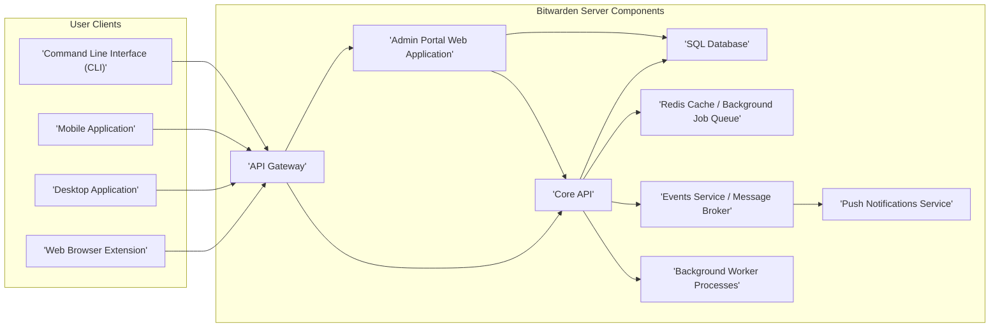
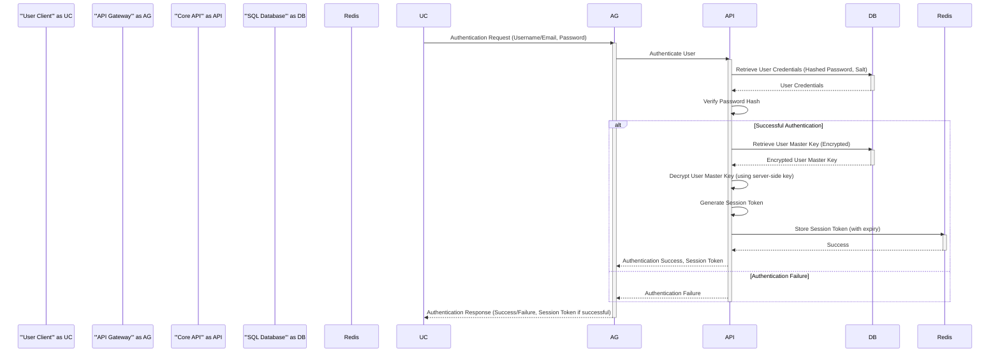
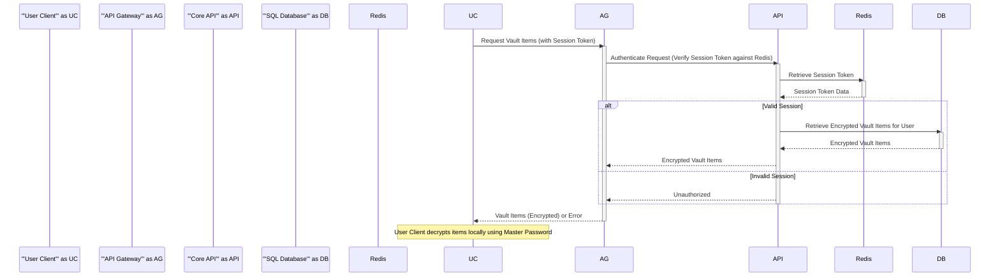
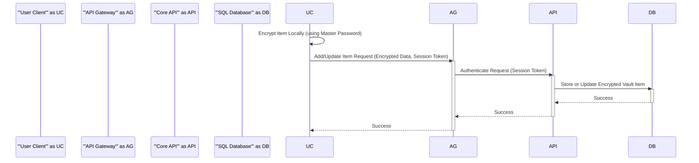

# Project Design Document: Bitwarden Server

**Version:** 1.1
**Date:** October 26, 2023
**Prepared By:** Gemini (AI Architecture Expert)

## 1. Project Overview

This document provides an enhanced design overview of the Bitwarden Server, a self-hosted password management solution. This detailed design serves as a robust foundation for subsequent threat modeling activities, offering a comprehensive understanding of the system's components, their interactions, and the flow of data. The design is informed by the publicly available source code repository: [https://github.com/bitwarden/server](https://github.com/bitwarden/server).

## 2. Goals and Objectives

*   To present a clear, detailed, and easily understandable overview of the Bitwarden Server architecture.
*   To precisely identify the core components and their specific functionalities and responsibilities.
*   To thoroughly illustrate the interactions and dependencies between the different components within the system.
*   To meticulously describe the data flow pathways and transformations within the Bitwarden Server.
*   To emphasize critical security considerations, design choices, and inherent security mechanisms.
*   To act as a definitive resource for identifying potential threats, vulnerabilities, and attack vectors.

## 3. Target Audience

*   Security Engineers responsible for threat modeling and security assessments.
*   Software Developers involved in maintaining, extending, or integrating with the Bitwarden Server.
*   DevOps Engineers responsible for deploying, managing, and monitoring the Bitwarden Server infrastructure.
*   Threat Modeling Teams tasked with systematically identifying and analyzing potential security risks.

## 4. High-Level Architecture

The Bitwarden Server employs a modular, multi-component architecture designed to securely manage sensitive user data. These core components collaborate to deliver a complete and robust password management solution.

## 5. Detailed Component Breakdown

*   **User Clients ("'Web Browser Extension'", "'Desktop Application'", "'Mobile Application'", "'Command Line Interface (CLI)'"):** These are the diverse applications that end-users utilize to interact with the Bitwarden service. They handle user authentication, secure input and display of sensitive data, and communication with the server's API. Each client encrypts and decrypts vault data locally using the user's master password.

*   **API Gateway ("'API Gateway'"):** This component serves as the single entry point for all client requests destined for the Bitwarden Server. Its responsibilities include:
    *   **Request Routing:** Directing incoming requests to the appropriate backend service (Core API or Admin Portal).
    *   **Authentication:** Verifying the identity of the client using session tokens or other authentication mechanisms.
    *   **Authorization:** Ensuring the authenticated client has the necessary permissions to access the requested resource.
    *   **Rate Limiting:** Protecting the backend services from abuse by limiting the number of requests from a single client or IP address within a given timeframe.
    *   **TLS Termination:** Handling the decryption of HTTPS traffic, ensuring secure communication.

*   **Core API ("'Core API'"):** This component embodies the central business logic of the Bitwarden server. It manages core functionalities such as:
    *   **User Management:** Registration, login, password reset, two-factor authentication management.
    *   **Vault Management:** Creation, retrieval, updating, and deletion of individual vault items (logins, notes, cards, identities).
    *   **Organization Management:** Creation, management of users and permissions within organizations, sharing of vault items.
    *   **Key Derivation and Management:** Handling the server-side aspects of key derivation and the storage of encrypted user master keys.
    *   **Synchronization:**  Managing the synchronization of vault data across multiple user devices.

*   **Admin Portal Web Application ("'Admin Portal Web Application'"):** A web-based interface specifically designed for administrative tasks. It provides functionalities for:
    *   **User and Organization Administration:** Managing user accounts, roles, permissions, and organizational settings.
    *   **System Configuration:** Configuring server settings, such as email settings, SMTP configuration, and other system-level parameters.
    *   **Reporting and Auditing:** Viewing system logs, user activity, and other relevant reports.

*   **SQL Database ("'SQL Database'"):** The primary persistent data store for the Bitwarden Server. It securely stores:
    *   **User Accounts:** User credentials (hashed passwords), email addresses, and other user-related information.
    *   **Encrypted Vault Data:**  User vault items, encrypted using the user's master key.
    *   **Organization Data:** Information about organizations, their members, and shared vault items.
    *   **Server Configuration:**  Persistent server settings.
    *   **Encryption at Rest:**  The database should be configured with encryption at rest to protect sensitive data even if the physical storage is compromised.

*   **Redis Cache / Background Job Queue ("'Redis Cache / Background Job Queue'"):**  Utilized for:
    *   **Caching:** Storing frequently accessed data (e.g., session data, configuration settings) in memory to improve application performance and reduce database load.
    *   **Background Job Queue:** Managing asynchronous tasks that do not need to be executed immediately, such as sending emails, processing bulk operations, or scheduled tasks. This improves the responsiveness of the main API.

*   **Events Service / Message Broker ("'Events Service / Message Broker'"):**  A component responsible for facilitating asynchronous communication between different parts of the system. It allows components to publish events that other components can subscribe to and react to. This enables:
    *   **Auditing:**  Logging significant events within the system for security and compliance purposes.
    *   **Real-time Updates:**  Potentially used for pushing real-time updates to clients.
    *   **Decoupling of Services:** Allowing components to interact without direct dependencies.

*   **Push Notifications Service ("'Push Notifications Service'"):**  Handles the delivery of push notifications to user devices for events such as:
    *   **Login Alerts:** Notifying users when their account is accessed from a new device or location.
    *   **Sharing Notifications:** Informing users about shared vault items.

*   **Background Worker Processes ("'Background Worker Processes'"):**  Independent processes that execute tasks queued by the Core API or other services. These tasks might include:
    *   **Sending Emails:**  Password reset emails, invitation emails, notification emails.
    *   **Generating Reports:**  Creating usage statistics or audit reports.
    *   **Performing Maintenance Tasks:**  Database cleanup, log rotation, etc.

## 6. Data Flow Diagrams

### 6.1 User Authentication and Session Creation

### 6.2 Retrieving Encrypted Vault Items

### 6.3 Adding or Updating a Vault Item

## 7. Key Security Considerations

*   **Client-Side End-to-End Encryption:** User vault data is encrypted on the client-side *before* being transmitted to the server. The server only handles encrypted data and never has access to the user's unencrypted master password or vault contents. Decryption only occurs on the user's trusted devices.
*   **Secure Master Password Derivation:** The client-side key derivation function (e.g., PBKDF2, Argon2) ensures that the master password is not directly used for encryption, making it computationally expensive for attackers to brute-force.
*   **Server-Side Key Management:** The server manages a server-side encryption key used to encrypt sensitive data at rest, including the user's encrypted master key. Secure storage, access control, and regular rotation of this key are paramount.
*   **Robust Authentication and Authorization:**  Strong authentication mechanisms (username/password, two-factor authentication) and granular authorization policies are enforced to control access to resources. Session management with secure tokens and appropriate expiry times is crucial.
*   **Secure Communication Channels (HTTPS):** All communication between clients and the server must be encrypted using HTTPS to protect data in transit from eavesdropping and tampering. Proper TLS configuration and certificate management are essential.
*   **Strict Input Validation and Sanitization:** The API must rigorously validate and sanitize all incoming data to prevent common web application vulnerabilities such as SQL injection, cross-site scripting (XSS), and command injection.
*   **Rate Limiting and Abuse Prevention:** Implementing rate limiting on API endpoints is crucial to mitigate brute-force attacks, denial-of-service attempts, and other forms of abuse.
*   **Regular Security Audits and Penetration Testing:** Periodic independent security audits and penetration testing are necessary to proactively identify and address potential vulnerabilities in the system.
*   **Secure Dependency Management:**  Maintaining an up-to-date list of dependencies and promptly patching known security vulnerabilities in third-party libraries is vital.
*   **Secure Deployment Practices:** Following secure deployment practices, such as using hardened container images, principle of least privilege for container execution, and secure network configurations, is critical to minimize the attack surface.

## 8. Deployment Architecture

The Bitwarden Server is commonly deployed using containerization technologies like Docker, often orchestrated with tools like Docker Compose or Kubernetes for scalability and resilience.

*   **Containerized Components:** Each logical component (API Gateway, Core API, Admin Portal, Database, Redis, etc.) is typically packaged and deployed as an independent Docker container. This promotes isolation, portability, and easier management.
*   **Container Orchestration (Docker Compose/Kubernetes):**
    *   **Docker Compose:** Suitable for simpler deployments, defines and manages multi-container Docker applications.
    *   **Kubernetes:** Provides advanced features for scaling, automated deployment, management, and networking of containerized applications in more complex environments.
*   **Reverse Proxy (Nginx/Traefik):** A reverse proxy is typically deployed in front of the Bitwarden Server components to:
    *   **Handle TLS Termination:** Decrypting incoming HTTPS traffic.
    *   **Load Balancing:** Distributing traffic across multiple instances of backend services for improved performance and availability.
    *   **Request Routing:** Directing requests to the appropriate backend container based on the URL path or other criteria.
*   **Database Deployment:** The SQL Database can be deployed as:
    *   **A Containerized Instance:** Running within a Docker container.
    *   **A Managed Database Service:** Utilizing cloud provider services like Azure SQL Database, AWS RDS, or Google Cloud SQL, which offer managed infrastructure, backups, and high availability.
*   **Volume Management:** Persistent data for the database and potentially other components is managed using Docker volumes or persistent volumes in Kubernetes to ensure data survives container restarts.

## 9. Technology Stack

Based on the publicly available information and the GitHub repository, the core technologies involved in the Bitwarden Server include:

*   **Backend Framework and Language:** .NET (primarily using C#)
*   **Database System:** SQL Server (though other database systems might be supported or configurable)
*   **Caching and Message Brokering:** Redis
*   **Web Server (underlying .NET):** Kestrel (typically used behind a reverse proxy)
*   **Frontend Framework (Admin Portal):**  Likely a modern JavaScript framework such as React, Angular, or Vue.js.
*   **Containerization Platform:** Docker
*   **Container Orchestration (Optional):** Docker Compose, Kubernetes
*   **Reverse Proxy (Common Choices):** Nginx, Traefik

## 10. Future Considerations

*   **Enhanced Federated Authentication Options:** Expanding support for integration with various external identity providers (e.g., SAML, OpenID Connect) for seamless user authentication.
*   **More Granular and Comprehensive Audit Logging:** Implementing more detailed audit trails to track user and system activities for enhanced security monitoring and compliance.
*   **Performance and Scalability Optimizations:** Continuously improving the architecture and code to handle increasing user loads and data volumes efficiently.
*   **Advanced Multi-Factor Authentication (MFA) Enforcement Policies:** Providing more flexible and granular control over MFA requirements for different users and organizations.
*   **Integration with Hardware Security Modules (HSMs):** Exploring the use of HSMs for enhanced security of the server-side encryption key.
*   **Built-in Monitoring and Alerting Capabilities:** Integrating more robust monitoring and alerting systems to proactively detect and respond to potential issues.

This improved design document provides a more detailed and comprehensive understanding of the Bitwarden Server architecture, making it a more effective resource for threat modeling and security analysis. The enhanced descriptions, more detailed data flow diagrams, and expanded security considerations offer a stronger foundation for identifying and mitigating potential risks.
