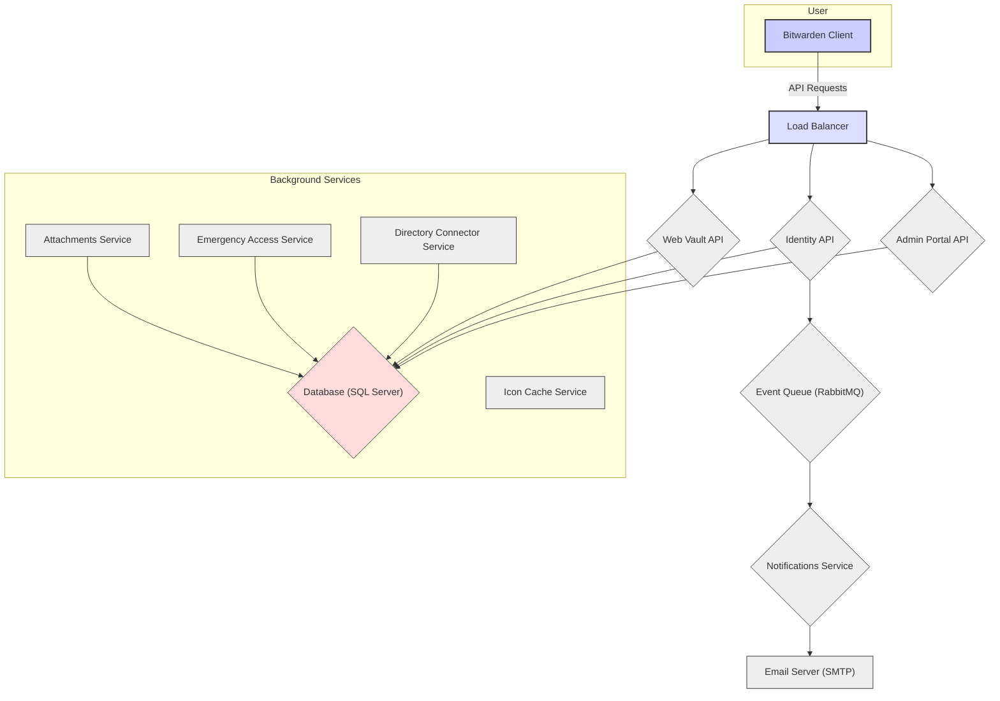
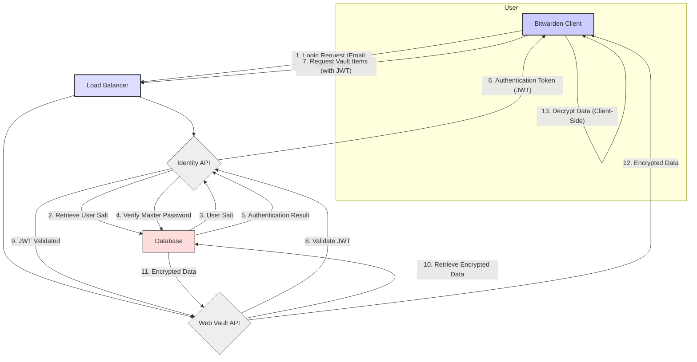

# Project Design Document: Bitwarden Server

**Version:** 1.1
**Date:** October 26, 2023
**Author:** AI Software Architect

## 1. Introduction

This document provides a detailed architectural design of the Bitwarden server, an open-source password management solution. This document aims to provide a comprehensive understanding of the system's components, their interactions, and data flow, which will serve as the foundation for subsequent threat modeling activities. This design is based on the publicly available source code at [https://github.com/bitwarden/server](https://github.com/bitwarden/server) as of the document creation date. This revision includes more detailed descriptions of component functionalities and data flows.

## 2. Goals and Non-Goals

**Goals:**

*   Clearly define the major components of the Bitwarden server and their specific responsibilities.
*   Describe the interactions and data flow between these components, including specific data formats and protocols where relevant.
*   Identify the technologies and frameworks used by each component and their purpose within the system.
*   Provide a more detailed overview of the deployment architecture, including common deployment patterns.
*   Highlight key security considerations within the design, including potential vulnerabilities and mitigation strategies.

**Non-Goals:**

*   Provide an exhaustive code-level analysis of every function and module.
*   Detail the specific implementation of third-party libraries beyond their general function.
*   Cover the design of the Bitwarden client applications (browsers, desktop, mobile) in detail, focusing primarily on their interaction with the server.
*   Address highly specific deployment configurations or infrastructure details beyond common patterns and considerations.
*   Perform a formal threat analysis within this document (that will be a separate activity).

## 3. Architectural Overview

The Bitwarden server is a multi-component system designed to securely store and manage user credentials and other sensitive information. The core components interact to provide authentication, authorization, data storage, and synchronization capabilities. The system is designed with a separation of concerns, with distinct APIs handling different aspects of the application.

## 4. Component Breakdown

This section details the primary components of the Bitwarden server and their responsibilities, including more specific functionalities.

*   **Bitwarden Client:**
    *   Represents the various client applications (browser extensions, desktop apps, mobile apps) used by end-users.
    *   Provides the user interface for interacting with the Bitwarden service.
    *   Handles client-side encryption and decryption of vault data using the user's master password.
    *   Communicates with the server APIs using HTTPS, typically sending and receiving JSON payloads.
    *   Manages local caching of vault data for offline access.

*   **Load Balancer:**
    *   Distributes incoming HTTPS requests across multiple instances of the API services (Web Vault, Identity, Admin Portal).
    *   Improves availability and scalability by preventing overload on individual servers.
    *   Often performs SSL/TLS termination, offloading encryption/decryption from the API servers.
    *   May implement health checks to ensure traffic is only routed to healthy instances.

*   **Web Vault API:**
    *   Provides the core functionality for managing user vaults.
    *   Handles CRUD operations (Create, Read, Update, Delete) for vault items (logins, secure notes, cards, identities).
    *   Enforces authorization policies to ensure users can only access their own data or data shared with them.
    *   Receives encrypted vault data from clients and stores it in the database.
    *   Provides endpoints for sharing vault items with other users or organizations.

*   **Identity API:**
    *   Manages user authentication and authorization.
    *   Handles user registration, login (including username/password and potentially other methods like SSO).
    *   Issues authentication tokens (typically JWTs) upon successful login. These tokens are used for subsequent API requests.
    *   Manages password reset workflows, including email verification.
    *   Handles two-factor authentication (2FA) setup and verification.
    *   Potentially integrates with external authentication providers.

*   **Admin Portal API:**
    *   Provides administrative functionalities for managing organizations and users.
    *   Allows administrators to create and manage organizations, invite and manage users within organizations.
    *   Enforces administrative roles and permissions.
    *   Provides endpoints for configuring organization policies (e.g., password requirements, 2FA enforcement).
    *   May include features for auditing administrative actions.

*   **Database (SQL Server):**
    *   The primary persistent data store for the Bitwarden server.
    *   Stores user accounts, including hashed and salted passwords (for authentication) and master password hints.
    *   Stores encrypted vault data (items, folders, collections).
    *   Stores organization information, user memberships, and policies.
    *   Stores audit logs and other system data.
    *   Requires robust security measures, including encryption at rest and access controls.

*   **Event Queue (RabbitMQ):**
    *   An asynchronous message broker used for decoupling services.
    *   Allows services to communicate without direct dependencies.
    *   Used for tasks like triggering email notifications when certain events occur (e.g., password resets, organization invitations).
    *   Improves system resilience and scalability.

*   **Notifications Service:**
    *   Consumes messages from the RabbitMQ event queue.
    *   Processes events and generates email notifications.
    *   Uses an SMTP server to send emails to users.
    *   May handle different types of notifications based on the event type.

*   **Email Server (SMTP):**
    *   A standard Simple Mail Transfer Protocol server used by the Notifications Service to send emails.
    *   Requires proper configuration for secure email delivery.

*   **Attachments Service:**
    *   Handles the storage and retrieval of file attachments associated with vault items.
    *   May store attachments directly in the database (as BLOBs) or utilize external object storage services (e.g., AWS S3, Azure Blob Storage).
    *   Requires secure access controls to prevent unauthorized access to attachments.

*   **Icon Cache Service:**
    *   Caches website icons (favicons) to improve the user experience and reduce reliance on external resources.
    *   Fetches icons from websites and stores them locally for faster retrieval.
    *   May implement a cache invalidation mechanism to ensure icons are up-to-date.

*   **Emergency Access Service:**
    *   Manages the emergency access feature, allowing users to grant trusted contacts access to their vault after a specified waiting period.
    *   Stores emergency access requests and manages the countdown timer.
    *   Provides mechanisms for granting and revoking emergency access.

*   **Directory Connector Service:**
    *   Synchronizes user and group information between the Bitwarden server and external directory services (e.g., Active Directory, LDAP).
    *   Automates user provisioning and de-provisioning based on changes in the directory service.
    *   Simplifies user management for organizations.
    *   Requires secure configuration and authentication with the directory service.

## 5. Data Flow

This section describes the typical data flow for key operations, providing more detail on the steps involved.

*   **User Login:**
    1. User enters their email address and master password in the Bitwarden client.
    2. The client sends a login request containing the email and a securely derived key (based on the master password) to the Identity API over HTTPS.
    3. The Identity API retrieves the user's salt from the database based on the provided email.
    4. The Identity API uses the provided key and the retrieved salt to verify the master password.
    5. Upon successful verification, the Identity API generates an authentication token (JWT) containing user claims and signs it.
    6. The Identity API returns the JWT to the client over HTTPS.
    7. The client securely stores the JWT and includes it in the `Authorization` header of subsequent API requests.

*   **Retrieving Vault Items:**
    1. User requests their vault items through the Bitwarden client.
    2. The client sends an HTTPS request to the Web Vault API, including the JWT in the `Authorization` header.
    3. The Load Balancer routes the request to an available instance of the Web Vault API.
    4. The Web Vault API authenticates the request by verifying the signature and validity of the JWT.
    5. Upon successful authentication, the Web Vault API queries the database for the user's encrypted vault data.
    6. The database returns the encrypted data to the Web Vault API.
    7. The Web Vault API sends the encrypted vault data back to the client over HTTPS.
    8. The client decrypts the vault data locally using the user's master password (which is never transmitted to the server).

*   **Saving a New Vault Item:**
    1. User creates a new vault item in the Bitwarden client.
    2. The client encrypts the vault item data locally using the user's master password.
    3. The client sends an HTTPS request to the Web Vault API, including the JWT in the `Authorization` header and the encrypted vault item data in the request body (typically as JSON).
    4. The Load Balancer routes the request to an available instance of the Web Vault API.
    5. The Web Vault API authenticates the request by verifying the JWT.
    6. Upon successful authentication, the Web Vault API stores the encrypted vault item data in the database, associating it with the user.
    7. The Web Vault API sends a success response back to the client.

## 6. Security Considerations

This section outlines key security considerations inherent in the Bitwarden server design, including potential vulnerabilities and mitigation strategies.

*   **End-to-End Encryption:**  A primary security feature. Compromise of the server should not reveal vault contents due to client-side encryption. *Consideration:* Ensure strong cryptographic algorithms and proper implementation are used in the clients.
*   **Authentication and Authorization:**  Robust authentication via the Identity API is critical. Authorization mechanisms in the Web Vault and Admin Portal APIs must prevent unauthorized access to data and functionalities. *Consideration:*  Vulnerabilities in authentication or authorization logic could lead to data breaches or privilege escalation.
*   **Secure Token Management:**  JWTs must be securely generated, transmitted (over HTTPS), and stored by clients. Short expiration times and proper key management are essential. *Consideration:*  Token theft or compromise could grant attackers access to user accounts.
*   **Database Security:**  The database is a critical asset. Encryption at rest, strong access controls, regular backups, and protection against SQL injection are vital. *Consideration:*  A database breach could expose all user data, even if encrypted.
*   **Communication Security (HTTPS):**  Enforcing HTTPS for all communication is crucial to protect data in transit. Proper SSL/TLS configuration is necessary to prevent man-in-the-middle attacks.
*   **Input Validation:**  All APIs must rigorously validate user inputs to prevent injection attacks (e.g., SQL injection, cross-site scripting).
*   **Rate Limiting:**  Implementing rate limiting on authentication and other sensitive endpoints can mitigate brute-force attacks.
*   **Two-Factor Authentication (2FA):**  Encouraging and enforcing 2FA significantly enhances account security by adding an extra layer of protection.
*   **Regular Security Audits and Penetration Testing:**  Essential for identifying and addressing potential vulnerabilities in the code and infrastructure.
*   **Master Password Security:**  While the server doesn't store the master password directly, the security of the entire system relies on users choosing strong, unique master passwords. Providing guidance and potentially enforcing password complexity policies can help.
*   **Dependency Management:**  Keeping third-party libraries and dependencies up-to-date is crucial to patch known vulnerabilities.

## 7. Deployment Architecture (High-Level)

A typical deployment of the Bitwarden server involves the following components and considerations:

*   **Containerization (Docker):**  Deploying components as Docker containers provides isolation, portability, and simplifies management.
*   **Orchestration (Docker Compose, Kubernetes):**  Orchestration platforms manage the deployment, scaling, and health of the containerized services. Kubernetes offers more advanced features for larger deployments.
*   **Reverse Proxy/Load Balancer (Nginx, HAProxy):**  Acts as the entry point, handles SSL/TLS termination, load balances traffic across API instances, and can provide additional security features like web application firewall (WAF) capabilities.
*   **Database Server (SQL Server):**  A dedicated SQL Server instance or cluster for high availability and performance. Consider using managed database services for easier maintenance.
*   **Message Queue (RabbitMQ):**  A dedicated RabbitMQ instance or cluster for reliable message queuing. Managed message queue services are also an option.
*   **Object Storage (AWS S3, Azure Blob Storage):**  Often used for storing attachments, providing scalable and cost-effective storage.
*   **SMTP Server:**  Can be a self-hosted SMTP server or a third-party email service (e.g., SendGrid, Mailgun).
*   **Infrastructure as Code (IaC):**  Tools like Terraform or Ansible can be used to automate the provisioning and management of the infrastructure.
*   **Monitoring and Logging:**  Implementing robust monitoring and logging solutions is crucial for identifying issues and security incidents.

## 8. Technology Stack

This section lists the primary technologies used by the Bitwarden server and their roles.

*   **Programming Languages:** C# (.NET) for the backend APIs and services, JavaScript (React) for parts of the web vault UI.
*   **Frameworks:** ASP.NET Core for building the backend APIs, Entity Framework Core for database interaction.
*   **Database:** Microsoft SQL Server for persistent data storage.
*   **Message Queue:** RabbitMQ for asynchronous messaging.
*   **Containerization:** Docker for packaging and deploying applications.
*   **Web Server/Reverse Proxy:** Typically Nginx or IIS for handling incoming requests and routing traffic.
*   **Authentication:** JWT (JSON Web Tokens) for stateless authentication.
*   **Caching:**  Potentially Redis or an in-memory cache for improving performance.

## 9. Future Considerations

*   **Enhanced Audit Logging:**  Implementing more detailed and configurable audit logging across all components for improved security monitoring and incident response capabilities.
*   **Improved Secret Management:**  Exploring and implementing more robust solutions for managing sensitive secrets and API keys used by the server components, potentially using dedicated secret management tools (e.g., HashiCorp Vault).
*   **Further Microservice Decomposition:**  Evaluating opportunities to break down larger APIs into smaller, more independent microservices to enhance scalability, fault isolation, and development agility.
*   **Integration with Hardware Security Modules (HSMs):**  Investigating the use of HSMs for enhanced key management and cryptographic operations, particularly for sensitive keys used in encryption processes.
*   **Federated Identity Management:**  Exploring options for integrating with federated identity providers to streamline user authentication and authorization for organizations.
*   **WebAuthn Support:**  Further enhancing authentication options by fully supporting WebAuthn for passwordless login.

This document provides a more detailed and comprehensive understanding of the Bitwarden server architecture, building upon the previous version. It will serve as a valuable and more informative resource for subsequent threat modeling exercises, enabling a more thorough identification and analysis of potential security risks.