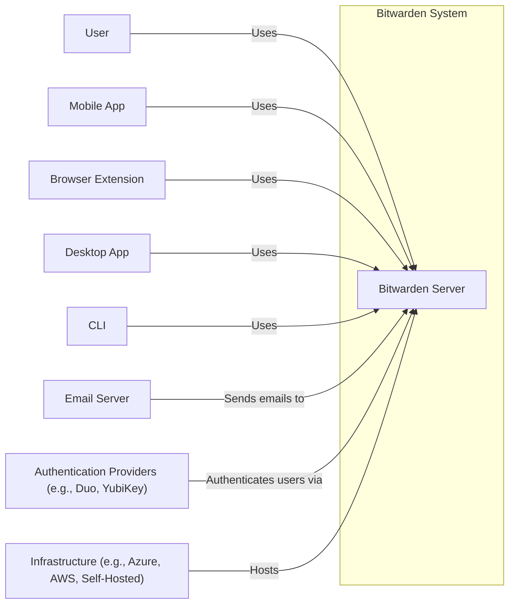
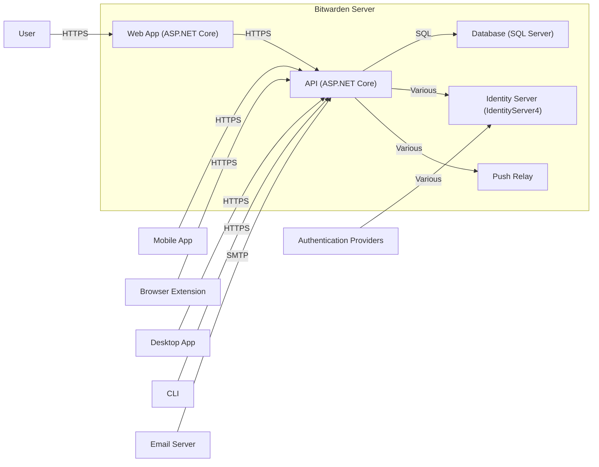
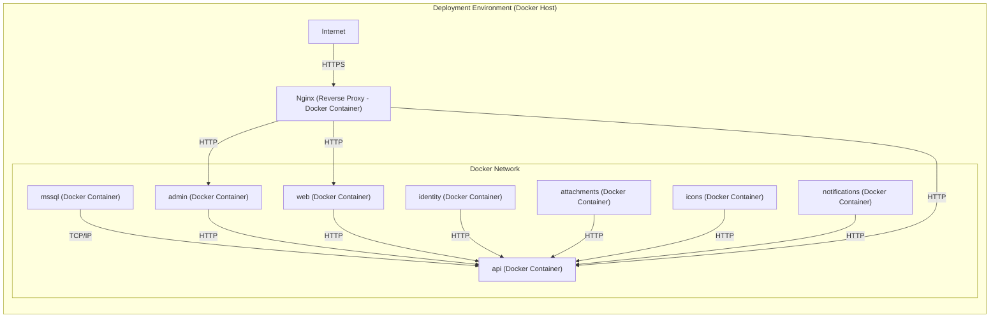
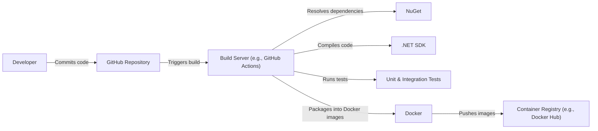

Okay, let's create a design document for the Bitwarden server project, focusing on aspects relevant to threat modeling.

# BUSINESS POSTURE

Bitwarden is an established open-source password management service.  The server component is critical for both individual users and enterprise customers.  The primary business goals are:

*   Provide a secure and reliable password management solution.
*   Maintain user trust and confidence in the platform's security.
*   Support both individual and enterprise use cases with appropriate features and scalability.
*   Enable self-hosting for users who prefer to manage their own infrastructure.
*   Continuously improve the security and functionality of the platform.

Key business priorities:

*   Data Confidentiality:  Protecting user credentials and other sensitive data is paramount.  A breach would be catastrophic to the business.
*   Data Integrity:  Ensuring that user data is not tampered with or corrupted is crucial.
*   Service Availability:  The service must be highly available to meet user needs.
*   Compliance:  Meeting relevant regulatory requirements (e.g., GDPR, HIPAA, SOC 2) is essential, especially for enterprise customers.
*   Reputation: Maintaining a strong security reputation is vital for continued growth and user trust.

Most important business risks:

*   Compromise of user credentials due to server-side vulnerabilities.
*   Data loss or corruption due to infrastructure failures or attacks.
*   Denial of service attacks impacting service availability.
*   Reputational damage resulting from security incidents.
*   Failure to meet compliance requirements, leading to legal and financial penalties.
*   Supply chain attacks targeting the build and deployment pipeline.

# SECURITY POSTURE

Existing security controls (based on the GitHub repository and general knowledge of Bitwarden):

*   security control: End-to-end encryption: User data is encrypted client-side before being sent to the server. The server never has access to the unencrypted data. Implemented in client applications.
*   security control: Secure password hashing:  Uses industry-standard algorithms like Argon2id for password hashing. Implemented in server code.
*   security control: Two-factor authentication (2FA):  Supports various 2FA methods to enhance account security. Implemented in server and client applications.
*   security control: Rate limiting:  Protects against brute-force attacks. Implemented in server code and potentially at the infrastructure level.
*   security control: Regular security audits and penetration testing:  Bitwarden undergoes regular security assessments. Described in security documentation and reports.
*   security control: Open-source codebase:  Allows for community review and scrutiny. Publicly available on GitHub.
*   security control: Bug bounty program:  Encourages responsible disclosure of vulnerabilities. Described in security documentation.
*   security control: HTTPS: Enforces encrypted communication between clients and the server. Implemented at the infrastructure level (e.g., load balancer, reverse proxy).
*   security control: Input validation: Server-side validation of user inputs to prevent injection attacks. Implemented in server code.
*   security control: Cross-Site Request Forgery (CSRF) protection: Implemented in server code.
*   security control: Content Security Policy (CSP): Implemented in server code and delivered via HTTP headers.
*   security control: Use of secure coding practices and frameworks: The project uses ASP.NET Core, which provides built-in security features. Implemented in server code.

Accepted risks:

*   accepted risk: Reliance on client-side security: The security model heavily relies on the security of the client applications. A compromise of the client could expose user data even if the server is secure.
*   accepted risk: Potential for zero-day vulnerabilities:  Like any software, Bitwarden is susceptible to unknown vulnerabilities.
*   accepted risk: User error:  Weak passwords, phishing attacks, and other user-related security lapses can compromise accounts.
*   accepted risk: Self-hosting risks: Users who self-host are responsible for securing their own infrastructure.

Recommended security controls:

*   Implement Subresource Integrity (SRI) for included JavaScript libraries to mitigate supply chain risks.
*   Implement robust logging and monitoring to detect and respond to security incidents.
*   Implement network segmentation to limit the impact of potential breaches.
*   Implement a Web Application Firewall (WAF) to protect against common web attacks.

Security Requirements:

*   Authentication:
    *   Support strong password policies (length, complexity).
    *   Enforce 2FA for all users (or provide strong recommendations).
    *   Protect against brute-force and credential stuffing attacks.
    *   Securely store and manage user authentication tokens.
    *   Implement secure session management.

*   Authorization:
    *   Implement role-based access control (RBAC) for enterprise features.
    *   Ensure that users can only access their own data.
    *   Enforce least privilege principles.

*   Input Validation:
    *   Validate all user inputs on the server-side.
    *   Sanitize data to prevent cross-site scripting (XSS) attacks.
    *   Protect against SQL injection and other injection vulnerabilities.

*   Cryptography:
    *   Use strong, industry-standard encryption algorithms (e.g., AES-256, RSA).
    *   Securely manage cryptographic keys.
    *   Use secure random number generators.
    *   Regularly review and update cryptographic implementations.

# DESIGN

## C4 CONTEXT

C4 Context Element Descriptions:

*   Element:
    *   Name: User
    *   Type: Person
    *   Description: A person who uses Bitwarden to manage their passwords and other sensitive data.
    *   Responsibilities: Authenticates with Bitwarden, manages their vault, interacts with the various Bitwarden clients.
    *   Security controls: Strong passwords, 2FA, secure device management.

*   Element:
    *   Name: Mobile App
    *   Type: Software System
    *   Description: Bitwarden mobile application for iOS and Android.
    *   Responsibilities: Provides access to the user's vault on mobile devices, performs client-side encryption/decryption.
    *   Security controls: End-to-end encryption, secure storage of encryption keys, biometric authentication.

*   Element:
    *   Name: Browser Extension
    *   Type: Software System
    *   Description: Bitwarden browser extension for various web browsers.
    *   Responsibilities: Provides access to the user's vault within the browser, autofills credentials, performs client-side encryption/decryption.
    *   Security controls: End-to-end encryption, secure communication with the browser, protection against XSS.

*   Element:
    *   Name: Desktop App
    *   Type: Software System
    *   Description: Bitwarden desktop application for Windows, macOS, and Linux.
    *   Responsibilities: Provides access to the user's vault on desktop computers, performs client-side encryption/decryption.
    *   Security controls: End-to-end encryption, secure storage of encryption keys, OS-level security features.

*   Element:
    *   Name: CLI
    *   Type: Software System
    *   Description: Bitwarden command-line interface.
    *   Responsibilities: Provides access to the user's vault via the command line, allows for scripting and automation.
    *   Security controls: End-to-end encryption, secure storage of encryption keys.

*   Element:
    *   Name: Bitwarden Server
    *   Type: Software System
    *   Description: The core server component of Bitwarden.
    *   Responsibilities: Handles user authentication, stores encrypted user data, manages organizations and collections, provides API access for clients.
    *   Security controls: Secure password hashing, rate limiting, input validation, CSRF protection, CSP, HTTPS.

*   Element:
    *   Name: Email Server
    *   Type: Software System
    *   Description: An external email server used for sending notifications, account verification emails, etc.
    *   Responsibilities: Delivers emails to users.
    *   Security controls: Secure email protocols (e.g., TLS), sender authentication (e.g., SPF, DKIM, DMARC).

*   Element:
    *   Name: Authentication Providers (e.g., Duo, YubiKey)
    *   Type: Software System
    *   Description: External services used for two-factor authentication.
    *   Responsibilities: Provides 2FA services.
    *   Security controls: Secure authentication protocols, hardware security modules (HSMs) for key management.

*   Element:
    *   Name: Infrastructure (e.g., Azure, AWS, Self-Hosted)
    *   Type: Infrastructure
    *   Description: The underlying infrastructure on which the Bitwarden server is deployed.
    *   Responsibilities: Provides compute, storage, and networking resources.
    *   Security controls: Firewalls, intrusion detection/prevention systems, regular security updates, access controls.

## C4 CONTAINER

C4 Container Element Descriptions:

*   Element:
    *   Name: Web App (ASP.NET Core)
    *   Type: Web Application
    *   Description: The web application component, providing the user interface for the web vault.
    *   Responsibilities: Serves the web vault, handles user interaction, communicates with the API.
    *   Security controls: CSP, XSS protection, HTTPS.

*   Element:
    *   Name: API (ASP.NET Core)
    *   Type: API Application
    *   Description: The core API component, handling all business logic and data access.
    *   Responsibilities: Handles user authentication, manages user data, provides API access for clients.
    *   Security controls: Input validation, secure password hashing, rate limiting, CSRF protection, authorization checks.

*   Element:
    *   Name: Database (SQL Server)
    *   Type: Database
    *   Description: The database storing encrypted user data and other application data.
    *   Responsibilities: Stores data persistently and securely.
    *   Security controls: Encryption at rest, access controls, auditing.

*   Element:
    *   Name: Identity Server (IdentityServer4)
    *   Type: Web Application
    *   Description: Handles user authentication and authorization.
    *   Responsibilities: Manages user accounts, issues authentication tokens, handles 2FA.
    *   Security controls: Secure authentication protocols, secure token management.

*   Element:
    *   Name: Push Relay
    *   Type: Application
    *   Description: Service for sending push notifications to clients.
    *   Responsibilities: Delivers push notifications to mobile and desktop clients.
    *   Security controls: Secure communication channels, authentication of clients.

*   Element:
    *   Name: User
    *   Type: Person
    *   Description: A person who uses Bitwarden to manage their passwords.
    *   Responsibilities: Authenticates, manages vault, interacts with clients.
    *   Security controls: Strong passwords, 2FA, secure device.

*   Element:
    *   Name: Mobile App
    *   Type: Software System
    *   Description: Bitwarden mobile application.
    *   Responsibilities: Accesses vault, client-side encryption.
    *   Security controls: End-to-end encryption, biometric authentication.

*   Element:
    *   Name: Browser Extension
    *   Type: Software System
    *   Description: Bitwarden browser extension.
    *   Responsibilities: Accesses vault, autofills, client-side encryption.
    *   Security controls: End-to-end encryption, XSS protection.

*   Element:
    *   Name: Desktop App
    *   Type: Software System
    *   Description: Bitwarden desktop application.
    *   Responsibilities: Accesses vault, client-side encryption.
    *   Security controls: End-to-end encryption, OS-level security.

*   Element:
    *   Name: CLI
    *   Type: Software System
    *   Description: Bitwarden command-line interface.
    *   Responsibilities: Accesses vault via command line.
    *   Security controls: End-to-end encryption.

*   Element:
    *   Name: Email Server
    *   Type: Software System
    *   Description: External email server.
    *   Responsibilities: Delivers emails.
    *   Security controls: TLS, SPF, DKIM, DMARC.

*   Element:
    *   Name: Authentication Providers
    *   Type: Software System
    *   Description: External 2FA services.
    *   Responsibilities: Provides 2FA.
    *   Security controls: Secure authentication, HSMs.

## DEPLOYMENT

Possible deployment solutions:

1.  Self-hosting using Docker: This is a popular option for users who want full control over their data.
2.  Self-hosting without Docker:  This involves manually installing and configuring all dependencies.
3.  Cloud deployment (Azure, AWS, GCP, etc.):  Bitwarden can be deployed to various cloud platforms.
4.  Bitwarden Cloud: Using Bitwarden's own hosted service.

Chosen solution for detailed description: Self-hosting using Docker.

Deployment Element Descriptions:

*   Element:
    *   Name: Docker Host
    *   Type: Infrastructure
    *   Description: The physical or virtual machine hosting the Docker containers.
    *   Responsibilities: Provides the runtime environment for the containers.
    *   Security controls: OS hardening, firewall, intrusion detection/prevention.

*   Element:
    *   Name: Docker Network
    *   Type: Network
    *   Description: The virtual network connecting the Docker containers.
    *   Responsibilities: Facilitates communication between containers.
    *   Security controls: Network segmentation, firewall rules.

*   Element:
    *   Name: mssql (Docker Container)
    *   Type: Container
    *   Description: The SQL Server database container.
    *   Responsibilities: Stores encrypted user data.
    *   Security controls: Encryption at rest, access controls, strong passwords.

*   Element:
    *   Name: admin (Docker Container)
    *   Type: Container
    *   Description: The admin panel container.
    *   Responsibilities: Provides administrative interface.
    *   Security controls: Authentication, authorization, input validation.

*   Element:
    *   Name: web (Docker Container)
    *   Type: Container
    *   Description: The web vault container.
    *   Responsibilities: Serves the web vault.
    *   Security controls: CSP, XSS protection.

*   Element:
    *   Name: api (Docker Container)
    *   Type: Container
    *   Description: The API container.
    *   Responsibilities: Handles business logic and data access.
    *   Security controls: Input validation, secure password hashing, rate limiting.

*   Element:
    *   Name: identity (Docker Container)
    *   Type: Container
    *   Description: The IdentityServer container.
    *   Responsibilities: Manages user authentication.
    *   Security controls: Secure authentication protocols, secure token management.

*   Element:
    *   Name: attachments (Docker Container)
    *   Type: Container
    *   Description: Container for handling file attachments.
    *   Responsibilities: Stores and serves file attachments.
    *   Security controls: Virus scanning, file type validation.

*   Element:
    *   Name: icons (Docker Container)
    *   Type: Container
    *   Description: Container for serving website icons.
    *   Responsibilities: Stores and serves website icons.
    *   Security controls: Access controls.

*   Element:
    *   Name: notifications (Docker Container)
    *   Type: Container
    *   Description: Container for handling push notifications.
    *   Responsibilities: Sends push notifications to clients.
    *   Security controls: Secure communication channels.

*   Element:
    *   Name: Nginx (Reverse Proxy - Docker Container)
    *   Type: Container
    *   Description: The Nginx reverse proxy container.
    *   Responsibilities: Handles TLS termination, load balancing, and routing.
    *   Security controls: HTTPS configuration, TLS certificate management, WAF (optional).

*   Element:
    *   Name: Internet
    *   Type: External
    *   Description: The public internet.
    *   Responsibilities: Provides connectivity to users.
    *   Security controls: N/A

## BUILD

The Bitwarden server project uses a combination of build tools and scripts, primarily within the .NET ecosystem. The build process is automated and can be executed locally or within a CI/CD environment.

1.  **Source Code:** Developers work on the codebase, committing changes to the Git repository (GitHub).
2.  **Build Trigger:** A build is triggered manually or automatically (e.g., on commit, on tag).
3.  **Dependency Resolution:** NuGet is used to manage .NET dependencies.
4.  **Compilation:** The .NET SDK compiles the source code into intermediate language (IL) assemblies.
5.  **Testing:** Unit tests and integration tests are executed.
6.  **Packaging:** The compiled code and dependencies are packaged into Docker images.
7.  **Publishing:** Docker images are pushed to a container registry (e.g., Docker Hub, Azure Container Registry).

Security Controls in Build Process:

*   security control: Static Application Security Testing (SAST): SAST tools can be integrated into the build process to identify potential vulnerabilities in the source code.
*   security control: Software Composition Analysis (SCA): SCA tools can be used to scan dependencies for known vulnerabilities.
*   security control: Code signing:  Build artifacts (e.g., Docker images) can be signed to ensure their integrity and authenticity.
*   security control: Build server hardening: The build server itself should be secured to prevent unauthorized access and tampering.
*   security control: Least privilege: Build processes should run with the minimum necessary privileges.

# RISK ASSESSMENT

Critical Business Processes:

*   User authentication and authorization.
*   Secure storage and retrieval of encrypted user data.
*   Management of organizations and collections (for enterprise users).
*   Delivery of push notifications.
*   Email notifications.

Data Sensitivity:

*   User credentials (encrypted): Highest sensitivity.  Even though encrypted, a compromise could lead to attempts to decrypt the data.
*   User vault data (encrypted): Highest sensitivity.  Contains all the user's sensitive information.
*   Organization data (encrypted): High sensitivity.  Contains information about organizations and their members.
*   Email addresses: Medium sensitivity.  Used for communication and account recovery.
*   IP addresses: Low sensitivity.  Used for logging and rate limiting.

# QUESTIONS & ASSUMPTIONS

Questions:

*   What specific compliance requirements (e.g., GDPR, HIPAA, SOC 2) does Bitwarden need to meet?
*   What is the target threat model for self-hosted deployments? (e.g., sophisticated nation-state actors, opportunistic attackers)
*   What are the specific performance and scalability requirements for the server?
*   What is the process for handling security vulnerabilities discovered in third-party dependencies?
*   Are there any specific hardware security requirements (e.g., HSMs)?
*   What is the disaster recovery plan for the Bitwarden server?

Assumptions:

*   BUSINESS POSTURE: Bitwarden prioritizes security above all else.
*   SECURITY POSTURE: The existing security controls described in the documentation are implemented correctly.
*   DESIGN: The provided design diagrams are a reasonable representation of the actual system architecture. The system uses Docker and docker-compose for deployments. Client applications handle encryption/decryption.