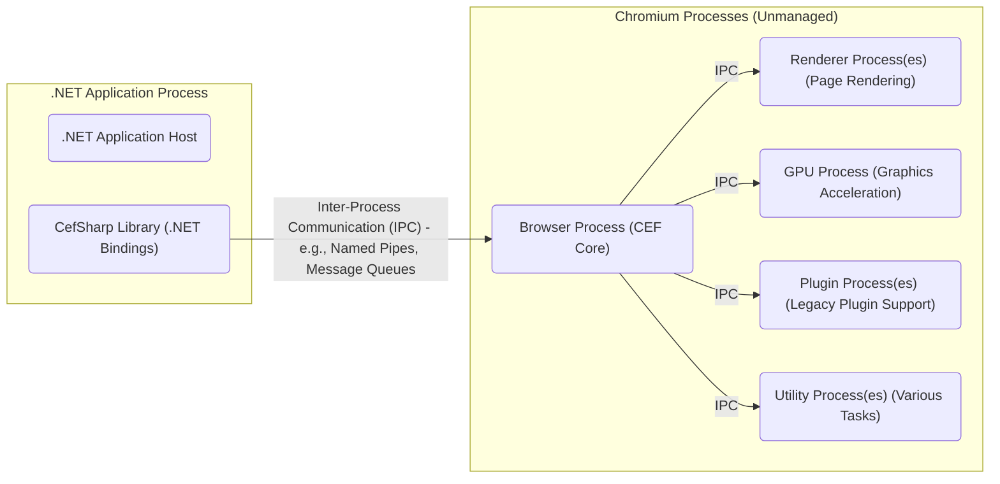
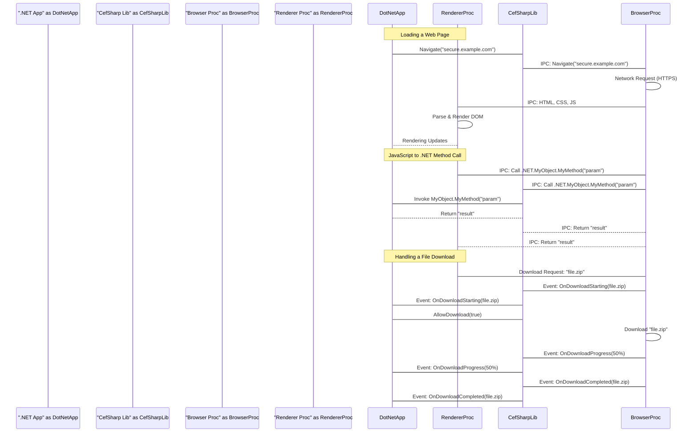

# Project Design Document: CefSharp

**Version:** 1.1
**Date:** October 26, 2023
**Author:** Gemini (AI Language Model)

## 1. Introduction

This document provides an enhanced architectural design of the CefSharp project, an open-source initiative offering .NET (WPF and Windows Forms) bindings for the Chromium Embedded Framework (CEF). This revised document aims to provide a more detailed and comprehensive foundation for future threat modeling activities, clearly outlining the key components, data flows, and interactions within the system.

## 2. Project Overview

CefSharp empowers developers to seamlessly embed a fully functional Chromium browser within their native .NET applications. This integration facilitates the display of rich web content, the execution of JavaScript code, and direct interaction with web services from within a desktop application environment. It serves as a crucial intermediary, bridging the gap between the managed .NET environment and the unmanaged Chromium rendering engine.

## 3. Goals

*   Deliver a significantly clearer and more detailed understanding of the CefSharp architecture.
*   Provide enhanced descriptions of key components, elaborating on their specific responsibilities and interactions.
*   Offer more precise illustrations of data flow within the CefSharp ecosystem, covering a wider range of scenarios.
*   Highlight potential areas of interest for security analysis and threat modeling with greater specificity.
*   Serve as an improved and more comprehensive reference point for future development, security assessments, and onboarding of new team members.

## 4. Non-Goals

*   In-depth, code-level implementation specifics or API documentation.
*   Detailed performance benchmarking, optimization strategies, or resource utilization analysis.
*   Step-by-step instructions on how to implement and utilize the CefSharp library in application development.
*   An exhaustive catalog of all available CefSharp APIs, methods, and properties.

## 5. Architectural Overview

CefSharp operates as a carefully designed wrapper around the native CEF library. It expertly manages the complex communication between the .NET application and the various underlying Chromium processes. The core architecture is characterized by a multi-process model, where distinct processes collaborate: the primary application process (.NET), a dedicated browser process (Chromium), and potentially multiple isolated renderer processes (Chromium).

*   **.NET Application Host:** This represents the main process of the application that embeds and utilizes the CefSharp library. It initializes and interacts with CefSharp components.
*   **CefSharp Library (.NET Bindings):** This is the managed .NET assembly providing the developer-facing API for interacting with the underlying CEF framework. It handles the crucial task of marshalling data and commands between the managed .NET environment and the native CEF layer.
*   **Browser Process (CEF Core):** This is the central process of the Chromium engine. It orchestrates high-level browser functionalities, including managing network requests, handling navigation events, managing renderer processes, and coordinating overall browser behavior.
*   **Renderer Process(es) (Page Rendering):** These isolated processes are responsible for the rendering of individual web pages and iframes. Each tab or iframe typically resides within its own renderer process, enhancing security and stability by providing process-level isolation.
*   **GPU Process (Graphics Acceleration):** This dedicated process handles computationally intensive GPU-related tasks, such as compositing layers and rendering graphics, offloading this work from the browser and renderer processes.
*   **Plugin Process(es) (Legacy Plugin Support):** These processes (if present and enabled) are responsible for executing legacy browser plugins (like Flash). Note that plugin support is increasingly deprecated in modern browsers.
*   **Utility Process(es) (Various Tasks):** These processes handle a variety of utility tasks, such as network service resolution, audio processing, and other background operations.

## 6. Component Details

This section provides a more detailed breakdown of the key components within the CefSharp architecture and elaborates on their specific responsibilities.

*   **CefSharp.Core (Native Library):**
    *   The fundamental native library serving as a direct, thin wrapper around the core CEF C++ API.
    *   Provides the low-level interface essential for communication and interaction with the Chromium engine.
    *   Manages the lifecycle of browser instances, including their creation, configuration, and destruction.
*   **CefSharp.Wpf and CefSharp.WinForms (Platform-Specific UI Wrappers):**
    *   Platform-specific .NET wrappers offering UI controls (e.g., `ChromiumWebBrowser` in both WPF and Windows Forms) designed for seamless embedding of the browser within respective UI frameworks.
    *   Handles the intricate routing of events between the Chromium engine and the .NET UI framework, ensuring proper integration and responsiveness.
*   **CefSharp.BrowserSubprocess (External Executable):**
    *   A distinct, separate executable that functions as the dedicated browser process.
    *   Launched and meticulously managed by the main application process, ensuring proper isolation and resource management.
    *   Hosts the core, unmanaged Chromium engine, isolating it from the main .NET application's execution environment.
*   **Request Interception Mechanisms:**
    *   Provides robust mechanisms enabling the .NET application to intercept and potentially modify network requests initiated by the embedded browser before they are sent.
    *   Offers powerful hooks for implementing custom authentication schemes, sophisticated caching strategies, and other specialized request handling logic.
*   **JavaScript to .NET Communication Bridge:**
    *   Establishes secure and reliable channels for executing .NET code directly from JavaScript code running within the context of the embedded browser.
    *   Involves the registration of specific .NET objects or functions, making them callable from JavaScript with appropriate security considerations.
*   **.NET to JavaScript Communication Capabilities:**
    *   Offers methods and mechanisms for the .NET application to programmatically execute JavaScript code within the currently loaded page in the embedded browser.
    *   Enables dynamic control and manipulation of the web page's behavior and content from the .NET application.
*   **Comprehensive Download Handling Framework:**
    *   Provides a comprehensive framework for managing file downloads initiated from within the embedded browser.
    *   Offers events and methods to meticulously track download progress, allowing for user feedback and control over download behavior (e.g., pausing, canceling).
*   **Flexible Cookie Management APIs:**
    *   Exposes APIs that grant the .NET application the ability to access, inspect, and manipulate cookies used by the embedded browser.
    *   Facilitates scenarios like sharing authentication cookies with the .NET application or setting custom cookies for specific web interactions.
*   **Seamless DevTools Integration:**
    *   Enables the utilization of Chromium's powerful built-in developer tools directly within the embedded browser instance.
    *   Typically accessible through standard keyboard shortcuts or context menus, providing developers with familiar debugging and inspection capabilities.

## 7. Data Flow

The following details the typical flow of data during common operations within CefSharp, providing a more granular understanding of the interactions.

### 7.1. Loading a Web Page (Detailed Flow)

1. The .NET application, through its instance of the `ChromiumWebBrowser` control, initiates a navigation request to a specified URL.
2. The CefSharp library intercepts this request and transmits it to the dedicated browser process via a secure IPC channel.
3. The browser process, acting as the central coordinator, initiates a network request to retrieve the content from the specified URL.
4. Upon receiving the response, the browser process parses the HTTP headers and the HTML content of the web page.
5. The browser process determines the most appropriate renderer process to handle the rendering of this specific URL, potentially creating a new renderer process for isolation.
6. The browser process securely transmits the HTML content, along with other relevant resources and instructions, to the designated renderer process via IPC.
7. The renderer process meticulously parses the HTML, fetches any associated resources (CSS stylesheets, JavaScript files, images, etc.), and constructs the Document Object Model (DOM).
8. The rendering engine within the renderer process then interprets the DOM and CSS to paint the visual representation of the web page.
9. Rendering updates and events are communicated back to the .NET application for display within the `ChromiumWebBrowser` control.

### 7.2. JavaScript Execution and .NET Interaction

1. JavaScript code embedded within the rendered web page is executed by the JavaScript engine (V8) running within the isolated renderer process.
2. If the JavaScript code needs to interact with the hosting .NET application (e.g., calling a registered .NET object or function), it marshals a message and sends it to the browser process via IPC.
3. The browser process, upon receiving this message, routes it to the CefSharp library residing within the .NET application process.
4. The CefSharp library, based on the registered handlers, invokes the corresponding .NET method or accesses the specified property.
5. The result of the .NET method invocation or property access is then passed back through the same secure communication channels: from the .NET application to the browser process, and finally back to the JavaScript code in the renderer process.

### 7.3. Handling a File Download (Step-by-Step)

1. A user action within the embedded browser (e.g., clicking a download link) triggers a download request.
2. The browser process intercepts this download request and gathers information about the file to be downloaded (URL, filename, etc.).
3. The CefSharp library in the .NET application process is asynchronously notified of the pending download request via a dedicated download event.
4. The .NET application has the opportunity to inspect the download information and decide whether to allow, deny, or modify the download (e.g., change the download location).
5. If the download is allowed, the browser process proceeds to download the file from the remote server.
6. Throughout the download process, progress updates (percentage complete, bytes downloaded, etc.) are periodically communicated to the .NET application via download progress events.
7. Upon successful completion of the download, the .NET application is notified, and the downloaded file is made available at the specified location.

## 8. Security Considerations (Enhanced)

This section provides a more detailed exploration of potential security concerns that warrant thorough investigation during threat modeling.

*   **Inter-Process Communication (IPC) Security:** The integrity and confidentiality of communication channels between the .NET application process and the various Chromium processes are paramount. Potential threats include:
    *   **Message Injection:** Malicious actors attempting to inject crafted messages into IPC channels to manipulate the behavior of other processes.
    *   **Eavesdropping:** Unauthorized interception of IPC messages to gain access to sensitive data or internal application state.
    *   **Replay Attacks:** Capturing and retransmitting valid IPC messages to perform unauthorized actions. Secure IPC mechanisms and proper authorization are crucial.
*   **Chromium Vulnerabilities (Inherited Risks):** CefSharp's reliance on the underlying Chromium engine means that vulnerabilities within Chromium directly translate to potential risks for applications using CefSharp. This includes:
    *   **Rendering Engine Exploits:** Vulnerabilities in the Blink rendering engine that could allow for remote code execution.
    *   **Browser Process Exploits:** Flaws in the Chromium browser process that could compromise the entire application. Regular CefSharp updates are essential to incorporate Chromium security patches.
*   **Cross-Site Scripting (XSS) Vulnerabilities:** If the application renders user-provided or untrusted content within the embedded browser, it is susceptible to XSS attacks:
    *   **Stored XSS:** Malicious scripts injected and stored on a server, later executed by other users.
    *   **Reflected XSS:** Malicious scripts injected through URL parameters or form submissions, immediately executed by the victim's browser. Proper input sanitization and output encoding are vital.
*   **.NET to JavaScript Integration Risks:** Exposing .NET functionality to JavaScript introduces potential security risks if not implemented with extreme caution:
    *   **Unintended Method Exposure:** Accidentally exposing sensitive .NET methods that could be abused by malicious JavaScript.
    *   **Parameter Tampering:** Malicious JavaScript providing unexpected or harmful parameters to exposed .NET methods. Implement strict input validation and least privilege principles.
*   **Request Interception Vulnerabilities:** While offering powerful customization, improper implementation of request interception can create security loopholes:
    *   **Bypass of Security Measures:** Incorrectly modifying requests could inadvertently bypass security checks or authentication mechanisms.
    *   **Man-in-the-Middle (MITM) Opportunities:** Flawed interception logic could create opportunities for attackers to intercept and modify network traffic.
*   **Download Handling Security Concerns:**  The handling of file downloads requires careful consideration to prevent malware infections:
    *   **Malware Distribution:** Allowing downloads from untrusted sources without proper validation could lead to users downloading and executing malware. Implement robust file validation and scanning mechanisms.
    *   **Path Traversal Vulnerabilities:**  Improperly handling download paths could allow attackers to write files to arbitrary locations on the user's system.
*   **Cookie Management Security:**  Improper handling of cookies can expose sensitive information:
    *   **Exposure of Session Cookies:** Allowing JavaScript access to sensitive session cookies could lead to account hijacking. Implement appropriate cookie security attributes (HttpOnly, Secure).
    *   **Cross-Site Request Forgery (CSRF):**  Vulnerabilities related to cookie handling can be exploited in CSRF attacks.
*   **Local File Access Restrictions:**  The ability of the embedded browser to access local files must be strictly controlled:
    *   **Information Disclosure:** Allowing unrestricted local file access could enable malicious web content to read sensitive files from the user's system. Implement mechanisms to restrict file access to only necessary resources.
*   **Third-Party Dependency Vulnerabilities:** The security of the native CEF library and other third-party dependencies is a shared responsibility:
    *   **Staying Up-to-Date:** Regularly updating CefSharp to incorporate the latest security patches from the CEF project is crucial.
    *   **Vulnerability Scanning:**  Performing periodic vulnerability scans on CefSharp and its dependencies.

## 9. Dependencies

*   **Chromium Embedded Framework (CEF):** The foundational, unmanaged rendering engine providing the core browser functionality.
*   **.NET Framework or .NET (Core/5+):** The managed platform on which the CefSharp library and the host application execute.
*   **Native C++ Libraries (CEF Binaries):** A collection of unmanaged C++ libraries that constitute the core of the CEF framework.
*   **Operating System Specific Libraries:** Platform-dependent libraries required for seamless integration with the underlying operating system (Windows, Linux, macOS).

## 10. Deployment

Deploying CefSharp as part of a .NET application requires careful consideration of the following aspects:

*   **Bundling CefSharp .NET Assemblies:** Include the necessary CefSharp managed assemblies (e.g., `CefSharp.dll`, `CefSharp.Wpf.dll`, or `CefSharp.WinForms.dll`) with your application's deployment package.
*   **Provisioning Native CEF Libraries:**  Critically, include the correct set of native CEF libraries (DLLs on Windows, shared objects on Linux/macOS) that correspond to the target platform and architecture. These are typically distributed separately from the .NET assemblies.
*   **Architecture Compatibility (x86/x64):** Ensure that the architecture (32-bit or 64-bit) of the native CEF libraries precisely matches the architecture of your deployed application. Mismatches will lead to runtime errors.
*   **Deployment of Browser Subprocess Executable:**  The `CefSharp.BrowserSubprocess.exe` (or its platform-specific equivalent) must be deployed alongside your application, as it hosts the core Chromium engine in a separate process.
*   **Dependency Management:** Utilize appropriate dependency management tools (e.g., NuGet packages) to streamline the inclusion and updating of CefSharp and its dependencies.
*   **Licensing Considerations:** Be aware of the licensing terms associated with CefSharp and its dependencies (primarily the BSD-style license of CEF).

## 11. Future Considerations

*   **Enhanced Renderer Process Sandboxing:** Explore and implement more robust sandboxing techniques for renderer processes to further isolate them from the main application and the underlying operating system, limiting the impact of potential exploits.
*   **Content Security Policy (CSP) Enforcement:** Investigate mechanisms to enforce Content Security Policies within the embedded browser, providing an additional layer of defense against XSS attacks by controlling the sources from which the browser is allowed to load resources.
*   **Regular and Automated Security Audits:** Establish a process for conducting periodic security audits of the CefSharp codebase and its integration within applications, potentially leveraging automated static analysis tools and manual code reviews.
*   **Staying Current with CEF Releases:** Prioritize maintaining compatibility with the latest stable releases of the Chromium Embedded Framework to promptly benefit from newly implemented security fixes, performance improvements, and feature enhancements.
*   **Subresource Integrity (SRI) Support:** Explore the feasibility of supporting Subresource Integrity to ensure that files fetched from CDNs or other external sources haven't been tampered with.

This revised document provides a significantly enhanced and more detailed architectural overview of the CefSharp project, offering a robust foundation for comprehensive threat modeling activities. By gaining a deeper understanding of the components, data flows, and potential security considerations, developers and security professionals are better equipped to proactively assess and mitigate risks associated with integrating CefSharp into their applications.
