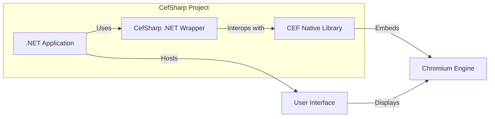

# BUSINESS POSTURE

The CefSharp project aims to provide a .NET wrapper for the Chromium Embedded Framework (CEF). This allows developers to embed a fully functional web browser into their .NET applications.

Business Priorities and Goals:

- Enable .NET developers to easily integrate web browsing capabilities into their desktop applications.
- Provide a modern and feature-rich browser engine based on Chromium, ensuring compatibility with modern web standards.
- Offer a cross-platform solution for embedding browsers in .NET applications (Windows, Linux, macOS).
- Maintain an active and community-driven project to ensure ongoing support and updates, keeping pace with Chromium and .NET developments.
- Provide a stable and reliable library suitable for use in production applications.

Business Risks:

- Security vulnerabilities in the underlying Chromium Embedded Framework could directly impact applications using CefSharp.
- Compatibility issues between CefSharp, CEF, and different .NET versions or operating systems could lead to application instability or malfunction.
- Lack of timely updates and security patches for CefSharp could expose applications to known vulnerabilities.
- Dependence on the Chromium project's roadmap and changes, which are outside of CefSharp's direct control.
- Potential for breaking changes in CEF or .NET that require significant rework in CefSharp and applications using it.

# SECURITY POSTURE

Existing Security Controls:

- security control: Utilizes the security features of the Chromium Embedded Framework, which is based on the Chromium browser. Chromium has a strong security track record and undergoes continuous security audits and updates. (Implemented within CEF, inherited by CefSharp)
- security control: Relies on the .NET framework's security features and runtime environment. (Implemented by .NET runtime environment)
- security control: Open-source project with community review, allowing for broader scrutiny of the codebase for potential vulnerabilities. (Implemented through open-source development model and GitHub)
- security control: Regular updates to incorporate newer versions of CEF, including security patches from the Chromium project. (Implemented through project release cycle and dependency updates)

Accepted Risks:

- accepted risk: Inherited vulnerabilities from the upstream Chromium project before they are patched and released in CEF and subsequently CefSharp.
- accepted risk: Potential for vulnerabilities in the CefSharp wrapper code itself, although the codebase is relatively thin as it primarily wraps CEF.
- accepted risk: Risk of misconfiguration or misuse of CefSharp by developers embedding it in their applications, leading to security weaknesses in those applications.
- accepted risk: Reliance on the security of the underlying operating system and hardware where applications using CefSharp are deployed.

Recommended Security Controls:

- security control: Implement automated security scanning (SAST/DAST) for the CefSharp codebase and build process to identify potential vulnerabilities early in the development lifecycle.
- security control: Establish a clear process for reporting and handling security vulnerabilities, including a security policy and contact information.
- security control: Provide security guidelines and best practices for developers using CefSharp to embed browsers securely in their applications, covering topics like input validation, origin control, and handling of sensitive data within the browser context.
- security control: Conduct regular security audits or penetration testing of applications that heavily rely on CefSharp to identify and mitigate application-level security risks.

Security Requirements:

- Authentication: CefSharp itself does not handle user authentication. Authentication is typically managed by the web applications loaded within the embedded browser or by the host .NET application. Security requirement: Applications using CefSharp should implement appropriate authentication mechanisms for web content and application features, as needed.
- Authorization: CefSharp does not enforce authorization policies. Authorization is the responsibility of the web applications and the host .NET application. Security requirement: Applications using CefSharp must implement proper authorization controls to restrict access to sensitive resources and functionalities, both within the embedded browser and the host application.
- Input Validation: CefSharp renders web content, which inherently involves processing various forms of input. Input validation is primarily the responsibility of the web applications loaded within CefSharp. Security requirement: Applications using CefSharp should ensure that web applications loaded within the browser perform robust input validation to prevent injection attacks (e.g., XSS, SQL injection if the web app interacts with a backend). Additionally, consider validating any data passed between the .NET application and the embedded browser via CefSharp's inter-process communication mechanisms.
- Cryptography: CefSharp relies on Chromium's built-in cryptography capabilities for secure communication (HTTPS) and handling of encrypted web content. Security requirement: Ensure that applications using CefSharp enforce HTTPS for all sensitive web traffic within the embedded browser. If the .NET application needs to handle sensitive data passed to or from the browser, consider using appropriate encryption methods provided by the .NET framework.

# DESIGN

## C4 CONTEXT

```mermaid
graph LR
    subgraph "Company A"
        SystemBoundary(sb)
        sb -- CefSharp Project -- User[User]
        sb -- CefSharp Project -- OS[Operating System]
        sb -- CefSharp Project -- DotNetFramework[.NET Framework]
        sb -- CefSharp Project -- CEF[Chromium Embedded Framework]
    end
    User -- Uses --> CefSharp Project
    CefSharp Project -- Runs on --> OS
    CefSharp Project -- Requires --> DotNetFramework
    CefSharp Project -- Wraps --> CEF
    CEF -- Based on --> Chromium[Chromium Browser]
    style SystemBoundary fill:transparent,stroke-dasharray: 5 5
```

Context Diagram Elements:

- Element:
  - Name: User
  - Type: Person
  - Description: End-user who interacts with the .NET application that embeds CefSharp.
  - Responsibilities: Uses the .NET application for its intended purpose, which involves interacting with web content rendered by CefSharp.
  - Security controls: User authentication within the .NET application (if applicable), operating system security controls on the user's machine.
- Element:
  - Name: CefSharp Project
  - Type: Software System
  - Description: .NET wrapper library for the Chromium Embedded Framework, enabling embedding of Chromium-based browsers in .NET applications.
  - Responsibilities: Provides .NET API for controlling and interacting with an embedded Chromium browser instance. Bridges .NET code and CEF functionality.
  - Security controls: Inherits security features from CEF and .NET Framework. Implements secure coding practices in the wrapper code. Relies on build process security controls.
- Element:
  - Name: Operating System
  - Type: Software System
  - Description: The operating system (Windows, Linux, macOS) on which the .NET application and CefSharp are running.
  - Responsibilities: Provides the runtime environment for .NET applications and CefSharp. Manages system resources and enforces OS-level security policies.
  - Security controls: Operating system level security controls (firewall, access control, patching, etc.).
- Element:
  - Name: .NET Framework
  - Type: Software System
  - Description: The .NET runtime environment required to run .NET applications and CefSharp.
  - Responsibilities: Provides the managed execution environment, libraries, and security features for .NET applications.
  - Security controls: .NET Framework security features (Code Access Security, etc.), runtime environment security.
- Element:
  - Name: Chromium Embedded Framework (CEF)
  - Type: Software System
  - Description: Open-source framework for embedding the Chromium browser engine into other applications. CefSharp is a wrapper around CEF.
  - Responsibilities: Provides the core browser engine functionality, including rendering, networking, JavaScript execution, and security features.
  - Security controls: Chromium's extensive security features, sandboxing, process isolation, regular security updates.
- Element:
  - Name: Chromium Browser
  - Type: Software System
  - Description: The open-source browser project that CEF is based on.
  - Responsibilities: Provides the upstream codebase and security updates that are incorporated into CEF.
  - Security controls: Chromium's browser security model, sandboxing, vulnerability patching process.

## C4 CONTAINER



Container Diagram Elements:

- Element:
  - Name: .NET Application
  - Type: Application
  - Description: The .NET application that is built by a developer and uses the CefSharp library to embed a browser.
  - Responsibilities: Hosts the CefSharp wrapper and utilizes its API to control the embedded browser. Implements application-specific logic and user interface.
  - Security controls: Application-level security controls (authentication, authorization, input validation within the .NET application code). Secure configuration and deployment of the .NET application.
- Element:
  - Name: CefSharp .NET Wrapper
  - Type: Library
  - Description: The .NET assembly (DLL) that provides the managed API for interacting with CEF. It's a wrapper around the native CEF library.
  - Responsibilities: Exposes .NET friendly interfaces to CEF functionality. Handles inter-process communication between the .NET application and the CEF native library.
  - Security controls: Secure coding practices in the wrapper implementation. Vulnerability scanning of the wrapper code.
- Element:
  - Name: CEF Native Library
  - Type: Native Library
  - Description: The native (C++) Chromium Embedded Framework library (DLL/SO/DYLIB) that CefSharp wraps.
  - Responsibilities: Provides the core browser engine functionality. Handles rendering, networking, JavaScript execution, and security features at the native level.
  - Security controls: Inherits Chromium's security features. Compiled with security flags and optimizations.
- Element:
  - Name: Chromium Engine
  - Type: Process
  - Description: The actual Chromium browser engine running as a separate process (or processes) managed by CEF.
  - Responsibilities: Renders web pages, executes JavaScript, handles network requests, and enforces Chromium's security policies.
  - Security controls: Chromium's sandboxing, process isolation, site isolation, and other browser security mechanisms.
- Element:
  - Name: User Interface
  - Type: User Interface
  - Description: The graphical user interface of the .NET application, which includes the embedded browser window provided by CefSharp.
  - Responsibilities: Presents the rendered web content to the user. Handles user interactions within the browser window.
  - Security controls: UI framework security considerations. Input handling and event processing security.

## DEPLOYMENT

Deployment Scenario: Standalone Desktop Application Deployment

```mermaid
graph LR
    subgraph "User's Machine"
        subgraph "Operating System"
            OSNode[Operating System (Windows/Linux/macOS)]
            DotNetRuntimeNode[.NET Runtime]
            AppFilesNode[Application Files]
            CEFSharpFilesNode[CefSharp Files]
            CEFFilesNode[CEF Files]
            AppProcessNode[Application Process]
            CEFProcessNode[CEF Browser Process]
        end
    end
    AppFilesNode -- Contains --> DotNetRuntimeNode
    CEFSharpFilesNode -- Contains --> DotNetRuntimeNode
    CEFFilesNode -- Contains --> OSNode
    AppProcessNode -- Runs on --> DotNetRuntimeNode
    CEFProcessNode -- Runs on --> OSNode
    AppProcessNode -- Uses --> CEFSharpFilesNode
    CEFSharpFilesNode -- Uses --> CEFFilesNode
    AppProcessNode -- Creates --> CEFProcessNode
```

Deployment Diagram Elements:

- Element:
  - Name: User's Machine
  - Type: Environment
  - Description: The end-user's computer where the .NET application using CefSharp is installed and running.
  - Responsibilities: Provides the physical hardware and operating system environment for the application.
  - Security controls: Physical security of the machine, operating system security controls, user account security.
- Element:
  - Name: Operating System (Windows/Linux/macOS)
  - Type: Infrastructure
  - Description: The operating system installed on the user's machine.
  - Responsibilities: Provides the base system for running applications, managing resources, and enforcing security policies.
  - Security controls: OS-level security features (firewall, access control, patching, anti-malware).
- Element:
  - Name: .NET Runtime
  - Type: Software
  - Description: The .NET runtime environment required to execute the .NET application and CefSharp.
  - Responsibilities: Provides the managed execution environment for .NET code.
  - Security controls: .NET runtime security features, security updates for the runtime.
- Element:
  - Name: Application Files
  - Type: Files
  - Description: Executable and library files of the .NET application itself.
  - Responsibilities: Contains the application's code and resources.
  - Security controls: File system permissions, code signing of executables.
- Element:
  - Name: CefSharp Files
  - Type: Files
  - Description: .NET wrapper assemblies and related files for CefSharp.
  - Responsibilities: Provides the .NET API for CEF.
  - Security controls: File system permissions, integrity checks of CefSharp files.
- Element:
  - Name: CEF Files
  - Type: Files
  - Description: Native CEF library files (DLLs/SOs/DYLIBs).
  - Responsibilities: Contains the core Chromium browser engine.
  - Security controls: File system permissions, integrity checks of CEF files.
- Element:
  - Name: Application Process
  - Type: Process
  - Description: The running process of the .NET application.
  - Responsibilities: Executes the application's code and interacts with CefSharp.
  - Security controls: Process isolation, application-level security controls.
- Element:
  - Name: CEF Browser Process
  - Type: Process
  - Description: The separate process spawned by CEF to run the Chromium engine.
  - Responsibilities: Renders web content and handles browser functionality.
  - Security controls: Chromium's process sandboxing and isolation.

## BUILD

```mermaid
graph LR
    Developer[Developer] --> SourceCodeRepository[Source Code Repository (GitHub)]
    SourceCodeRepository --> CI[CI/CD System (GitHub Actions, Jenkins)]
    CI -- Build --> BuildEnvironment[Build Environment]
    BuildEnvironment -- Compiler --> BuildArtifacts[Build Artifacts (.NET Assemblies, Native Libraries)]
    BuildArtifacts --> ArtifactRepository[Artifact Repository (NuGet, Local File System)]
    ArtifactRepository --> DeploymentEnvironment[Deployment Environment (User's Machine)]

    subgraph "Build Environment"
        BuildEnvironment -- SAST[SAST Scanner]
        BuildEnvironment -- DependencyCheck[Dependency Check]
        BuildEnvironment -- Linter[Code Linter]
    end

    style BuildEnvironment fill:#f9f,stroke:#333,stroke-width:2px
```

Build Process Description:

1. Developer writes code and commits changes to the Source Code Repository (e.g., GitHub).
2. CI/CD System (e.g., GitHub Actions, Jenkins) is triggered by code changes.
3. CI/CD System sets up a Build Environment.
4. Build Environment performs security checks:
    - SAST Scanner: Static Application Security Testing to find potential vulnerabilities in the code.
    - Dependency Check: Checks for known vulnerabilities in project dependencies (e.g., NuGet packages, CEF binaries).
    - Code Linter: Enforces code quality and style guidelines, which can indirectly improve security.
5. Build Environment compiles the code using a Compiler (.NET compiler, C++ compiler for CEF).
6. Compiler produces Build Artifacts: .NET assemblies (DLLs), native libraries (CEF binaries), and other necessary files.
7. Build Artifacts are stored in an Artifact Repository (e.g., NuGet for .NET packages, local file system for distribution).
8. Deployment Environment (User's Machine) retrieves Build Artifacts from the Artifact Repository for installation and execution.

Build Security Controls:

- security control: Secure Source Code Repository: Access control to the repository, branch protection, and audit logging. (Implemented by GitHub)
- security control: CI/CD Pipeline Security: Secure configuration of CI/CD system, access control, secrets management, and pipeline hardening. (Implemented by CI/CD system configuration)
- security control: Automated Security Scanning (SAST): Static analysis of code to detect potential vulnerabilities. (Implemented by SAST scanner in build pipeline)
- security control: Dependency Checking: Automated checks for known vulnerabilities in dependencies. (Implemented by dependency check tools in build pipeline)
- security control: Code Linting: Automated code quality checks and style enforcement. (Implemented by linters in build pipeline)
- security control: Secure Build Environment: Hardened build environment, access control, and regular patching. (Implemented by build environment configuration)
- security control: Code Signing: Signing of build artifacts to ensure integrity and authenticity. (Implemented during build and packaging process)
- security control: Artifact Repository Security: Access control to the artifact repository, integrity checks of artifacts. (Implemented by artifact repository security features)

# RISK ASSESSMENT

Critical Business Processes:

- Rendering and displaying web content within .NET applications. This is critical for applications that rely on web-based UIs or need to display online information.
- Interacting with web services and APIs from within .NET applications via the embedded browser. This is critical for applications that integrate with web-based platforms or services.
- User interaction with web content within the application. This is critical for user experience and application functionality.

Data Sensitivity:

- Data displayed and processed within the embedded browser: Sensitivity depends on the web applications loaded. Could include user credentials, personal information, financial data, or other sensitive content.
- Data exchanged between the .NET application and the embedded browser via CefSharp's inter-process communication: Sensitivity depends on the application's design. Could include application-specific data, user settings, or sensitive commands.
- Local storage and browser data within the embedded browser: Could contain browsing history, cookies, cached data, and potentially sensitive information depending on user activity and web application behavior. Sensitivity depends on the application's use case and data handling practices.

Data Sensitivity Levels (example, needs to be defined based on specific application context):

- Public: Non-sensitive, publicly available web content.
- Internal: Data intended for internal application use, not sensitive if exposed externally.
- Confidential: Data that requires protection from unauthorized access, such as user credentials or personal information.
- Highly Confidential: Extremely sensitive data, such as financial transactions or critical business data, requiring the highest level of security.

# QUESTIONS & ASSUMPTIONS

Questions:

- What type of .NET applications are intended to use CefSharp? (e.g., desktop applications, specific industry applications)
- What is the intended deployment environment for applications using CefSharp? (e.g., corporate networks, public internet, specific operating systems)
- What are the specific security requirements and compliance needs for applications using CefSharp? (e.g., GDPR, HIPAA, PCI DSS)
- Are there any specific security concerns or past incidents related to CefSharp or its usage?
- What is the process for reporting and handling security vulnerabilities in CefSharp?
- What are the guidelines and best practices for developers using CefSharp to build secure applications?

Assumptions:

- CefSharp is primarily used to embed web browser functionality into desktop .NET applications.
- Security is a significant concern for applications using CefSharp due to the nature of web browsers and potential exposure to web-based threats.
- Developers using CefSharp are responsible for implementing application-level security controls and following security best practices.
- The CefSharp project aims to provide a secure and reliable wrapper around CEF, but ultimate security depends on the underlying Chromium and the application's implementation.
- The build process for CefSharp includes basic security checks, but further enhancements might be beneficial.