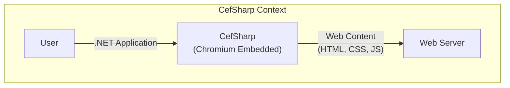
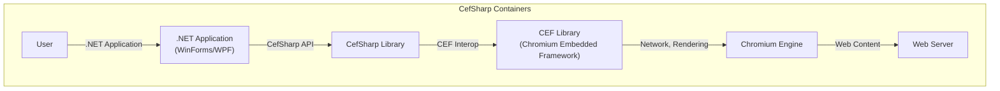
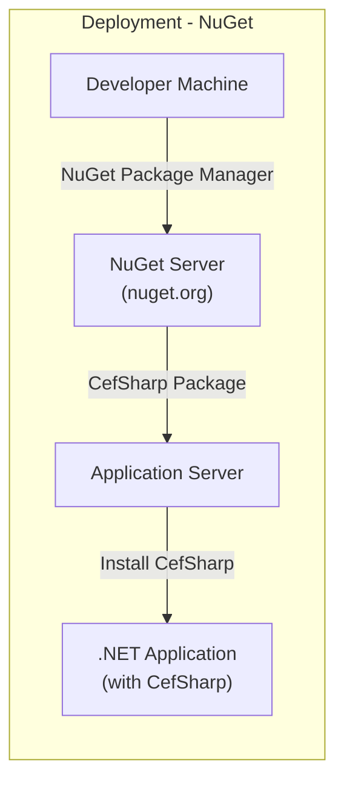
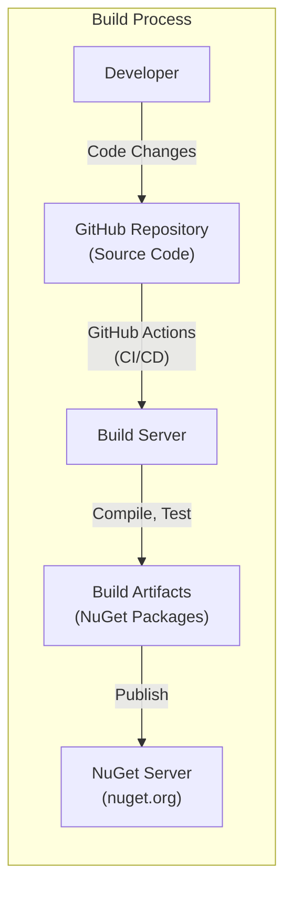

Okay, let's create a design document for the CefSharp project, keeping in mind its purpose and potential security considerations.

# BUSINESS POSTURE

CefSharp enables developers to embed Chromium-based browsers within their .NET (WinForms and WPF) applications.

Priorities and Goals:

*   Provide a seamless and modern web browsing experience within .NET applications.
*   Maintain compatibility with the latest Chromium releases.
*   Offer a robust and easy-to-use API for developers.
*   Ensure stability and performance of embedded browsers.
*   Provide a secure browsing environment within the host application.

Business Risks:

*   Security vulnerabilities in the Chromium Embedded Framework (CEF) could be exploited through CefSharp, potentially compromising the host application and user data.
*   Incompatibility with future Chromium releases could break existing applications relying on CefSharp.
*   Performance issues or instability could lead to a poor user experience.
*   Lack of proper sandboxing or isolation could allow malicious web content to affect the host application.
*   Supply chain attacks targeting CefSharp or its dependencies could introduce malicious code.

# SECURITY POSTURE

Existing Security Controls:

*   security control: Relies on the security features of the underlying CEF and Chromium, including sandboxing, process isolation, and regular security updates. (Described in CEF documentation and Chromium project).
*   security control: Provides options for configuring network settings, proxy settings, and handling certificates, allowing developers to control the browser's network interactions. (Described in CefSharp API documentation).
*   security control: Offers mechanisms for handling JavaScript dialogs, permission requests (e.g., geolocation, microphone), and other browser events, allowing developers to control the browser's behavior and prevent unwanted actions. (Described in CefSharp API documentation).
*   security control: Uses NuGet package manager for distribution, which includes package signing and verification. (Described in NuGet documentation).
*   security control: CefSharp is open-source, allowing for community review and contributions to identify and address security issues. (Visible in the GitHub repository).

Accepted Risks:

*   accepted risk: CefSharp is inherently dependent on the security of CEF and Chromium. Vulnerabilities in these underlying components could impact CefSharp, even if CefSharp itself is implemented securely.
*   accepted risk: Developers using CefSharp are responsible for implementing appropriate security measures within their applications, such as input validation, output encoding, and secure communication protocols. CefSharp provides the tools, but the ultimate security responsibility lies with the application developer.
*   accepted risk: Older versions of CefSharp may be vulnerable to known security issues. Users are responsible for keeping CefSharp up-to-date.

Recommended Security Controls:

*   security control: Implement a robust Content Security Policy (CSP) within the embedded browser to mitigate XSS and other code injection attacks.
*   security control: Regularly audit and update CEF and Chromium to the latest versions to address known vulnerabilities.
*   security control: Provide clear guidance and best practices to developers on securely using CefSharp, including handling user input, managing permissions, and configuring security settings.
*   security control: Consider implementing a mechanism for automatically updating CefSharp to the latest version, or at least notifying users of available updates.
*   security control: Implement sandboxing at the application level, if possible, to further isolate the CefSharp browser component from the rest of the application.

Security Requirements:

*   Authentication: CefSharp itself does not handle user authentication directly. Authentication is typically managed by the web content loaded within the browser or by the host application.
*   Authorization: Similar to authentication, authorization is typically handled by the web content or the host application. CefSharp provides mechanisms for intercepting and handling requests, which can be used to implement custom authorization logic.
*   Input Validation: CefSharp relies on the input validation performed by the Chromium browser. However, developers should also validate any user input passed to CefSharp from the host application.
*   Cryptography: CefSharp utilizes Chromium's built-in cryptographic capabilities for secure communication (HTTPS). Developers should ensure that their applications use secure protocols and handle certificates appropriately.

# DESIGN

## C4 CONTEXT

Element Descriptions:

*   Element:
    *   Name: User
    *   Type: Person
    *   Description: A person interacting with a .NET application that embeds a web browser using CefSharp.
    *   Responsibilities: Interacts with the .NET application, which in turn interacts with the embedded web browser.
    *   Security controls: Relies on the security controls implemented by the .NET application and CefSharp.

*   Element:
    *   Name: .NET Application
    *   Type: Software System
    *   Description: A .NET application (WinForms or WPF) that utilizes CefSharp to embed a Chromium-based browser.
    *   Responsibilities: Hosts the CefSharp browser control, handles user interactions, and communicates with the embedded browser.
    *   Security controls: Responsible for implementing application-level security controls, such as input validation, output encoding, and secure communication.

*   Element:
    *   Name: CefSharp
    *   Type: Software System
    *   Description: The CefSharp library, which provides the .NET bindings for the Chromium Embedded Framework (CEF).
    *   Responsibilities: Provides the API for embedding and interacting with Chromium-based browsers within .NET applications.
    *   Security controls: Relies on the security features of CEF and Chromium, provides options for configuring security settings, and offers mechanisms for handling browser events.

*   Element:
    *   Name: Web Content (HTML, CSS, JS)
    *   Type: Data
    *   Description: The web content (HTML, CSS, JavaScript) loaded and rendered within the embedded browser.
    *   Responsibilities: Provides the user interface and functionality of the web application.
    *   Security controls: Subject to the security policies enforced by the browser (e.g., same-origin policy, CSP).

*   Element:
    *   Name: Web Server
    *   Type: Software System
    *   Description: A web server that hosts the web content loaded by the embedded browser.
    *   Responsibilities: Serves web content to the embedded browser.
    *   Security controls: Responsible for implementing server-side security controls, such as HTTPS, input validation, and access control.

## C4 CONTAINER

Element Descriptions:

*   Element:
    *   Name: User
    *   Type: Person
    *   Description: A person interacting with a .NET application that embeds a web browser using CefSharp.
    *   Responsibilities: Interacts with the .NET application.
    *   Security controls: Relies on security controls of .NET application and CefSharp.

*   Element:
    *   Name: .NET Application (WinForms/WPF)
    *   Type: Container (Application)
    *   Description: The host .NET application that embeds the CefSharp browser control.
    *   Responsibilities: Manages the application UI, handles user input, and interacts with the CefSharp API.
    *   Security controls: Implements application-level security, such as input validation and secure communication.

*   Element:
    *   Name: CefSharp Library
    *   Type: Container (Library)
    *   Description: The CefSharp library, providing the .NET API for interacting with CEF.
    *   Responsibilities: Provides the interface for embedding and controlling the Chromium browser.
    *   Security controls: Relies on CEF's security features, provides options for configuring security settings.

*   Element:
    *   Name: CEF Library (Chromium Embedded Framework)
    *   Type: Container (Library)
    *   Description: The native CEF library, providing the core functionality for embedding Chromium.
    *   Responsibilities: Manages the Chromium browser process, handles rendering, networking, and other browser tasks.
    *   Security controls: Implements Chromium's security features, including sandboxing and process isolation.

*   Element:
    *   Name: Chromium Engine
    *   Type: Container (Browser Engine)
    *   Description: The core Chromium browser engine, responsible for rendering web content and executing JavaScript.
    *   Responsibilities: Renders web pages, executes JavaScript, handles network requests.
    *   Security controls: Enforces web security policies (e.g., same-origin policy, CSP).

*   Element:
    *   Name: Web Server
    *   Type: Container (Web Server)
    *   Description: A web server that hosts the web content loaded by the embedded browser.
    *   Responsibilities: Serves web content to the embedded browser.
    *   Security controls: Implements server-side security controls.

## DEPLOYMENT

Deployment Solutions:

1.  NuGet Package: CefSharp is primarily distributed as a NuGet package. This is the recommended and most common deployment method.
2.  Manual Build: Building CefSharp from source is possible but more complex and less common.

Chosen Solution (NuGet Package):

Element Descriptions:

*   Element:
    *   Name: Developer Machine
    *   Type: Infrastructure Node (Workstation)
    *   Description: The developer's workstation where the .NET application is developed.
    *   Responsibilities: Used for developing and building the application.
    *   Security controls: Relies on developer machine security.

*   Element:
    *   Name: NuGet Server (nuget.org)
    *   Type: Infrastructure Node (Server)
    *   Description: The public NuGet server hosting the CefSharp package.
    *   Responsibilities: Provides the CefSharp package for download.
    *   Security controls: NuGet package signing and verification.

*   Element:
    *   Name: Application Server
    *   Type: Infrastructure Node (Server)
    *   Description: The server where the .NET application is deployed.
    *   Responsibilities: Hosts the .NET application.
    *   Security controls: Relies on server security configuration.

*   Element:
    *   Name: .NET Application (with CefSharp)
    *   Type: Software System
    *   Description: The deployed .NET application, including the CefSharp dependencies.
    *   Responsibilities: Runs the application and embeds the Chromium browser.
    *   Security controls: Application-level security and CefSharp security settings.

## BUILD

Build Process Description:

1.  Developer: Developers make code changes and commit them to the CefSharp GitHub repository.
2.  GitHub Repository: The source code is hosted on GitHub.
3.  GitHub Actions (CI/CD): CefSharp uses GitHub Actions for continuous integration and continuous delivery. This automates the build, test, and packaging process.
4.  Build Server: GitHub Actions utilizes build servers to compile the code, run tests, and create the NuGet packages.
5.  Build Artifacts (NuGet Packages): The build process produces NuGet packages containing the CefSharp binaries and dependencies.
6.  NuGet Server (nuget.org): The NuGet packages are published to the public NuGet server (nuget.org), making them available for developers to use in their projects.

Security Controls in Build Process:

*   security control: GitHub Actions provides a secure and isolated environment for building and testing the code.
*   security control: Automated tests (unit tests, integration tests) are run as part of the build process to identify potential issues.
*   security control: NuGet package signing helps ensure the integrity and authenticity of the distributed packages.
*   security control: Static analysis tools could be integrated into the build process to identify potential security vulnerabilities in the code (SAST).
*   security control: Dependency scanning tools could be used to identify and manage vulnerabilities in third-party libraries.

# RISK ASSESSMENT

Critical Business Processes:

*   Providing a seamless and secure web browsing experience within .NET applications.
*   Maintaining compatibility with the latest Chromium releases.
*   Ensuring the stability and performance of embedded browsers.

Data to Protect:

*   User data accessed or entered within the embedded browser (e.g., browsing history, cookies, form data). Sensitivity: Potentially high, depending on the web content and user activity.
*   Application data that interacts with the embedded browser. Sensitivity: Varies depending on the application.
*   System data on the host machine. Sensitivity: High.

# QUESTIONS & ASSUMPTIONS

Questions:

*   What specific types of web content will be loaded within the embedded browser? (This helps determine the level of risk and the necessary security controls.)
*   Will the embedded browser need to access any local resources or interact with the host application in any way? (This impacts the required level of isolation and sandboxing.)
*   What is the expected user base and their technical expertise? (This helps determine the appropriate level of security awareness and training.)
*   Are there any specific regulatory or compliance requirements that need to be considered?

Assumptions:

*   BUSINESS POSTURE: The primary goal is to provide a reliable and secure way to embed web browsing capabilities within .NET applications.
*   SECURITY POSTURE: The underlying CEF and Chromium components are regularly updated and maintained. Developers using CefSharp are aware of basic security best practices.
*   DESIGN: The deployment will primarily rely on NuGet packages. The build process will utilize GitHub Actions for automation and security.