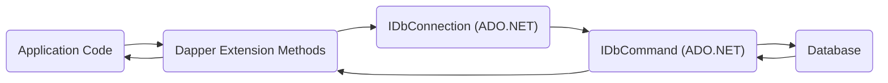

# Project Design Document: Dapper Micro-ORM

**Version:** 1.1
**Date:** October 26, 2023
**Author:** AI Software Architect

## 1. Introduction

This document provides a detailed design overview of the Dapper micro-ORM library. Dapper is a lightweight object-relational mapper (ORM) for the .NET platform. It extends the `IDbConnection` interface by providing useful extension methods for executing SQL queries and mapping the results to .NET objects. This document aims to provide a comprehensive understanding of Dapper's architecture, components, and data flow, which will serve as a foundation for subsequent threat modeling activities.

## 2. Goals

The primary goals of this design document are:

*   Clearly articulate the architecture and components of the Dapper library.
*   Describe the data flow within Dapper during query execution.
*   Identify key interfaces and extension points.
*   Provide sufficient detail to facilitate effective threat modeling of applications utilizing Dapper.

## 3. Scope

This document focuses on the core functionalities of Dapper related to executing SQL queries and mapping results. It covers:

*   The extension methods provided by Dapper on `IDbConnection`.
*   The process of executing parameterized queries.
*   The mechanisms for mapping query results to .NET objects.
*   The handling of stored procedures.
*   Basic transaction management within Dapper.

This document does not cover:

*   Detailed performance analysis of Dapper.
*   Specific database provider implementations (e.g., SQL Server, PostgreSQL) beyond their interaction with ADO.NET interfaces.
*   Advanced mapping scenarios or custom type handlers in granular detail, though their role will be acknowledged.

## 4. High-Level Architecture

Dapper operates as an extension to the standard ADO.NET interfaces. It leverages the existing database connection and command objects provided by ADO.NET.

*   **Application Code:** The .NET application that utilizes Dapper to interact with a database.
*   **Dapper Extension Methods:** Static methods provided by the Dapper library that extend the `IDbConnection` interface. These methods encapsulate the logic for executing queries and mapping results.
*   **IDbConnection (ADO.NET):**  An interface representing an open connection to a data source. Dapper relies on concrete implementations of this interface (e.g., `SqlConnection`, `NpgsqlConnection`).
*   **IDbCommand (ADO.NET):** An interface representing a SQL statement or stored procedure to execute against a data source.
*   **Database:** The underlying database system (e.g., SQL Server, PostgreSQL, MySQL).

## 5. Detailed Design

### 5.1. Key Components

*   **`SqlMapper` Class:** The core class within Dapper that contains the implementation of the extension methods. It handles the execution of commands and the mapping of results. This class utilizes internal caches for reflection information and command preparation to optimize performance.
*   **Extension Methods on `IDbConnection`:**  Dapper provides various extension methods on the `IDbConnection` interface, such as:
    *   `Query<T>`: Executes a query and maps the results to a collection of objects of type `T`. Supports buffering and streaming of results.
    *   `QueryFirstOrDefault<T>`: Executes a query and returns the first result, or the default value if no results are found.
    *   `Execute`: Executes a non-query command (e.g., INSERT, UPDATE, DELETE). Returns the number of rows affected.
    *   `ExecuteScalar<T>`: Executes a query and returns a single, scalar value.
    *   `QueryMultiple`: Executes multiple queries within a single database round trip, allowing for efficient retrieval of related data.
*   **`CommandDefinition` Structure:**  A structure used to encapsulate the details of a database command, including the SQL query, parameters, command timeout, command type (text or stored procedure), transaction, and flags for command behavior. This structure is passed to the `SqlMapper` methods.
*   **Parameter Handling:** Dapper strongly encourages and facilitates parameterized queries to prevent SQL injection vulnerabilities. Parameters are added to the `IDbCommand.Parameters` collection. Dapper infers parameter types based on the provided .NET object properties but allows for explicit type specification.
*   **Result Mapping:** Dapper uses a combination of reflection and dynamic code generation (via Expression Trees) to efficiently map the columns returned by a query to the properties of the target .NET object. It supports mapping by name (case-insensitive) and allows for customization through attributes or explicit mapping configurations (though not a core feature).
*   **Type Handlers:**  Mechanisms to customize how specific data types are mapped between the database and .NET objects. This is particularly useful for handling custom data types or performing data transformations. Implementing custom type handlers requires careful consideration of potential security implications.

### 5.2. Data Flow for Query Execution

The following steps outline the typical data flow when executing a query using Dapper:

1. **"Application Code calls a Dapper extension method (e.g., `connection.Query<User>("SELECT * FROM Users WHERE Id = @Id", new { Id = userId })`)."**
    *   The application provides the SQL query and an anonymous object or dictionary containing the parameter values.
2. **"Dapper creates a `CommandDefinition` object."**
    *   This object encapsulates the SQL query, parameters, and other command-related settings.
3. **"Dapper retrieves or creates an `IDbCommand` object from the `IDbConnection`."**
    *   Dapper utilizes connection pooling provided by the ADO.NET provider.
4. **"Dapper sets the `CommandText` and `CommandType` properties of the `IDbCommand`."**
    *   The `CommandType` is typically `Text` for direct SQL queries or `StoredProcedure` for stored procedures.
5. **"Dapper adds parameters to the `IDbCommand.Parameters` collection."**
    *   It iterates through the provided parameter values and creates `IDataParameter` objects, setting their name and value. Dapper attempts to infer the database type of the parameter.
6. **"Dapper executes the `IDbCommand` using `command.ExecuteReader()` (for `Query` methods) or other appropriate `Execute` methods."**
7. **"Dapper reads the results from the `IDataReader`."**
8. **"Dapper maps the data from the `IDataReader` to instances of the specified .NET type (`T`)."**
    *   This involves matching column names in the result set to property names in the target class. Dapper uses cached reflection information for efficiency.
9. **"Dapper returns a collection of the mapped objects to the application code."**
10. **"The `IDataReader` and `IDbCommand` are typically disposed of (or returned to the connection pool)."**

```mermaid
graph LR
    A("Application Code\n(Query Call)") --> B("Dapper Extension Method\n(e.g., Query<T>)");
    B --> C("Create CommandDefinition");
    C --> D("Get/Create IDbCommand");
    D --> E("Set CommandText & Type");
    E --> F("Add Parameters");
    F --> G("ExecuteReader()");
    G --> H("Read Results from IDataReader");
    H --> I("Map Results to .NET Objects");
    I --> J("Return Mapped Objects\nto Application Code");
    J --> K("Dispose IDataReader & IDbCommand");
    K --> L("Database");
    L --> G;
```

### 5.3. Stored Procedure Execution

Dapper supports executing stored procedures. The process is similar to executing direct SQL queries, but with the `CommandType` set to `StoredProcedure`.

1. **Application Code calls a Dapper extension method, specifying the stored procedure name and parameters.**
2. **Dapper creates a `CommandDefinition` with `CommandType` set to `StoredProcedure`.**
3. **The stored procedure name is set as the `CommandText`.**
4. **Parameters are added to the `IDbCommand.Parameters` collection. It's crucial to define the parameter direction (input, output, input/output, return value) when working with stored procedures.**
5. **The `IDbCommand` is executed using the appropriate `Execute` method.** Dapper can also map output parameters and return values from stored procedures back to the application.

### 5.4. Transaction Management

Dapper integrates with ADO.NET's transaction management capabilities.

1. **The application begins a transaction using `connection.BeginTransaction()`.** This returns an `IDbTransaction` object.
2. **The `IDbTransaction` object is passed to the Dapper extension methods via the `transaction` parameter in the `CommandDefinition`.** This ensures that the command is executed within the scope of the provided transaction.
3. **All Dapper operations within the scope of the transaction will participate in it.** This guarantees atomicity, consistency, isolation, and durability (ACID) for the involved database operations.
4. **The application commits or rolls back the transaction using `transaction.Commit()` or `transaction.Rollback()`.** Proper error handling is essential to ensure transactions are either committed or rolled back appropriately.

## 6. Key Technologies

*   **.NET Framework or .NET:** The target platform for Dapper.
*   **ADO.NET:** The underlying data access technology that Dapper extends, providing interfaces for database interaction.
*   **Reflection:** Used for inspecting the structure of .NET objects to facilitate mapping between database columns and object properties.
*   **Dynamic Code Generation (Expression Trees):** Used for generating efficient code at runtime for mapping results, improving performance compared to pure reflection.

## 7. Security Considerations (For Threat Modeling)

This section outlines security considerations relevant for threat modeling applications using Dapper:

*   **SQL Injection:**
    *   **Threat:**  Developers might bypass parameterized queries and construct SQL queries dynamically by concatenating strings, leading to potential SQL injection vulnerabilities.
    *   **Mitigation:** Emphasize and enforce the use of parameterized queries. Code reviews and static analysis tools can help identify potential vulnerabilities.
*   **Connection String Security:**
    *   **Threat:**  Storing connection strings in plain text within configuration files or code can expose database credentials.
    *   **Mitigation:** Utilize secure configuration management techniques, such as the .NET Configuration API with encryption, Azure Key Vault, or other secrets management solutions. Avoid hardcoding connection strings.
*   **Information Disclosure:**
    *   **Threat:**  Detailed error messages from the database or Dapper, especially in production environments, can reveal sensitive information about the database schema, data, or internal application workings.
    *   **Mitigation:** Implement proper error handling and logging. Avoid displaying raw database error messages to end-users. Log errors securely for debugging purposes.
*   **Denial of Service (DoS):**
    *   **Threat:**  Maliciously crafted or excessively complex queries could consume significant database resources, leading to performance degradation or denial of service.
    *   **Mitigation:** Implement query timeouts, input validation, and rate limiting where appropriate. Monitor database performance and resource utilization.
*   **Parameter Sniffing (Indirect Security Impact):**
    *   **Threat:** While not a direct vulnerability in Dapper, understanding how the database optimizes queries based on parameter values is important. In some cases, this can lead to unexpected performance issues or, in rare scenarios, expose data based on access patterns.
    *   **Mitigation:**  Database administrators should be aware of parameter sniffing and implement appropriate strategies (e.g., `OPTION (RECOMPILE)` in SQL Server) if necessary.
*   **Stored Procedure Security:**
    *   **Threat:** If using stored procedures, vulnerabilities within the stored procedure logic itself (e.g., SQL injection within the stored procedure) can be exploited through Dapper. Insufficient access controls on stored procedures can also be a risk.
    *   **Mitigation:**  Apply secure coding practices when developing stored procedures. Implement proper authorization and access controls on stored procedures. Regularly review and audit stored procedure code.
*   **Data Integrity:**
    *   **Threat:**  Errors in application logic or improper transaction management can lead to data inconsistencies or corruption.
    *   **Mitigation:** Implement robust transaction management with proper error handling. Validate data before writing to the database. Utilize database constraints and triggers to enforce data integrity.
*   **Custom Type Handlers:**
    *   **Threat:**  Improperly implemented custom type handlers could introduce vulnerabilities if they don't correctly sanitize or validate data during the mapping process.
    *   **Mitigation:**  Thoroughly review and test custom type handlers. Ensure they handle data securely and prevent potential injection attacks or data corruption.

## 8. Assumptions and Constraints

*   It is assumed that the underlying ADO.NET provider is correctly implemented and handles database-specific security concerns at the driver level.
*   Dapper relies on the security features provided by the database system itself (e.g., authentication, authorization, row-level security).
*   This design document focuses on the core Dapper library and does not cover third-party extensions or integrations, which may introduce their own security considerations.
*   The application developers are responsible for writing secure SQL queries and handling data appropriately.

## 9. Future Considerations

*   Detailed security analysis of custom type handlers and the potential for vulnerabilities.
*   Exploration of advanced mapping scenarios and their impact on security, particularly when dealing with complex object graphs or inheritance.
*   Consideration of logging and auditing capabilities within applications using Dapper to track database interactions for security monitoring.
*   Investigation of potential security implications related to Dapper's internal caching mechanisms.

This document provides a more detailed and enhanced foundation for understanding the architecture and data flow of the Dapper micro-ORM. The expanded details and security considerations outlined here will be valuable for conducting thorough threat modeling exercises to identify and mitigate potential security risks in applications utilizing Dapper.
