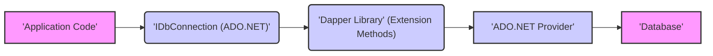
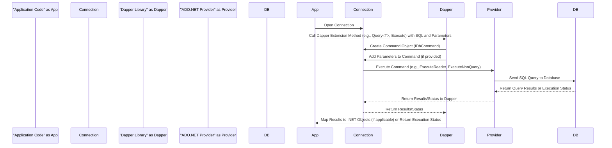

# Project Design Document: Dapper Micro-ORM

**Version:** 1.1
**Date:** October 26, 2023
**Author:** AI Software Architect

## 1. Introduction

This document provides a detailed architectural design of the Dapper micro-ORM library. This design will serve as the foundation for subsequent threat modeling activities, allowing us to identify potential security vulnerabilities and design appropriate mitigations. This document outlines the key components, data flow, and architectural considerations of Dapper, with a specific focus on security implications.

### 1.1. Purpose

The primary purpose of this document is to provide a comprehensive architectural overview of the Dapper library to facilitate effective threat modeling. It aims to clearly define the system boundaries, components, and interactions, enabling security professionals to identify potential attack vectors, trust boundaries, and vulnerabilities.

### 1.2. Scope

This document covers the core architectural design of the Dapper library itself. It focuses on the internal workings of Dapper and its interactions with external components like ADO.NET providers and databases. It explicitly excludes the design of applications that *use* Dapper, focusing instead on the security characteristics inherent to the library's design.

### 1.3. Target Audience

This document is intended for:

* Security engineers and architects involved in threat modeling, security assessments, and penetration testing.
* Developers who require a deep understanding of Dapper's architecture for secure coding practices, debugging, or extending the library.
* DevOps engineers responsible for deploying and maintaining applications that utilize Dapper and need to understand its security dependencies.

## 2. Overview of Dapper

Dapper is a lightweight object-relational mapper (ORM) for the .NET platform. It functions as an extension to the standard ADO.NET library, offering a simple and performant method for mapping the results of database queries to .NET objects. Dapper prioritizes speed and minimal overhead by directly executing SQL queries provided by the developer.

### 2.1. Key Features

* **Direct SQL Execution:** Enables developers to execute raw SQL queries, providing precise control over database interactions.
* **Efficient Object Mapping:**  Streamlines the process of mapping query results to .NET objects, handling type conversions and property assignments with minimal overhead.
* **Parameterized Query Support:**  Facilitates the use of parameterized queries, a crucial defense against SQL injection vulnerabilities.
* **Cross-Database Compatibility:**  Operates with any database system supported by ADO.NET, offering flexibility in database selection.
* **Lightweight Design:**  Introduces minimal performance overhead compared to full-fledged ORMs due to its focused approach.
* **ADO.NET Extension Methods:** Implemented as extension methods on `IDbConnection` and related ADO.NET interfaces, seamlessly integrating with existing ADO.NET workflows.

## 3. Architectural Design

The following diagram illustrates the high-level architecture of Dapper and its interactions:

### 3.1. Components

* **Application Code:** Represents the .NET application that integrates and utilizes the Dapper library to interact with a database. This is the primary consumer of Dapper's functionality.
* **`IDbConnection` (ADO.NET):** The fundamental interface in ADO.NET for establishing and managing a connection to a database. Dapper extends the functionality of this interface.
* **Dapper Library (Extension Methods):** The core of Dapper, implemented as a set of extension methods added to ADO.NET interfaces. This component contains the logic for query execution and result mapping.
* **ADO.NET Provider:** A database-specific library (e.g., `System.Data.SqlClient`, `Npgsql`, `MySql.Data`) that implements the ADO.NET interfaces and handles the low-level communication with the specific database system.
* **Database:** The persistent data store where the application's data resides. Dapper facilitates interaction with this component.

### 3.2. Data Flow

The following sequence diagram illustrates the typical data flow when using Dapper for executing a query:

**Detailed Data Flow Description:**

* **Connection Initialization:** The application code initiates a connection to the database using a concrete implementation of `IDbConnection` provided by the ADO.NET provider.
* **Dapper Method Invocation:** The application code invokes a Dapper extension method on the `IDbConnection` instance, providing the raw SQL query string and any necessary parameters.
* **Command Object Creation:** Dapper internally utilizes the `CreateCommand()` method of the `IDbConnection` to instantiate an `IDbCommand` object. This object represents the SQL query to be executed.
* **Parameter Binding:** If parameters are supplied, Dapper meticulously adds them to the `IDbCommand`'s `Parameters` collection. This crucial step ensures proper parameterization, mitigating the risk of SQL injection.
* **Command Execution via Provider:** Dapper calls the appropriate execution method (e.g., `ExecuteReader` for queries returning data, `ExecuteNonQuery` for commands that modify data) on the `IDbCommand` object. This call is then delegated to the underlying ADO.NET provider.
* **Database Interaction:** The ADO.NET provider translates the command and transmits it to the target database system.
* **Result Retrieval:** The database executes the provided SQL query and returns the results (or the status of the execution for non-query commands) back to the ADO.NET provider.
* **Result Handling by Dapper:** The ADO.NET provider returns the raw results to Dapper.
* **Object Mapping (for Queries):** If the invoked Dapper method is intended to return data (e.g., `Query<T>`), Dapper uses reflection and other techniques to efficiently map the data from the `IDataReader` (obtained from `ExecuteReader`) to instances of the specified .NET type.
* **Return to Application:** The mapped objects (for queries) or the execution status (for non-query commands) are returned to the calling application code.

## 4. Security Considerations and Trust Boundaries

This section outlines key security considerations and identifies trust boundaries relevant to the Dapper library. These points are crucial for effective threat modeling.

* **SQL Injection Vulnerability:**
    * **Threat:** If developers construct SQL queries by directly concatenating user-provided input instead of using parameterized queries, applications using Dapper are highly susceptible to SQL injection attacks.
    * **Dapper's Role:** Dapper provides the mechanism for parameterized queries, but it is the developer's responsibility to utilize this feature correctly. Dapper itself does not automatically sanitize or escape input.
    * **Trust Boundary:** The boundary exists between the application code and the Dapper library. Dapper trusts the application code to provide safe and parameterized SQL.

* **Connection String Management:**
    * **Threat:** Storing connection strings containing database credentials insecurely (e.g., hardcoded in source code, in easily accessible configuration files without encryption) can lead to unauthorized database access.
    * **Dapper's Role:** Dapper relies on the `IDbConnection` object provided by the application, which includes the connection string. Dapper does not manage or enforce the secure storage of connection strings.
    * **Trust Boundary:** The boundary exists between the application configuration and the Dapper library. Dapper trusts the application to provide a valid and appropriately secured connection.

* **Data Access Control and Authorization:**
    * **Threat:** Dapper executes the SQL queries it is given, regardless of the user's authorization level. If the application does not implement proper authorization checks before executing queries, users might be able to access or modify data they are not permitted to.
    * **Dapper's Role:** Dapper is purely a data access mechanism and does not provide any built-in authorization or authentication features.
    * **Trust Boundary:** The boundary exists between the application logic and the Dapper library. Dapper trusts the application to enforce appropriate access controls.

* **Dependency Vulnerabilities:**
    * **Threat:** Vulnerabilities in the underlying ADO.NET provider or the .NET framework itself could potentially be exploited by attackers.
    * **Dapper's Role:** Dapper depends on these components. Security vulnerabilities in these dependencies could indirectly affect applications using Dapper.
    * **Trust Boundary:** The boundary exists between the Dapper library and its dependencies (ADO.NET Provider, .NET Framework). Dapper trusts these underlying components to be secure.

* **Information Disclosure through Error Messages:**
    * **Threat:** Verbose error messages returned by the database or Dapper (especially in development or production environments) could reveal sensitive information about the database schema, data, or internal workings.
    * **Dapper's Role:** Dapper might propagate error messages from the ADO.NET provider.
    * **Mitigation:** Proper error handling and logging practices in the application code are crucial to prevent information disclosure.

* **Denial of Service (DoS) through Malicious Queries:**
    * **Threat:** An attacker might be able to craft and execute resource-intensive SQL queries through the application, potentially overloading the database and causing a denial of service.
    * **Dapper's Role:** Dapper facilitates the execution of these queries if the application allows it.
    * **Mitigation:** Input validation, rate limiting, and query optimization are necessary at the application level to mitigate this risk.

## 5. Dependencies

Dapper has a minimal set of external dependencies:

* **ADO.NET:** Dapper fundamentally relies on the standard ADO.NET interfaces (`IDbConnection`, `IDbCommand`, `IDataReader`, etc.) provided by the .NET framework. This is a core dependency.

## 6. Deployment

Dapper is typically deployed as a NuGet package that is included as a dependency in the application project. No separate installation or deployment of the Dapper library itself is required. The application utilizing Dapper needs to be deployed to an environment where it can establish a connection to the target database, along with the appropriate ADO.NET provider for that database.

## 7. Future Considerations (Out of Scope for Immediate Threat Modeling)

While not directly relevant for the immediate threat modeling exercise, potential future architectural considerations for Dapper could include:

* **Enhanced support for complex object-relational mapping scenarios.**
* **Integration with advanced data access patterns and techniques.**
* **Performance optimizations tailored for specific database systems.**

This document provides a comprehensive architectural overview of the Dapper library, emphasizing security considerations and trust boundaries. The information presented here is essential for conducting a thorough threat modeling exercise to identify and mitigate potential security risks associated with the use of Dapper.