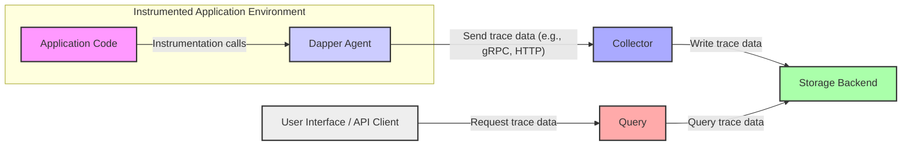
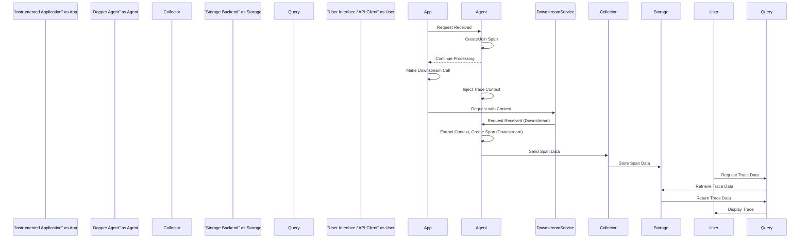

# Project Design Document: Dapper Distributed Tracing System

**Version:** 1.1
**Date:** October 26, 2023
**Author:** AI Software Architect

## 1. Introduction

This document provides an enhanced design overview of the Dapper distributed tracing system, based on the project at [https://github.com/dapperlib/dapper](https://github.com/dapperlib/dapper). The primary goal is to clearly articulate the system's architecture, components, and data flow to facilitate a comprehensive threat modeling process. This document details the key elements of the system and their interactions, providing the necessary context for identifying potential security vulnerabilities and design weaknesses.

## 2. Goals

*   Clearly and concisely define the architecture and components of the Dapper distributed tracing system.
*   Elaborate on the interactions and data flow between the system's components.
*   Provide sufficient and specific details to enable effective and targeted threat modeling of the system.
*   Document the core technologies, protocols, and dependencies utilized by the system.

## 3. High-Level Architecture

Dapper implements a standard distributed tracing architecture, where agents within applications capture trace data, a collector aggregates and processes this data, and a query component allows for retrieval and visualization.

*   **Core Components:**
    *   Agent: Instruments applications to capture trace data.
    *   Collector: Receives, processes, and persists trace data.
    *   Query: Enables retrieval and analysis of stored trace data.
    *   Storage Backend: Provides persistent storage for trace data.

*   **Key Interactions and Data Flow:**
    *   Instrumented applications, via the Dapper Agent, send trace information to the Collector.
    *   The Collector processes and stores this trace data in the designated Storage Backend.
    *   The Query component retrieves trace data from the Storage Backend in response to user requests.
    *   Users interact with the Query component through a user interface (likely web-based) or an API to visualize and analyze traces.

## 4. Detailed Component Design

### 4.1. Agent

*   **Purpose:** To instrument application code, capturing timing information and metadata about operations, forming the basis of distributed traces.
*   **Functionality:**
    *   **Instrumentation API:** Provides libraries or SDKs for developers to integrate tracing capabilities into their application code. This includes creating spans and adding metadata.
    *   **Span Management:** Creates, starts, and stops spans, representing individual units of work within a trace.
    *   **Context Propagation:**  Automatically propagates trace context (trace ID, span ID) across service boundaries, typically using HTTP headers or message metadata. This ensures related operations across services are linked together in a single trace.
    *   **Data Serialization:**  Serializes collected trace data into a format suitable for transmission (e.g., Protocol Buffers).
    *   **Data Transmission:** Sends serialized trace data to the configured Collector endpoint, potentially using protocols like gRPC or HTTP.
    *   **Configuration:** Allows configuration of sampling strategies (to reduce data volume), Collector endpoint details, and other operational parameters.
*   **Technology:** Implemented using language-specific libraries, often leveraging middleware or interceptors to automatically capture trace data.
*   **Deployment:** Typically deployed as a library linked directly into the application process or as a sidecar container running alongside the application.

### 4.2. Collector

*   **Purpose:** To receive trace data from multiple Agents, process it, and persist it to the designated Storage Backend. Acts as a central point for aggregating tracing information.
*   **Functionality:**
    *   **Data Reception:** Listens for and accepts incoming trace data from Agents, often using gRPC or HTTP endpoints.
    *   **Data Validation:** Performs basic validation of incoming trace data to ensure integrity and correctness.
    *   **Processing and Enrichment:** May perform transformations, enrichments, or aggregation of trace data before storage.
    *   **Buffering and Batching:**  Often buffers incoming trace data and writes it to the Storage Backend in batches to improve efficiency and reduce load on the storage system.
    *   **Storage Integration:**  Writes the processed trace data to the configured Storage Backend, adapting to the specific API of the chosen storage system.
*   **Technology:** Usually implemented as a standalone, scalable service, potentially using frameworks optimized for high-throughput data processing and network communication.
*   **Deployment:** Deployed as a scalable service, often containerized and orchestrated using platforms like Kubernetes to handle varying loads.

### 4.3. Query

*   **Purpose:** To provide an interface for users and systems to retrieve and analyze trace data stored in the Storage Backend. Enables observability and troubleshooting.
*   **Functionality:**
    *   **Query Interface:** Provides an API (e.g., RESTful API) for programmatic access to trace data and a user interface (likely web-based) for interactive exploration.
    *   **Query Processing:** Parses and executes user queries against the Storage Backend, supporting filtering by service name, operation name, time range, tags/attributes, and other criteria.
    *   **Data Retrieval:** Fetches relevant trace data from the Storage Backend based on the executed query.
    *   **Data Aggregation and Formatting:**  May perform aggregations or format the retrieved trace data for presentation in the user interface or API response.
*   **Technology:** Implemented as a service with an API, often interacting with the Storage Backend using a database query language or a specialized query interface provided by the storage system.
*   **Deployment:** Deployed as a service, potentially with multiple instances for high availability and to handle concurrent user requests.

### 4.4. Storage Backend

*   **Purpose:** To provide persistent, scalable, and reliable storage for the collected trace data. The choice of backend significantly impacts query performance and data retention capabilities.
*   **Functionality:**
    *   **Data Ingestion:** Efficiently ingests and stores large volumes of trace data written by the Collector.
    *   **Data Storage and Indexing:** Stores trace data in a structured format and creates indexes to enable efficient querying based on various attributes.
    *   **Data Retrieval:** Provides mechanisms for the Query component to retrieve trace data based on specific criteria.
    *   **Scalability and Durability:**  Designed to scale horizontally to handle increasing data volumes and ensure data durability and availability.
    *   **Data Retention Policies:**  Implements mechanisms for managing data retention, allowing for automatic deletion of older trace data.
*   **Technology:** Can be various database systems or specialized time-series databases optimized for trace data. Examples include:
    *   Cassandra (NoSQL database)
    *   Elasticsearch (Search and analytics engine)
    *   Jaeger's supported backends (e.g., in-memory, Cassandra, Elasticsearch, Kafka)
    *   Custom storage solutions.
*   **Deployment:** Deployed according to the specific requirements and best practices of the chosen storage technology, often involving clustering and replication for scalability and fault tolerance.

## 5. Data Flow: Tracing a Request

A typical trace request flows through the Dapper system as follows:

1. **Request Initiation:** An application instrumented with the Dapper Agent receives an incoming request.
2. **Span Creation (Agent):** The Agent intercepts the request and creates a root span, representing the start of the trace, or joins an existing trace if trace context is propagated from an upstream service.
3. **Context Propagation (Agent):** If the application makes calls to other services, the Agent injects trace context information (e.g., trace ID, span ID) into the outgoing request headers (e.g., HTTP headers) or message metadata.
4. **Downstream Instrumentation (Agent):** Downstream services, also instrumented with the Dapper Agent, extract the trace context from the incoming request and create child spans, linking them to the parent span and the overall trace.
5. **Span Data Collection (Agent):** The Agent collects timing information, metadata (tags/attributes), and error information for each span as the operation progresses.
6. **Data Serialization (Agent):** Once a span is completed, the Agent serializes the collected span data.
7. **Data Transmission (Agent):** The Agent sends the serialized span data to the configured Collector endpoint, typically using an asynchronous mechanism to avoid impacting application performance.
8. **Data Reception (Collector):** The Collector receives the trace data from the Agent.
9. **Data Validation and Processing (Collector):** The Collector validates the received span data and may perform additional processing or enrichment.
10. **Data Storage (Collector):** The Collector writes the processed span data to the configured Storage Backend.
11. **Query Request (User/API Client):** A user or an automated system makes a request to the Query component to retrieve trace data, specifying criteria like service name, time range, or trace ID.
12. **Data Retrieval (Query):** The Query component translates the user request into a query against the Storage Backend and retrieves the matching trace data.
13. **Data Response (Query):** The Query component formats the retrieved trace data and sends it back to the user or API client.
14. **Visualization and Analysis (UI):** If a user interface is used, it visualizes the retrieved trace data, allowing users to explore the flow of requests, identify performance bottlenecks, and diagnose errors.

## 6. Deployment Architecture

Dapper's components can be deployed in various configurations depending on scale, performance, and fault tolerance requirements.

*   **Deployment Models:**
    *   **All-in-One:** All components (Agent, Collector, Query, Storage Backend) are deployed on a single machine or a small cluster, suitable for development or small-scale deployments.
    *   **Microservices-Based:** Each component is deployed as an independent microservice, often containerized and orchestrated using Kubernetes or similar platforms. This allows for independent scaling and fault isolation.
    *   **Cloud-Native:** Leveraging cloud provider services for managed Kubernetes (e.g., AWS EKS, Google GKE, Azure AKS), managed databases, and message queues to simplify deployment and management.

*   **Agent Deployment Strategies:**
    *   **Library Integration:** The Agent is included as a library within the application code, offering tight integration but requiring application restarts for updates.
    *   **Sidecar Proxy:** The Agent runs as a separate container alongside the application container in the same pod. This allows for independent updates and language-agnostic instrumentation.
    *   **Host-Based Agent:** A single Agent instance runs on the host machine, monitoring multiple applications. This can be less resource-intensive but might have limitations in terms of isolation and configuration.

## 7. Security Considerations (Pre-Threat Modeling)

This section outlines potential security concerns that will be the focus of subsequent threat modeling activities.

*   **Agent Security:**
    *   **Configuration Vulnerabilities:**  Improperly secured Agent configurations could expose sensitive information (e.g., Collector endpoints, API keys) or allow malicious actors to redirect trace data.
    *   **Data Exfiltration:** A compromised Agent could be used to exfiltrate sensitive data by sending fabricated or modified trace information to unauthorized collectors.
    *   **Code Injection Risks:** Vulnerabilities in the Agent library itself could be exploited for code injection attacks within the instrumented application.
*   **Collector Security:**
    *   **Authentication and Authorization Bypass:** Lack of proper authentication and authorization could allow unauthorized Agents to send data, leading to data pollution or denial of service.
    *   **Denial of Service (DoS) Attacks:** The Collector could be targeted with a high volume of malicious or malformed trace data, overwhelming its resources and causing service disruption.
    *   **Data Tampering:** Without proper integrity checks, malicious actors could potentially inject or modify trace data as it passes through the Collector.
*   **Query Security:**
    *   **Authentication and Authorization Flaws:** Insufficient access controls could allow unauthorized users to view sensitive trace data belonging to other services or applications.
    *   **Data Exposure Risks:** Vulnerabilities in the Query component or its API could expose sensitive information contained within the trace data.
    *   **Injection Attacks:** The Query component might be susceptible to SQL injection or NoSQL injection attacks if user-provided input is not properly sanitized before querying the Storage Backend.
*   **Storage Backend Security:**
    *   **Unauthorized Access:** Weak access controls on the Storage Backend could allow unauthorized parties to read, modify, or delete sensitive trace data.
    *   **Data Breach:**  A compromised Storage Backend could lead to a significant data breach, exposing historical tracing information.
    *   **Lack of Encryption:**  Failure to encrypt trace data at rest and in transit could expose sensitive information if the storage system or communication channels are compromised.
*   **Communication Security:**
    *   **Man-in-the-Middle (MITM) Attacks:** Unencrypted communication channels between components (e.g., Agent to Collector, Collector to Storage, Query to Storage) are vulnerable to interception and tampering.
    *   **Lack of Mutual Authentication:** Without mutual TLS (mTLS), the identity of communicating parties cannot be fully verified, potentially allowing malicious components to impersonate legitimate ones.

## 8. Future Considerations

*   **Enhanced Sampling and Filtering:** Implementing more advanced sampling algorithms and filtering capabilities to optimize data collection and reduce storage costs.
*   **Integration with Other Observability Tools:**  Seamless integration with other observability platforms for metrics, logging, and alerting to provide a holistic view of system health.
*   **Adoption of Open Standards:**  Transitioning to and fully supporting open standards like OpenTelemetry for instrumentation and data formats to improve interoperability.
*   **Machine Learning for Anomaly Detection:** Incorporating machine learning algorithms to automatically detect anomalies and patterns in trace data, facilitating proactive issue identification.
*   **Real-time Stream Processing:**  Adding capabilities for real-time stream processing of trace data to enable immediate insights and alerting.
