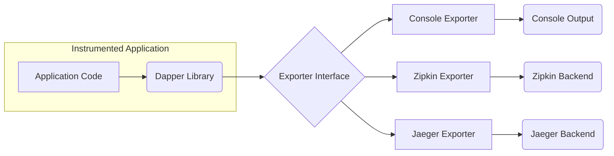
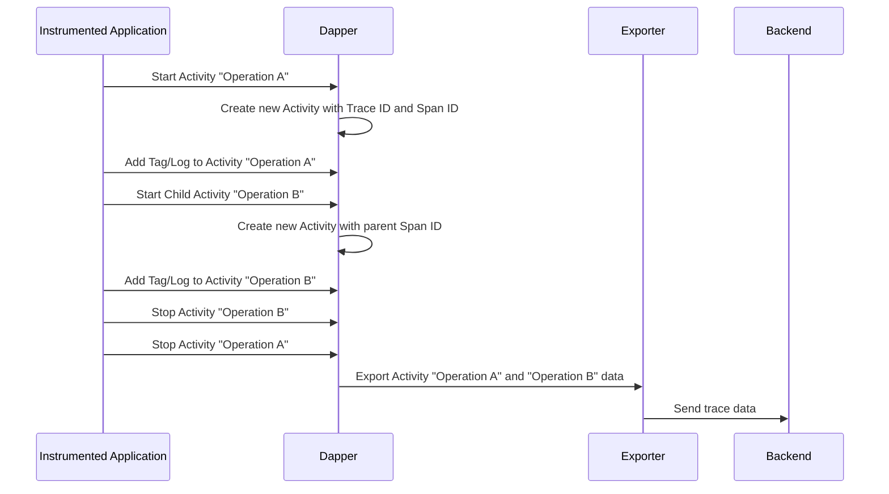

# Project Design Document: Dapper Distributed Tracing Library

**Version:** 1.1
**Date:** October 26, 2023
**Author:** AI Software Architect

## 1. Introduction

This document provides an enhanced design overview of the Dapper distributed tracing library, as found in the GitHub repository [https://github.com/dapperlib/dapper](https://github.com/dapperlib/dapper). This revised document aims to provide an even clearer and more comprehensive articulation of Dapper's architecture, components, and data flow to facilitate effective threat modeling and security analysis.

## 2. Goals and Objectives

The primary goals of Dapper are to:

*   Provide a lightweight and efficient mechanism for instrumenting .NET applications with distributed tracing capabilities, minimizing performance overhead.
*   Enable developers to track the progression of individual requests as they propagate through various services in a distributed system, aiding in performance analysis and debugging.
*   Support a pluggable architecture for exporting collected trace data to multiple tracing backend systems, offering flexibility in choosing monitoring infrastructure.
*   Offer a simple and intuitive API for seamless integration into existing and new .NET applications, reducing the learning curve and integration effort.

## 3. High-Level Architecture

Dapper functions as an in-process library that is integrated directly into .NET applications. It intercepts and records information about significant operations within the application's execution flow, constructing a detailed trace of activity. This collected trace data is then formatted and transmitted to a configured external backend system for persistent storage, visualization, and analysis.

**Key Components:**

*   **Instrumented Application:** The target .NET application that incorporates and utilizes the Dapper library for tracing.
*   **Dapper Library:** The core set of classes and interfaces responsible for the creation, management, and export of tracing data.
*   **Exporter Interface:** Defines a standardized contract that concrete exporter implementations must adhere to, enabling extensibility for different backend systems.
*   **Console Exporter:** A specific implementation of the `Exporter` interface that outputs trace data in a human-readable format to the application's console or standard output. Primarily used for development and debugging.
*   **Zipkin Exporter:** A concrete implementation of the `Exporter` interface responsible for formatting and transmitting trace data to a Zipkin backend service, adhering to the Zipkin data model and API.
*   **Jaeger Exporter:** A concrete implementation of the `Exporter` interface responsible for formatting and transmitting trace data to a Jaeger backend service, adhering to the Jaeger data model and API.
*   **Tracing Backends (Console, Zipkin, Jaeger):** External, independent systems responsible for the persistent storage, indexing, querying, and visualization of collected trace data.

## 4. Detailed Design

### 4.1 Core Concepts

*   **Activity:** Represents a logical, potentially time-bound operation within the application's execution. It serves as the fundamental unit of a trace. Activities can be hierarchically nested to represent parent-child relationships, reflecting the flow of execution across different parts of the application. In Dapper's implementation, `System.Diagnostics.Activity` is the primary class used for this purpose.
*   **Span:** While Dapper primarily utilizes the `Activity` class, the concept of a "Span" is inherent within it. An `Activity` effectively acts as a span, representing a named, timed operation that forms a node in the trace tree. It encapsulates the start and end times, and associated metadata.
*   **Tracer (Implicit):**  While not an explicitly named component in Dapper's public API, the `System.Diagnostics.ActivitySource` class implicitly acts as a tracer. It's the mechanism through which new `Activity` instances are created and managed.
*   **Exporter:** An interface defining the contract for components responsible for serializing and transmitting collected `Activity` data to an external backend system. This allows for a pluggable architecture supporting various tracing backends.

### 4.2 Data Flow

The typical lifecycle of trace data within Dapper involves the following sequence of steps:

1. **Instrumentation:** Developers add instrumentation points within their application code, typically using the `System.Diagnostics.ActivitySource` to create and manage `Activity` instances. This can be done manually by developers or through automatic instrumentation provided by libraries or frameworks.
2. **Activity Creation:** When an instrumented operation begins execution, a new `Activity` instance is created using an `ActivitySource`. This `Activity` is assigned a globally unique identifier (Trace ID) and a locally unique identifier (Span ID or Activity ID). If the operation is part of an existing trace, it will also be assigned the ID of its parent `Activity`.
3. **Span Recording (Implicit through Activity):** The `Activity` instance implicitly records the start and end times of the operation it represents. This timing information is crucial for understanding the latency and duration of different parts of the request.
4. **Metadata Collection:** During the execution of the operation represented by the `Activity`, relevant contextual information is collected and associated with the `Activity`. This metadata includes:
    *   **Tags:** Key-value pairs that provide additional context and attributes about the operation (e.g., HTTP method, database query).
    *   **Logs:** Timed events that occur during the operation, capturing specific moments or details with timestamps and messages.
    *   **Baggage:** Key-value pairs that are designed to propagate across service boundaries. Baggage carries contextual information that is relevant to the entire trace and should be passed along with subsequent requests to downstream services.
5. **Activity Completion:** When the instrumented operation finishes executing, the `Activity` is stopped. This marks the end time of the operation and finalizes the data associated with the `Activity`.
6. **Exporting:** Periodically, or upon the completion of a root-level `Activity` (the initial activity in a trace), the collected `Activity` data is passed to the configured `Exporter` instance. The timing of export can be based on intervals or triggered by specific events.
7. **Backend Transmission:** The `Exporter` implementation takes the `Activity` data, formats it according to the specific requirements of the target backend system (e.g., Zipkin's JSON format, Jaeger's Thrift format), and transmits it to the backend service using network communication (typically HTTP or gRPC).

### 4.3 Components

*   **`ActivitySource`:**  A class that serves as a named factory for creating and managing `Activity` instances. It's the primary entry point for instrumenting code with tracing.
    *   Provides a logical name for the source of the activities, aiding in filtering and identification.
    *   Offers methods like `StartActivity()` to initiate new tracing activities.
*   **`Activity`:** Represents a single unit of work within a trace. It encapsulates the timing, metadata, and relationships of an operation.
    *   Properties include: `Id`, `ParentId`, `TraceId`, `SpanId`, `StartTimeUtc`, `EndTimeUtc`, `Duration`.
    *   Methods for adding metadata: `AddTag()`, `AddEvent()`, `AddBaggage()`.
*   **`ActivityContext`:**  A structure that represents the context of an `Activity`, containing the `TraceId` and `SpanId`. This is crucial for propagating tracing context across asynchronous operations and service boundaries.
*   **`ActivitySpanId` and `ActivityTraceId`:** Structures representing the unique identifiers for spans (activities) and traces, respectively. These ensure proper correlation of events across distributed systems.
*   **Exporters:** Concrete implementations of the `Exporter` interface, each responsible for sending trace data to a specific backend.
    *   **`ConsoleExporter`:** Writes formatted trace information to the console output. Primarily intended for local development and debugging purposes.
    *   **`ZipkinExporter`:** Formats `Activity` data according to the Zipkin v2 JSON format and sends it to a configured Zipkin collector endpoint via HTTP.
    *   **`JaegerExporter`:** Formats `Activity` data according to the Jaeger Thrift or gRPC format and sends it to a configured Jaeger agent or collector endpoint.
    *   **Custom Exporters:** Developers can create custom exporters by implementing the `Exporter` interface, allowing integration with other tracing backends or custom monitoring solutions.
*   **Configuration:** Mechanisms for configuring the behavior of the Dapper library, including:
    *   Specifying which exporters should be active and used for sending trace data.
    *   Configuring backend-specific connection details (e.g., URLs, API keys).
    *   Potentially configuring sampling behavior (although this might be handled by the underlying `System.Diagnostics.Activity` or external samplers).

### 4.4 Data Model

The central element of Dapper's data model is the `Activity` class. When an `Activity` is exported, it typically includes the following information:

*   **Trace ID:** A globally unique identifier that remains consistent across all spans within a single distributed transaction or request.
*   **Span ID (Activity ID):** A unique identifier for the specific `Activity` instance within the trace.
*   **Parent Span ID (Parent Activity ID):** The `Span ID` of the `Activity` that initiated the current `Activity`, forming the parent-child relationship in the trace.
*   **Operation Name:** A human-readable name describing the operation being traced (often set when the `Activity` is started).
*   **Start Time (UTC):** The timestamp (in UTC) when the `Activity` began execution.
*   **End Time (UTC):** The timestamp (in UTC) when the `Activity` finished execution.
*   **Duration:** The total time elapsed during the execution of the `Activity`, calculated from the start and end times.
*   **Tags:** A collection of key-value pairs providing contextual metadata about the operation.
*   **Logs (Events):** A collection of timestamped events that occurred during the `Activity`, each with a message and optional associated data.
*   **Context (Baggage):** A collection of key-value pairs that propagate along with the trace, carrying contextual information across service boundaries.

## 5. Security Considerations (Preliminary)

This section provides an initial overview of security considerations relevant to Dapper, which will be further analyzed during a dedicated threat modeling exercise.

*   **Data Confidentiality:** Trace data may inadvertently contain sensitive information such as user identifiers, request parameters, or internal system details. Ensuring the confidentiality of this data during transmission and storage is paramount.
    *   **Secure Transmission:** Exporters should enforce the use of secure communication protocols (e.g., HTTPS, TLS) when transmitting trace data to backend systems to prevent eavesdropping and interception.
    *   **Backend Security:** The security posture of the chosen tracing backend system is critical. Proper access controls, encryption at rest, and secure storage practices are necessary.
*   **Data Integrity:** Maintaining the integrity of trace data is essential for accurate analysis and debugging. Preventing unauthorized modification or tampering is crucial.
    *   **Secure Communication:** Using secure communication protocols helps prevent man-in-the-middle attacks that could alter trace data in transit.
    *   **Backend Integrity Mechanisms:** The backend system should implement mechanisms to ensure the integrity of stored trace data, such as checksums or digital signatures.
*   **Availability and Performance Impact:** The tracing system itself should not negatively impact the availability or performance of the instrumented application.
    *   **Performance Overhead:** Dapper is designed to be lightweight, but inefficient exporters or excessive instrumentation could introduce noticeable performance overhead. Careful consideration should be given to the volume of data being collected and exported.
    *   **Exporter Resilience:** The application should be designed to handle failures in exporting trace data gracefully, preventing crashes or service disruptions if the backend is temporarily unavailable. Implementing retry mechanisms and circuit breakers can improve resilience.
*   **Access Control:** Controlling who can access and view the collected trace data is important, especially in environments with sensitive information or compliance requirements. This is primarily managed by the tracing backend system.
*   **Injection Vulnerabilities:** Care must be taken when adding user-provided data as tags or logs to prevent potential injection vulnerabilities in the backend systems that process and display this data. Input sanitization and encoding may be necessary.
*   **Denial of Service (DoS):** Malicious actors could potentially attempt to flood the tracing system with a large volume of spurious trace data, leading to performance degradation or increased costs for the tracing backend. Implementing sampling strategies and rate limiting at the application level or within the tracing backend can mitigate this risk.

## 6. Deployment

Dapper is typically deployed as a NuGet package that is added as a dependency to the target .NET application project. Configuration is generally performed through code or application configuration files (e.g., `appsettings.json`). The specific deployment steps and configuration options will vary depending on the chosen tracing backend.

*   **NuGet Package Installation:** Add the appropriate Dapper NuGet package (e.g., a package containing the core library and specific exporters) to the project using the .NET CLI or Visual Studio's NuGet Package Manager.
*   **Exporter Configuration:** Configure the desired `Exporter` implementation (e.g., `ZipkinExporter`, `JaegerExporter`) and provide the necessary connection details for the target backend system (e.g., server URLs, API keys, authentication credentials). This configuration is often done in the application's startup code or configuration files.
*   **Instrumentation Implementation:** Add code to instrument relevant parts of the application using `ActivitySource` to create and manage `Activity` instances. This can involve manual instrumentation or leveraging automatic instrumentation libraries provided by frameworks like ASP.NET Core.

## 7. Future Considerations

*   **Enhanced Sampling Capabilities:** Implementing more sophisticated sampling techniques, such as probabilistic sampling or adaptive sampling, to dynamically adjust the volume of trace data collected based on traffic or other factors.
*   **Standardized Context Propagation:**  Ensuring seamless and interoperable context propagation across different programming languages, frameworks, and communication protocols, potentially aligning with open standards like W3C Trace Context.
*   **Integration with Metrics and Logging:**  Exploring tighter integration with metrics collection and logging systems to provide a more comprehensive observability solution, correlating traces with metrics and logs for richer insights.
*   **Advanced Filtering and Enrichment:**  Providing more advanced mechanisms for filtering trace data at the application level before export and enriching trace data with additional contextual information.

This revised document provides a more detailed and comprehensive design overview of the Dapper distributed tracing library. This enhanced information will be valuable for conducting a more thorough and effective threat model to identify and mitigate potential security risks.