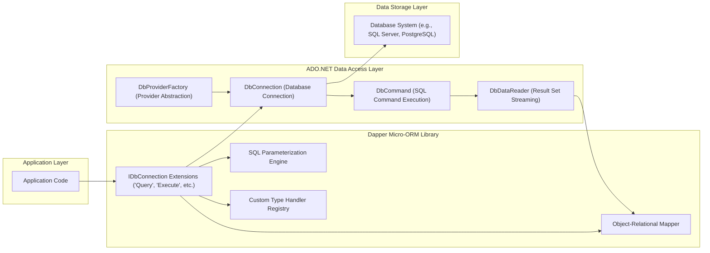

# Project Design Document: Dapper Micro-ORM for Threat Modeling (Improved)

**Project Name:** Dapper Micro-ORM

**Project Repository:** [https://github.com/dapperlib/dapper](https://github.com/dapperlib/dapper)

**Document Version:** 1.1
**Date:** 2023-10-27
**Author:** AI Software Architect

## 1. Introduction

This document provides an enhanced design overview of the Dapper micro-ORM library, specifically tailored for threat modeling activities. It aims to furnish security professionals and developers with a comprehensive understanding of Dapper's architecture, component interactions, data flow, and inherent security considerations. This detailed design will serve as the foundation for identifying potential security vulnerabilities and attack vectors in applications leveraging Dapper for database interactions.

Dapper is a lightweight, high-performance ORM for .NET, extending ADO.NET's capabilities. Its core philosophy centers around speed and developer-friendliness, offering convenient extension methods to the `IDbConnection` interface for executing raw SQL queries and efficiently mapping results to .NET objects.  Unlike full-fledged ORMs, Dapper intentionally omits features like automatic change tracking and lazy loading, granting developers fine-grained control over SQL and database operations. This design document will facilitate a robust threat model, ensuring secure application development with Dapper.

## 2. System Architecture

Dapper acts as an intermediary layer between the application's business logic and the database system. It leverages the robust foundation of ADO.NET to establish database connections, execute commands, and retrieve data, while providing a streamlined and developer-centric interface.

### 2.1. Architecture Diagram



**Diagram Description:**

*   **Application Layer:** Represents the application's core logic that initiates database interactions using Dapper. This is where developers write code that utilizes Dapper to fetch or manipulate data.
*   **Dapper Micro-ORM Library:** The heart of Dapper, providing the abstraction and convenience layer.
    *   **IDbConnection Extensions:** Exposes extension methods on `IDbConnection` (like `Query<T>`, `Execute`, `QueryFirst<T>`) to simplify SQL execution. These are the primary entry points for developers using Dapper.
    *   **SQL Parameterization Engine:**  Handles the secure parameterization of SQL queries, crucial for preventing SQL injection attacks. It takes parameters provided by the application and integrates them safely into the SQL commands.
    *   **Object-Relational Mapper:**  Responsible for efficiently mapping data retrieved from the `DbDataReader` into .NET objects. This component handles the conversion of database rows into usable application objects.
    *   **Custom Type Handler Registry:**  Allows developers to register custom logic for handling specific data type conversions between the database and .NET. This adds flexibility for complex data types.
*   **ADO.NET Data Access Layer:**  .NET's foundational data access technology upon which Dapper is built.
    *   **DbProviderFactory:**  Provides an abstract way to create instances of ADO.NET providers, enabling database independence.
    *   **DbConnection:** Manages the physical connection to the database server. Handles connection pooling and lifecycle.
    *   **DbCommand:** Represents a SQL command (query or stored procedure) to be executed against the database.
    *   **DbDataReader:** Provides a forward-only, read-only stream of data rows from the database, offering efficient data retrieval.
*   **Data Storage Layer:** The actual database system where data is persisted and managed. This could be SQL Server, MySQL, PostgreSQL, or any other database supported by ADO.NET providers.

## 3. Component Description

This section provides a detailed breakdown of Dapper's key components and their functionalities, emphasizing aspects relevant to security and threat modeling.

### 3.1. IDbConnection Extension Methods (Entry Points)

These extension methods are the primary interface developers interact with when using Dapper. They abstract away much of the boilerplate code associated with ADO.NET, but understanding their behavior is crucial for security.

*   **`Query<T>`, `QueryFirst<T>`, `QuerySingle<T>`, etc.:**  These methods are designed for executing SELECT queries and retrieving data. They are critical from a security perspective because they often involve retrieving sensitive information. Misuse can lead to data leaks if queries are not properly constructed or if access controls are insufficient.
*   **`Execute`, `ExecuteScalar<T>`, `ExecuteReader`, `QueryMultiple`:** These methods handle various types of SQL command executions, including INSERT, UPDATE, DELETE, and more complex scenarios.  Improper use, especially with dynamically constructed SQL, can lead to SQL injection and data manipulation vulnerabilities.

**Security Relevance:** These methods are the initial point of contact with Dapper and directly influence how SQL queries are constructed and executed.  Threat modeling should focus on how these methods are used within the application code to ensure secure query construction and data retrieval practices.

### 3.2. SQL Parameterization Engine (SQL Injection Prevention)

Dapper's parameterization engine is a critical security component. It automatically handles the creation and binding of database parameters, mitigating the risk of SQL injection.

*   **Automatic Parameter Binding:** Dapper infers parameters from the `param` object passed to query methods. It uses property names of anonymous objects, dictionary keys, or POCO property names to match parameters in the SQL query.
*   **ADO.NET Parameterization:** Under the hood, Dapper leverages ADO.NET's built-in parameterization mechanisms. This ensures that parameter values are properly escaped and handled by the specific database provider, preventing malicious SQL injection attempts.

**Security Relevance:** This component is the primary defense against SQL injection. Threat modeling should verify that parameterized queries are consistently used throughout the application and that developers are not bypassing parameterization by constructing SQL queries through string concatenation.

**Example of Secure Parameterization:**

```csharp
// Secure - Parameterized query
var userId = 123;
var user = connection.QueryFirst<User>("SELECT * FROM Users WHERE UserId = @UserId", new { UserId = userId });
```

**Example of Insecure Practice (Avoid):**

```csharp
// Insecure - Vulnerable to SQL Injection
var userIdInput = GetUserInput(); // Imagine this comes from user input
var sql = "SELECT * FROM Users WHERE UserId = " + userIdInput; // String concatenation - SQL Injection risk!
var user = connection.QueryFirst<User>(sql);
```

### 3.3. Object-Relational Mapper (Data Handling)

The ORM component is responsible for mapping database results to .NET objects. While not directly a security vulnerability point itself, understanding its behavior is important for data handling and potential information disclosure.

*   **Automatic and Custom Mapping:** Dapper automatically maps columns to properties based on naming conventions. It also supports custom mapping for complex scenarios.
*   **Data Type Conversion:**  Handles the conversion of database data types to .NET types. This process is generally safe, but custom type handlers (see below) could introduce vulnerabilities if not implemented carefully.

**Security Relevance:**  While the mapping process itself is usually safe, threat modeling should consider:
    *   **Data Integrity:** Ensure data is mapped correctly and no data corruption occurs during the mapping process.
    *   **Information Disclosure:**  Verify that the mapping process does not inadvertently expose more data than intended, especially when using dynamic objects or complex mappings.

### 3.4. Custom Type Handler Registry (Extensibility and Potential Risk)

Type handlers provide extensibility to Dapper, allowing developers to customize data type conversions. However, custom handlers can also introduce security risks if not implemented securely.

*   **Custom Conversion Logic:** Developers can register custom type handlers to handle specific data types or perform custom transformations during data retrieval or storage.
*   **Potential for Vulnerabilities:**  If custom type handlers are not carefully implemented, they could introduce vulnerabilities, especially if they involve parsing or processing user-provided data within the handler logic.

**Security Relevance:** Custom type handlers should be carefully reviewed during threat modeling.  Focus on:
    *   **Input Validation within Handlers:**  If handlers process external data, ensure proper input validation to prevent injection or other vulnerabilities within the handler logic itself.
    *   **Complexity and Error Handling:**  Complex handlers are more prone to errors. Review error handling and ensure robust and secure implementation.

## 4. Data Flow (Detailed Query Execution)

Understanding the data flow during a Dapper query execution is crucial for identifying potential interception points or data manipulation opportunities.

1.  **Application Initiates Dapper Query:** Application code calls a Dapper extension method (e.g., `connection.Query<User>(sql, parameters)`).
2.  **Dapper Processes SQL and Parameters:**
    *   Dapper receives the SQL query string and the parameter object.
    *   It creates a `DbCommand` object from the `DbConnection`.
    *   It iterates through the parameters in the `param` object and creates `DbParameter` objects, adding them to the `DbCommand.Parameters` collection. **Crucially, this is where parameterization happens.**
3.  **ADO.NET Executes Command:**
    *   Dapper calls `DbCommand.ExecuteReader()` (or similar method) to execute the SQL query against the database via ADO.NET.
    *   ADO.NET interacts with the database provider and sends the parameterized SQL command to the database.
4.  **Database Executes Query:** The database system receives the parameterized query, executes it, and prepares the result set.
5.  **Database Returns Result Set:** The database sends the result set back to ADO.NET.
6.  **ADO.NET Provides DbDataReader:** ADO.NET creates a `DbDataReader` object that streams the result set from the database.
7.  **Dapper Maps Data:**
    *   Dapper receives the `DbDataReader`.
    *   It iterates through the rows in the `DbDataReader`.
    *   For each row, it maps column values to properties of the target .NET object type `T` using reflection and caching for performance.
8.  **Dapper Returns Mapped Objects:** Dapper returns a collection of mapped objects (e.g., `List<User>`) back to the application code.

**Security Relevance:**  This detailed data flow highlights the critical role of parameterization in step 2. It also shows how data is transferred from the database to the application, which is relevant for data confidentiality and integrity considerations.

## 5. Technology Stack (Dependencies and Security Updates)

Dapper's security posture is also influenced by its underlying technology stack.

*   **.NET Runtime (.NET Framework, .NET Core, .NET 5+):**  Dapper relies on the security and stability of the .NET runtime. Keeping the .NET runtime updated with the latest security patches is essential.
*   **C# Language:**  The security of the C# language itself is generally robust.
*   **ADO.NET and ADO.NET Providers:** Dapper is built on ADO.NET and depends on specific ADO.NET data providers for each database system (e.g., `System.Data.SqlClient`, `Npgsql`, `MySql.Data.MySqlClient`).
    *   **Provider Security:**  The security of these providers is critical. Vulnerabilities in ADO.NET providers can directly impact applications using Dapper. Regularly update ADO.NET providers to their latest versions to patch known vulnerabilities.
*   **Reflection:** Dapper uses reflection for object mapping. While reflection itself is not inherently insecure, excessive or uncontrolled reflection could potentially be exploited in very specific scenarios (though highly unlikely in typical Dapper usage).

**Security Relevance:**  Maintaining up-to-date dependencies, especially the .NET runtime and ADO.NET providers, is a crucial aspect of securing applications using Dapper.  Threat modeling should include verifying dependency update processes.

## 6. Security Considerations (Threat Landscape)

This section outlines key security considerations when using Dapper, categorized for clarity.

### 6.1. SQL Injection Vulnerabilities (Primary Threat)

*   **Cause:** Failure to use parameterized queries, leading to the injection of malicious SQL code through user inputs.
*   **Mitigation:** **Always use parameterized queries provided by Dapper.**  Strictly avoid string concatenation to build SQL queries with user-provided data.
*   **Detection:** Code reviews, static analysis tools, and penetration testing can help identify potential SQL injection vulnerabilities.

### 6.2. Connection String Security (Credential Management)

*   **Cause:** Hardcoding connection strings in code or storing them insecurely (e.g., in plain text configuration files).
*   **Mitigation:**
    *   **Secure Storage:** Store connection strings in secure configuration mechanisms like environment variables, Azure Key Vault, AWS Secrets Manager, or HashiCorp Vault.
    *   **Principle of Least Privilege:** Use database accounts in connection strings with only the necessary permissions. Avoid using overly privileged accounts (like `sa` or `root`).
    *   **Encryption:** Consider encrypting connection strings at rest and in transit where applicable.
*   **Detection:** Configuration reviews and security audits should verify secure connection string management practices.

### 6.3. Data Exposure (Information Disclosure)

*   **Cause:**  Overly broad queries retrieving more data than necessary, insufficient access controls, or improper data handling after retrieval.
*   **Mitigation:**
    *   **Principle of Least Privilege (Data Access):** Design SQL queries to retrieve only the data required for the application's functionality.
    *   **Access Control:** Implement robust database access controls to restrict access to sensitive data based on user roles and permissions.
    *   **Data Sanitization and Masking:** Sanitize or mask sensitive data when logging, displaying, or transmitting it to prevent unintended exposure.
*   **Detection:** Data flow analysis, code reviews, and penetration testing can help identify potential data exposure vulnerabilities.

### 6.4. Dependency Vulnerabilities (Software Supply Chain)

*   **Cause:** Using outdated versions of Dapper, ADO.NET providers, or the .NET runtime with known security vulnerabilities.
*   **Mitigation:**
    *   **Regular Updates:** Keep Dapper library, ADO.NET providers, and the .NET runtime updated to the latest stable versions.
    *   **Vulnerability Scanning:** Implement dependency scanning tools to identify and alert on known vulnerabilities in project dependencies.
    *   **Patch Management:** Establish a process for promptly applying security patches to dependencies.
*   **Detection:** Dependency scanning tools and security audits can identify outdated and vulnerable dependencies.

### 6.5. Custom Type Handler Vulnerabilities (Extensibility Risks)

*   **Cause:**  Insecure implementation of custom type handlers, potentially introducing vulnerabilities in data conversion or transformation logic.
*   **Mitigation:**
    *   **Secure Coding Practices:** Follow secure coding practices when implementing custom type handlers, especially when handling user-provided data or performing complex transformations.
    *   **Input Validation in Handlers:**  If handlers process external data, implement robust input validation within the handler logic.
    *   **Code Review:**  Thoroughly review custom type handler code for potential vulnerabilities.
*   **Detection:** Code reviews and unit testing of custom type handlers can help identify potential vulnerabilities.

## 7. Threat Modeling Focus Areas (Questions for Analysis)

When performing threat modeling for applications using Dapper, consider the following questions to guide your analysis:

**SQL Injection:**

*   **Are parameterized queries consistently used for all database interactions?**
*   **Are there any instances of dynamic SQL construction or string concatenation used to build queries?**
*   **Is user input properly validated *before* being used as parameters in Dapper queries (even though Dapper parameterizes, validation is still important for data integrity and business logic)?**
*   **Are stored procedures used, and if so, are they also parameterized and securely designed?**

**Connection String Security:**

*   **Where are connection strings stored? Are they stored securely (e.g., environment variables, key vaults)?**
*   **Are connection strings hardcoded in the application code or configuration files?**
*   **Does the database user in the connection string have the minimum necessary privileges?**
*   **Is connection string encryption used where appropriate?**

**Data Exposure:**

*   **Do SQL queries retrieve only the necessary data? Are there overly broad queries?**
*   **Are database access controls properly configured to restrict access to sensitive data?**
*   **Is sensitive data sanitized or masked when logged, displayed, or transmitted?**
*   **Is data access audited and monitored?**

**Dependency Vulnerabilities:**

*   **Are Dapper library and ADO.NET providers kept up-to-date?**
*   **Is there a process for regularly checking for and patching dependency vulnerabilities?**
*   **Are dependency scanning tools used to identify vulnerable components?**

**Custom Type Handlers (If Applicable):**

*   **Are custom type handlers used in the application?**
*   **Have custom type handlers been reviewed for security vulnerabilities?**
*   **Do custom type handlers properly validate input data?**
*   **Are custom type handlers implemented with secure coding practices?**

By systematically addressing these questions during threat modeling, you can effectively identify and mitigate potential security risks associated with using Dapper in your applications, leading to more robust and secure software.