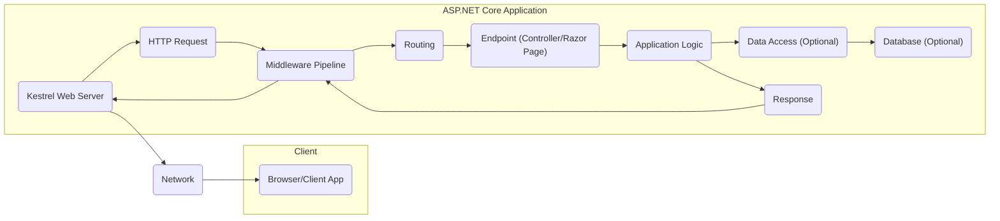
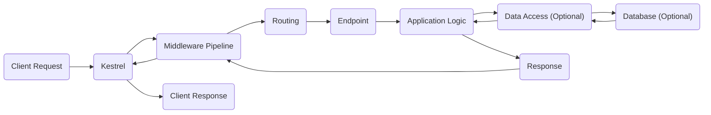

# Project Design Document: ASP.NET Core Framework

**Version:** 1.1
**Date:** October 26, 2023
**Author:** AI Software Architect

## 1. Introduction

This document provides an enhanced architectural design of the ASP.NET Core framework, based on the codebase available at [https://github.com/dotnet/aspnetcore](https://github.com/dotnet/aspnetcore). This revised document aims to provide a more detailed and nuanced understanding of the framework's key components, their interactions, and data flow, specifically tailored to serve as a robust foundation for future threat modeling activities. The focus is on the logical architecture and key security boundaries within the framework.

## 2. Project Goals

The primary goal of the ASP.NET Core project is to offer a versatile, cross-platform, and performant open-source framework for constructing modern, cloud-native, and internet-connected applications. Key objectives, particularly relevant for security considerations, include:

*   Empowering developers to build secure web applications and services with built-in security features.
*   Providing a modular and extensible architecture that allows for the integration of custom security measures.
*   Offering high performance without compromising security.
*   Supporting secure cross-platform development and deployment across various environments (Windows, macOS, Linux).
*   Facilitating the adoption of modern secure development practices.

## 3. High-Level Architecture

The ASP.NET Core framework employs a layered and modular architecture. The processing of an incoming request involves a well-defined pipeline of components.

**Key Components:**

*   **Kestrel Web Server:** A cross-platform web server, built upon libuv, acting as the primary entry point for requests.
*   **HTTP Request:** The raw incoming request from a client, containing headers, body, and other metadata.
*   **Middleware Pipeline:** An ordered sequence of components that process each request and response. Each middleware can inspect, modify, or short-circuit the pipeline.
*   **Routing:** The mechanism that maps incoming request URLs to specific endpoints within the application.
*   **Endpoint (Controller/Razor Page):** The specific handler responsible for processing a matched request and generating a response.
*   **Application Logic:** The custom code implemented by the developer to fulfill the application's specific requirements.
*   **Data Access (Optional):** Components and patterns used to interact with data storage systems, such as Entity Framework Core.
*   **Database (Optional):** The persistent storage layer for application data.
*   **Response:** The HTTP response generated by the application, including headers, body, and status code.

## 4. Component Details

This section provides a more in-depth look at the core components, highlighting their functionalities and security-relevant aspects.

### 4.1. Kestrel Web Server

*   **Description:** A cross-platform web server based on libuv. It's designed for performance and is the recommended server for production deployments of ASP.NET Core applications.
*   **Responsibilities:**
    *   Listening for incoming HTTP requests on configured network interfaces and ports.
    *   Handling TLS/SSL termination to provide secure communication over HTTPS.
    *   Forwarding requests to the ASP.NET Core application pipeline for further processing.
*   **Key Interactions:**
    *   Receives raw network requests from clients.
    *   Passes the parsed HTTP Request object to the Middleware Pipeline.
    *   Receives the final HTTP Response from the Middleware Pipeline and transmits it back to the client.
*   **Security Relevance:** Proper configuration of Kestrel, especially regarding TLS/SSL settings and listening ports, is crucial for security. Vulnerabilities in Kestrel itself could expose the application.

### 4.2. Middleware Pipeline

*   **Description:** A sequence of middleware components executed in a defined order for each HTTP request. Middleware can perform cross-cutting concerns like authentication, authorization, logging, exception handling, request rewriting, and serving static files.
*   **Responsibilities:**
    *   Intercepting and processing both incoming HTTP requests and outgoing responses.
    *   Modifying request and response headers and bodies.
    *   Making decisions to short-circuit the pipeline (e.g., returning an error response early).
*   **Key Interactions:**
    *   Receives the HTTP Request from Kestrel.
    *   Passes the request sequentially through each registered middleware component.
    *   Eventually passes the request to the Routing component or terminates the pipeline.
    *   Receives the HTTP Response from the endpoint and processes it in reverse order through the pipeline.
*   **Security Relevance:** Middleware plays a critical role in security. Authentication middleware verifies user identity, authorization middleware enforces access controls, and other middleware can mitigate common web vulnerabilities. Improperly configured or vulnerable middleware can introduce significant security risks.

### 4.3. Routing

*   **Description:** The process of matching incoming HTTP requests to specific handler logic (endpoints) based on the request URL, HTTP method, and potentially other request characteristics.
*   **Responsibilities:**
    *   Evaluating incoming request URLs against defined route templates.
    *   Extracting route parameters from the URL.
    *   Selecting the appropriate Endpoint (Controller action or Razor Page handler) to handle the request.
*   **Key Interactions:**
    *   Receives the HTTP Request from the Middleware Pipeline.
    *   Uses the configured route definitions to find the best matching endpoint.
    *   Passes control and route data to the selected Endpoint.
*   **Security Relevance:** Secure routing practices prevent unauthorized access to sensitive endpoints. Properly defined route constraints and authorization checks are essential.

### 4.4. Endpoint (Controller/Razor Page)

*   **Description:** The specific code unit responsible for handling a matched request and generating the corresponding HTTP response. This can be a controller action method in an MVC application or a handler method within a Razor Page.
*   **Responsibilities:**
    *   Receiving input data from the request (e.g., route parameters, query strings, request body) through model binding.
    *   Executing the core business logic required to fulfill the request.
    *   Interacting with data access layers, external services, or other components as needed.
    *   Generating the HTTP response to be sent back to the client.
*   **Key Interactions:**
    *   Receives control and request data from the Routing component.
    *   May interact with data access components (like Entity Framework Core) or other application services.
    *   Generates the HTTP Response object to be sent back through the Middleware Pipeline.
*   **Security Relevance:**  Endpoints are where application-specific security vulnerabilities often reside. Proper input validation, output encoding, and authorization checks within endpoint logic are crucial.

### 4.5. Model Binding

*   **Description:** The process of automatically mapping HTTP request data (e.g., form data, query strings, route parameters, request body) to .NET objects (models) for easier use within the Endpoint.
*   **Responsibilities:**
    *   Reading data from various parts of the HTTP request.
    *   Converting the data to the appropriate .NET types.
    *   Performing basic validation of the input data.
*   **Key Interactions:**
    *   Occurs before the Endpoint is invoked, providing strongly-typed data to the handler method.
*   **Security Relevance:** While model binding provides some basic validation, it's crucial to implement robust, application-specific validation to prevent malicious or unexpected input from reaching the application logic. Relying solely on default model binding validation is a security risk.

### 4.6. Authentication and Authorization

*   **Description:** Middleware components responsible for verifying the identity of the user (authentication) and determining whether the authenticated user has permission to access the requested resource (authorization).
*   **Responsibilities:**
    *   Authenticating users based on various schemes (e.g., cookies, JWT bearer tokens, OAuth).
    *   Maintaining user identity and session information.
    *   Authorizing access to resources based on roles, policies, or claims.
*   **Key Interactions:**
    *   Typically implemented as middleware that intercepts requests early in the pipeline.
    *   Examines request credentials and makes authentication and authorization decisions.
    *   Provides user identity information to subsequent middleware and endpoints.
*   **Security Relevance:** These are fundamental security components. Secure authentication and authorization are essential to protect application resources and data from unauthorized access.

### 4.7. Data Access (e.g., Entity Framework Core)

*   **Description:** A set of technologies and patterns that enable interaction with data storage systems (e.g., relational databases, NoSQL databases). Entity Framework Core (EF Core) is a popular Object-Relational Mapper (ORM) for .NET.
*   **Responsibilities:**
    *   Mapping domain objects to database tables (in the case of ORMs).
    *   Generating database queries and commands.
    *   Managing database connections and transactions.
*   **Key Interactions:**
    *   Used by the Application Logic within Endpoints to read and write data to the database.
*   **Security Relevance:** Data access layers are a common target for attacks like SQL injection. Using parameterized queries or ORM features correctly is crucial to prevent these vulnerabilities. Proper database connection string management and access control are also vital.

### 4.8. Configuration

*   **Description:** A system for managing application settings and configuration data from various sources, such as `appsettings.json` files, environment variables, command-line arguments, and Azure Key Vault.
*   **Responsibilities:**
    *   Loading configuration data from different providers.
    *   Providing a unified and hierarchical way to access configuration values.
*   **Key Interactions:**
    *   Used by various components throughout the application to access settings and parameters.
*   **Security Relevance:** Securely managing sensitive configuration data, such as database connection strings, API keys, and secrets, is paramount. Avoid storing sensitive information directly in configuration files within the codebase.

### 4.9. Logging

*   **Description:** A system for recording events, errors, and informational messages within the application. This is essential for monitoring, debugging, auditing, and security analysis.
*   **Responsibilities:**
    *   Providing an abstraction for logging messages with different severity levels.
    *   Supporting various logging providers (e.g., console, file, database, application insights).
*   **Key Interactions:**
    *   Used by various components to log events and diagnostic information.
*   **Security Relevance:** Comprehensive and secure logging is crucial for detecting and responding to security incidents. Logs should be protected from unauthorized access and tampering. Avoid logging sensitive information.

## 5. Data Flow Diagram

This diagram visually represents the typical flow of data through an ASP.NET Core application when processing an HTTP request.

**Data Flow Description:**

1. A client initiates an HTTP request.
2. The Kestrel web server receives the raw request.
3. The request is passed through the configured Middleware Pipeline.
4. The Routing component analyzes the request and selects the appropriate Endpoint.
5. The designated Endpoint is invoked to handle the request.
6. The Application Logic within the Endpoint is executed, performing the necessary operations.
7. Optionally, the Application Logic interacts with the Data Access layer to retrieve or store data.
8. The Data Access layer communicates with the underlying Database.
9. The Database returns data to the Data Access layer.
10. The Data Access layer provides the data back to the Application Logic.
11. The Application Logic constructs the HTTP Response.
12. The Response is passed back through the Middleware Pipeline for final processing.
13. Kestrel sends the completed Response back to the client.

## 6. Key Security Considerations

This section outlines critical security aspects to consider during the development and deployment of ASP.NET Core applications. These considerations are essential for effective threat modeling.

*   **Input Validation:** Rigorously validate all user-provided input at multiple layers (client-side and server-side) to prevent injection attacks (e.g., SQL injection, cross-site scripting), buffer overflows, and other input-related vulnerabilities. Utilize ASP.NET Core's validation attributes and custom validation logic.
*   **Authentication:** Implement secure authentication mechanisms to reliably verify user identities. Choose appropriate authentication methods based on the application's requirements (e.g., cookie-based authentication, JWT bearer tokens, OAuth 2.0). Securely store and manage user credentials.
*   **Authorization:** Enforce strict authorization policies to control access to resources and functionalities based on user roles and permissions. Utilize ASP.NET Core's authorization framework, including policies and requirements. Follow the principle of least privilege.
*   **Cross-Site Scripting (XSS) Prevention:** Implement robust measures to prevent the injection of malicious scripts into web pages rendered by the application. Utilize techniques like output encoding (HTML encoding, JavaScript encoding, URL encoding) and Content Security Policy (CSP).
*   **Cross-Site Request Forgery (CSRF) Prevention:** Protect against unauthorized actions performed on behalf of an authenticated user. Implement anti-CSRF tokens (using `@Html.AntiForgeryToken()` in Razor views) and ensure they are validated on the server.
*   **SQL Injection Prevention:**  Avoid constructing dynamic SQL queries by concatenating user input. Use parameterized queries or ORM features like Entity Framework Core to prevent malicious SQL code from being executed against the database.
*   **Secrets Management:** Securely store and manage sensitive information like API keys, database connection strings, and encryption keys. Utilize secure storage mechanisms like Azure Key Vault, HashiCorp Vault, or environment variables with appropriate access controls. Avoid hardcoding secrets in the codebase or configuration files.
*   **TLS/SSL Configuration:** Ensure secure communication over HTTPS by properly configuring TLS/SSL certificates on the web server (Kestrel or a reverse proxy). Enforce HTTPS and use HTTP Strict Transport Security (HSTS) to prevent protocol downgrade attacks.
*   **CORS (Cross-Origin Resource Sharing):**  Configure CORS policies carefully to control which domains are allowed to make cross-origin requests to the application's resources. Avoid overly permissive CORS configurations.
*   **Error Handling and Exception Handling:** Implement robust error handling and exception handling mechanisms to prevent sensitive information from being leaked in error messages. Log errors securely and provide generic error messages to users.
*   **Security Headers:** Utilize security-related HTTP headers (e.g., Content-Security-Policy, Strict-Transport-Security, X-Frame-Options, X-Content-Type-Options) to enhance the application's security posture.
*   **Dependency Management:** Keep all project dependencies (NuGet packages) up-to-date to patch known security vulnerabilities. Regularly review and update dependencies.
*   **Logging and Monitoring:** Implement comprehensive and secure logging and monitoring to detect and respond to security incidents. Securely store and analyze logs, and monitor for suspicious activity.
*   **Data Protection:** Utilize ASP.NET Core's Data Protection API to securely encrypt and protect sensitive data at rest and in transit.

## 7. Assumptions and Constraints

*   This document provides a general architectural overview of the ASP.NET Core framework. Specific implementations and configurations within individual applications will vary.
*   The focus is primarily on the core architectural components most relevant for web application development and their associated security considerations.
*   Detailed coverage of specific features and functionalities within the broader ASP.NET Core ecosystem (e.g., SignalR, gRPC, Blazor) is outside the scope of this document.
*   The subsequent threat modeling process will leverage this document as a foundation and delve deeper into specific areas of concern and potential vulnerabilities within a given application built on ASP.NET Core.

This enhanced design document provides a more detailed and security-focused understanding of the ASP.NET Core framework architecture, aiming to facilitate more effective and comprehensive threat modeling activities.
