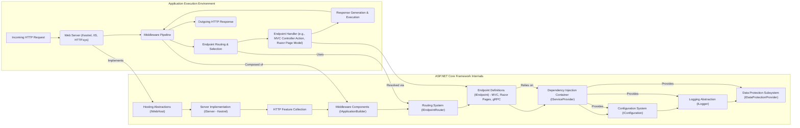
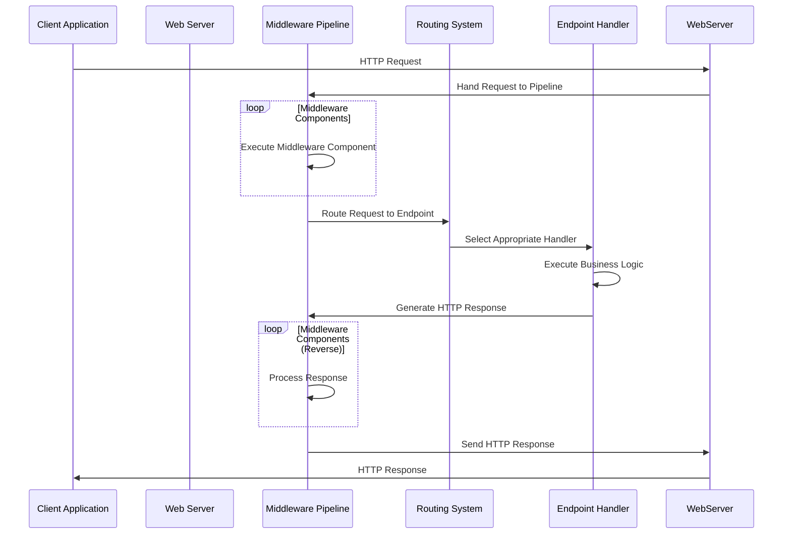

# Project Design Document: ASP.NET Core Framework - Enhanced

**Document Version:** 1.1
**Date:** October 26, 2023
**Author:** AI Software Architect

## 1. Introduction

This document provides an enhanced architectural design overview of the ASP.NET Core framework, based on the codebase found in the GitHub repository (https://github.com/dotnet/aspnetcore). This detailed design serves as a crucial foundation for subsequent threat modeling activities, offering a clear understanding of the framework's components, their interactions, and the overall system structure. This document is intended for security engineers, developers, and architects involved in analyzing and securing applications built with ASP.NET Core.

## 2. Goals and Objectives

The fundamental goals driving the development of the ASP.NET Core framework are:

* **High Performance and Scalability:** To provide a framework capable of handling significant loads and delivering fast response times for modern web applications.
* **Cross-Platform Compatibility:** To enable developers to build and run applications on various operating systems (Windows, macOS, Linux) without requiring platform-specific code changes.
* **Modular and Extensible Design:** To offer a framework where developers can select and integrate only the necessary features, promoting a lean and efficient application footprint.
* **Versatile Application Development:** To support the creation of a wide range of application types, including web applications, RESTful APIs, microservices, real-time communication platforms, and background services.
* **Flexible Hosting Options:** To accommodate diverse deployment scenarios, ranging from self-hosting within custom processes to utilizing established web servers like IIS and Nginx, and cloud-based platforms.
* **Comprehensive Feature Set:** To provide a rich collection of built-in functionalities covering routing, middleware processing, dependency injection, configuration management, and logging.
* **Community-Driven Development:** To foster an active and collaborative open-source community, encouraging contributions and continuous improvement of the framework.

## 3. Architectural Overview

ASP.NET Core employs a modular, layered architecture centered around the concept of a middleware pipeline and leveraging dependency injection for managing component dependencies.

**Detailed Explanation of Architectural Layers:**

* **Application Execution Environment:** This represents the runtime environment where the ASP.NET Core application is hosted. It handles the initial reception of HTTP requests and the final transmission of responses.
    * **Web Server:**  The component responsible for listening on network ports and accepting incoming HTTP requests. Examples include Kestrel (the default cross-platform server), IIS (for Windows environments), and HTTP.sys (a Windows kernel-mode HTTP listener).
    * **Middleware Pipeline:** A sequence of components (middleware) that process each incoming HTTP request and outgoing response. Each middleware can inspect, modify, or short-circuit the pipeline.
    * **Endpoint Routing & Selection:** The process of matching an incoming request URL to a specific endpoint within the application. This involves evaluating route templates and constraints.
    * **Endpoint Handler:** The specific code responsible for handling the business logic associated with a matched endpoint. This could be an MVC controller action, a Razor Page handler method, or a gRPC service method.
    * **Response Generation & Execution:** The process of creating and sending the HTTP response back to the client, potentially involving rendering views or serializing data.

* **ASP.NET Core Framework Internals:** This layer encompasses the core abstractions and implementations that provide the fundamental building blocks for ASP.NET Core applications.
    * **Hosting Abstractions (IWebHost):** Provides an abstraction for the application host, managing the application's lifecycle and startup.
    * **Server Implementation (IServer - Kestrel):** The concrete implementation of the web server interface. Kestrel is a primary example, offering cross-platform capabilities.
    * **HTTP Feature Collection:** A collection of interfaces providing access to low-level HTTP features and information about the current request and connection.
    * **Middleware Components (IApplicationBuilder):**  The mechanism for building and configuring the middleware pipeline. Middleware components implement specific functionalities like authentication, authorization, logging, and routing.
    * **Routing System (IEndpointRouter):**  The core component responsible for matching incoming requests to defined endpoints. It uses a collection of `IEndpoint` instances.
    * **Endpoint Definitions (IEndpoint) - MVC, Razor Pages, gRPC:** Represents the different types of request handlers within the framework. This includes MVC controller actions, Razor Page handlers, and gRPC service methods.
    * **Dependency Injection Container (IServiceProvider):**  A built-in container that manages the creation and lifetime of application services and their dependencies, promoting loose coupling and testability.
    * **Configuration System (IConfiguration):**  A flexible system for loading and accessing application settings from various sources like configuration files, environment variables, and command-line arguments.
    * **Logging Abstraction (ILogger):** Provides a standardized way to log application events and messages, allowing for integration with different logging providers.
    * **Data Protection Subsystem (IDataProtectionProvider):** Offers cryptographic services to protect sensitive data, such as authentication cookies and anti-forgery tokens, from tampering and unauthorized access.

## 4. Key Components and Subsystems

This section provides a more detailed look at some of the critical components within the ASP.NET Core framework:

* **Kestrel Web Server:**
    * A cross-platform web server built on libuv, designed for high performance and asynchronous I/O operations.
    * Can act as an edge server directly exposed to the internet or as an internal server behind a reverse proxy.
    * Supports HTTPS through TLS termination, either directly or offloaded to a reverse proxy.
    * Handles low-level HTTP protocol processing, including request parsing and response formatting.
* **Middleware Pipeline:**
    * A linear sequence of asynchronous delegates that process HTTP requests and responses.
    * Each middleware component implements the `IMiddleware` interface or is provided as a delegate.
    * Middleware components are executed in the order they are added to the pipeline.
    * Examples include:
        * `AuthenticationMiddleware`: Responsible for authenticating the user.
        * `AuthorizationMiddleware`: Enforces authorization policies.
        * `RoutingMiddleware`: Matches incoming requests to endpoints.
        * `StaticFileMiddleware`: Serves static files like images and CSS.
        * `ExceptionHandlerMiddleware`: Handles unhandled exceptions.
        * `CORS Middleware`: Handles Cross-Origin Resource Sharing.
* **Routing System:**
    * Responsible for mapping incoming request URLs to specific endpoint handlers within the application.
    * Supports both conventional routing (based on predefined patterns) and attribute routing (defined directly on controller actions or Razor Page handlers).
    * Enables the extraction of parameters from the URL and the application of constraints to route parameters.
* **Model-View-Controller (MVC):**
    * A well-established architectural pattern for building web applications with a clear separation of concerns.
    * **Models:** Represent the data and business logic of the application.
    * **Views:** Responsible for rendering the user interface, typically using Razor syntax.
    * **Controllers:** Handle user input, interact with models, and select the appropriate view to render.
* **Razor Pages:**
    * A page-based programming model that simplifies building web UI by combining markup and C# code within individual Razor files.
    * Offers a more streamlined approach compared to MVC for simpler applications or page-centric workflows.
* **Web API Framework:**
    * Provides the tools and conventions for building RESTful APIs that can be consumed by various clients.
    * Supports content negotiation to handle different request and response formats (e.g., JSON, XML).
    * Includes features for model binding, validation, and response formatting.
* **Dependency Injection (DI) Container:**
    * A built-in Inversion of Control (IoC) container that manages the dependencies between application components.
    * Supports constructor injection, property injection, and method injection.
    * Promotes loose coupling, making the application more modular, testable, and maintainable.
* **Configuration System:**
    * A flexible and extensible system for managing application settings.
    * Supports loading configuration from various providers, including:
        * `appsettings.json` and `appsettings.{Environment}.json` files.
        * Environment variables.
        * Command-line arguments.
        * Azure Key Vault.
        * Custom configuration providers.
    * Allows for hierarchical configuration and reloading of configuration changes.
* **Logging Abstraction:**
    * Provides a consistent API for logging events and messages throughout the application.
    * Supports various logging providers, such as:
        * Console logging.
        * File logging.
        * EventSource logging.
        * Integration with third-party logging frameworks (e.g., Serilog, NLog).
    * Enables structured logging, allowing for richer log data and easier analysis.
* **Data Protection API:**
    * A set of cryptographic APIs used to protect sensitive data, such as:
        * Authentication cookies.
        * Anti-forgery tokens.
        * Connection strings.
    * Provides services for encryption, decryption, and data integrity verification.
* **Authentication and Authorization Subsystem:**
    * Provides mechanisms for identifying and verifying the identity of users (authentication).
    * Controls access to resources based on user identity and permissions (authorization).
    * Supports various authentication schemes, including:
        * Cookie-based authentication.
        * JWT (JSON Web Token) Bearer authentication.
        * OAuth 2.0 and OpenID Connect.
        * Windows Authentication.
* **SignalR Library:**
    * Enables real-time, bidirectional communication between clients and servers over various transports.
    * Supports WebSockets, Server-Sent Events (SSE), and Long Polling as fallback mechanisms.
    * Facilitates building features like chat applications, live dashboards, and real-time updates.
* **gRPC Framework:**
    * A high-performance, open-source universal RPC framework.
    * Uses Protocol Buffers as the interface definition language.
    * Enables building efficient and scalable microservices with strong typing and code generation.

## 5. Data Flow

A typical HTTP request journey through an ASP.NET Core application follows these steps:

1. **Client Initiates Request:** A client application (e.g., a web browser, mobile app) sends an HTTP request to the server.
2. **Server Receives Request:** The configured web server (Kestrel, IIS, etc.) receives the incoming HTTP request.
3. **Request Enters Middleware Pipeline:** The server passes the request to the ASP.NET Core middleware pipeline for processing.
4. **Middleware Components Process Request:** Each middleware component in the pipeline executes sequentially, performing its specific task on the request or response.
    * **Example Flow:** Authentication middleware attempts to authenticate the user; Authorization middleware checks if the authenticated user is authorized to access the requested resource; Routing middleware matches the request URL to a specific endpoint.
5. **Endpoint is Selected:** The routing middleware identifies the appropriate endpoint handler based on the request URL.
6. **Endpoint Handler Executes:** The selected endpoint handler (e.g., a controller action, Razor Page handler) executes the application's business logic, potentially interacting with databases, external services, or other components.
7. **Response is Generated:** The endpoint handler generates an HTTP response, which may involve rendering a view, serializing data into JSON or XML, or returning a status code.
8. **Response Passes Through Middleware Pipeline (Reverse):** The generated response travels back through the middleware pipeline in reverse order, allowing middleware components to perform post-processing tasks (e.g., adding headers, logging the response).
9. **Server Sends Response:** The web server sends the completed HTTP response back to the client.

## 6. Security Considerations (Pre-Threat Modeling)

While this document primarily focuses on the architecture, it's crucial to acknowledge inherent security considerations that will be further explored during threat modeling:

* **Robust Input Validation:** The framework provides mechanisms for validating user input to prevent common injection vulnerabilities (e.g., SQL injection, cross-site scripting). Developers must implement proper validation logic.
* **Secure Authentication and Authorization:**  The framework offers various authentication and authorization schemes. Secure configuration and implementation are paramount to protect sensitive resources.
* **Data Protection Best Practices:** Utilizing the Data Protection API correctly is essential for safeguarding sensitive data at rest and in transit. Proper key management and storage are critical.
* **Cross-Site Scripting (XSS) Mitigation:** The framework includes features like HTML encoding to help prevent XSS attacks. Developers must be aware of contexts where encoding is necessary.
* **Cross-Site Request Forgery (CSRF) Prevention:** Anti-forgery tokens are a built-in mechanism to mitigate CSRF attacks. Proper implementation and validation of these tokens are crucial.
* **Secure Configuration Management:**  Securely managing application configuration, especially sensitive information like connection strings and API keys, is vital. Avoid storing secrets directly in code or configuration files.
* **Dependency Vulnerability Management:** Regularly updating dependencies is crucial to address known security vulnerabilities in third-party libraries.
* **Comprehensive Error Handling and Logging:** Securely handling errors and logging relevant information are important for debugging and security monitoring. Avoid exposing sensitive information in error messages.
* **Hosting Environment Security:** The security posture of the underlying hosting environment (operating system, web server, network configuration) significantly impacts the overall security of the application.
* **Rate Limiting and Throttling:** Implementing rate limiting and throttling can help prevent denial-of-service attacks.

## 7. Deployment Model

ASP.NET Core applications offer a wide range of deployment options:

* **Self-Hosting with Kestrel:** The application runs as an independent process using the Kestrel web server. This is common for microservices, containerized applications, and scenarios where a full-fledged web server like IIS is not required.
* **Hosting with IIS (Windows):** Leveraging Internet Information Services (IIS) on Windows provides robust process management, security features, and integration with the Windows ecosystem.
* **Hosting with Nginx or Apache (Linux):** Deploying behind a reverse proxy like Nginx or Apache on Linux offers benefits like load balancing, SSL termination, and enhanced security. Kestrel typically runs as a backend server in this setup.
* **Containerization (Docker):** Packaging the application and its dependencies into Docker containers enables consistent deployments across different environments and facilitates orchestration with tools like Kubernetes.
* **Serverless Computing (Azure Functions, AWS Lambda):** Deploying parts of the application as serverless functions allows for event-driven execution and automatic scaling.
* **Cloud Platform Services (Azure App Service, AWS Elastic Beanstalk):** Managed cloud platforms provide simplified deployment and scaling options for ASP.NET Core applications.

## 8. Technologies Used

The ASP.NET Core framework is built upon and utilizes various core technologies:

* **.NET Runtime:** The underlying execution environment for ASP.NET Core applications, providing essential services like garbage collection and just-in-time compilation.
* **C# Programming Language:** The primary language used for developing ASP.NET Core applications, offering strong typing and object-oriented features.
* **HTTP Protocol:** The foundation for web communication, defining how clients and servers exchange information.
* **JSON and XML:** Common data serialization formats used for APIs and data exchange.
* **HTML, CSS, and JavaScript:** Front-end technologies used for building user interfaces in web applications.
* **NuGet Package Manager:** A package manager for discovering, installing, and managing dependencies in .NET projects.
* **Git Version Control:** The distributed version control system used for managing the ASP.NET Core codebase and enabling collaboration.

## 9. Future Considerations

The ASP.NET Core framework is continuously evolving. Future development efforts may focus on:

* **Performance Optimizations:** Further enhancements to improve the performance and efficiency of the framework.
* **New Feature Development:** Adding new components and functionalities to address emerging web development trends and requirements.
* **Developer Experience Improvements:** Streamlining workflows, providing better tooling, and simplifying common tasks for developers.
* **Security Enhancements:** Continuously improving the security posture of the framework by addressing potential vulnerabilities and adding new security features.
* **Integration with Emerging .NET Technologies:** Seamlessly integrating with new features and capabilities introduced in the .NET platform.

This enhanced design document provides a more in-depth understanding of the ASP.NET Core framework's architecture, components, and data flow. This detailed information is crucial for conducting effective threat modeling and identifying potential security risks.