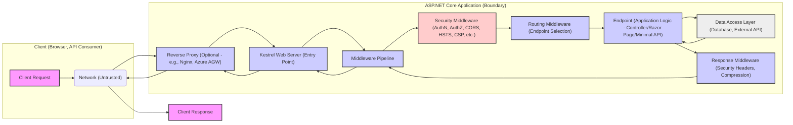

# Project Design Document: ASP.NET Core Framework for Threat Modeling (Improved)

**Project Name:** ASP.NET Core Framework

**Project Repository:** [https://github.com/dotnet/aspnetcore](https://github.com/dotnet/aspnetcore)

**Document Version:** 1.1
**Date:** 2023-10-27
**Author:** AI Software Architect

## 1. Introduction

This document provides an enhanced architectural design overview of the ASP.NET Core framework, specifically tailored for security threat modeling. Building upon the initial version, this document aims to provide more granular detail and clarity on security-relevant aspects of the framework. It outlines key components, data flow, and potential vulnerabilities to facilitate a comprehensive threat modeling process. This document serves as the foundational input for subsequent threat modeling exercises, enabling proactive security risk identification and mitigation.

## 2. Project Overview

ASP.NET Core is a modern, open-source, and cross-platform framework developed by Microsoft for building web applications and services using .NET.  It is designed for high performance, scalability, and cloud-native deployments.  Its modular architecture and middleware pipeline allow developers to customize and extend its functionality.  Understanding its architecture is crucial for identifying potential security vulnerabilities and designing secure applications.

## 3. Architectural Overview

ASP.NET Core's architecture is centered around a request processing pipeline and modular components.  This design promotes flexibility and allows for fine-grained control over request handling. Key architectural elements from a security perspective include:

*   **Modular Middleware Pipeline:**  The core of ASP.NET Core. Requests are processed sequentially by a configurable pipeline of middleware components. This pipeline is the primary area for implementing security controls.
*   **Kestrel Web Server (Default):** A cross-platform web server optimized for ASP.NET Core. While performant, it's often recommended to use a reverse proxy in production for enhanced security and features. Security configuration of Kestrel and the reverse proxy is critical.
*   **Hosting Abstraction Layer:**  Allows deployment across various environments (Kestrel, IIS, HTTP.sys, custom).  Security considerations vary depending on the chosen hosting model.
*   **Dependency Injection (DI):**  While promoting good design, misconfigured DI can inadvertently expose sensitive components or create vulnerabilities if dependencies are not properly secured.
*   **Configuration System:**  Flexible configuration from multiple sources. Securely managing configuration, especially secrets, is paramount.
*   **Built-in Security Features:** ASP.NET Core provides built-in features for authentication, authorization, data protection, and more. Proper utilization and configuration of these features are essential for security.
*   **Extensibility:** The framework's extensibility through middleware and NuGet packages allows for custom security implementations but also introduces potential risks if extensions are not vetted for security.

## 4. Key Components and Security-Focused Data Flow

The following diagram illustrates the data flow through an ASP.NET Core application, highlighting components relevant to security threat modeling:

**Component Descriptions (Security Focused):**

*   **"Client Request"**:  HTTP request from a potentially untrusted source.  Threats: Malicious payloads, injection attacks, DoS attempts.
*   **"Network (Untrusted)"**: The public internet or an untrusted network segment.  Threats: Man-in-the-middle attacks, eavesdropping, network-level attacks.
*   **"Reverse Proxy (Optional - e.g., Nginx, Azure AGW)"**:  Acts as a security gateway.  Handles TLS termination, load balancing, WAF (Web Application Firewall) functionalities.  Crucial for external facing applications. Threats: Misconfiguration leading to bypasses, vulnerabilities in the proxy itself.
*   **"Kestrel Web Server (Entry Point)"**:  Receives requests after the reverse proxy (if present).  Handles HTTP protocol processing.  Threats: DoS attacks targeting Kestrel, vulnerabilities in Kestrel itself (though less common).
*   **"Middleware Pipeline"**:  The sequence of request handlers.  This is where most security middleware resides.  Threats: Misconfigured middleware order, missing security middleware, vulnerabilities in custom middleware.
*   **"Security Middleware (AuthN, AuthZ, CORS, HSTS, CSP, etc.)"**:  Critical for enforcing security policies.
    *   **Authentication (AuthN) Middleware**: Verifies user identity. Examples: `CookieAuthenticationMiddleware`, `JwtBearerAuthenticationMiddleware`. Threats: Authentication bypass, weak authentication schemes, session hijacking.
    *   **Authorization (AuthZ) Middleware**: Enforces access control. Examples: `AuthorizationMiddleware`. Threats: Authorization bypass, privilege escalation, insecure direct object references.
    *   **CORS Middleware**: Controls cross-origin requests. Threats: CORS misconfiguration allowing unauthorized cross-origin access.
    *   **HSTS Middleware**: Enforces HTTPS. Threats: Downgrade attacks if HSTS is not properly configured.
    *   **CSP Middleware**: Content Security Policy to mitigate XSS. Threats: Weak CSP policies, bypasses in CSP implementation.
    *   Other security-related middleware:  Antiforgery, Request Filtering, Rate Limiting, etc.
*   **"Routing Middleware (Endpoint Selection)"**:  Maps URLs to application endpoints. Threats:  Route injection vulnerabilities, information disclosure through predictable routes.
*   **"Endpoint (Application Logic - Controller/Razor Page/Minimal API)"**:  Application-specific code.  **Primary area for application-level vulnerabilities.** Threats: Injection vulnerabilities (SQL, XSS, Command Injection), business logic flaws, insecure data handling, insecure file uploads, etc.
*   **"Data Access Layer (Database, External API)"**:  Interactions with data stores and external services. Threats: SQL Injection, insecure API calls, data breaches, insecure storage of credentials.
*   **"Response Middleware (Security Headers, Compression)"**:  Modifies the outgoing response.
    *   **Security Headers Middleware**: Adds security headers (e.g., `X-Frame-Options`, `X-Content-Type-Options`, `Referrer-Policy`). Threats: Missing security headers, misconfigured headers.
    *   **Compression Middleware**: Compresses responses. Security implications are generally lower but could impact observability in some scenarios.

## 5. Technology Stack (Security Implications)

*   **Programming Language: C#**: Generally considered memory-safe, reducing certain classes of vulnerabilities (e.g., buffer overflows common in C/C++). However, application logic vulnerabilities are still possible.
*   **.NET Runtime:**  Provides built-in security features and undergoes regular security updates. Keeping the runtime updated is crucial.
*   **Web Server: Kestrel (default):**  Written in C# and optimized for performance. Security depends on proper configuration and often benefits from being behind a reverse proxy.
*   **Protocols: HTTP/1.1, HTTP/2, HTTPS:**  HTTPS is essential for secure communication. Proper TLS configuration is critical.
*   **Dependency Injection Container:**  Can introduce vulnerabilities if dependencies are not properly managed or if insecure dependencies are injected.
*   **Configuration System:**  Storing secrets in plain text configuration files is a major vulnerability. Secure configuration management practices are essential.
*   **NuGet Packages:**  Extensive ecosystem.  Vulnerability scanning and dependency management are crucial to avoid using packages with known security flaws.

## 6. Deployment Model (Security Considerations)

Deployment environment significantly impacts security.

*   **Cloud Platforms (Azure, AWS, GCP):**  Offer various security services (WAF, DDoS protection, security monitoring).  Leveraging these services is recommended. Cloud misconfiguration is a common vulnerability.
*   **Containers (Docker, Kubernetes):**  Container security is crucial.  Image scanning, secure container registries, and proper Kubernetes security configurations are necessary.
*   **On-Premises Servers:** Requires more manual security hardening of the server infrastructure (OS patching, firewall configuration, etc.).
*   **Serverless Environments:**  Security is often managed by the cloud provider, but proper function configuration and permissions are still important.

**Reverse Proxy Importance:**  For production deployments, using a reverse proxy (like Nginx, Apache, Azure Application Gateway, AWS Application Load Balancer) in front of Kestrel is highly recommended for:

*   **TLS Termination:** Offloads TLS processing from Kestrel.
*   **Web Application Firewall (WAF):**  Provides protection against common web attacks.
*   **Load Balancing:** Distributes traffic for scalability and resilience.
*   **Security Hardening:** Reverse proxies are often more mature and hardened against attacks compared to directly exposing Kestrel.

## 7. Security Considerations (Detailed for Threat Modeling)

This section expands on the security considerations, providing more specific examples of threats and mitigations for each area, directly relevant for threat modeling:

| Security Area                  | Potential Threats                                                                 | Mitigation Strategies                                                                                                |
|-------------------------------|-----------------------------------------------------------------------------------|-----------------------------------------------------------------------------------------------------------------------|
| **Input Validation**          | SQL Injection, Cross-Site Scripting (XSS), Command Injection, Path Traversal, Buffer Overflows, Format String Bugs | Parameterized queries/Stored Procedures, Input sanitization/encoding, Whitelisting, Input length limits, Regular expressions |
| **Output Encoding**           | Cross-Site Scripting (XSS)                                                        | Context-sensitive output encoding (HTML, JavaScript, URL, CSS), Templating engines with automatic encoding              |
| **Authentication**            | Brute-force attacks, Credential stuffing, Session hijacking, Session fixation, Weak password policies, Insecure storage of credentials | Multi-factor authentication (MFA), Strong password policies, Account lockout, Secure session management (HTTP-only, Secure cookies),  OAuth 2.0/OpenID Connect, Password hashing (bcrypt, Argon2) |
| **Authorization**             | Authorization bypass, Privilege escalation, Insecure Direct Object References (IDOR), Role manipulation | Role-Based Access Control (RBAC), Attribute-Based Access Control (ABAC), Policy enforcement points, Least privilege principle, Input validation for object IDs |
| **Data Protection**           | Data breaches, Data leakage, Insecure storage of sensitive data, Key compromise, Man-in-the-middle attacks | Encryption at rest (database encryption, file system encryption), Encryption in transit (HTTPS), Data masking/redaction, Secure key management (Key Vault, HSMs), Data minimization |
| **CSRF Protection**           | Cross-Site Request Forgery (CSRF)                                                 | Antiforgery tokens (built-in ASP.NET Core support), SameSite cookies (Strict or Lax)                                  |
| **CORS**                      | Cross-Origin Resource Sharing (CORS) bypass, Unauthorized cross-domain requests     | Properly configured CORS policies (whitelist origins, methods, headers), Avoid wildcard CORS (`*`) in production        |
| **Security Headers**          | Clickjacking, XSS (reflected), MIME-sniffing vulnerabilities, Insecure connections | Implement and configure security headers: `Content-Security-Policy`, `X-Content-Type-Options`, `X-Frame-Options`, `Strict-Transport-Security`, `Referrer-Policy`, etc. |
| **Dependency Management**     | Exploiting vulnerabilities in third-party libraries                               | Regularly audit and update NuGet packages, Use vulnerability scanning tools, Software Composition Analysis (SCA)        |
| **Error Handling & Exceptions** | Information disclosure through error messages, Denial of Service through excessive error logging | Generic error pages, Log errors securely (avoid logging sensitive data), Centralized exception handling, Rate limiting error responses |
| **Logging & Monitoring**      | Lack of audit trails, Delayed incident detection, Insufficient forensic data         | Comprehensive logging (security events, access logs, application logs), Security Information and Event Management (SIEM) systems, Real-time monitoring and alerting |
| **Secure Configuration**      | Exposure of secrets (connection strings, API keys), Misconfiguration vulnerabilities | Environment variables, Azure Key Vault/AWS Secrets Manager/GCP Secret Manager, Configuration validation, Principle of least privilege for configuration access |
| **DoS Protection**            | Denial of Service (DoS), Distributed Denial of Service (DDoS)                      | Rate limiting, Request throttling, Connection limits, Input size limits, Web Application Firewall (WAF), DDoS mitigation services (Cloudflare, Azure DDoS Protection) |
| **Kestrel Security**          | Exploiting Kestrel vulnerabilities, DoS attacks targeting Kestrel                  | Configure Kestrel limits (request size, connection limits), TLS configuration, Use behind a reverse proxy in production |
| **Hosting Environment Security**| OS vulnerabilities, Server misconfiguration, Network segmentation issues             | Regular OS patching, Server hardening, Firewall configuration, Network segmentation, Security audits and penetration testing |

## 8. Threat Modeling Scope and Objectives

This design document defines the scope for threat modeling the ASP.NET Core framework in the context of building web applications. The primary objectives of the threat modeling exercise are:

*   **Identify Potential Threats:** Systematically identify potential security threats targeting ASP.NET Core applications, considering each component and data flow path outlined in this document.
*   **Analyze Attack Vectors:**  Determine potential attack vectors and entry points that could be exploited by attackers.
*   **Assess Security Risks:** Evaluate the likelihood and impact of identified threats to prioritize mitigation efforts.
*   **Evaluate Existing Controls:** Analyze the effectiveness of built-in and recommended security controls within ASP.NET Core and identify any gaps.
*   **Develop Mitigation Strategies:**  Propose and document specific mitigation strategies and security recommendations to address identified threats and reduce security risks.

This document will be used as a living document throughout the threat modeling process and should be updated as new information emerges or the architecture evolves. The output of the threat modeling exercise will be a prioritized list of security risks and corresponding mitigation actions to enhance the security posture of ASP.NET Core applications.