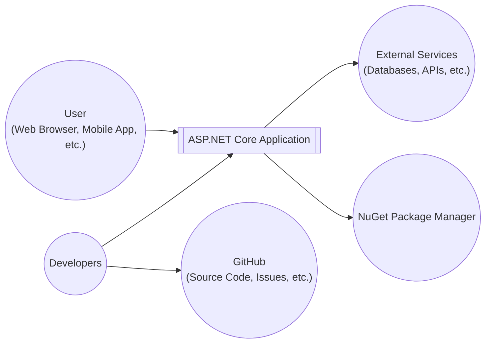
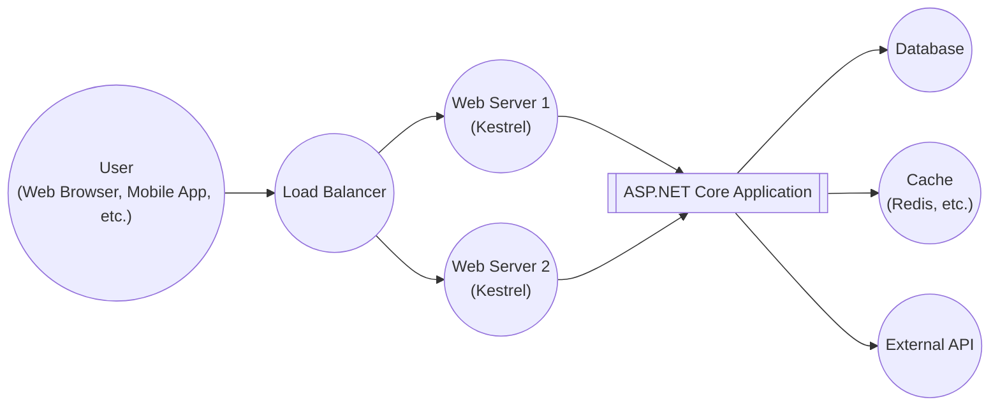
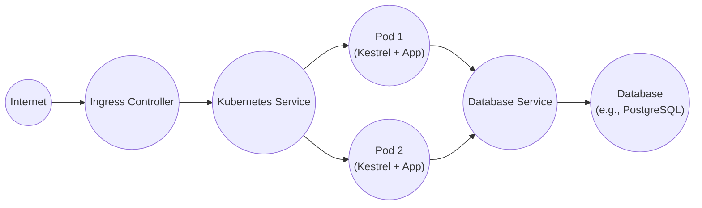
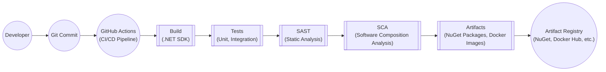

Okay, let's create a design document for the ASP.NET Core framework, keeping in mind its purpose and the need for a threat modeling-ready document.

# BUSINESS POSTURE

ASP.NET Core is a cross-platform, high-performance, open-source framework for building modern, cloud-based, and internet-connected applications.  It's developed by Microsoft and the .NET community.

Priorities and Goals:

-   Enable developers to build a wide range of applications (web apps, APIs, microservices, mobile backends, etc.) efficiently and securely.
-   Provide a high-performance runtime and development environment.
-   Support cross-platform development (Windows, macOS, Linux).
-   Be cloud-ready, with easy deployment to various cloud providers.
-   Maintain a strong security posture, protecting applications from common web vulnerabilities.
-   Foster a large and active open-source community.
-   Provide excellent documentation and support.

Most Important Business Risks:

-   Vulnerabilities in the framework that could lead to widespread exploitation of applications built with ASP.NET Core.  This is the paramount risk, given the framework's widespread use.
-   Performance bottlenecks that limit the scalability of applications.
-   Compatibility issues with different operating systems or cloud environments.
-   Lack of adoption due to complexity or competition from other frameworks.
-   Reputational damage due to security incidents or poor performance.
-   Supply chain attacks targeting the framework or its dependencies.
-   Failure to keep up with evolving web standards and security best practices.

# SECURITY POSTURE

Existing Security Controls:

-   security control: Secure Development Lifecycle (SDL) practices are followed by Microsoft, including threat modeling, code reviews, static analysis, and penetration testing. (Described in Microsoft's SDL documentation and public statements).
-   security control: Built-in features for input validation, output encoding, and protection against common web vulnerabilities like Cross-Site Scripting (XSS), Cross-Site Request Forgery (CSRF), and SQL injection. (Described in ASP.NET Core documentation).
-   security control: Authentication and authorization mechanisms, including support for various authentication providers (e.g., OAuth 2.0, OpenID Connect, Windows Authentication) and role-based/policy-based authorization. (Described in ASP.NET Core documentation).
-   security control: Data protection APIs for encrypting and signing data. (Described in ASP.NET Core documentation).
-   security control: HTTPS enforcement and support for secure cookie management. (Described in ASP.NET Core documentation).
-   security control: Regular security updates and patches released by Microsoft to address vulnerabilities. (Described in Microsoft Security Response Center (MSRC) announcements).
-   security control: Dependency management to help track and update third-party libraries. (Described in .NET documentation).
-   security control: Support for Content Security Policy (CSP) and other security headers. (Described in ASP.NET Core documentation).
-   security control: Open-source codebase, allowing for community scrutiny and contributions.

Accepted Risks:

-   accepted risk: Reliance on third-party libraries, which may introduce vulnerabilities.  This is mitigated by dependency management and regular updates, but the risk remains.
-   accepted risk: The framework's complexity can lead to misconfiguration by developers, potentially introducing security vulnerabilities. This is mitigated by documentation and best practices, but developer error is always a possibility.
-   accepted risk: Zero-day vulnerabilities are an inherent risk in any software. This is mitigated by Microsoft's SDL and rapid response to reported vulnerabilities.

Recommended Security Controls:

-   Implement robust logging and monitoring to detect and respond to security incidents.
-   Integrate with security information and event management (SIEM) systems.
-   Provide more built-in support for advanced security features like anomaly detection and intrusion prevention.
-   Enhance supply chain security measures, including code signing and software bill of materials (SBOM) generation.

Security Requirements:

-   Authentication:
    -   Support for multiple authentication providers (OAuth 2.0, OpenID Connect, etc.).
    -   Secure storage of user credentials (hashing and salting).
    -   Protection against brute-force attacks.
    -   Multi-factor authentication (MFA) support.
    -   Session management with secure cookies and timeouts.

-   Authorization:
    -   Role-based access control (RBAC).
    -   Policy-based access control.
    -   Fine-grained authorization at the resource level.

-   Input Validation:
    -   Validation of all user inputs against a whitelist of allowed characters and formats.
    -   Protection against common injection attacks (SQL injection, XSS, command injection).
    -   Data type validation.
    -   Length restrictions.

-   Cryptography:
    -   Use of strong, industry-standard cryptographic algorithms.
    -   Secure key management.
    -   Data encryption at rest and in transit.
    -   Data integrity protection (hashing and digital signatures).

# DESIGN

## C4 CONTEXT

Element Descriptions:

-   User:
    -   Name: User
    -   Type: Person
    -   Description: Represents any user interacting with an application built using ASP.NET Core. This could be through a web browser, a mobile application, or any other client.
    -   Responsibilities: Initiates requests, provides input, receives responses.
    -   Security controls: Browser security features, secure communication protocols (HTTPS).

-   ASP.NET Core Application:
    -   Name: ASP.NET Core Application
    -   Type: Software System
    -   Description: Represents an application built using the ASP.NET Core framework.
    -   Responsibilities: Handles user requests, processes data, interacts with external services, enforces security policies.
    -   Security controls: Input validation, output encoding, authentication, authorization, data protection, HTTPS enforcement, CSRF protection, XSS protection.

-   External Services:
    -   Name: External Services
    -   Type: Software System
    -   Description: Represents any external systems that the ASP.NET Core application interacts with, such as databases, third-party APIs, message queues, etc.
    -   Responsibilities: Provides data or services to the ASP.NET Core application.
    -   Security controls: Authentication, authorization, encryption, access controls, API security measures.

-   NuGet Package Manager:
    -   Name: NuGet
    -   Type: Software System
    -   Description: The package manager for .NET, used to manage dependencies in ASP.NET Core projects.
    -   Responsibilities: Provides access to a repository of .NET packages, manages package installation and updates.
    -   Security controls: Package signing, vulnerability scanning, dependency analysis.

-   Developers:
    -   Name: Developers
    -   Type: Person
    -   Description: Individuals who develop and maintain ASP.NET Core applications and the framework itself.
    -   Responsibilities: Write code, configure the application, deploy the application, manage security.
    -   Security controls: Secure coding practices, access controls to development environments, code reviews, security training.

-   GitHub:
    -   Name: GitHub
    -   Type: Software System
    -   Description: The platform where the ASP.NET Core source code is hosted, issues are tracked, and collaboration happens.
    -   Responsibilities: Provides version control, issue tracking, code review tools, and collaboration features.
    -   Security controls: Access controls, two-factor authentication, code scanning, security audits.

## C4 CONTAINER

Element Descriptions:

-   User:
    -   Name: User
    -   Type: Person
    -   Description: Same as in the Context diagram.

-   Load Balancer:
    -   Name: Load Balancer
    -   Type: Container
    -   Description: Distributes incoming traffic across multiple web servers.
    -   Responsibilities: Distributes load, improves availability, handles SSL termination (potentially).
    -   Security controls: DDoS protection, SSL/TLS configuration, access control lists.

-   Web Server (Kestrel):
    -   Name: Web Server (Kestrel)
    -   Type: Container
    -   Description: The cross-platform web server for ASP.NET Core.
    -   Responsibilities: Handles HTTP requests, hosts the ASP.NET Core application.
    -   Security controls: HTTPS configuration, request filtering, connection limits.

-   ASP.NET Core Application:
    -   Name: ASP.NET Core Application
    -   Type: Container
    -   Description: The application code, including controllers, middleware, services, etc.
    -   Responsibilities: Processes requests, interacts with data sources and external services, implements business logic.
    -   Security controls: Input validation, output encoding, authentication, authorization, data protection.

-   Database:
    -   Name: Database
    -   Type: Container
    -   Description: Stores application data.
    -   Responsibilities: Stores and retrieves data.
    -   Security controls: Authentication, authorization, encryption at rest, auditing.

-   Cache:
    -   Name: Cache
    -   Type: Container
    -   Description: Caches frequently accessed data to improve performance.
    -   Responsibilities: Stores and retrieves cached data.
    -   Security controls: Access controls, data validation.

-   External API:
    -   Name: External API
    -   Type: Container
    -   Description: Represents an external API that the application interacts with.
    -   Responsibilities: Provides external services.
    -   Security controls: API keys, authentication, authorization, rate limiting.

## DEPLOYMENT

Possible Deployment Solutions:

1.  Azure App Service: A fully managed platform for building, deploying, and scaling web apps.
2.  AWS Elastic Beanstalk: A similar service to Azure App Service, provided by Amazon Web Services.
3.  Google Cloud App Engine: Google's platform-as-a-service offering.
4.  Kubernetes: A container orchestration platform for deploying and managing containerized applications.
5.  Docker Compose: A tool for defining and running multi-container Docker applications.
6.  Self-hosted on a virtual machine or physical server.

Chosen Solution (for detailed description): Kubernetes

Element Descriptions:

-   Internet:
    -   Name: Internet
    -   Type: Infrastructure Node
    -   Description: The public internet.
    -   Responsibilities: Routes traffic to the application.
    -   Security controls: Firewall, DDoS protection.

-   Ingress Controller:
    -   Name: Ingress Controller
    -   Type: Infrastructure Node
    -   Description: Manages external access to the services in a Kubernetes cluster.
    -   Responsibilities: Routes traffic to the appropriate service, handles SSL termination.
    -   Security controls: SSL/TLS configuration, access control rules.

-   Kubernetes Service:
    -   Name: Kubernetes Service
    -   Type: Infrastructure Node
    -   Description: Provides a stable endpoint for accessing a set of pods.
    -   Responsibilities: Load balances traffic across pods.
    -   Security controls: Network policies.

-   Pod (Kestrel + App):
    -   Name: Pod
    -   Type: Infrastructure Node
    -   Description: A Kubernetes pod running the Kestrel web server and the ASP.NET Core application.
    -   Responsibilities: Handles HTTP requests, executes application logic.
    -   Security controls: Container security best practices, resource limits.

-   Database Service
    -   Name: Database Service
    -   Type: Infrastructure Node
    -   Description: Provides a stable endpoint for accessing a database.
    -   Responsibilities: Load balances traffic across database instances.
    -   Security controls: Network policies.

-   Database:
    -   Name: Database
    -   Type: Infrastructure Node
    -   Description: The database instance (e.g., PostgreSQL, MySQL, SQL Server).
    -   Responsibilities: Stores and retrieves data.
    -   Security controls: Authentication, authorization, encryption at rest, auditing.

## BUILD

Build Process Description:

1.  Developer commits code to a Git repository (e.g., GitHub).
2.  A CI/CD pipeline (e.g., GitHub Actions) is triggered.
3.  The .NET SDK is used to build the application.
4.  Unit and integration tests are executed.
5.  Static analysis security testing (SAST) is performed to identify potential vulnerabilities in the code.
6.  Software composition analysis (SCA) is performed to identify vulnerabilities in third-party dependencies.
7.  Build artifacts (NuGet packages, Docker images) are created.
8.  The artifacts are published to an artifact registry (e.g., NuGet, Docker Hub, Azure Container Registry).

Security Controls:

-   Code reviews: Mandatory code reviews before merging changes.
-   SAST: Static analysis tools (e.g., SonarQube, Roslyn analyzers) are used to detect vulnerabilities.
-   SCA: Dependency scanning tools (e.g., OWASP Dependency-Check, Snyk) are used to identify vulnerable dependencies.
-   Build automation: The build process is fully automated to ensure consistency and prevent manual errors.
-   Signed packages: NuGet packages are signed to ensure their integrity.
-   Container image scanning: Docker images are scanned for vulnerabilities before being deployed.
-   Least privilege: Build agents and service accounts have minimal permissions.

# RISK ASSESSMENT

Critical Business Processes:

-   Serving web requests and API calls: The core functionality of most ASP.NET Core applications.
-   Data processing and storage: Handling sensitive user data and business information.
-   Integration with external services: Interacting with other systems, which may have their own security implications.

Data Sensitivity:

-   User credentials (passwords, API keys): Highly sensitive.
-   Personally identifiable information (PII): Names, addresses, email addresses, etc.  Sensitivity depends on the specific data and applicable regulations (e.g., GDPR, CCPA).
-   Financial data: Credit card numbers, bank account details, transaction history. Highly sensitive.
-   Business data: Proprietary information, trade secrets, internal documents. Sensitivity varies.
-   Application configuration data: Database connection strings, API keys, etc. Highly sensitive.

# QUESTIONS & ASSUMPTIONS

Questions:

-   What specific types of applications are most commonly built with ASP.NET Core within the organization using this document? (This helps tailor the threat model.)
-   What are the specific regulatory compliance requirements (e.g., GDPR, HIPAA, PCI DSS) that apply to these applications?
-   What is the organization's risk tolerance level? (This influences the prioritization of security controls.)
-   What existing security infrastructure (e.g., firewalls, intrusion detection systems) is in place?
-   What is the level of security expertise within the development team?

Assumptions:

-   BUSINESS POSTURE: The organization prioritizes security and is willing to invest in necessary security controls.
-   SECURITY POSTURE: The development team follows secure coding practices and is aware of common web vulnerabilities.
-   DESIGN: The application will be deployed to a cloud environment (e.g., Azure, AWS, GCP) or a Kubernetes cluster. The application will use a relational database. The application will interact with at least one external service.