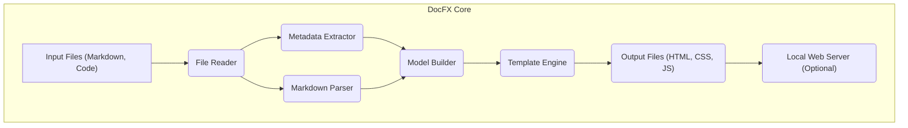
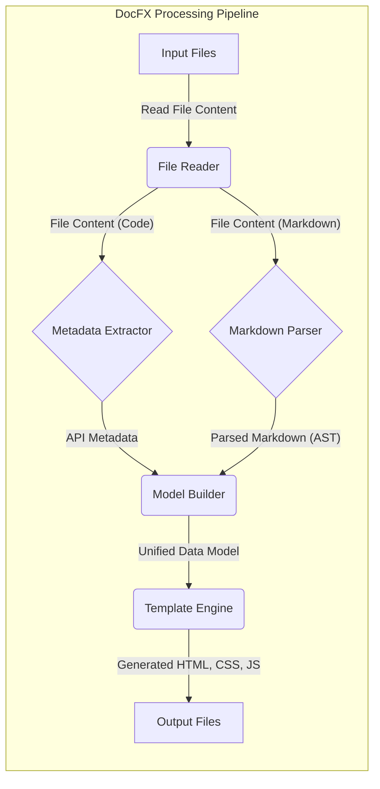

# Project Design Document: DocFX

**Version:** 1.1
**Date:** October 26, 2023
**Author:** AI Software Architect

## 1. Introduction

This document provides a detailed design overview of the DocFX project, an open-source documentation generator for .NET. This document aims to provide a comprehensive understanding of the system's architecture, components, and data flow, which will serve as the foundation for subsequent threat modeling activities.

## 2. Goals

The primary goals of this design document are to:

* Clearly articulate the architecture and components of DocFX.
* Describe the data flow and interactions between different parts of the system.
* Identify key technologies and dependencies.
* Provide a basis for identifying potential security vulnerabilities during threat modeling.

## 3. Scope

This document covers the core functionalities and architecture of DocFX as a documentation generation tool. It focuses on the process of taking source code and Markdown files as input and generating static website output. It includes:

* Core engine for processing documentation.
* Metadata extraction from source code.
* Markdown rendering and processing.
* Template engine for output generation.
* Basic web server for local preview.

This document does not cover:

* Specific DocFX plugins or extensions beyond a general understanding of their potential impact.
* Detailed implementation specifics of individual modules down to the code level.
* Deployment infrastructure beyond the basic local preview server and general considerations for production hosting.

## 4. Architecture Overview

DocFX follows a pipeline architecture where input files are processed through a series of stages to produce the final documentation website.

**Key Architectural Components:**

* **Input Files (Markdown, Code):** The source material for the documentation, including Markdown files (`.md`), source code files (C#, VB.NET, etc. - `.cs`, `.vb`), and potentially other configuration files (`.yml`, `.json`).
* **File Reader:** Responsible for reading and accessing the input files from the file system, respecting configured include/exclude patterns.
* **Metadata Extractor:** Analyzes source code files to extract metadata like class names, methods, properties, comments (including triple-slash comments for C#), and attributes. This information is used to generate API documentation.
* **Markdown Parser:** Parses Markdown files, converting them into an internal representation (Abstract Syntax Tree - AST) that can be further processed. It typically supports CommonMark and potentially extensions like GitHub Flavored Markdown (GFM).
* **Model Builder:** Combines the extracted metadata from code and the parsed Markdown content into a unified, structured data model representing the documentation structure, content, and relationships between different elements (e.g., linking Markdown documentation to specific API members).
* **Template Engine:** Applies predefined templates (often using a templating language like Liquid) to the data model to generate the final output files (HTML, CSS, JavaScript, images, etc.). This component handles the presentation, layout, and navigation of the documentation.
* **Output Files (HTML, CSS, JS):** The generated static website files that constitute the final documentation, ready for deployment to a web server.
* **Local Web Server (Optional):** A lightweight HTTP server that can be used to preview the generated documentation locally during development, allowing developers to see the output before deploying it.

## 5. Component Details

This section provides a more detailed description of each key component.

### 5.1. Input Files (Markdown, Code)

* **Purpose:** Contains the source content for the documentation.
* **Types:**
    * Markdown files (`.md`): Contain textual content, structure (headings, lists), formatting (bold, italics), and links.
    * Source code files (`.cs`, `.vb`, `.fs`, etc.): Used for extracting API documentation, including comments that are part of the public API surface.
    * YAML files (`.yml`): Used for configuration (e.g., `docfx.json`), table of contents (`toc.yml`), and potentially other metadata.
    * JSON files (`.json`): Primarily for configuration.
    * Image files (`.png`, `.jpg`, `.svg`, etc.): Assets embedded in the documentation.
    * Other static assets (e.g., custom CSS, JavaScript).
* **Responsibilities:** Providing the raw data and structure for the documentation generation process. The integrity and correctness of these files are crucial for the final output.

### 5.2. File Reader

* **Purpose:** Locates and reads the input files from the specified directories and according to the configuration.
* **Responsibilities:**
    * File system traversal based on configured source folders and file patterns.
    * File access and reading, handling potential file access errors.
    * Handling different file encodings (e.g., UTF-8).
    * Applying include and exclude patterns defined in the configuration to filter files.
    * Potentially caching file contents for performance during multiple processing stages.

### 5.3. Metadata Extractor

* **Purpose:** Extracts structured information (metadata) from source code files to generate API documentation.
* **Supported Languages:** Primarily C#, VB.NET, and F#. Support for other languages might be available through plugins or extensions.
* **Responsibilities:**
    * Parsing source code files using language-specific parsers (e.g., Roslyn for C#).
    * Identifying and extracting information about namespaces, classes, interfaces, structs, enums, methods, properties, fields, events, and other members.
    * Extracting documentation comments (e.g., triple-slash comments in C#) and associating them with the corresponding API elements.
    * Handling attributes and other code annotations that provide metadata.
    * Building a structured representation of the API, often in a format suitable for further processing (e.g., a set of objects representing API elements).

### 5.4. Markdown Parser

* **Purpose:** Converts Markdown syntax in `.md` files into a structured format that DocFX can understand and process.
* **Responsibilities:**
    * Parsing Markdown text according to a specific Markdown specification (typically CommonMark or a superset like GitHub Flavored Markdown).
    * Identifying and interpreting Markdown syntax for headings, paragraphs, lists, code blocks, links, images, tables, and other elements.
    * Handling Markdown extensions and custom syntax supported by DocFX.
    * Converting the Markdown content into an internal document object model (DOM) or Abstract Syntax Tree (AST) that represents the structure and content of the Markdown document.

### 5.5. Model Builder

* **Purpose:** Combines the extracted metadata from source code and the parsed Markdown content into a unified, coherent data model.
* **Responsibilities:**
    * Linking Markdown documentation pages to corresponding API elements based on identifiers and cross-references.
    * Building a hierarchical structure of the documentation, reflecting the organization of both the Markdown files and the API.
    * Resolving cross-references between documentation pages and API elements, ensuring that links between different parts of the documentation work correctly.
    * Creating a comprehensive data structure that represents the entire documentation set, including content, metadata, and relationships, which is then passed to the template engine.

### 5.6. Template Engine

* **Purpose:** Generates the final output files (HTML, CSS, JavaScript, etc.) by applying predefined templates to the data model created by the Model Builder.
* **Technology:** Commonly uses a templating language like Liquid (popular in the .NET ecosystem) or potentially others.
* **Responsibilities:**
    * Reading and processing template files, which define the structure and layout of the output documentation.
    * Iterating over the data model provided by the Model Builder to populate the templates with content.
    * Generating HTML markup for the documentation pages, including content, navigation, and structure.
    * Generating CSS files for styling the documentation.
    * Generating JavaScript files for interactive elements and client-side functionality.
    * Handling localization and internationalization if supported.
    * Generating other static assets as needed (e.g., images, fonts).

### 5.7. Output Files (HTML, CSS, JS)

* **Purpose:** The final generated static website files that constitute the complete documentation.
* **Types:**
    * HTML files (`.html`): Contain the content of the documentation pages, structured with HTML markup.
    * CSS files (`.css`): Define the styling, layout, and visual presentation of the documentation.
    * JavaScript files (`.js`): Provide interactive elements, client-side logic, and dynamic functionality.
    * Image files (`.png`, `.jpg`, `.svg`, etc.): Assets used within the documentation.
    * Other static assets (e.g., fonts, favicons).
* **Responsibilities:**  Representing the final, presentable form of the documentation, ready to be served by a web server.

### 5.8. Local Web Server (Optional)

* **Purpose:** Provides a lightweight HTTP server for previewing the generated documentation locally during development.
* **Functionality:** Serves the static output files (HTML, CSS, JS, etc.) over HTTP, allowing developers to view the documentation in a web browser.
* **Responsibilities:**
    * Listening for HTTP requests on a specified port.
    * Serving static files from the output directory in response to requests.
    * Typically a basic server intended for development and testing, not for production use.

## 6. Data Flow

The following diagram illustrates the flow of data through the DocFX system:

**Data Flow Description:**

1. **Input Files:** The process begins with various input files (Markdown, code, YAML configuration, images, etc.) located in the specified source directories.
2. **File Reader:** The File Reader component reads the content of these input files based on the project configuration.
3. **Metadata Extractor:** Source code files are passed to the Metadata Extractor, which parses them and extracts API metadata (namespaces, classes, members, comments).
4. **Markdown Parser:** Markdown files are passed to the Markdown Parser, which converts the Markdown syntax into a structured Abstract Syntax Tree (AST).
5. **Model Builder:** The extracted API metadata and the parsed Markdown ASTs are combined by the Model Builder to create a unified data model. This model represents the complete documentation structure and content, linking API documentation with conceptual documentation.
6. **Template Engine:** The Template Engine takes the unified data model and applies predefined templates to generate the final output files (HTML, CSS, JavaScript, etc.).
7. **Output Files:** The generated static website files are written to the specified output directory.

## 7. Deployment Model

DocFX is primarily used as a command-line tool. The typical deployment model involves:

* **Installation:** DocFX is installed as a .NET global tool or a local tool within a project.
* **Configuration:** A `docfx.json` configuration file (or similar configuration mechanisms) specifies the input files, output directory, templates, and other settings for the documentation generation process.
* **Execution:** The `docfx` command is executed from the command line, triggering the documentation generation process based on the configuration.
* **Output:** The generated static website (HTML, CSS, JS files) is placed in the specified output directory.
* **Hosting:** The generated output files are then deployed to a static website hosting platform. Common options include:
    * GitHub Pages
    * Azure Blob Storage with static website hosting enabled
    * Netlify
    * Vercel
    * Any standard web server (e.g., Apache, Nginx).

Optionally, the built-in local web server can be used for previewing the documentation during development by running a command like `docfx serve <output_directory>`.

## 8. Security Considerations (High-Level)

While this document focuses on the architecture, it's important to consider potential security aspects for future threat modeling:

* **Input Validation:** DocFX processes user-provided Markdown content and extracts information from code comments. Insufficient input validation could allow for the injection of malicious scripts or code snippets, potentially leading to Cross-Site Scripting (XSS) vulnerabilities in the generated documentation. For example, unescaped user-provided content in Markdown could be rendered as active script in the HTML output.
* **Output Sanitization:** When generating HTML, DocFX needs to ensure that any user-provided content (from Markdown or code comments) is properly sanitized and escaped to prevent XSS vulnerabilities in the generated website. Failure to sanitize could allow attackers to inject malicious scripts that execute in the browsers of users viewing the documentation.
* **Dependency Management:** DocFX relies on various third-party libraries and dependencies (e.g., for Markdown parsing, templating). Vulnerabilities in these dependencies could potentially be exploited if not properly managed and updated. Regularly scanning dependencies for known vulnerabilities is crucial.
* **Configuration Security:** The `docfx.json` file and other configuration files might contain sensitive information (though less likely in a typical scenario). However, ensuring the integrity of these files is important, as malicious modifications could alter the documentation generation process in unexpected ways.
* **Local Web Server Security:** The built-in local web server is intended for development purposes and likely lacks robust security features. It should not be used in production environments as it could be vulnerable to attacks if exposed.
* **Access Control (Generated Output):** While the generated output is typically static, considerations around access control might be relevant depending on the hosting environment and the sensitivity of the documented information. Ensuring that only authorized users can access the documentation might require additional configuration on the hosting platform.
* **Template Security:** If custom templates are used, vulnerabilities within those templates could introduce security risks. For example, improper handling of data within templates could lead to XSS.

## 9. Technologies Used

* **Programming Language:** C#
* **Platform:** .NET
* **Markdown Parsing Library:** Likely Markdig or a similar .NET Markdown parsing library.
* **Templating Engine:**  Commonly Liquid.
* **Web Server (Local Preview):** Likely Kestrel (a cross-platform web server for ASP.NET Core).
* **Configuration Format:** JSON (for `docfx.json`) and YAML (for `toc.yml` and other content metadata).
* **Source Code Parsing:** Roslyn (the .NET Compiler Platform) for C# and VB.NET.

## 10. Future Considerations

Potential future developments or changes that could impact the architecture include:

* **Enhanced Plugin System:** A more extensible plugin system could allow for greater customization and integration with other tools, potentially introducing new components and data flows.
* **Live Preview Features:** More advanced live preview capabilities with features like hot-reloading could require changes to the web server component and the overall processing pipeline.
* **Integration with Other Tools and Platforms:** Deeper integration with CI/CD pipelines, IDEs, or other documentation platforms could introduce new interaction points and data exchange mechanisms.
* **Support for New Documentation Formats:** Adding support for other input formats (e.g., reStructuredText) would necessitate the inclusion of new parsers and processing logic.
* **Improved Theming and Customization:** Enhancements to the theming system could involve changes to how templates and static assets are handled.

This document provides a more detailed and refined understanding of the DocFX project's architecture and components. This information will be crucial for conducting a thorough threat model to identify and mitigate potential security risks.