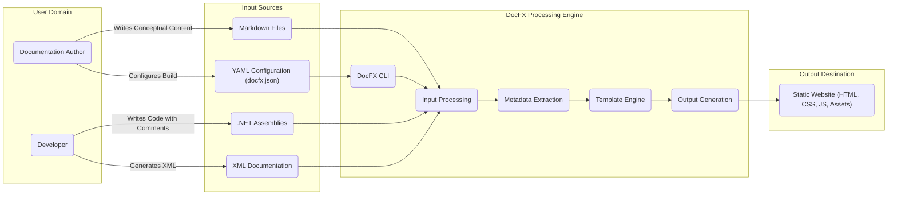

# Project Design Document: DocFX

**Version:** 1.1
**Date:** October 26, 2023
**Author:** AI Software Architect

## 1. Introduction

This document provides a detailed design overview of the DocFX project, a documentation generation tool for .NET. DocFX excels at building API documentation from .NET assemblies and associated XML documentation comments, alongside conceptual documentation authored in Markdown. This document details the system's architecture, core components, data flow, and crucial security considerations, serving as a foundational resource for subsequent threat modeling exercises.

## 2. Goals

*   Generate high-quality, professional API documentation from .NET assemblies and their XML documentation.
*   Seamlessly integrate and process Markdown for creating comprehensive conceptual documentation.
*   Produce static websites that effectively present both API references and conceptual content.
*   Offer a customizable templating system to tailor the look and feel of the generated documentation.
*   Provide a user-friendly command-line interface (CLI) for easy integration into various development and deployment pipelines.
*   Enable robust cross-referencing between API elements and conceptual documentation topics.
*   Support collaborative documentation efforts through seamless integration with version control systems.

## 3. Non-Goals

*   Providing real-time, interactive documentation experiences or live API exploration interfaces.
*   Serving as a general-purpose Content Management System (CMS) for dynamic content management.
*   Implementing built-in user authentication or authorization mechanisms for the generated documentation websites.
*   Directly managing or deploying the generated static website to specific hosting platforms.

## 4. Architecture Overview

DocFX functions as a static site generator, transforming source code, XML documentation, and Markdown files into a cohesive static website. The core process involves a series of steps: input parsing, metadata extraction, template application, and final output generation (HTML, CSS, JavaScript).

**Key Architectural Components:**

*   **DocFX CLI:** This is the primary interface for users, handling command execution, configuration loading from `docfx.json`, and orchestrating the entire documentation generation workflow.
*   **Input Processing:** This component is responsible for reading and parsing various input formats:
    *   Compiled .NET assemblies (`.dll`, `.exe`).
    *   XML documentation files generated by the .NET compiler.
    *   Conceptual documentation written in Markdown.
    *   Project configuration defined in YAML files (`docfx.json`).
*   **Metadata Extraction:** This component analyzes the parsed input to extract essential metadata:
    *   API signatures, types, members, and associated documentation from assemblies and XML comments.
    *   Structure, content, and metadata (e.g., title, author) from Markdown files.
    *   Build and processing instructions from YAML configuration.
*   **Template Engine:** DocFX utilizes a templating engine (Liquid by default) to transform the extracted metadata and content into the final output format. Templates define the structure, layout, and styling of the generated website.
*   **Output Generation:** This component takes the processed data and rendered templates to generate the static website files, including HTML, CSS, JavaScript, and associated assets.

## 5. Component Details

### 5.1. DocFX CLI

*   **Responsibilities:**
    *   Receiving and interpreting user commands and arguments.
    *   Loading and validating the `docfx.json` configuration file.
    *   Managing the overall documentation build process lifecycle.
    *   Providing options for local preview and serving of the generated website.
    *   Facilitating the integration of plugins and extensions.
*   **Key Interactions:**
    *   Reads project configuration from `docfx.json`.
    *   Invokes the Input Processing component, providing paths to input sources.
    *   Triggers the Metadata Extraction process after input processing.
    *   Passes extracted metadata to the Template Engine for rendering.
    *   Initiates the Output Generation process to create the static website.

### 5.2. Input Processing

*   **Responsibilities:**
    *   Locating and accessing input files based on the project configuration.
    *   Parsing .NET assemblies using reflection to extract type information.
    *   Parsing XML documentation files to associate comments with corresponding code elements.
    *   Parsing Markdown files to extract content, structure, and embedded metadata.
    *   Parsing YAML configuration files to retrieve build settings and options.
*   **Key Interactions:**
    *   Receives input file paths and configuration from the DocFX CLI.
    *   Interacts with the file system to read input files.
    *   Passes the parsed data structures to the Metadata Extraction component.

### 5.3. Metadata Extraction

*   **Responsibilities:**
    *   Extracting detailed API metadata (namespaces, types, members, parameters, return types, etc.) from the parsed assembly information.
    *   Associating XML documentation comments with their respective API elements.
    *   Extracting metadata from Markdown files, such as titles, headings, and links.
    *   Constructing a comprehensive model of the documentation structure, including relationships between API elements and conceptual topics.
    *   Resolving cross-references between different parts of the documentation (API to conceptual, and vice versa).
*   **Key Interactions:**
    *   Receives parsed data from the Input Processing component.
    *   Passes the extracted and structured metadata to the Template Engine.

### 5.4. Template Engine

*   **Responsibilities:**
    *   Loading and interpreting template files (typically written using the Liquid templating language).
    *   Receiving the extracted metadata from the Metadata Extraction component.
    *   Dynamically generating output files (HTML, XML, etc.) based on the templates and the provided metadata.
    *   Supporting custom templates to allow for complete UI and layout customization.
*   **Key Interactions:**
    *   Receives metadata from the Metadata Extraction component.
    *   Passes the rendered output to the Output Generation component.
    *   May access static assets (CSS, JavaScript, images) from the file system as defined in the templates.

### 5.5. Output Generation

*   **Responsibilities:**
    *   Receiving the rendered output from the Template Engine.
    *   Generating the final static HTML files for each documentation page.
    *   Generating CSS and JavaScript files for styling and interactive elements.
    *   Copying static assets (images, fonts, etc.) to the output directory.
    *   Creating supporting files for the static website, such as a sitemap.
*   **Key Interactions:**
    *   Receives rendered content from the Template Engine.
    *   Writes the generated files to the specified output directory on the file system.

## 6. Data Flow

The primary data flow within DocFX follows these steps:

1. **Content Creation:** Documentation Authors write conceptual content in **Markdown Files**, and Developers write code with **XML Documentation** comments within **.NET Assemblies**. They also configure the build process using **YAML Configuration (docfx.json)**.
2. **Initiation:** The **User** invokes the **DocFX CLI** to start the documentation generation process.
3. **Configuration Loading:** The **DocFX CLI** reads and parses the **YAML Configuration (docfx.json)** to understand input sources and build settings.
4. **Input Processing:** The **Input Processing** component reads and parses the specified **.NET Assemblies**, **XML Documentation**, and **Markdown Files**.
5. **Metadata Extraction:** The **Metadata Extraction** component analyzes the parsed input to extract API metadata, content structure, and relationships between documentation elements.
6. **Templating:** The extracted metadata is passed to the **Template Engine**, which uses predefined or custom templates to render the final output.
7. **Output Generation:** The **Output Generation** component takes the rendered output and generates the **Static Website (HTML, CSS, JS, Assets)** in the specified output directory.
8. **Deployment:** The generated **Static Website** is then ready for deployment to a web server or Content Delivery Network (CDN).

## 7. Security Considerations

This section outlines key security considerations for DocFX, crucial for identifying potential threats during threat modeling.

*   **Input Validation and Sanitization:** DocFX processes various file formats, making robust input validation and sanitization paramount to prevent vulnerabilities:
    *   **Malicious Assembly Handling:** Strict validation and sandboxing of loaded .NET assemblies are necessary to prevent the execution of arbitrary code. Consider the risks of loading assemblies from untrusted sources.
    *   **XML External Entity (XXE) Prevention:** Secure parsing of XML documentation files is critical to avoid exploiting external entity references, which could lead to information disclosure or denial-of-service.
    *   **Markdown Injection Prevention:**  Sanitize Markdown content to prevent Cross-Site Scripting (XSS) attacks in the generated website. This includes handling potentially malicious HTML or JavaScript embedded in Markdown.
    *   **YAML Deserialization Security:** Securely parse YAML configuration files to prevent arbitrary code execution through deserialization vulnerabilities. Avoid using unsafe deserialization methods.
    *   **File Path Handling:** Ensure proper handling of file paths in configuration and input to prevent path traversal vulnerabilities, which could allow access to sensitive files.
*   **Template Security:** The templating engine executes code within the DocFX process, requiring careful attention to security:
    *   **Template Injection Prevention:**  Ensure that user-provided input or data from untrusted sources cannot be directly injected into template code, which could lead to arbitrary code execution within the DocFX process.
    *   **Secure Template Context:** Limit the capabilities and access of the template execution environment to prevent templates from performing unauthorized actions on the server or file system.
*   **Output Integrity:** Maintaining the integrity of the generated static website is essential:
    *   **Path Traversal Prevention in Output Generation:** Ensure that the output generation process cannot write files outside the intended output directory, preventing potential overwriting of critical system files.
*   **Dependency Management:** DocFX relies on external libraries and dependencies, introducing potential vulnerabilities:
    *   **Regular Vulnerability Scanning:** Implement a process for regularly scanning dependencies for known vulnerabilities using tools like OWASP Dependency-Check or similar.
    *   **Dependency Updates:**  Maintain up-to-date versions of all dependencies to patch known security flaws.
    *   **Supply Chain Security:** Be mindful of the sources and integrity of dependencies.
*   **Configuration Security:** The `docfx.json` file contains sensitive configuration information:
    *   **Secure Storage and Access Control:** Ensure that `docfx.json` is stored securely and access is restricted to authorized personnel or processes. Avoid storing sensitive credentials directly in the configuration file.
*   **Plugin Security:** DocFX supports plugins, which can extend its functionality but also introduce security risks:
    *   **Plugin Sandboxing and Isolation:** Consider implementing mechanisms to sandbox or isolate plugins to limit their access to system resources and prevent them from interfering with the core DocFX process.
    *   **Plugin Validation and Verification:** Implement a process to validate and verify the integrity and security of plugins before they are used. Consider using code signing or other verification methods.
    *   **Principle of Least Privilege:** Grant plugins only the necessary permissions required for their functionality.

## 8. Deployment Model

DocFX is primarily utilized as a command-line tool, typically integrated into development workflows and CI/CD pipelines. Common deployment scenarios include:

*   **Local Development Environment:** Developers use DocFX locally to generate and preview documentation during the development process.
*   **Continuous Integration/Continuous Deployment (CI/CD) Pipelines:** DocFX is integrated into the build process to automatically generate documentation upon code changes. The resulting static website is then deployed to a web server or CDN.
*   **Self-Hosted Documentation Websites:** The generated static website is hosted on the organization's own infrastructure, providing full control over the hosting environment.
*   **Cloud-Based Hosting Solutions:** The generated static website is deployed to cloud storage services such as Azure Blob Storage, Amazon S3, Google Cloud Storage, or platforms like Netlify or Vercel, leveraging their scalability and availability.

## 9. Technology Stack

*   **Core Programming Language:** C# (.NET)
*   **Default Templating Engine:** Liquid
*   **Primary Markup Languages:** Markdown, XML
*   **Configuration Language:** YAML
*   **Package Management System:** NuGet

## 10. Future Considerations

*   **Enhanced and More Secure Plugin Architecture:** Develop a more robust plugin system with improved security features, such as stricter sandboxing and permission management.
*   **Improved Theming and Customization Capabilities:** Offer a wider range of built-in themes and more intuitive tools for customizing the appearance of generated documentation.
*   **Deeper Integration with OpenAPI/Swagger:** Explore tighter integration with OpenAPI specifications to streamline the generation of API documentation from API definitions.
*   **Accessibility Enhancements:** Continuously improve the accessibility of the generated documentation websites to meet accessibility standards.
*   **Performance Optimization for Large Projects:** Optimize the documentation generation process to improve performance, especially for projects with a large number of files and complex documentation structures.
