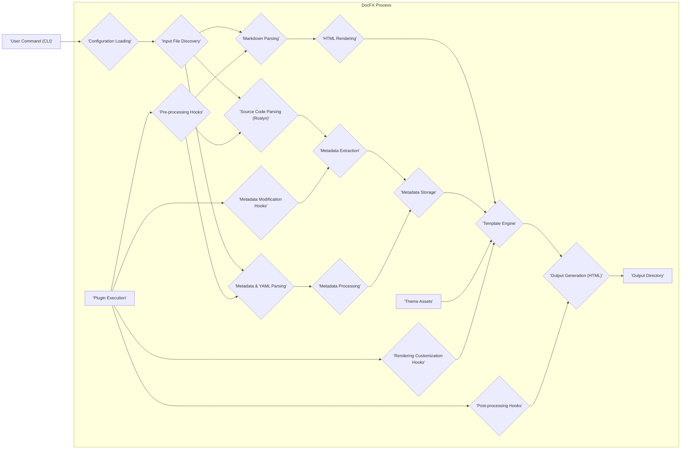

# Project Design Document: DocFX

**Version:** 1.1
**Date:** October 26, 2023
**Author:** AI Software Architect

## 1. Introduction

This document provides an enhanced and detailed design overview of the DocFX project, an open-source documentation generator primarily for the .NET ecosystem. This document is specifically crafted to facilitate thorough threat modeling by clearly outlining the system's architecture, individual components, data flow pathways, and critical security considerations.

## 2. Goals and Objectives

The core objectives driving the design and development of DocFX are:

*   **Automated API Documentation Generation:** To automatically generate comprehensive API documentation directly from .NET source code, supporting languages like C#, F#, and VB.
*   **Conceptual Documentation Authoring:** To enable the creation of rich conceptual documentation using the Markdown format, providing flexibility and ease of use for technical writers.
*   **Unified Documentation Output:** To seamlessly merge API documentation and conceptual documentation into a cohesive and navigable single website.
*   **Extensibility and Customization:** To offer a highly extensible platform through a plugin system and customizable themes, allowing users to tailor the documentation generation process and output.
*   **Static Site Generation:** To primarily produce static HTML websites, ensuring broad compatibility and ease of deployment on various web servers and platforms.

## 3. System Architecture

DocFX operates as a command-line tool, orchestrating a series of processes to transform source code and Markdown files into a static website. The architecture comprises the following key components, each with specific responsibilities:

*   **Command-Line Interface (CLI):**
    *   Serves as the primary interaction point for users.
    *   Parses command-line arguments provided by the user.
    *   Loads and validates project configuration settings.
    *   Initiates and manages the overall documentation generation workflow.
*   **Configuration System:**
    *   Manages project settings defined in configuration files (typically `docfx.json` or `docfx.yml`).
    *   Specifies input file paths, output directories, theme selection, plugin configurations, and other build parameters.
    *   Provides a centralized location for customizing the documentation generation process.
*   **Input Processing:**
    *   Responsible for locating and reading various input file types.
    *   Identifies:
        *   .NET source code files (`.cs`, `.fs`, `.vb`).
        *   Markdown files (`.md`) containing conceptual documentation.
        *   YAML files (`.yml`) used for metadata, table of contents, and configuration overrides.
        *   Static asset files (images, scripts, stylesheets) referenced in the documentation.
*   **Metadata Extraction (for .NET):**
    *   Utilizes the Roslyn compiler platform to parse .NET source code.
    *   Extracts metadata about namespaces, types (classes, interfaces, structs, enums), members (methods, properties, events), and their associated documentation comments (triple-slash comments).
    *   Generates structured data representing the API surface.
*   **Markdown Processing:**
    *   Parses Markdown files according to established syntax rules.
    *   Renders Markdown content into HTML fragments.
    *   May support extensions to the standard Markdown syntax.
*   **Template Engine:**
    *   Employs a templating language (often Liquid) to define the structure and layout of the final HTML pages.
    *   Combines extracted metadata and rendered Markdown content with template files.
    *   Allows for dynamic generation of HTML based on the input data.
*   **Theme Engine:**
    *   Provides the visual styling and user interface for the generated website.
    *   Consists of CSS stylesheets, JavaScript files, and potentially image assets.
    *   Offers pre-built themes and allows users to create or customize their own.
*   **Output Generation:**
    *   Takes the processed metadata, rendered Markdown, and applies the selected theme and templates.
    *   Generates the final static HTML website files.
    *   Organizes the output into the specified directory structure.
*   **Plugin System:**
    *   Enables developers to extend DocFX's functionality by creating custom plugins.
    *   Plugins can hook into various stages of the build process, including:
        *   Pre-processing input files.
        *   Modifying extracted metadata.
        *   Customizing the rendering process.
        *   Performing post-processing tasks on the generated output.
*   **File Serving (Optional):**
    *   Includes a lightweight, built-in web server for local previewing of the generated documentation during development.
    *   Primarily intended for development and testing purposes.

## 4. Data Flow

The following diagram illustrates the typical flow of data through the DocFX system during the documentation generation process:

**Detailed Data Flow Description:**

1. The user initiates the documentation generation process by executing a **'User Command (CLI)'** with specific arguments.
2. The **'Configuration Loading'** component reads and validates the project configuration from `docfx.json` or `docfx.yml`.
3. **'Input File Discovery'** identifies all relevant input files (source code, Markdown, YAML, assets) based on the configuration.
4. For .NET source code files, **'Source Code Parsing (Roslyn)'** is performed to analyze the code structure.
5. For Markdown files, **'Markdown Parsing'** converts the Markdown syntax into HTML.
6. For metadata and YAML files, **'Metadata & YAML Parsing'** extracts structured data.
7. **'Metadata Extraction'** from the parsed source code generates detailed information about APIs, including types, members, and documentation comments.
8. **'HTML Rendering'** produces HTML fragments from the parsed Markdown content.
9. **'Metadata Processing'** prepares the extracted metadata for use within the templates.
10. **'Metadata Storage'** temporarily holds the extracted and processed metadata.
11. The **'Template Engine'** combines the rendered HTML, stored metadata, and **'Theme Assets'** to generate the final HTML pages.
12. **'Output Generation (HTML)'** writes the generated HTML files, along with other static assets, to the **'Output Directory'**.
13. **'Plugin Execution'** can occur at various stages through different hooks:
    *   **'Pre-processing Hooks'**: Allow plugins to modify input files before parsing.
    *   **'Metadata Modification Hooks'**: Enable plugins to alter the extracted metadata.
    *   **'Rendering Customization Hooks'**: Permit plugins to customize the rendering process.
    *   **'Post-processing Hooks'**: Allow plugins to perform actions on the generated output.

## 5. Security Considerations

Given its role in processing source code and generating web content, DocFX presents several security considerations that are crucial for threat modeling:

*   **Input Validation and Sanitization:**
    *   **Source Code Injection:** Malicious code embedded within source code could potentially be executed during metadata extraction if vulnerabilities exist in the Roslyn integration or custom plugins. Robust parsing and isolation are necessary.
    *   **Markdown Injection (XSS):** User-provided Markdown content, if not properly sanitized during rendering, could introduce cross-site scripting (XSS) vulnerabilities into the generated website. Strict output encoding is essential.
    *   **Configuration File Manipulation:** Maliciously crafted configuration files could potentially lead to arbitrary file access, command execution, or denial of service if not parsed and validated securely.
    *   **Plugin Security:** Untrusted or compromised plugins pose a significant risk, as they can execute arbitrary code within the DocFX process and potentially compromise the generated output or the system itself. A secure plugin loading and execution mechanism is vital.
*   **Dependency Management:**
    *   **Vulnerable Dependencies:** DocFX relies on various third-party libraries (e.g., Roslyn, Markdown processors, templating engines). Vulnerabilities in these dependencies could be exploited if not regularly updated and managed.
    *   **Supply Chain Attacks:** Compromised dependencies introduced through the supply chain could introduce vulnerabilities or malicious code.
*   **Output Security:**
    *   **Cross-Site Scripting (XSS):** The generated static website must be free from XSS vulnerabilities. Proper sanitization of user-provided content and secure templating practices are crucial.
    *   **Information Disclosure:** Ensure that sensitive information is not inadvertently included in the generated documentation or its metadata.
*   **File System Access:**
    *   **Unauthorized Access:** DocFX requires read access to input files and write access to the output directory. Improperly configured permissions could lead to unauthorized access to sensitive data or the ability to overwrite critical files.
    *   **Path Traversal:** Vulnerabilities in handling file paths could allow attackers to access files outside the intended input or output directories.
*   **Secrets Management:**
    *   **Exposure of Credentials:** Configuration files or plugins might inadvertently contain sensitive information such as API keys, database credentials, or other secrets. Secure storage and handling of such secrets, potentially using environment variables or dedicated secret management solutions, are essential.
*   **Denial of Service (DoS):**
    *   **Resource Exhaustion:** Processing extremely large or deeply nested input files, or complex plugin operations, could potentially lead to excessive resource consumption (CPU, memory) and denial of service. Input validation and resource limits are important.
*   **Plugin Isolation:**  Mechanisms to isolate plugins and limit their access to system resources can mitigate the impact of compromised or malicious plugins.

## 6. Deployment

DocFX is typically deployed in the following scenarios:

*   **Local Development Environment:** Developers install DocFX locally on their machines to generate, preview, and test documentation during the development process. This allows for iterative refinement of documentation alongside code changes.
*   **Continuous Integration/Continuous Deployment (CI/CD) Pipelines:** DocFX is frequently integrated into CI/CD pipelines to automate documentation generation whenever code changes are merged into the main branch or a release branch. The generated output is then automatically deployed to a web server or static site hosting platform.
*   **Build Servers:** Dedicated build servers within an organization may host DocFX to generate documentation as part of the software build process.
*   **Containerized Environments:** DocFX can be run within Docker containers, providing a consistent and isolated environment for documentation generation, particularly useful in CI/CD pipelines.

## 7. Future Considerations

Ongoing development and potential future enhancements for DocFX include:

*   **Enhanced Security Auditing and Scanning:** Implementing automated security scans and validation checks for input files, generated output, and plugin code to proactively identify potential vulnerabilities.
*   **Improved Plugin Security Model:** Strengthening the plugin security model through features like sandboxing, permission management, and code signing to mitigate risks associated with untrusted plugins.
*   **Support for More Output Formats:** Expanding beyond static HTML to support other documentation formats like PDF or ePub.
*   **Cloud-Based Documentation Generation Services:** Exploring the possibility of offering DocFX as a cloud-based service, potentially simplifying setup and management for users.
*   **Deeper Integration with Source Control and Collaboration Platforms:** Enhancing integration with platforms like GitHub, GitLab, and Azure DevOps to streamline the documentation workflow and facilitate collaboration.
*   **Real-time Preview and Editing:** Investigating features for real-time preview and collaborative editing of documentation.

This enhanced design document provides a more detailed and comprehensive understanding of the DocFX project, specifically tailored for threat modeling activities. By thoroughly examining the architecture, data flow, and security considerations outlined here, security professionals can effectively identify and address potential risks associated with the system.