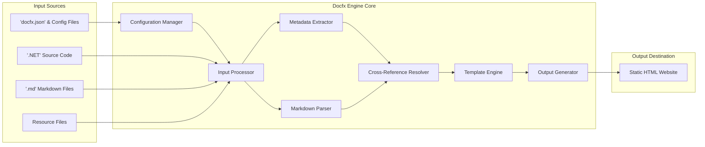
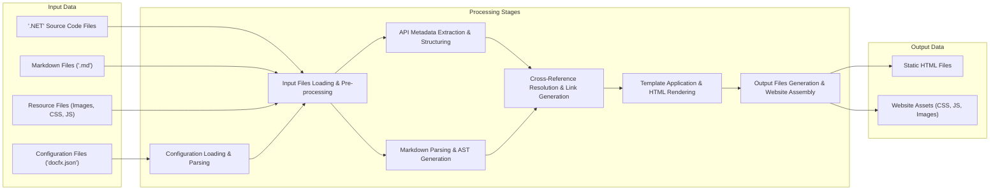

# Project Design Document: Docfx (Improved)

## 1. Project Overview

Docfx is a powerful static site generator tailored for technical documentation, particularly within the .NET ecosystem. It ingests diverse inputs – .NET source code (C#, VB.NET, F#), Markdown files, and YAML configuration files – to produce a polished static HTML website. Docfx is renowned for its ability to generate API documentation directly from .NET assemblies and seamlessly integrate it with conceptual documentation authored in Markdown. Key features include robust cross-referencing, support for code snippets, customizable themes, and extensibility via plugins. Docfx aims to streamline the creation and maintenance of comprehensive, professional-grade technical documentation.

This document provides an enhanced design overview of Docfx, specifically focusing on aspects crucial for threat modeling. It details the system architecture, data flow, and key components, with a stronger emphasis on potential security vulnerabilities and considerations. This document will serve as a foundation for subsequent threat modeling activities.

## 2. System Architecture

The following diagram illustrates the high-level architecture of Docfx, emphasizing data flow and component interaction.

**Component Description (Enhanced):**

*   **Input Sources:** The various origins of data consumed by Docfx.
    *   **'docfx.json' & Configuration Files:** YAML or JSON files defining project-wide settings, build configurations, input/output paths, template selections, plugin configurations, and other operational parameters. These files are critical for controlling Docfx's behavior.
    *   **'.NET' Source Code:**  .NET source code files (C#, VB.NET, F#) that are analyzed to automatically generate API documentation. This includes code comments, attributes, and code structure.
    *   **'.md' Markdown Files:** Conceptual documentation written in Markdown format. These files provide the narrative and descriptive content of the documentation.
    *   **Resource Files:** Static assets such as images, CSS stylesheets, JavaScript files, and other media that enhance the documentation website's presentation and functionality.

*   **Docfx Engine Core:** The central processing unit of Docfx, orchestrating the documentation generation process through distinct modules.
    *   **Configuration Manager:**  The initial entry point, responsible for reading and parsing configuration files. It validates configuration settings and makes them accessible to other components. This component is crucial for setting up the build environment.
    *   **Input Processor:**  Handles the intake of data from various input sources. It manages file system operations, loads content into memory, and performs initial parsing or pre-processing of input files. This stage prepares the data for subsequent processing stages.
    *   **Metadata Extractor:**  Specifically designed for .NET source code, this component leverages .NET compilation tools (like Roslyn) to analyze source code and extract API metadata. It generates structured data representing namespaces, classes, methods, properties, and their associated documentation comments.
    *   **Markdown Parser:**  Responsible for parsing Markdown files according to the CommonMark specification and potentially Docfx-specific extensions. It converts Markdown syntax into an intermediate representation (e.g., an Abstract Syntax Tree) suitable for further processing and HTML generation.
    *   **Cross-Reference Resolver:**  A vital component for linking documentation elements. It resolves cross-references within Markdown files (e.g., `[link text](xref:MyNamespace.MyClass)`) and between Markdown and API documentation (linking from conceptual docs to API references and vice versa). This ensures a navigable and interconnected documentation set.
    *   **Template Engine:**  Applies templates (often based on Liquid or similar templating languages) to the processed metadata and Markdown content. Templates define the layout, structure, and visual style of the final HTML pages. This component merges data with presentation logic to generate the output.
    *   **Output Generator:**  The final stage responsible for writing the generated HTML files and associated assets (CSS, JavaScript, images) to the designated output directory. It constructs the static website structure and prepares it for deployment.

*   **Output Destination:** The final product of Docfx's processing.
    *   **Static HTML Website:** A collection of static HTML, CSS, JavaScript, and image files that constitute the complete documentation website. This output is designed for easy deployment on any static file server or CDN.

## 3. Data Flow (Improved)

The following diagram illustrates the detailed data flow within Docfx, highlighting data transformations at each stage.

**Data Flow Description (Enhanced):**

1.  **Configuration Loading & Parsing (P_CFG):** Docfx initiates the process by loading and parsing configuration files (e.g., `docfx.json`). This stage involves reading the file content, parsing it (YAML/JSON), and validating the configuration structure and values. The parsed configuration is then made available to other components.

2.  **Input Files Loading & Pre-processing (P_INPUT):** Based on the configuration, Docfx loads input files from specified directories. This includes:
    *   Reading '.NET' source code files, potentially performing initial syntax analysis or tokenization.
    *   Reading Markdown files, possibly performing basic pre-processing like encoding detection.
    *   Copying resource files to a staging area for later inclusion in the output.
    *   This stage might involve file system traversal and handling of file encoding.

3.  **API Metadata Extraction & Structuring (P_META):** For '.NET' source code, Docfx utilizes .NET compilation tools to perform in-depth analysis. This stage extracts API metadata, including:
    *   Namespaces, classes, interfaces, structs, enums, delegates.
    *   Members (methods, properties, events, fields, constructors).
    *   Documentation comments (/// comments).
    *   Attributes and other code annotations.
    *   The extracted metadata is structured into an intermediate format suitable for templating and cross-referencing.

4.  **Markdown Parsing & AST Generation (P_MD):** Markdown files are parsed to convert them into a structured representation, typically an Abstract Syntax Tree (AST). This stage involves:
    *   Lexical analysis and parsing of Markdown syntax.
    *   Handling Markdown extensions and custom syntax.
    *   Generating an AST that represents the document structure and content.

5.  **Cross-Reference Resolution & Link Generation (P_XREF):** Docfx resolves cross-references to create hyperlinks between different parts of the documentation. This involves:
    *   Identifying cross-reference syntax in Markdown and API metadata.
    *   Looking up target elements (API members, Markdown documents) based on identifiers.
    *   Generating URLs and links that connect related documentation elements.
    *   This stage ensures that the documentation is internally consistent and navigable.

6.  **Template Application & HTML Rendering (P_TEMP):** The processed metadata and parsed Markdown content (often represented as ASTs) are combined and fed into the template engine. This stage performs:
    *   Template selection based on configuration and content type.
    *   Data binding: merging metadata and Markdown content with template placeholders.
    *   HTML generation by executing template logic and rendering content.
    *   This stage determines the final visual presentation of the documentation.

7.  **Output Files Generation & Website Assembly (P_OUT):** The generated HTML content and associated assets are written to the output directory. This stage involves:
    *   Creating the directory structure for the static website.
    *   Writing HTML files for each document and API page.
    *   Copying resource files (CSS, JavaScript, images) to the output directory.
    *   Generating any necessary index files or site maps.
    *   This stage assembles the complete static HTML website ready for deployment.

8.  **Output Data (OUT_HTML, OUT_ASSETS):** The final output is a static HTML website, comprising HTML files and associated assets, ready for hosting on a web server.

## 4. Security Considerations (Enhanced & Detailed)

Based on the architecture and data flow, here are more detailed security considerations for Docfx, categorized for clarity and including potential mitigation strategies:

*   **Input Validation & Sanitization:**
    *   **Threat:** Maliciously crafted input files can exploit vulnerabilities in parsing or processing logic, leading to various attacks.
        *   **Configuration Files ('docfx.json'):**
            *   **Threat:** YAML/JSON deserialization vulnerabilities, allowing arbitrary code execution if Docfx uses insecure deserialization methods. Malformed configurations could cause denial-of-service or unexpected behavior. Path traversal vulnerabilities if configuration allows specifying arbitrary file paths.
            *   **Mitigation:** Use secure YAML/JSON parsing libraries. Implement strict schema validation for configuration files. Sanitize and validate all configuration values, especially file paths and URLs. Employ least privilege principles for file system access based on configuration.
        *   **Markdown Files ('.md'):**
            *   **Threat:** Cross-Site Scripting (XSS) vulnerabilities if Markdown parsing doesn't properly sanitize user-provided content. Malicious Markdown could inject JavaScript into generated HTML, compromising users viewing the documentation.
            *   **Mitigation:** Utilize a robust and well-vetted Markdown parsing library that inherently sanitizes output against XSS. Implement Content Security Policy (CSP) in generated HTML to further mitigate XSS risks. Carefully review and sanitize any custom Markdown extensions.
        *   **Source Code ('.NET'):**
            *   **Threat:** While less direct, vulnerabilities in metadata extraction could be triggered by specially crafted source code. Denial-of-service if the metadata extractor fails to handle very large or complex code structures.
            *   **Mitigation:** Ensure the metadata extraction process is robust and handles malformed or malicious code gracefully. Implement resource limits to prevent denial-of-service. Regularly update the underlying .NET compilation tools (Roslyn) to patch potential vulnerabilities.
        *   **Resource Files (Images, etc.):**
            *   **Threat:** Inclusion of malicious files disguised as legitimate resources (e.g., polyglot files).
            *   **Mitigation:** Implement file type validation and sanitization for resource files. Avoid directly serving user-provided resource files without processing or validation.

*   **Template Security:**
    *   **Threat:** Template Injection vulnerabilities if user-provided templates or unsanitized template inputs are allowed. This could lead to arbitrary code execution on the server or information disclosure. XSS vulnerabilities within templates themselves if not carefully designed.
        *   **Mitigation:** Use a secure templating engine with sandboxing capabilities. Restrict or carefully control user-provided templates. Sanitize all data passed to templates to prevent XSS. Implement secure coding practices when designing templates, avoiding direct HTML output of unsanitized data.

*   **Output Security:**
    *   **Threat:** Generated HTML website itself could contain vulnerabilities (e.g., XSS) due to issues in Markdown parsing, template rendering, or cross-reference resolution.
        *   **Mitigation:** Thoroughly test the generated HTML for XSS vulnerabilities. Implement Content Security Policy (CSP) headers in the generated HTML to restrict the capabilities of the browser and mitigate XSS. Ensure all generated URLs and links are properly encoded and sanitized.

*   **Dependency Security (Supply Chain Security):**
    *   **Threat:** Docfx relies on numerous third-party libraries and dependencies. Vulnerabilities in these dependencies could directly impact Docfx's security.
        *   **Mitigation:** Maintain a Software Bill of Materials (SBOM) for Docfx's dependencies. Regularly scan dependencies for known vulnerabilities using vulnerability scanning tools. Keep dependencies updated to the latest secure versions. Follow secure development practices for managing and updating dependencies.

*   **Access Control & File System Security:**
    *   **Threat:** Unauthorized access to input files or output directories could lead to data breaches, modification of documentation, or injection of malicious content.
        *   **Mitigation:** Implement proper file system permissions to restrict access to input files and configuration to authorized users only. Secure the output directory to prevent unauthorized modification of the generated documentation website. Follow least privilege principles for Docfx's file system access.

*   **Plugin Security (Extensibility):**
    *   **Threat:** If Docfx supports plugins, malicious or poorly written plugins could introduce vulnerabilities, bypass security measures, or compromise the entire system.
        *   **Mitigation:** Implement a secure plugin architecture with sandboxing and permission controls. Review and audit plugins for security vulnerabilities before allowing their use. Provide clear guidelines and security best practices for plugin developers. Consider a plugin marketplace with security vetting processes.

## 5. Component Descriptions (Enhanced Security Focus)

This section provides a more detailed description of key components within the Docfx Engine, with a specific focus on their security functionalities and potential vulnerabilities.

*   **Configuration Manager:**
    *   **Functionality:** Reads, parses, validates, and manages configuration files (`docfx.json`, etc.). Provides configuration settings to other components.
    *   **Data Handled:** Configuration files (YAML/JSON), configuration settings.
    *   **Security Aspects:**
        *   **Vulnerabilities:** YAML/JSON deserialization vulnerabilities, malformed configuration parsing, path traversal in file path configurations.
        *   **Threats:** Arbitrary code execution, denial-of-service, unauthorized file system access.
        *   **Mitigation:** Secure YAML/JSON parsing libraries, strict schema validation, input sanitization, path traversal prevention, least privilege file access.

*   **Input Processor:**
    *   **Functionality:** Loads input files (source code, Markdown, resources) from specified paths. Manages file system interactions. Pre-processes input files.
    *   **Data Handled:** Source code files, Markdown files, resource files, file paths.
    *   **Security Aspects:**
        *   **Vulnerabilities:** Path traversal vulnerabilities, denial-of-service due to large files or directory structures, improper file handling.
        *   **Threats:** Unauthorized file access, information disclosure, denial-of-service.
        *   **Mitigation:** Path sanitization, input size limits, resource management, secure file handling practices, file type validation.

*   **Metadata Extractor:**
    *   **Functionality:** Parses '.NET' source code using .NET compilation tools (Roslyn) to extract API metadata.
    *   **Data Handled:** '.NET' source code files, API metadata.
    *   **Security Aspects:**
        *   **Vulnerabilities:** Potential vulnerabilities in underlying compilation tools, denial-of-service due to complex code, information leakage from metadata.
        *   **Threats:** Denial-of-service, information disclosure, potential exploitation of compiler vulnerabilities (less likely but possible).
        *   **Mitigation:** Regular updates of compilation tools, resource limits, robust error handling, careful review of extracted metadata for sensitive information.

*   **Markdown Parser:**
    *   **Functionality:** Parses Markdown files into HTML or an intermediate representation (AST). Supports Markdown syntax and extensions.
    *   **Data Handled:** Markdown files, parsed Markdown content (AST or HTML).
    *   **Security Aspects:**
        *   **Vulnerabilities:** Cross-Site Scripting (XSS) vulnerabilities if parsing is not secure, injection of malicious HTML through Markdown.
        *   **Threats:** Cross-Site Scripting attacks, website defacement, user compromise.
        *   **Mitigation:** Secure Markdown parsing library with built-in XSS sanitization, Content Security Policy (CSP), output encoding, careful handling of custom extensions.

*   **Cross-Reference Resolver:**
    *   **Functionality:** Resolves links and references within and between documentation files. Generates URLs for cross-references.
    *   **Data Handled:** Markdown content, API metadata, cross-reference links, URLs.
    *   **Security Aspects:**
        *   **Vulnerabilities:** Link injection, URL manipulation, open redirects if not properly validated.
        *   **Threats:** Phishing attacks, redirection to malicious sites, information disclosure.
        *   **Mitigation:** URL validation and sanitization, prevention of open redirects, secure URL generation, input validation for cross-reference targets.

*   **Template Engine:**
    *   **Functionality:** Applies templates to generate HTML output based on processed data.
    *   **Data Handled:** Processed metadata, parsed Markdown content, templates, HTML output.
    *   **Security Aspects:**
        *   **Vulnerabilities:** Template Injection vulnerabilities, XSS vulnerabilities in templates, insecure template execution.
        *   **Threats:** Arbitrary code execution, information disclosure, Cross-Site Scripting attacks.
        *   **Mitigation:** Secure templating engine with sandboxing, restrict user-provided templates, input sanitization before template rendering, secure template design practices, Content Security Policy (CSP).

*   **Output Generator:**
    *   **Functionality:** Writes generated HTML and assets to the output directory. Assembles the static website.
    *   **Data Handled:** HTML files, assets, output directory path.
    *   **Security Aspects:**
        *   **Vulnerabilities:** Path traversal vulnerabilities in output path handling, insecure file permissions for generated output.
        *   **Threats:** Unauthorized file write access, website defacement, potential for local privilege escalation if output directory is improperly configured.
        *   **Mitigation:** Output path sanitization, path traversal prevention, secure file permissions for generated output, least privilege file system access.

This improved design document provides a more comprehensive and security-focused foundation for threat modeling Docfx. By considering these detailed security aspects for each component and data flow stage, a more thorough and effective threat model can be developed, leading to a more secure documentation generation tool.