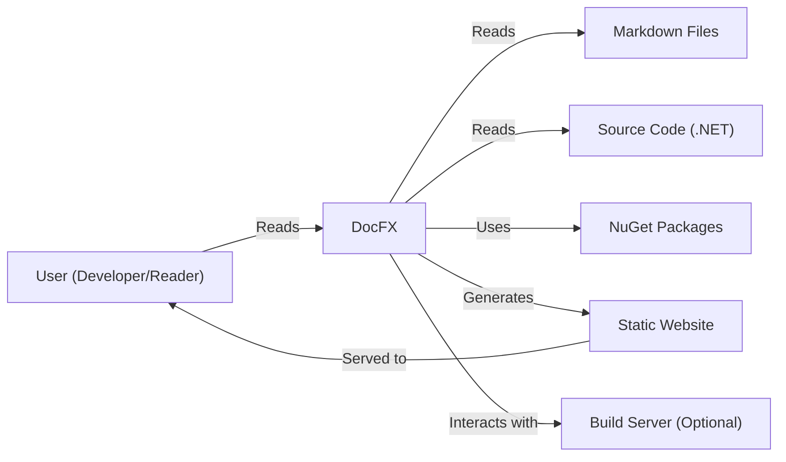
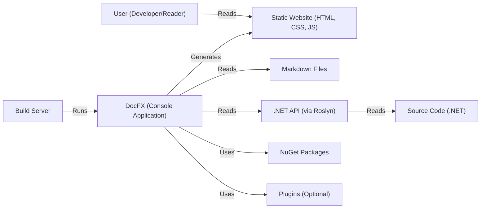
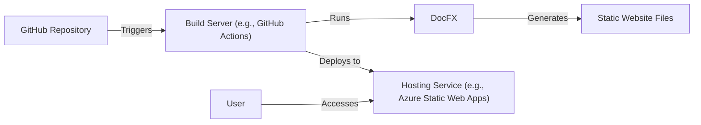
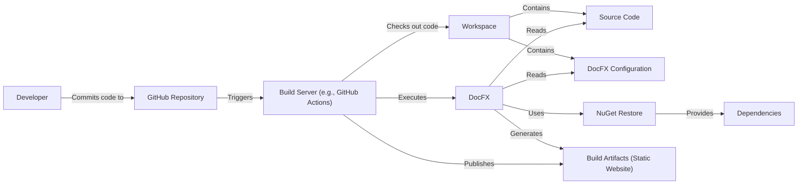

# BUSINESS POSTURE

Business Priorities and Goals:

*   Provide a robust and extensible static site generator specifically tailored for .NET documentation.
*   Support various input formats, including Markdown and .NET source code (via Roslyn).
*   Generate API documentation that is accurate, up-to-date, and easily navigable.
*   Enable customization of the generated website's appearance and structure.
*   Integrate seamlessly with existing .NET development workflows and build processes.
*   Maintain an active and supportive open-source community.
*   Provide good performance and scalability for large projects.

Most Important Business Risks:

*   Inaccurate or outdated API documentation, leading to developer confusion and errors.
*   Security vulnerabilities in the generated website or the DocFX tool itself, potentially exposing sensitive information or allowing malicious code execution.
*   Poor performance or scalability, hindering the usability of DocFX for large projects.
*   Lack of extensibility, limiting the ability to adapt DocFX to specific project needs.
*   Lack of community support, leading to unresolved issues and slow development.
*   Compatibility issues with different versions of .NET or other dependencies.

# SECURITY POSTURE

Existing Security Controls:

*   security control: Input validation: DocFX likely performs some input validation on Markdown files and source code to prevent common injection vulnerabilities. Implemented in parsing logic.
*   security control: Dependency management: DocFX uses NuGet for dependency management, which includes mechanisms for checking for known vulnerabilities. Described in project files and build process.
*   security control: Static analysis: The DocFX project likely uses static analysis tools to identify potential security vulnerabilities in the codebase. Described in build process.
*   security control: Code reviews: As an open-source project, DocFX benefits from community code reviews, which can help identify security issues. Described in GitHub repository.

Accepted Risks:

*   accepted risk: The generated static website may be vulnerable to client-side attacks (e.g., XSS) if custom templates or user-provided content are not properly sanitized.
*   accepted risk: DocFX's extensibility model (plugins) could introduce security vulnerabilities if plugins are not carefully vetted.

Recommended Security Controls:

*   security control: Implement Content Security Policy (CSP) in the generated website to mitigate XSS and other client-side attacks.
*   security control: Provide clear guidelines and security best practices for developing and using DocFX plugins.
*   security control: Regularly audit dependencies for known vulnerabilities and update them promptly.
*   security control: Integrate security scanning tools into the CI/CD pipeline to automatically detect vulnerabilities.
*   security control: Implement robust input validation and sanitization for all user-provided content, including Markdown, configuration files, and plugin inputs.
*   security control: Offer an option to generate a Software Bill of Materials (SBOM) for the generated website and DocFX itself.

Security Requirements:

*   Authentication:
    *   DocFX itself does not require authentication for generating documentation.
    *   If DocFX is integrated with a system that requires authentication (e.g., a private NuGet feed), it should support secure credential management.
*   Authorization:
    *   DocFX does not have built-in authorization mechanisms. Access control to the generated documentation is typically managed by the web server or hosting platform.
*   Input Validation:
    *   DocFX must validate and sanitize all input sources, including Markdown files, source code, configuration files, and plugin inputs.
    *   Validation should prevent common injection vulnerabilities, such as XSS, path traversal, and command injection.
*   Cryptography:
    *   DocFX should use secure cryptographic practices if it handles sensitive data (e.g., API keys, passwords).
    *   It should not store sensitive data in the generated documentation.
*   Output Encoding:
    *   DocFX should properly encode output to prevent XSS vulnerabilities in the generated website. This is particularly important for user-provided content and custom templates.

# DESIGN

## C4 CONTEXT

Element Descriptions:

*   Element:
    *   Name: User (Developer/Reader)
    *   Type: Person
    *   Description: A developer using DocFX to generate documentation or a reader accessing the generated documentation.
    *   Responsibilities: Uses DocFX, reads generated documentation.
    *   Security controls: Browser security settings, network security.

*   Element:
    *   Name: DocFX
    *   Type: Software System
    *   Description: The .NET static site generator for documentation.
    *   Responsibilities: Parses input, generates static website.
    *   Security controls: Input validation, dependency management, static analysis.

*   Element:
    *   Name: Markdown Files
    *   Type: Data
    *   Description: Markdown files containing documentation content.
    *   Responsibilities: Provides content for documentation.
    *   Security controls: Input validation by DocFX.

*   Element:
    *   Name: Source Code (.NET)
    *   Type: Data
    *   Description: .NET source code used to generate API documentation.
    *   Responsibilities: Provides API information.
    *   Security controls: Input validation by DocFX, Roslyn security features.

*   Element:
    *   Name: NuGet Packages
    *   Type: Data
    *   Description: NuGet packages used by DocFX and the project being documented.
    *   Responsibilities: Provides dependencies.
    *   Security controls: NuGet security features, dependency vulnerability scanning.

*   Element:
    *   Name: Static Website
    *   Type: Software System
    *   Description: The generated static website containing the documentation.
    *   Responsibilities: Presents documentation to users.
    *   Security controls: Web server security, CSP, output encoding.

*   Element:
    *   Name: Build Server (Optional)
    *   Type: Software System
    *   Description: A build server (e.g., Azure DevOps, Jenkins) that automates the DocFX build process.
    *   Responsibilities: Automates DocFX execution.
    *   Security controls: Build server security, secure credential management.

## C4 CONTAINER

Element Descriptions:

*   Element:
    *   Name: User (Developer/Reader)
    *   Type: Person
    *   Description: A developer using DocFX to generate documentation or a reader accessing the generated documentation.
    *   Responsibilities: Uses DocFX, reads generated documentation.
    *   Security controls: Browser security settings, network security.

*   Element:
    *   Name: Static Website (HTML, CSS, JS)
    *   Type: Web Application
    *   Description: The generated static website containing the documentation.
    *   Responsibilities: Presents documentation to users.
    *   Security controls: Web server security, CSP, output encoding.

*   Element:
    *   Name: DocFX (Console Application)
    *   Type: Application
    *   Description: The .NET static site generator executable.
    *   Responsibilities: Parses input, generates static website.
    *   Security controls: Input validation, dependency management, static analysis.

*   Element:
    *   Name: Markdown Files
    *   Type: Data
    *   Description: Markdown files containing documentation content.
    *   Responsibilities: Provides content for documentation.
    *   Security controls: Input validation by DocFX.

*   Element:
    *   Name: .NET API (via Roslyn)
    *   Type: API
    *   Description: The .NET Compiler Platform (Roslyn) used to analyze source code.
    *   Responsibilities: Provides API information from source code.
    *   Security controls: Roslyn security features.

*   Element:
    *   Name: Source Code (.NET)
    *   Type: Data
    *   Description: .NET source code used to generate API documentation.
    *   Responsibilities: Provides API information.
    *   Security controls: Input validation by DocFX, Roslyn security features.

*   Element:
    *   Name: NuGet Packages
    *   Type: Data
    *   Description: NuGet packages used by DocFX and the project being documented.
    *   Responsibilities: Provides dependencies.
    *   Security controls: NuGet security features, dependency vulnerability scanning.

*   Element:
    *   Name: Plugins (Optional)
    *   Type: Library
    *   Description: Optional plugins that extend DocFX's functionality.
    *   Responsibilities: Extends DocFX features.
    *   Security controls: Plugin security vetting, input validation.

*   Element:
    *   Name: Build Server
    *   Type: Software System
    *   Description: A build server (e.g., Azure DevOps, Jenkins) that automates the DocFX build process.
    *   Responsibilities: Automates DocFX execution.
    *   Security controls: Build server security, secure credential management.

## DEPLOYMENT

Possible Deployment Solutions:

1.  Manual deployment to a static website hosting service (e.g., Netlify, GitHub Pages, Azure Static Web Apps).
2.  Automated deployment via a CI/CD pipeline (e.g., Azure DevOps, GitHub Actions) to a static website hosting service.
3.  Deployment to a traditional web server (e.g., IIS, Apache, Nginx).

Chosen Solution (Automated Deployment via CI/CD):

Element Descriptions:

*   Element:
    *   Name: GitHub Repository
    *   Type: Code Repository
    *   Description: The source code repository for the project and documentation.
    *   Responsibilities: Stores code and documentation.
    *   Security controls: GitHub access controls, branch protection rules.

*   Element:
    *   Name: Build Server (e.g., GitHub Actions)
    *   Type: CI/CD Platform
    *   Description: A platform that automates the build and deployment process.
    *   Responsibilities: Runs DocFX, deploys static website.
    *   Security controls: Build server security, secure credential management.

*   Element:
    *   Name: DocFX
    *   Type: Application
    *   Description: The .NET static site generator executable.
    *   Responsibilities: Parses input, generates static website.
    *   Security controls: Input validation, dependency management, static analysis.

*   Element:
    *   Name: Static Website Files
    *   Type: Data
    *   Description: The generated HTML, CSS, and JavaScript files.
    *   Responsibilities: Represents the documentation website.
    *   Security controls: Output encoding.

*   Element:
    *   Name: Hosting Service (e.g., Azure Static Web Apps)
    *   Type: Hosting Platform
    *   Description: A platform that hosts the static website.
    *   Responsibilities: Serves the website to users.
    *   Security controls: Web server security, access controls, DDoS protection.

*   Element:
    *   Name: User
    *   Type: Person
    *   Description: A reader accessing the generated documentation.
    *   Responsibilities: Reads generated documentation.
    *   Security controls: Browser security settings, network security.

## BUILD

Build Process Description:

1.  A developer commits code and documentation changes to the GitHub repository.
2.  The commit triggers a build on the build server (e.g., GitHub Actions).
3.  The build server checks out the code into a workspace.
4.  The build server restores NuGet dependencies.
5.  The build server executes DocFX, which reads the source code, Markdown files, and DocFX configuration.
6.  DocFX generates the static website files (HTML, CSS, JavaScript).
7.  The build server publishes the generated files as build artifacts.
8.  Optionally, SAST and other security checks are performed during the build.

Security Controls:

*   security control: Secure credential management on the build server.
*   security control: Dependency vulnerability scanning during the build.
*   security control: Static analysis (SAST) of the DocFX codebase and potentially the project being documented.
*   security control: Code signing of DocFX releases (optional).
*   security control: Use of a secure build environment (e.g., isolated containers).

# RISK ASSESSMENT

Critical Business Processes:

*   Generating accurate and up-to-date API documentation.
*   Providing a user-friendly and accessible documentation website.
*   Maintaining the security and integrity of the DocFX tool and generated websites.

Data to Protect:

*   Source code (sensitivity depends on the project).
*   Documentation content (sensitivity depends on the project).
*   Configuration files (may contain sensitive information, such as API keys).
*   DocFX codebase (protect against malicious modifications).
*   Generated website (protect against defacement and injection attacks).

Data Sensitivity:

*   Source code and documentation content can range from public (open-source) to highly confidential (proprietary).
*   Configuration files may contain sensitive information that requires protection.

# QUESTIONS & ASSUMPTIONS

Questions:

*   What specific security scanning tools are currently used in the DocFX build process?
*   Are there any existing security guidelines or policies for DocFX contributors?
*   What is the process for reporting and addressing security vulnerabilities in DocFX?
*   Are there any plans to implement code signing for DocFX releases?
*   What level of support is provided for different hosting environments and deployment scenarios?
*   What are the specific mechanisms used for input validation and sanitization in DocFX?
*   How are plugins managed and vetted for security?

Assumptions:

*   BUSINESS POSTURE: The primary goal is to provide a reliable and secure documentation generator for .NET projects.
*   SECURITY POSTURE: DocFX relies on standard .NET security practices and community code reviews for security.
*   DESIGN: DocFX generates a static website that can be deployed to various hosting environments. The build process can be automated using CI/CD pipelines.