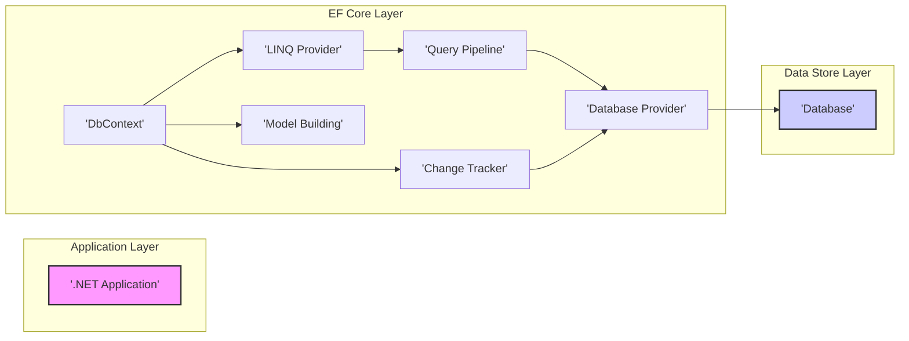

## Project Design Document: Entity Framework Core (EF Core)

**1. Introduction**

This document provides a detailed design overview of the Entity Framework Core (EF Core) project, an open-source, lightweight, extensible, and cross-platform Object-Relational Mapper (ORM) for .NET. This document serves as a foundation for subsequent threat modeling activities.

**2. Project Goals**

*   Provide a modern, performant, and developer-friendly ORM for .NET applications.
*   Enable developers to work with databases using .NET objects.
*   Support a wide range of database systems.
*   Offer extensibility points for customization and integration.
*   Maintain cross-platform compatibility.

**3. System Overview**

EF Core acts as an intermediary between the application's domain model (represented by .NET classes) and the underlying database. It allows developers to perform database operations using LINQ queries and strongly-typed objects, abstracting away the complexities of direct database interaction. EF Core handles tasks such as:

*   Object-Relational Mapping: Translating between .NET objects and database tables.
*   Query Translation: Converting LINQ queries into database-specific SQL.
*   Change Tracking: Monitoring changes made to entities.
*   Persistence: Saving changes to the database.
*   Schema Management: Creating and managing database schemas.

**4. Architectural Design**

The following diagram illustrates the high-level architecture of EF Core:

**5. Component Description**

*   **.NET Application:** The application code that utilizes EF Core to interact with the database.
*   **DbContext:**  The primary entry point for interacting with EF Core. It represents a session with the database and provides APIs for querying, saving, and tracking entities.
*   **LINQ Provider:** Responsible for translating LINQ queries written by the application into an expression tree that EF Core can understand.
*   **Query Pipeline:**  Processes the expression tree, optimizes the query, and generates database-specific SQL.
*   **Database Provider:**  A plugin that provides database-specific functionality, including:
    *   SQL generation.
    *   Connection management.
    *   Transaction management.
    *   Schema management.
*   **Change Tracker:**  Monitors changes made to entities loaded from or attached to the `DbContext`. It determines which entities need to be inserted, updated, or deleted when `SaveChanges` is called.
*   **Model Building:**  Configures the mapping between .NET entities and database schema. This can be done through conventions, data attributes, or the fluent API.
*   **Database:** The underlying data store (e.g., SQL Server, PostgreSQL, SQLite).

**6. Data Flow**

The following outlines the typical data flow for common operations:

*   **Querying Data:**
    1. The application executes a LINQ query against a `DbSet` exposed by the `DbContext`.
    2. The LINQ Provider translates the query into an expression tree.
    3. The Query Pipeline processes the expression tree and generates database-specific SQL using the active Database Provider.
    4. The Database Provider executes the SQL query against the Database.
    5. The Database returns the result set.
    6. The Database Provider materializes the result set into .NET entity objects.
    7. The `DbContext` returns the tracked entities to the application.

*   **Saving Changes:**
    1. The application modifies tracked entities or adds/removes entities from `DbSet`s.
    2. The `DbContext`'s Change Tracker detects these changes.
    3. When `SaveChanges` is called, the Query Pipeline generates appropriate INSERT, UPDATE, or DELETE commands based on the tracked changes, using the active Database Provider.
    4. The Database Provider executes these commands against the Database within a transaction (by default).
    5. The Database persists the changes.
    6. The `DbContext` updates the state of the tracked entities.

**7. Technology Stack**

*   **Programming Language:** C#
*   **.NET Runtime:**  .NET (Core, Framework, Standard)
*   **Core Libraries:**  `Microsoft.EntityFrameworkCore`, `Microsoft.EntityFrameworkCore.Relational`
*   **Database Provider Libraries:** (Examples)
    *   `Microsoft.EntityFrameworkCore.SqlServer`
    *   `Npgsql.EntityFrameworkCore.PostgreSQL`
    *   `Microsoft.EntityFrameworkCore.Sqlite`
*   **Build System:**  .NET SDK

**8. Deployment Architecture**

EF Core is a library that is integrated directly into the application. Deployment considerations are primarily focused on the application itself and the chosen database. Common deployment scenarios include:

*   **Web Applications:** Deployed to web servers (e.g., IIS, Kestrel) connecting to a database server.
*   **Desktop Applications:** Deployed as standalone applications with an embedded database (e.g., SQLite) or connecting to a remote database server.
*   **Cloud Environments:** Deployed to cloud platforms (e.g., Azure, AWS, GCP) utilizing managed database services.

**9. Security Considerations**

*   **SQL Injection:**  A primary concern when constructing dynamic SQL queries. EF Core mitigates this by using parameterized queries by default. However, raw SQL queries or poorly constructed LINQ queries can still be vulnerable.
*   **Connection String Security:**  Protecting database connection strings is crucial. Avoid storing them directly in code or configuration files. Consider using environment variables, Azure Key Vault, or other secure storage mechanisms.
*   **Data Validation:**  EF Core provides mechanisms for data validation, but it's essential to implement robust validation rules to prevent invalid data from being persisted.
*   **Authorization and Access Control:** EF Core itself doesn't handle user authentication or authorization. This must be implemented at the application level, ensuring that only authorized users can access and modify data.
*   **Sensitive Data Handling:**  Properly handle sensitive data (e.g., passwords, API keys) by encrypting it at rest and in transit. Avoid storing sensitive data directly in the database if possible.
*   **Database Provider Security:**  The security of the chosen database provider is also important. Ensure that the provider is up-to-date and follows security best practices.
*   **Code Injection (less common in typical EF Core usage):**  While less direct, vulnerabilities in custom interceptors or extensions could potentially introduce code injection risks.

**10. Extensibility Points**

EF Core offers various extensibility points, which are important to consider from a security perspective as they can introduce custom logic and potential vulnerabilities:

*   **Database Providers:**  Allow plugging in support for different database systems.
*   **Interceptors:**  Enable interception of database commands, connection events, and transaction events.
*   **Model Building Conventions:**  Allow customization of how the model is built from entity classes.
*   **Value Converters:**  Enable conversion between property values and database column values.
*   **Queryable Extensions:**  Allow adding custom query operators.

**11. Future Considerations**

*   Continued improvements in query performance and SQL generation.
*   Enhanced support for new database features.
*   Further development of tooling and diagnostics.

This document provides a comprehensive overview of the EF Core project's design, laying the groundwork for a thorough threat modeling exercise. The identified components, data flows, and security considerations will be crucial in identifying potential vulnerabilities and developing appropriate mitigation strategies.
