# Project Design Document: Entity Framework Core (EF Core)

**Version:** 1.1
**Date:** October 26, 2023
**Prepared By:** AI Software Architect

## 1. Introduction

This document provides a detailed architectural design of the Entity Framework Core (EF Core) project, specifically to facilitate comprehensive threat modeling activities. It meticulously outlines the key components, data flows, and interactions within the system to enable the identification of potential security vulnerabilities. This document is intended for security engineers, developers, architects, and anyone involved in the security analysis and hardening of EF Core or applications utilizing it.

## 2. Project Overview

Entity Framework Core (EF Core) is a lightweight, extensible, open source, and cross-platform Object-Relational Mapper (ORM) for .NET. It allows developers to interact with databases using .NET objects, abstracting away the need to write most of the boilerplate data access code. EF Core supports various database systems through its provider model.

This design document focuses on the core runtime architecture and functionalities of EF Core as represented in the provided GitHub repository: [https://github.com/dotnet/efcore](https://github.com/dotnet/efcore). The aim is to provide sufficient detail for security professionals to understand the system's inner workings and potential attack surfaces.

## 3. Goals

* Provide a clear, detailed, and accurate architectural overview of EF Core's core functionalities.
* Identify and describe key components, their responsibilities, and their interactions.
* Illustrate data flow within the system for various operations (querying, saving, migrations).
* Serve as a foundational resource for subsequent threat modeling exercises, enabling the identification of potential vulnerabilities and attack vectors.
* Document key security considerations relevant to each component and data flow.

## 4. Scope

This document comprehensively covers the following aspects of EF Core relevant to threat modeling:

* Core components of the EF Core runtime environment.
* Interactions with various database providers and the abstraction layer provided.
* The complete query execution pipeline, from LINQ expression to database execution.
* The change tracking mechanism and its role in managing entity states.
* The update pipeline responsible for persisting changes to the database.
* The migrations feature and its design-time and runtime aspects.
* Key extension points and extensibility mechanisms within EF Core.

This document explicitly does *not* cover:

* Detailed implementation specifics of individual database providers beyond their interaction with the core EF Core layers.
* Tools and command-line interfaces (CLIs) built on top of EF Core, although their interactions with the core are considered.
* The minute details of every class and method within the EF Core codebase.
* Performance optimization strategies within EF Core.

## 5. High-Level Architecture

EF Core's architecture is layered and modular, facilitating extensibility and separation of concerns. The key layers and components include:

* **Application Code:** The .NET application that utilizes EF Core to perform data access operations. This is the entry point for most interactions with EF Core.
* **`DbContext`:** The central class in EF Core, representing a session with the database. It provides APIs for querying (`DbSet<T>`), saving changes (`SaveChanges`), and configuring the model. It manages the unit of work and tracks entity states.
* **Model Building and Metadata:** This involves defining the conceptual model (entities, properties, relationships) and mapping it to the database schema. This can be done through conventions, data attributes, or the fluent API. The resulting metadata is used throughout the query and update pipelines.
* **Query Pipeline:**  Transforms LINQ queries into executable database commands. This involves:
    * **LINQ Expression Tree Parsing:**  Analyzing the LINQ query.
    * **Query Model Building:** Creating an internal representation of the query.
    * **Query Optimization:** Applying transformations to improve query efficiency.
    * **SQL Generation:** Translating the optimized query model into database-specific SQL.
* **Change Tracking:** Monitors changes made to entities retrieved from the database or newly added. It maintains the state of entities (Added, Modified, Deleted, Unchanged) and is crucial for the update pipeline.
* **Update Pipeline:** Orchestrates the process of persisting changes to the database. This involves:
    * **Identifying Changes:**  Consulting the change tracker to determine which operations need to be performed.
    * **Generating Commands:** Creating database-specific INSERT, UPDATE, and DELETE commands.
    * **Executing Commands:**  Sending the commands to the database provider for execution.
    * **Saving Related Data:** Handling cascading deletes and other relationship constraints.
* **Database Providers:**  Implement database-specific logic, acting as a bridge between EF Core and the underlying database system. This includes connection management, transaction handling, SQL generation, and data type mapping.
* **Migrations:** A system for managing changes to the database schema over time. It involves creating migration files that describe schema modifications and applying them to the database.

## 6. Key Components (Detailed)

* **`Microsoft.EntityFrameworkCore`:**  The core NuGet package containing fundamental classes and interfaces. Key components include:
    * **`DbContext`:** As described above.
    * **`DbSet<T>`:** Represents a collection of all entities of a given type in the context.
    * **`IQueryable<T>` and related interfaces:**  Used for building and executing queries.
    * **`ChangeTracker`:**  Manages the state of tracked entities.
    * **`ModelBuilder`:**  Used to configure the data model.
    * **`Database`:** Abstraction for database-related operations like connection management and transactions.
* **`Microsoft.EntityFrameworkCore.Relational`:** Provides the base infrastructure for relational database providers. Key components include:
    * **`RelationalConnection`:** Manages the database connection.
    * **`RelationalCommandBuilderFactory`:** Creates command builders for generating SQL.
    * **`QuerySqlGenerator`:**  Translates query expressions into SQL.
    * **`UpdateSqlGenerator`:** Generates SQL for data modification operations.
    * **`MigrationsSqlGenerator`:** Generates SQL for applying and reverting migrations.
* **Database Provider Packages (e.g., `Microsoft.EntityFrameworkCore.SqlServer`, `Npgsql.EntityFrameworkCore.PostgreSQL`, `Pomelo.EntityFrameworkCore.MySql`):** Implement database-specific logic. Key aspects include:
    * **Connection Implementation:**  Database-specific connection management.
    * **SQL Generation:** Adapting SQL generation to the specific database dialect.
    * **Data Type Mapping:** Mapping .NET types to database-specific types.
    * **Transaction Management:** Handling database transactions.
* **`Microsoft.EntityFrameworkCore.Design`:**  Contains components used during design-time operations:
    * **`MigrationScaffolder`:** Generates migration code.
    * **`DbContextFactory`:**  Used to create `DbContext` instances at design time.
    * **`DatabaseModelFactory`:**  Creates a model representation from an existing database.
* **`Microsoft.EntityFrameworkCore.Infrastructure`:** Provides internal services and infrastructure:
    * **`IServiceProvider` integration:**  Uses dependency injection for managing components.
    * **Logging and diagnostics:**  Provides mechanisms for logging and diagnostics.
    * **Options and configuration:**  Manages configuration settings for EF Core.

## 7. Data Flow Diagrams

### 7.1. Query Execution Flow (Detailed)

```mermaid
graph LR
    subgraph "Application"
        A["Application Code: LINQ Query"]
    end
    subgraph "EF Core"
        B["DbContext: DbSet<T>"]
        C["LINQ Query Provider"]
        D["Expression Tree Visitor"]
        E["Query Model Builder"]
        F["Query Optimizer"]
        G["Database Provider Services"]
        H["SQL Generator"]
        I["Command Compilation"]
        J["Command Execution"]
        K["Result Materialization"]
    end
    subgraph "Database Provider"
        L["Database Provider Implementation"]
        M["Database"]
    end

    A --> B
    B --> C
    C --> D
    D --> E
    E --> F
    F --> G
    G --> H
    H --> I
    I --> J
    J --> L
    L --> M
    M --> L
    L --> K
    K --> B
    B --> A

    style A fill:#ccf,stroke:#333,stroke-width:2px
    style B fill:#ccf,stroke:#333,stroke-width:2px
    style C fill:#ccf,stroke:#333,stroke-width:2px
    style D fill:#ccf,stroke:#333,stroke-width:2px
    style E fill:#ccf,stroke:#333,stroke-width:2px
    style F fill:#ccf,stroke:#333,stroke-width:2px
    style G fill:#ccf,stroke:#333,stroke-width:2px
    style H fill:#ccf,stroke:#333,stroke-width:2px
    style I fill:#ccf,stroke:#333,stroke-width:2px
    style J fill:#ccf,stroke:#333,stroke-width:2px
    style K fill:#ccf,stroke:#333,stroke-width:2px
    style L fill:#ccf,stroke:#333,stroke-width:2px
    style M fill:#ccf,stroke:#333,stroke-width:2px

    linkStyle 0,10,20 stroke:#333, stroke-width:2px;
    linkStyle 9,19 stroke:#333, stroke-width:2px;
```

* **Application Code** initiates a query using LINQ against a `DbSet<T>` on the **DbContext**.
* The **LINQ Query Provider** receives the expression tree.
* The **Expression Tree Visitor** traverses and analyzes the expression tree.
* The **Query Model Builder** constructs an internal, canonical representation of the query.
* The **Query Optimizer** applies transformations and optimizations to the query model.
* **Database Provider Services** are invoked to leverage database-specific capabilities.
* The **SQL Generator** translates the optimized query model into database-specific SQL.
* **Command Compilation** prepares the SQL command for execution.
* **Command Execution** sends the SQL command to the **Database Provider Implementation**.
* The **Database Provider Implementation** executes the query against the **Database**.
* The **Database** returns the result set.
* **Result Materialization** converts the database results into .NET objects.
* The materialized objects are returned through the **DbContext** to the **Application Code**.

### 7.2. Save Changes Flow (Detailed)

```mermaid
graph LR
    subgraph "Application"
        A["Application Code: Entity Modifications"]
    end
    subgraph "EF Core"
        B["DbContext: SaveChanges()"]
        C["Change Tracker: Detect Changes"]
        D["Update Pipeline Orchestration"]
        E["Entity State Manager"]
        F["Command Interception"]
        G["Command Generation"]
        H["Parameterization"]
        I["Transaction Management"]
        J["Command Execution"]
        K["Save Result Processing"]
    end
    subgraph "Database Provider"
        L["Database Provider Implementation"]
        M["Database"]
    end

    A --> B
    B --> C
    C --> D
    D --> E
    E --> G
    G --> H
    H --> I
    I --> J
    J --> L
    L --> M
    M --> L
    L --> K
    K --> B
    B --> A

    style A fill:#ccf,stroke:#333,stroke-width:2px
    style B fill:#ccf,stroke:#333,stroke-width:2px
    style C fill:#ccf,stroke:#333,stroke-width:2px
    style D fill:#ccf,stroke:#333,stroke-width:2px
    style E fill:#ccf,stroke:#333,stroke-width:2px
    style F fill:#ccf,stroke:#333,stroke-width:2px
    style G fill:#ccf,stroke:#333,stroke-width:2px
    style H fill:#ccf,stroke:#333,stroke-width:2px
    style I fill:#ccf,stroke:#333,stroke-width:2px
    style J fill:#ccf,stroke:#333,stroke-width:2px
    style K fill:#ccf,stroke:#333,stroke-width:2px
    style L fill:#ccf,stroke:#333,stroke-width:2px
    style M fill:#ccf,stroke:#333,stroke-width:2px

    linkStyle 0,10,20 stroke:#333, stroke-width:2px;
    linkStyle 9,19 stroke:#333, stroke-width:2px;
```

* **Application Code** modifies tracked entities or adds/removes entities.
* Calling `SaveChanges()` on the **DbContext** initiates the process.
* The **Change Tracker** detects changes made to tracked entities.
* The **Update Pipeline Orchestration** determines the order of operations.
* The **Entity State Manager** manages the state of each entity (Added, Modified, Deleted).
* **Command Interception** allows for modification or observation of commands.
* **Command Generation** creates database-specific INSERT, UPDATE, or DELETE commands.
* **Parameterization** is used to prevent SQL injection vulnerabilities.
* **Transaction Management** ensures atomicity of changes.
* **Command Execution** sends the commands to the **Database Provider Implementation**.
* The **Database Provider Implementation** executes the commands against the **Database**.
* The **Database** persists the changes.
* **Save Result Processing** updates entity properties (e.g., generated keys).
* Control is returned through the **DbContext** to the **Application Code**.

### 7.3. Migrations Flow (Detailed)

```mermaid
graph LR
    subgraph "Developer Environment"
        A["Developer CLI/Tools: Migration Command"]
    end
    subgraph "EF Core Design-Time"
        B["Migrations Assembly Loading"]
        C["DbContext Instance Creation"]
        D["Model Building (Current)"]
        E["Last Model Snapshot Loading"]
        F["Database Schema Comparison"]
        G["Migration Operation Generation"]
        H["Migration Code Scaffolding"]
        I["Migration File Output"]
    end
    subgraph "Runtime Environment"
        J["Application Startup"]
        K["Apply Migrations (Optional)"]
        L["Migrations Assembly Loading (Runtime)"]
        M["Database Schema Update"]
    end
    subgraph "Database Provider"
        N["Database Provider Implementation"]
        O["Database"]
    end

    A --> B
    B --> C
    C --> D
    D --> E
    E --> F
    F --> G
    G --> H
    H --> I
    J --> K
    K --> L
    L --> D
    L --> N
    N --> M
    M --> O
    O --> N

    style A fill:#ccf,stroke:#333,stroke-width:2px
    style B fill:#ccf,stroke:#333,stroke-width:2px
    style C fill:#ccf,stroke:#333,stroke-width:2px
    style D fill:#ccf,stroke:#333,stroke-width:2px
    style E fill:#ccf,stroke:#333,stroke-width:2px
    style F fill:#ccf,stroke:#333,stroke-width:2px
    style G fill:#ccf,stroke:#333,stroke-width:2px
    style H fill:#ccf,stroke:#333,stroke-width:2px
    style I fill:#ccf,stroke:#333,stroke-width:2px
    style J fill:#ccf,stroke:#333,stroke-width:2px
    style K fill:#ccf,stroke:#333,stroke-width:2px
    style L fill:#ccf,stroke:#333,stroke-width:2px
    style M fill:#ccf,stroke:#333,stroke-width:2px
    style N fill:#ccf,stroke:#333,stroke-width:2px
    style O fill:#ccf,stroke:#333,stroke-width:2px

    linkStyle 0,1,2,3,4,5,6,7,8,9,10,11,12,13,14 stroke:#333, stroke-width:2px;
```



* In the **Developer Environment**, a **Developer CLI/Tools** command initiates a migration operation.
* **Migrations Assembly Loading** loads the application's migration assembly.
* A **DbContext Instance Creation** is performed in the design-time environment.
* **Model Building (Current)** constructs the current data model.
* The **Last Model Snapshot Loading** retrieves the previously saved model state.
* **Database Schema Comparison** identifies the differences between the current model and the snapshot.
* **Migration Operation Generation** determines the necessary schema changes.
* **Migration Code Scaffolding** generates the C# code for the migration.
* The **Migration File Output** saves the migration code to disk.
* In the **Runtime Environment**, at **Application Startup**, migrations can be applied.
* **Apply Migrations (Optional)** triggers the application of pending migrations.
* **Migrations Assembly Loading (Runtime)** loads the migration assembly.
* **Database Schema Update** uses the **Database Provider Implementation** to modify the **Database**.

## 8. Key Interactions (Detailed)

EF Core interacts with several external components, each presenting potential security considerations:

* **Databases:**  The most fundamental interaction. Potential threats include SQL injection, unauthorized access, and data breaches. The database provider acts as a crucial intermediary, and its security is paramount.
* **.NET Runtime:** EF Core relies heavily on the .NET runtime. Vulnerabilities in the runtime could potentially be exploited through EF Core. Secure coding practices within the runtime itself are essential.
* **Database Providers:**  Third-party libraries that extend EF Core's functionality. Vulnerabilities within these providers could directly impact the security of applications using them. Provider selection and vetting are important.
* **Application Code:** The way an application uses EF Core significantly impacts its security. Improperly constructed queries, lack of input validation, and insecure handling of connection strings are common vulnerabilities.
* **Configuration Sources (e.g., `appsettings.json`, environment variables):** Connection strings and other sensitive configuration data are often stored here. Secure storage and access control for these sources are critical.
* **Interceptors and Logging Mechanisms:** While useful for diagnostics, these can inadvertently log sensitive data if not configured carefully. Secure logging practices are necessary.
* **Design-Time Tools:** The EF Core design-time tools interact with the database and the file system. Security vulnerabilities in these tools could be exploited during development.

## 9. Security Considerations (Detailed for Threat Modeling)

This section expands on potential security concerns, providing more specific examples for threat modeling:

* **SQL Injection:**
    * **Risk:** Malicious SQL code injected through string concatenation or inadequate parameterization in raw SQL queries or LINQ queries that translate to vulnerable SQL.
    * **Affected Components:** `DbContext.Database.ExecuteSqlRaw()`, LINQ queries with dynamically constructed predicates.
* **Connection String Security:**
    * **Risk:** Exposure of database credentials leading to unauthorized database access.
    * **Affected Components:** Configuration files, environment variables, code where connection strings are managed.
* **Data Validation:**
    * **Risk:**  Invalid data being persisted to the database, potentially leading to application errors or security vulnerabilities if not handled correctly by the application logic.
    * **Affected Components:** Entity properties, `SaveChanges()` operation.
* **Interception and Logging:**
    * **Risk:** Sensitive data (e.g., user credentials, personal information, SQL queries with sensitive data) being logged or intercepted, leading to information disclosure.
    * **Affected Components:**  `IInterceptor` implementations, logging providers.
* **Migration Security:**
    * **Risk:** Maliciously crafted migrations executed by unauthorized individuals or during compromised deployments, leading to data corruption, data loss, or schema manipulation for malicious purposes.
    * **Affected Components:** Migrations files, `Database.Migrate()` operation, design-time tools.
* **Dependency Vulnerabilities:**
    * **Risk:**  Vulnerabilities in EF Core's own dependencies or transitive dependencies being exploited.
    * **Affected Components:** All EF Core packages and their dependencies. Regular updates and security scanning are crucial.
* **Provider-Specific Vulnerabilities:**
    * **Risk:** Security flaws within the database provider implementation potentially leading to exploits specific to that database system.
    * **Affected Components:** Database provider packages. Staying updated with provider patches is important.
* **Denial of Service:**
    * **Risk:**  Maliciously crafted or inefficient queries consuming excessive database resources, leading to performance degradation or service disruption.
    * **Affected Components:** Query pipeline, SQL generation.
* **Information Disclosure:**
    * **Risk:** Error messages or detailed logging revealing sensitive information about the database schema, data, or internal application workings to unauthorized users.
    * **Affected Components:** Exception handling, logging configurations.
* **Mass Assignment Vulnerabilities:**
    * **Risk:**  Over-binding of request data to entity properties, allowing attackers to modify properties they shouldn't have access to.
    * **Affected Components:** Entity property setters, model binding in web applications using EF Core.
* **Second-Order SQL Injection:**
    * **Risk:**  Malicious data stored in the database is later retrieved and used in a dynamic SQL query without proper sanitization, leading to SQL injection.
    * **Affected Components:** Query pipeline, application logic using data retrieved from the database.

## 10. Assumptions and Limitations

* This document provides a detailed but still high-level architectural overview. Implementation specifics of every single class and method are not covered.
* The security considerations listed are intended to be comprehensive but may not cover every possible vulnerability. Threat modeling should be an ongoing process.
* The focus is primarily on the core functionalities of EF Core. Features like caching mechanisms (beyond the first-level cache) are not detailed extensively.
* The document assumes a basic understanding of ORM concepts and database interactions.

## 11. Document Administration

* **Author:** AI Software Architect
* **Reviewers:** (To be added)
* **Approval:** (To be added)
* **Version History:**
    * 1.0 (October 26, 2023): Initial Draft
    * 1.1 (October 26, 2023): Improved version with more detail and clarity for threat modeling.

This document serves as a significantly enhanced foundation for conducting thorough threat modeling of the Entity Framework Core project and applications that utilize it. The detailed information about components, data flows, and potential security considerations will enable more effective identification of threats and the design of robust mitigation strategies.
