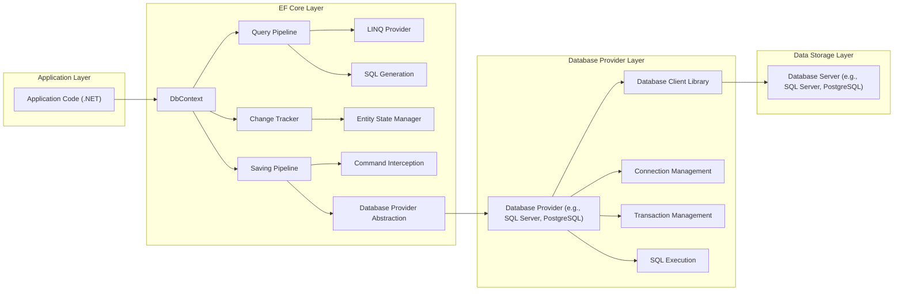

# Project Design Document: Enhanced Entity Framework Core (EF Core) for Threat Modeling

**Project Name:** Entity Framework Core (EF Core)

**Project Repository:** [https://github.com/dotnet/efcore](https://github.com/dotnet/efcore)

**Document Version:** 1.1

**Date:** October 26, 2023

**Author:** AI Software Architecture Expert

## 1. Introduction

This document provides an enhanced design overview of Entity Framework Core (EF Core), focusing on aspects relevant to threat modeling. Building upon the initial design document, this version provides more detailed explanations, clarifies security considerations, and offers examples to facilitate a comprehensive threat analysis.

EF Core's role as an ORM makes it a critical component in many .NET applications. Its architecture directly impacts the security posture of applications interacting with databases. This document aims to provide security professionals and developers with the necessary information to conduct effective threat modeling exercises for systems utilizing EF Core.

## 2. Project Overview

(No change from previous version - for completeness)

EF Core acts as a bridge between the application's object model and the underlying relational database. It provides features such as:

*   **Object-Relational Mapping (ORM):** Maps .NET classes (entities) to database tables and columns.
*   **Querying:** Allows querying data from the database using LINQ (Language Integrated Query) and SQL.
*   **Change Tracking:** Tracks changes made to entities, enabling efficient updates to the database.
*   **Saving Data:** Persists changes to the database, including inserts, updates, and deletes.
*   **Database Schema Management (Migrations):** Provides tools to create and evolve the database schema based on the entity model.
*   **Database Provider Abstraction:** Supports various database systems (e.g., SQL Server, PostgreSQL, MySQL, SQLite) through provider-specific implementations.
*   **Caching:** Offers caching mechanisms to improve performance by reducing database round trips.

## 3. Architecture Overview (Enhanced)

The architecture remains broadly the same, but the descriptions of components are enhanced with security context.

### 3.1. Application Layer

*   **"Application Code (.NET)"**: This layer is the primary interface for users and the entry point for many potential attacks. Security considerations here include:
    *   **Input Validation:**  Crucial to sanitize user inputs before they are used in queries or data manipulation operations via EF Core to prevent injection attacks.
    *   **Authorization Logic:** Application code must implement authorization to ensure users only access data they are permitted to. EF Core relies on the database for data access control, but application-level checks are often necessary.
    *   **Secure Coding Practices:**  General secure coding practices in the application layer are essential to minimize vulnerabilities that could be exploited through EF Core or other components.

### 3.2. EF Core Layer

*   **"DbContext"**:  The gateway to database interactions. Security aspects include:
    *   **Connection String Management:** Securely storing and managing connection strings is paramount. Hardcoding or storing in easily accessible configuration files is a risk. Consider using environment variables, secure configuration providers, or key vaults.
    *   **Configuration Security:**  EF Core configuration options (e.g., logging, sensitive data handling) should be reviewed for security implications. Overly verbose logging might expose sensitive data.
*   **"Query Pipeline"**: This is a critical area for SQL injection prevention.
    *   **"LINQ Provider"**: Generally safe from SQL injection when used correctly, as it translates LINQ to parameterized queries. However, developers must avoid constructing dynamic LINQ queries based on unsanitized user input.
    *   **"SQL Generation"**:  Responsible for generating SQL. Potential vulnerabilities could arise from:
        *   **Raw SQL Queries:** Using `FromSqlRaw` or similar methods directly embeds SQL and requires extreme caution to prevent injection. Parameterization is essential.
        *   **Interpolated Strings in LINQ:**  While EF Core attempts to parameterize interpolated strings, improper usage can still lead to vulnerabilities. Always use parameters explicitly.
        *   **Provider Bugs:**  Although rare, bugs in the SQL generation logic of specific database providers could theoretically introduce vulnerabilities. Keeping providers updated is important.
*   **"Change Tracker"**:  Manages entity state. Security considerations are less direct but include:
    *   **Data Integrity:**  Ensuring the change tracker correctly reflects intended data modifications is important for data integrity. Bugs in change tracking could lead to unexpected data changes.
    *   **Auditing:** Change tracking can be leveraged for auditing purposes to monitor data modifications, which is relevant for security monitoring and compliance.
    *   **Mass Assignment Vulnerabilities:**  If entity properties are bound directly to user inputs without proper validation, attackers might be able to modify unintended properties.
    *   **"Entity State Manager"**:  Correct state management is crucial for consistent data operations. Errors here could lead to unexpected behavior and potentially security-relevant issues.
*   **"Saving Pipeline"**:  Persists changes to the database.
    *   **"Command Interception"**:  A powerful feature that can be used for security enhancements like:
        *   **Auditing:** Logging all database commands for security monitoring.
        *   **Data Masking/Redaction:**  Modifying commands to mask sensitive data before it's logged or sent to external systems.
        *   **Security Policy Enforcement:**  Intercepting commands to enforce custom security policies or data access rules.
        *   **Potential Misuse:**  Interceptors themselves could be vulnerable if not implemented securely.
    *   **"Database Provider Abstraction"**:  While providing abstraction, it's important to understand provider-specific security features and limitations. For example, different providers might have varying levels of support for parameterized queries or encryption.

### 3.3. Database Provider Layer

*   **"Database Provider (e.g., SQL Server, PostgreSQL)"**:  The interface to the specific database. Security depends heavily on the chosen provider and its configuration.
    *   **"Database Client Library"**:  Vulnerabilities in the client library itself could be exploited. Keeping client libraries updated is crucial.
    *   **"Connection Management"**:  Secure connection management includes:
        *   **Encryption:**  Using encrypted connections (e.g., TLS/SSL) to protect data in transit between the application and the database.
        *   **Authentication:**  Using strong authentication methods (e.g., username/password, integrated authentication, certificate-based authentication) to verify the application's identity to the database.
        *   **Authorization:**  Database-level authorization (roles, permissions) is essential to control access to data. EF Core relies on the database's security model.
    *   **"Transaction Management"**:  Transactions are important for data consistency and can also have security implications. For example, proper transaction handling can prevent race conditions that could lead to data corruption or unauthorized access.
    *   **"SQL Execution"**:  The actual execution of SQL commands. Security here is primarily about ensuring that the generated SQL is secure (parameterized) and that database-level security controls are in place.

### 3.4. Data Storage Layer

*   **"Database Server (e.g., SQL Server, PostgreSQL)"**:  The database server itself. Security here is outside the direct scope of EF Core but is fundamentally important:
    *   **Database Hardening:**  Properly configuring and hardening the database server is essential (e.g., strong passwords, access control lists, patching, auditing).
    *   **Data Encryption at Rest:**  Encrypting data at rest within the database provides an additional layer of protection against data breaches.
    *   **Regular Security Audits:**  Regularly auditing database security configurations and access logs is crucial.

## 4. Data Flow (Enhanced Security Perspective)

The data flow descriptions are enhanced to highlight security-relevant aspects.

### 4.1. Querying Data (Security Focus)

1.  **"Application Code"** initiates a query. **Security Checkpoint:** Input validation should occur *before* the query is constructed. Sanitize user inputs to prevent injection attacks. Authorization checks should be performed to ensure the user is allowed to access the requested data.
2.  **"Query Pipeline"** in EF Core receives the query.
3.  **"LINQ Provider"** translates the LINQ query. **Security Note:** Ensure dynamic LINQ is not constructed from unsanitized user input.
4.  **"SQL Generation"** converts the query to SQL. **Critical Security Point:** Verify that parameterized queries are generated correctly, especially when using raw SQL or interpolated strings. Inspect generated SQL during development and testing.
5.  **"Database Provider"** receives the SQL query.
6.  **"Database Provider"** uses **"Database Client Library"** to send SQL to **"Database Server"**. **Security Checkpoint:** Ensure the connection is encrypted (TLS/SSL).
7.  **"Database Server"** executes the query. **Security Note:** Database-level security controls (permissions, roles) are enforced here.
8.  **"Database Server"** returns results.
9.  **"Database Provider"** receives results.
10. EF Core materializes results and returns to **"Application Code"**. **Security Checkpoint:** Consider if data masking or redaction is needed before returning data to the application layer, especially if sensitive data is involved.

### 4.2. Saving Data (Inserts, Updates, Deletes) (Security Focus)

1.  **"Application Code"** modifies entities. **Security Checkpoint:** Input validation and authorization are crucial *before* data modifications are made. Validate data against business rules and security policies. Prevent mass assignment vulnerabilities.
2.  **"Change Tracker"** detects changes.
3.  **"Application Code"** calls `SaveChanges`.
4.  **"Saving Pipeline"** is initiated.
5.  **"Saving Pipeline"** determines database operations.
6.  **"SQL Generation"** creates SQL commands. **Critical Security Point:** Ensure parameterized queries are generated for data modification operations to prevent injection.
7.  **"Database Provider"** receives SQL commands.
8.  **"Database Provider"** uses **"Database Client Library"** to execute SQL within a transaction on **"Database Server"**. **Security Checkpoint:** Ensure encrypted connection. Transaction management is important for data integrity and consistency, which has indirect security implications.
9.  **"Database Server"** executes commands. **Security Note:** Database-level security controls are enforced.
10. Transaction is committed/rolled back.
11. EF Core updates entity states and returns to **"Application Code"**. **Security Checkpoint:** Audit logging of data modification operations can be implemented (e.g., using command interception).

## 5. Security Considerations for Threat Modeling (Enhanced and Categorized)

This section is enhanced with categorization and examples for better threat modeling.

**5.1. Injection Attacks**

*   **SQL Injection:** (As described previously)
    *   **Example:**  Constructing dynamic SQL queries by concatenating user input strings directly into `FromSqlRaw` without proper parameterization.
    *   **Mitigation:**  *Always* use parameterized queries. Utilize LINQ and avoid raw SQL where possible. If raw SQL is necessary, use parameters meticulously. Regularly review and test queries for potential injection vulnerabilities. Employ static analysis tools to detect potential injection points.
*   **Command Injection (Less Direct, but Possible):**  While less direct with EF Core itself, if EF Core interacts with external systems or executes OS commands based on data retrieved from the database (e.g., via stored procedures or application logic), command injection vulnerabilities could arise.
    *   **Example:**  A stored procedure called by EF Core that executes OS commands based on user-provided data stored in the database.
    *   **Mitigation:**  Minimize interaction with external systems based on database data. If necessary, rigorously validate and sanitize data before using it in OS commands or external system calls. Follow the principle of least privilege for database accounts and application server accounts.

**5.2. Data Exposure and Information Disclosure**

*   **Unauthorized Data Access:**
    *   **Example:**  Insufficient database permissions allowing users to access data they should not. Application code not enforcing authorization rules.
    *   **Mitigation:**  Implement robust authorization at both the application and database levels. Follow the principle of least privilege. Regularly review and audit database permissions. Use database roles and grant permissions based on roles.
*   **Sensitive Data in Logs:**
    *   **Example:**  Logging full SQL queries including sensitive data (e.g., passwords, credit card numbers) in plain text.
    *   **Mitigation:**  Implement secure logging practices. Sanitize or mask sensitive data before logging. Avoid logging full SQL queries in production unless absolutely necessary for debugging and with strict access control to logs. Use structured logging to facilitate redaction and analysis.
*   **Connection String Exposure:**
    *   **Example:**  Storing connection strings in plain text configuration files committed to source control or easily accessible on the server.
    *   **Mitigation:**  Securely store connection strings using environment variables, secure configuration providers (like Azure Key Vault, AWS Secrets Manager), or encrypted configuration files. Avoid hardcoding connection strings.
*   **Over-querying and Data Leaks:**
    *   **Example:**  Inefficient queries retrieving entire tables when only specific columns are needed, potentially exposing sensitive data unnecessarily.
    *   **Mitigation:**  Design efficient queries to retrieve only the necessary data. Use projection in LINQ queries to select specific columns. Implement data access patterns that minimize data retrieval.

**5.3. Data Integrity Issues**

*   **Concurrency Conflicts Leading to Data Corruption:**
    *   **Example:**  Two users simultaneously updating the same entity, leading to lost updates or inconsistent data if concurrency handling is not implemented.
    *   **Mitigation:**  Implement appropriate concurrency control mechanisms (optimistic or pessimistic concurrency) in EF Core. Use row versioning or timestamps to detect and handle concurrency conflicts.
*   **Data Validation Bypass:**
    *   **Example:**  Insufficient data validation in the application or EF Core model, allowing invalid or malicious data to be persisted, potentially corrupting data or leading to application errors.
    *   **Mitigation:**  Implement comprehensive data validation at multiple layers: client-side, application layer, and database level (constraints, triggers). Use EF Core's data annotations or fluent API for model validation.

**5.4. Denial of Service (DoS)**

*   **Inefficient Queries Causing Database Overload:**
    *   **Example:**  Complex LINQ queries or poorly optimized SQL queries causing excessive database resource consumption, leading to slow performance or database unavailability.
    *   **Mitigation:**  Optimize queries. Use indexing effectively. Monitor database performance and identify slow queries. Review and optimize complex LINQ queries. Consider using compiled queries for frequently executed queries. Implement query timeouts to prevent runaway queries.
*   **Resource Exhaustion through Vulnerabilities:**
    *   **Example:**  Exploiting a vulnerability in EF Core or a database provider to cause excessive resource consumption on the server.
    *   **Mitigation:**  Keep EF Core, database providers, and the underlying operating system and database server patched and up-to-date. Regularly perform security vulnerability scanning.

**5.5. Dependency and Configuration Vulnerabilities**

*   **Vulnerable EF Core or Provider Libraries:**
    *   **Example:**  Using an outdated version of EF Core or a database provider with known security vulnerabilities.
    *   **Mitigation:**  Keep EF Core and all dependency libraries updated to the latest stable versions. Regularly check for security advisories and apply patches promptly. Use dependency scanning tools to identify vulnerable components.
*   **Insecure Default Configurations:**
    *   **Example:**  Using default EF Core or database provider configurations that are not optimized for security (e.g., overly permissive logging, weak encryption settings).
    *   **Mitigation:**  Review and harden default configurations. Follow security best practices for configuring EF Core and database providers. Consult security guidelines and documentation.

**5.6. Authentication and Authorization (Application Level)**

*   **Weak Database Authentication:**
    *   **Example:**  Using weak passwords for database accounts or not enforcing strong password policies.
    *   **Mitigation:**  Enforce strong password policies for database accounts. Use multi-factor authentication where possible. Regularly rotate database credentials.
*   **Missing Application-Level Authorization:**
    *   **Example:**  Relying solely on database-level authorization without implementing application-level checks, potentially leading to bypasses or inconsistent authorization logic.
    *   **Mitigation:**  Implement application-level authorization to control access to data and operations based on user roles and permissions. Integrate application authorization with database authorization for a layered security approach.

## 6. Assumptions and Limitations

(No change from previous version - for completeness)

*   This document provides a high-level architectural overview and focuses on aspects relevant to threat modeling. It does not delve into the detailed internal implementation of EF Core.
*   The security considerations are not exhaustive but highlight the most common and critical areas for threat modeling in the context of EF Core.
*   This document assumes a typical deployment scenario where EF Core is used in a .NET application interacting with a relational database. Specific deployment environments and configurations may introduce additional security considerations.
*   The document is based on the general understanding of EF Core architecture and publicly available information. For the most accurate and up-to-date details, refer to the official EF Core documentation and source code.

## 7. Conclusion

This enhanced design document provides a more robust foundation for threat modeling applications using Entity Framework Core. By understanding the detailed architecture, security-focused data flow, and categorized security considerations with examples and mitigations, security professionals and developers can conduct more effective threat modeling exercises. This document encourages a proactive security approach, enabling the development of more resilient and secure .NET applications leveraging EF Core. Further threat modeling should involve deep dives into specific application contexts, attack scenarios, and the use of threat modeling methodologies like STRIDE or PASTA.