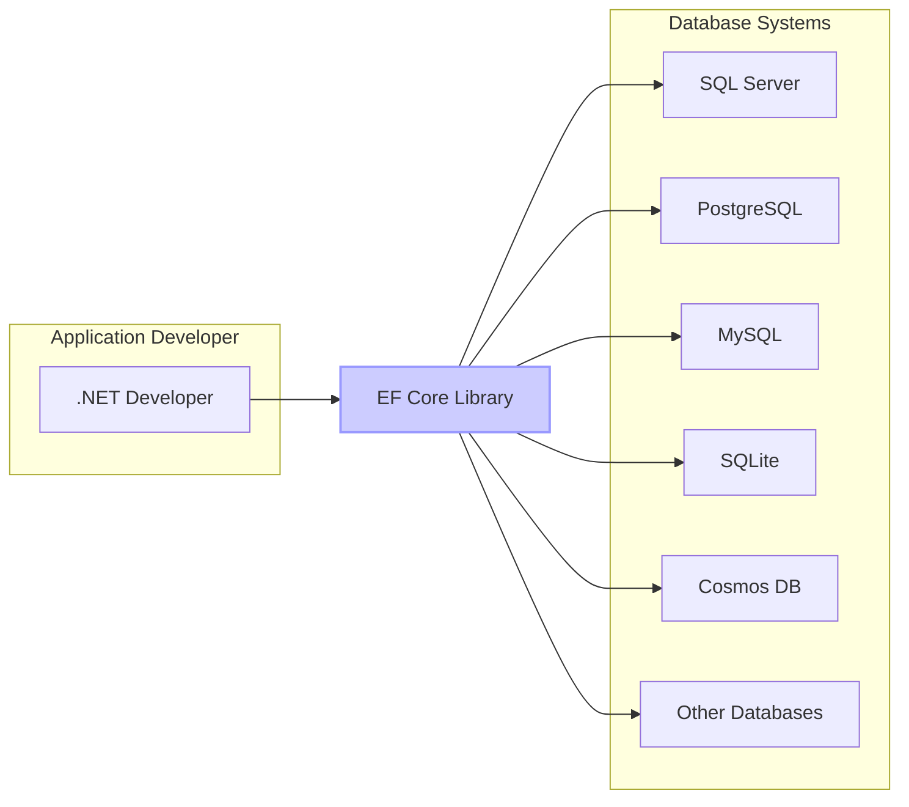
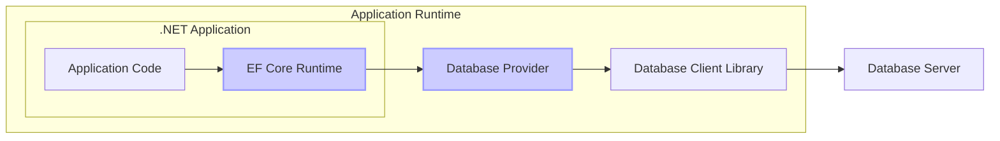
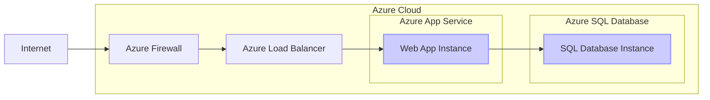

# BUSINESS POSTURE

The Entity Framework Core (EF Core) project is an open-source, lightweight, extensible, and cross-platform version of the popular Entity Framework data access technology. EF Core serves as an Object-Relational Mapper (ORM), enabling .NET developers to work with databases using .NET objects, eliminating the need for most of the data-access code that developers usually need to write.

Business priorities and goals for EF Core are:
- Provide a robust and performant ORM solution for .NET developers.
- Enable efficient and productive database interactions within .NET applications.
- Support a wide range of database systems and platforms.
- Maintain a high level of code quality, stability, and reliability.
- Foster a strong community and encourage contributions to the project.
- Ensure long-term maintainability and evolution of the framework.

Most important business risks that need to be addressed:
- Data integrity and consistency: Incorrect mappings or bugs in EF Core could lead to data corruption or inconsistencies in the database.
- Performance bottlenecks: Inefficient queries generated by EF Core or performance issues within the framework itself could negatively impact application performance.
- Security vulnerabilities: Security flaws in EF Core could be exploited to gain unauthorized access to data or compromise the application.
- Compatibility issues: Incompatibility with certain database systems, .NET versions, or other libraries could limit the usability of EF Core.
- Community dependency risk: Over-reliance on community contributions without sufficient maintainer oversight could lead to instability or lack of direction.

# SECURITY POSTURE

Existing security controls:
- security control: Open-source development model with public code repository on GitHub. This allows for community review and identification of potential vulnerabilities. Implemented in: GitHub repository.
- security control: Code reviews are performed for pull requests. Implemented in: GitHub pull request process.
- security control: Automated testing including unit tests and integration tests. Implemented in: GitHub Actions workflows.
- security control: Static analysis tools and code linters are likely used during development (though not explicitly mentioned in the provided context, it's a common practice for .NET projects). Implemented in: Development environment and potentially CI pipelines.
- security control: Dependency scanning to identify vulnerable dependencies (common practice in modern development). Implemented in: Potentially CI pipelines or dependency management tools.

Accepted risks:
- accepted risk: As an open-source project, the project relies on community contributions, which may introduce vulnerabilities if not properly vetted.
- accepted risk: Bugs and vulnerabilities may exist in the code despite testing and code reviews, as with any software project.
- accepted risk: Security vulnerabilities in underlying database providers or database systems are outside the scope of EF Core's direct control.

Recommended security controls:
- security control: Implement a formal security vulnerability disclosure and response process.
- security control: Conduct regular security audits and penetration testing of EF Core, especially before major releases.
- security control: Integrate SAST (Static Application Security Testing) and DAST (Dynamic Application Security Testing) tools into the CI/CD pipeline.
- security control: Implement dependency vulnerability scanning and automated updates of dependencies.
- security control: Provide security guidelines and best practices for developers using EF Core to build secure applications.

Security requirements:
- Authentication: EF Core itself does not handle application-level authentication. Authentication is the responsibility of the application using EF Core and the underlying database system. EF Core should be designed to seamlessly integrate with various authentication mechanisms provided by databases.
- Authorization: EF Core should facilitate the implementation of authorization logic within applications. It should not bypass database-level authorization. Developers should be able to use EF Core to query and manipulate data in accordance with application-specific authorization rules and database permissions.
- Input validation: EF Core should encourage and facilitate input validation to prevent injection attacks (e.g., SQL injection). This includes parameterized queries, input sanitization, and validation of data types and formats. EF Core should not introduce vulnerabilities through its query building or data handling mechanisms.
- Cryptography: EF Core should support the use of cryptography for sensitive data at rest and in transit. This includes features for data encryption at the database level and secure communication protocols. EF Core itself might not implement cryptographic algorithms, but it should be compatible with and encourage the use of secure cryptographic practices in applications.

# DESIGN

## C4 CONTEXT



Context Diagram Elements:

- Element:
  - Name: .NET Developer
  - Type: Person
  - Description: Software developers using .NET languages (C#, F#, etc.) who build applications that require data access.
  - Responsibilities: Develop applications using EF Core to interact with databases, define data models, write queries, and manage database migrations.
  - Security controls: Responsible for secure coding practices when using EF Core, including input validation, authorization logic within the application, and secure connection string management.

- Element:
  - Name: EF Core Library
  - Type: Software System
  - Description: Entity Framework Core is an Object-Relational Mapper (ORM) for .NET. It allows developers to interact with databases using .NET objects.
  - Responsibilities: Provide an abstraction layer between .NET applications and various database systems, translate LINQ queries into database-specific queries, manage database connections, track changes to entities, and perform database migrations.
  - Security controls: Input validation within the library to prevent injection vulnerabilities, secure handling of database credentials (though primarily passed through from the application), and adherence to secure coding practices in its development.

- Element:
  - Name: SQL Server
  - Type: Software System
  - Description: A popular relational database management system.
  - Responsibilities: Store and manage application data, execute SQL queries, enforce database-level security controls (authentication, authorization).
  - Security controls: Database authentication mechanisms, role-based access control, data encryption at rest and in transit, audit logging.

- Element:
  - Name: PostgreSQL
  - Type: Software System
  - Description: An open-source relational database management system.
  - Responsibilities: Store and manage application data, execute SQL queries, enforce database-level security controls (authentication, authorization).
  - Security controls: Database authentication mechanisms, role-based access control, data encryption at rest and in transit, audit logging.

- Element:
  - Name: MySQL
  - Type: Software System
  - Description: A widely used open-source relational database management system.
  - Responsibilities: Store and manage application data, execute SQL queries, enforce database-level security controls (authentication, authorization).
  - Security controls: Database authentication mechanisms, role-based access control, data encryption at rest and in transit, audit logging.

- Element:
  - Name: SQLite
  - Type: Software System
  - Description: A lightweight, file-based relational database management system.
  - Responsibilities: Store and manage application data, execute SQL queries, enforce database-level security controls (authentication, authorization - limited in SQLite compared to server-based systems).
  - Security controls: File system permissions for database file access, encryption extensions for data at rest.

- Element:
  - Name: Cosmos DB
  - Type: Software System
  - Description: A globally distributed, multi-model database service from Azure.
  - Responsibilities: Store and manage application data, execute queries (SQL, NoSQL), provide scalability and high availability, enforce cloud-based security controls (authentication, authorization).
  - Security controls: Azure Active Directory integration for authentication, role-based access control, data encryption at rest and in transit, network security controls.

- Element:
  - Name: Other Databases
  - Type: Software System
  - Description: Represents other database systems supported by EF Core, such as Oracle, DB2, etc.
  - Responsibilities: Store and manage application data, execute database-specific queries, enforce database-level security controls.
  - Security controls: Database-specific security controls, similar to those listed for SQL Server, PostgreSQL, and MySQL.

## C4 CONTAINER



Container Diagram Elements:

- Element:
  - Name: Application Code
  - Type: Container (Application Component)
  - Description: The custom code written by the .NET developer for their specific application, utilizing EF Core for data access.
  - Responsibilities: Implement business logic, define data models using EF Core, construct queries, handle user interactions, and manage application-level security.
  - Security controls: Application-level authentication and authorization, input validation, secure session management, protection against application-specific vulnerabilities.

- Element:
  - Name: EF Core Runtime
  - Type: Container (Library/Framework Component)
  - Description: The core runtime library of Entity Framework Core, responsible for ORM functionalities.
  - Responsibilities: Translate LINQ queries, manage entity tracking and change detection, interact with database providers, handle database connections and transactions.
  - Security controls: Parameterized query generation to prevent SQL injection, input validation within the framework, secure handling of database connection strings (though primarily passed from the application).

- Element:
  - Name: Database Provider
  - Type: Container (Library/Framework Component)
  - Description: A provider-specific library that allows EF Core to communicate with a particular database system (e.g., SQL Server provider, PostgreSQL provider).
  - Responsibilities: Translate EF Core's commands into database-specific SQL or commands, handle database-specific data types and features, manage database connections using the underlying client library.
  - Security controls: Secure communication with the database client library, proper handling of database-specific security features, and adherence to secure coding practices in provider development.

- Element:
  - Name: Database Client Library
  - Type: Container (Library)
  - Description: A client library provided by the database vendor or community that enables communication with the database server (e.g.,SqlClient for SQL Server, Npgsql for PostgreSQL).
  - Responsibilities: Establish connections to the database server, send and receive data over the network, handle database-specific protocols.
  - Security controls: Secure communication protocols (e.g., TLS/SSL), authentication with the database server, protection against network-level attacks.

- Element:
  - Name: Database Server
  - Type: Container (Database System)
  - Description: The actual database server instance (e.g., SQL Server instance, PostgreSQL server).
  - Responsibilities: Store and manage data, process queries, enforce database-level security policies, provide data persistence and availability.
  - Security controls: Database authentication and authorization, access control lists, data encryption at rest and in transit, audit logging, network security controls.

## DEPLOYMENT

EF Core as a library is not deployed in the traditional sense of a standalone application. It is integrated into .NET applications, which are then deployed to various environments. Common deployment scenarios for applications using EF Core include:

- On-premises servers (Windows/Linux)
- Cloud platforms (Azure, AWS, GCP)
- Containerized environments (Docker, Kubernetes)
- Serverless environments (Azure Functions, AWS Lambda)

Let's consider a common cloud deployment scenario using Azure App Service and Azure SQL Database.



Deployment Diagram Elements (Azure App Service & Azure SQL Database):

- Element:
  - Name: Web App Instance
  - Type: Deployment Environment (PaaS Instance)
  - Description: An instance of an Azure App Service web application running the .NET application that utilizes EF Core.
  - Responsibilities: Execute the application code, handle HTTP requests, interact with EF Core runtime, connect to the database.
  - Security controls: HTTPS for web traffic, Azure App Service security features (authentication/authorization, managed identities), application-level security controls.

- Element:
  - Name: SQL Database Instance
  - Type: Deployment Environment (PaaS Instance)
  - Description: An instance of Azure SQL Database storing the application data accessed by EF Core.
  - Responsibilities: Store and manage data, process SQL queries, enforce database-level security.
  - Security controls: Azure SQL Database security features (firewall, authentication, authorization, data encryption at rest and in transit), regular security patching.

- Element:
  - Name: Azure Load Balancer
  - Type: Infrastructure (Load Balancer)
  - Description: Azure Load Balancer distributes incoming traffic across multiple Web App Instances for scalability and high availability.
  - Responsibilities: Distribute traffic, ensure application availability, potentially provide basic DDoS protection.
  - Security controls: DDoS protection, traffic distribution policies, potentially TLS termination.

- Element:
  - Name: Azure Firewall
  - Type: Infrastructure (Firewall)
  - Description: Azure Firewall provides network security for the Azure environment, controlling inbound and outbound traffic.
  - Responsibilities: Filter network traffic, protect against network-based attacks, enforce network security policies.
  - Security controls: Network rules, threat intelligence, intrusion detection and prevention.

- Element:
  - Name: Internet
  - Type: External Environment
  - Description: The public internet from which users access the application.
  - Responsibilities: Provide access to users.
  - Security controls: N/A - external environment, security is focused on protecting the deployed application from internet-based threats.

## BUILD

```mermaid
flowchart LR
  A[Developer] --> B{Code Changes}
  B --> C[GitHub Repository]
  C --> D[GitHub Actions Workflow]
  D --> E{Build & Test}
  E --> F{Security Scans (SAST, Dependency)}
  F --> G{Package & Publish Artifacts}
  G --> H[NuGet Gallery / Artifact Storage]

  style D fill:#ccf,stroke:#99f,stroke-width:2px
```

Build Process Diagram Elements:

- Element:
  - Name: Developer
  - Type: Person
  - Description: A software developer contributing to the EF Core project.
  - Responsibilities: Write code, fix bugs, implement new features, submit code changes via pull requests.
  - Security controls: Secure development environment, code review participation, adherence to secure coding practices.

- Element:
  - Name: Code Changes
  - Type: Data
  - Description: Modifications to the EF Core codebase.
  - Responsibilities: Represent new features, bug fixes, or improvements.
  - Security controls: Version control using Git, code review process to identify potential security issues.

- Element:
  - Name: GitHub Repository
  - Type: Software System (Version Control)
  - Description: The central repository for EF Core source code, hosted on GitHub.
  - Responsibilities: Store source code, manage version history, facilitate collaboration, trigger CI/CD workflows.
  - Security controls: Access control (authentication and authorization), audit logging, branch protection rules.

- Element:
  - Name: GitHub Actions Workflow
  - Type: Software System (CI/CD)
  - Description: Automated workflows defined in GitHub Actions to build, test, and publish EF Core.
  - Responsibilities: Automate build process, run tests, perform security scans, package artifacts, publish releases.
  - Security controls: Secure workflow definitions, secrets management for credentials, access control to workflow execution.

- Element:
  - Name: Build & Test
  - Type: Process
  - Description: Compilation of source code and execution of automated tests.
  - Responsibilities: Ensure code compiles correctly, verify functionality through tests, identify build errors and test failures.
  - Security controls: Secure build environment, integrity checks of build tools and dependencies.

- Element:
  - Name: Security Scans (SAST, Dependency)
  - Type: Process
  - Description: Automated security scans performed during the build process, including Static Application Security Testing (SAST) and dependency vulnerability scanning.
  - Responsibilities: Identify potential security vulnerabilities in the code and dependencies.
  - Security controls: Configuration of SAST and dependency scanning tools, vulnerability reporting and remediation process.

- Element:
  - Name: Package & Publish Artifacts
  - Type: Process
  - Description: Packaging the built EF Core libraries and tools into distributable artifacts (e.g., NuGet packages) and publishing them.
  - Responsibilities: Create NuGet packages, sign packages, publish packages to NuGet Gallery or other artifact storage.
  - Security controls: Code signing to ensure package integrity and authenticity, secure publishing process, access control to artifact storage.

- Element:
  - Name: NuGet Gallery / Artifact Storage
  - Type: Software System (Package Repository)
  - Description: A repository for storing and distributing NuGet packages, where EF Core packages are published.
  - Responsibilities: Host NuGet packages, provide package download and installation services, verify package integrity.
  - Security controls: Access control, package integrity verification, vulnerability scanning of hosted packages (NuGet Gallery).

# RISK ASSESSMENT

Critical business process we are trying to protect:
- Secure and reliable data access for .NET applications. EF Core is fundamental for many .NET applications that interact with databases. Its reliability and security directly impact the functionality and security of those applications.
- Efficient .NET application development. EF Core aims to simplify and speed up data access development. Issues with EF Core can hinder developer productivity and project timelines.

Data we are trying to protect and their sensitivity:
- Application data stored in databases. The sensitivity of this data varies greatly depending on the application domain. It can range from publicly available information to highly sensitive personal or financial data. EF Core is used to access and manipulate this data, so its security is crucial for protecting data confidentiality, integrity, and availability.
- Intellectual property in the EF Core codebase itself. While open-source, the EF Core codebase represents significant development effort and expertise. Protecting its integrity and preventing unauthorized modifications is important for the project's long-term health and trustworthiness.

# QUESTIONS & ASSUMPTIONS

Questions:
- What specific SAST and DAST tools are currently used in the EF Core build process, if any?
- Is there a formal security vulnerability disclosure and response process in place for EF Core?
- Are regular security audits or penetration testing conducted for EF Core?
- What dependency scanning tools and processes are used to manage dependencies and identify vulnerabilities?
- Are there specific security guidelines or best practices documented for developers using EF Core?

Assumptions:
- The EF Core project follows secure coding practices during development.
- Code reviews are conducted with security considerations in mind.
- Automated testing includes some level of security testing (e.g., testing for common injection vulnerabilities).
- Dependency management practices are in place to keep dependencies up-to-date and mitigate known vulnerabilities.
- The open-source nature of the project contributes to security through community review and scrutiny.